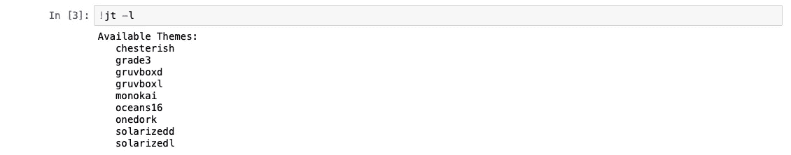

# Jupyter 笔记本格式化指南

> 原文：<https://medium.com/analytics-vidhya/the-jupyter-notebook-formatting-guide-873ab39f765e?source=collection_archive---------1----------------------->

Jupyter 笔记本非常强大，它是一个很好的工具，可以将可以编译的代码和文本信息结合起来，以一种视觉上吸引人的方式解释代码做了什么。

作为 Python 编码界的新手，我不得不努力理解基本的格式和文件嵌入选项。这是一个小小的努力，以帮助新用户顺利通过，并确保他们建立一个值得与任何人分享的 Jupyter 笔记本。

首先，你可以写下文本(非代码)内容的方法是在 Jupyter 笔记本中选择单元格，然后在下拉框中选择“Markdown”。

[下载链接](https://drive.google.com/open?id=1MNp9S9s7uRJKrDiVHJDkU7EveWTA9GCc)到一个示例`.ipynb`文件，该文件实现了以下所有格式化技术。

选择一个单元格作为降价

**01。粗体文本:**

书写粗体文本的方法是在一对双下划线之间插入要用粗体书写的文本。

示例:当您运行 markdown 单元格时，`__This text to appear in bold__`将被格式化为`**This text will appear in bold**`。

在 Markdown 单元格中将文本标记为粗体

**02。斜体文本:**

将某些文本标记为斜体与我们将文本标记为粗体非常相似。我们必须在一对下划线之间插入以斜体标记的文本。

示例:当您运行 markdown 单元格时，`_This text to appear in Italics_`将被格式化为`*This text to appear in Italics*`。

在 Markdown 单元格中用斜体标记文本

**03。换行:**

当你写文本的时候，你经常不得不使用换行符，没有必要插入两行空白来开始一个新的段落。您可以使用一个简单的` `标签来插入一个换行符。

降价中换行符的使用

04 年。标题:

标题可以使用 5 种不同的字体大小，最大的字体大小最适合标题，其他 4 种字体大小适合需要时使用。标题可以使用`#`开始，后跟`space`，然后是标题的文本。这将打印最大尺寸的标题。你得不断加`#`才能让标题变小。

示例:`# Title`打印最大尺寸的标题。`## Heading 1`打印下一个最小的标题。最小的标题是`##### Heading 4`。

减价单元格中不同大小的标题

05。颜色:

用不同的颜色突出显示一些文本有助于传递需要特别注意的信息。使用`The text to be show in pink`实现这一点非常简单。

示例颜色字体

**06。水平分隔符:**

如果你想插入一条水平线，作为横跨 markdown 单元格宽度的分隔符，你所要做的就是在新的一行中键入三个不带空格的星号`***`。

注意:水平分隔符显示为非常浅的灰色，在上方看不到

**07。编号列表和子列表:**

通过键入一个数字，后跟一个点和一个空格，可以生成一个编号列表

例子:`1\. some text`

对编号列表中的项目遵循相同的模式。对于子列表，前面带有相同格式的制表符将自动生成带有不同标签模式的子列表。对于更深层次的子列表，可以遵循相同的技术。

显示两级子列表的编号列表示例

**08。文本缩进:**

如果你想在一个缩进的块中显示一些代码或文本，你所要做的就是用一个`>`开始一行，后跟一个空格，然后是文本。文本缩进，并在左侧有一条灰色水平线，直到检测到下一个回车。

例子:`> this is indented text`

显示后跟普通文本的缩进文本块的示例

**09。等宽字体:**

等宽字体是一些在浅灰色背景中突出显示的文本。通常用于指示文件路径、用户输入的消息、文件名等。

例如:“这是等宽字体”

**10。数学符号:**

两个`$`符号之间可以显示数学符号。

示例:`$x = x + y$`

**11。内部链接:**

内部链接可用于创建链接，帮助您跳转到页面上的某个位置。一个经典的用例是标题索引列表的实现。一旦用户点击索引列表中的一个标题，它会直接将用户带到该标题所在的`.ipynb`文件部分。

内部链接有两个组成部分。来源和目的地

Source:这必须在您希望获得可点击链接的位置实现。其格式为`[text to appear as link](#linkhandle)`。

目的地:这必须在用户点击源链接时你想带用户去的地方实现。遵循的格式是``。随后可以是你想要的任何内容，无论是文本还是图像。

**12。外部链接:**

外部链接遵循的格式与我们用于内部链接的格式非常相似。要显示为链接的文本应该插入方括号`[click me]`中，后面应该是圆括号`(http://google.com)`中的超链接。

示例:`[click me](http://google.com)`

**13。嵌入网页:**

如果你想在你的`.ipynb`文件中引用某个特定的网页内容，在 Jupyter 笔记本中很容易做到。只需使用下面的代码，将下面示例中给出的 URL `[http://raghupro.com](http://raghupro.com)`替换为您想要的任何 URL。其他重要但可选的参数是设置`width`和`height`。执行后嵌入的网页将是用户可以访问的活动页面。

例子:`from IPython.display import IFrame
IFrame('http://raghupro.com', width = 800, height = 450)`

**注意事项:**上述代码必须在 code 单元格中实现，而不是在所有先前格式化技术的 markdown 单元格中实现。

嵌入 Jupyter 笔记本的示例网页

**14。嵌入 PDF 文档:**

就像嵌入网页一样简单，将 PDF 文件嵌入到您的 Jupyter 笔记本中也同样简单。遵循与嵌入网页完全相同的代码格式，但将 URL 替换为指向 PDF 文件的链接。

示例:`from IPython.display import IFrame
IFrame('https://www.w3.ord/WAI/ER/tests/xhtml/testfiles/resources/pdf/dummy.pdf', width = 800, height = 450)`

**注意事项:**上述代码必须在 code 单元格中实现，而不是在所有先前格式化技术的 markdown 单元格中实现。

嵌入到 Jupyter 笔记本中的示例 PDF 文件

15。嵌入 YouTube 视频:

嵌入 youtube 视频可能有点棘手。唯一需要注意的是不要粘贴整个 youtube 视频 URL。youtube 视频 URL 的典型格式是`[http://youtube.com/watch?v=RBSGK1AvoiM](http://youtube.com/watch?v=RBSGKlAvoiM.)` [。](http://youtube.com/watch?v=RBSGKlAvoiM.)这里，`v=`之后的部分是视频的唯一 ID。您只需复制`v=`之后的部分，这是惟一的 ID`RBSGK1AvoiM`，并在下面给出的示例代码中替换它。

例子:`from IPython.display import YouTubeVideo
YouTubeVideo('RBSGK1AvoiM', width = 800, height = 500)`

**注意事项:**上述代码必须在 code 单元格中实现，而不是在所有先前格式化技术的 markdown 单元格中实现。

嵌入 YouTube 视频

16。笔记本主题:

如果你觉得你的 Jupyter 笔记本的外观有点无聊，你可以通过应用主题让它看起来更有趣。首先，您必须在代码单元中安装执行简单命令的主题

`!pip install jupyterthemes`

执行上述命令后，它将在下面的输出中显示几行代码，这可能需要几秒钟，具体取决于您的互联网连接，因为它必须从远程服务器下载模块。安装完成后，您可以使用下面的命令来查看所有可供选择的主题列表

`!jt -l`

这将显示所有可用主题的列表。您可以使用以下命令应用任何主题

`!jt -t <name of theme>`

例子:`!jt -t chesterish`

**注意:**每次应用新主题时，您必须完全关闭并重启 jupyter 笔记本

切斯特主义主题在 Jupyter 笔记本上的应用

瞧啊。这将应用主题。如果出于某种原因，你想恢复到原来的股票主题，只需执行下面的命令。

`!jt -r`

[下载链接](https://drive.google.com/open?id=1MNp9S9s7uRJKrDiVHJDkU7EveWTA9GCc)到一个示例`.ipynb`文件，该文件实现了上述所有格式化技术。