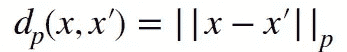
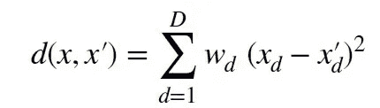
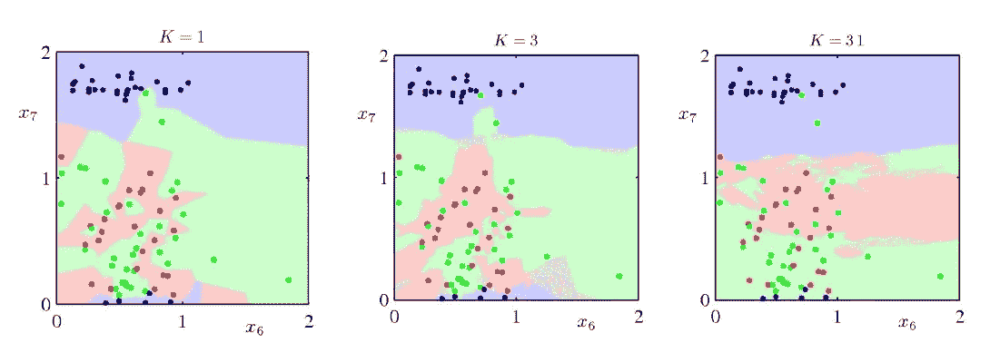
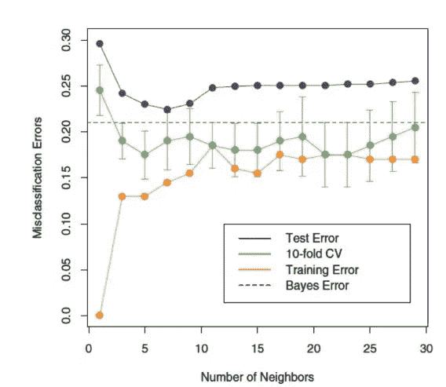
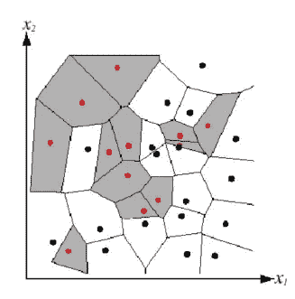
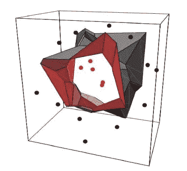
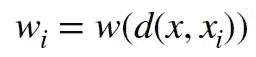
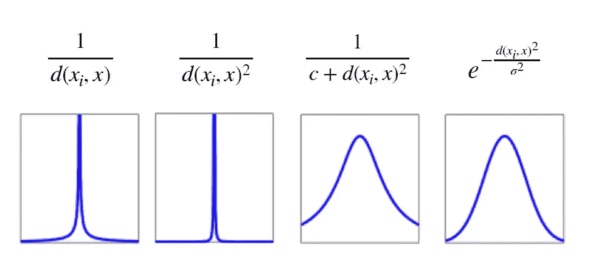

# K-最近邻(kNN)机器学习算法-第 1 部分

> 原文：<https://medium.com/analytics-vidhya/the-k-nearest-neighbor-knn-machine-learning-algorithm-part-1-49c52b00079d?source=collection_archive---------12----------------------->

“当你有最强的邻居时，恐惧就不在边缘”kNN 算法

## **简介**

*k-* NN 被认为是一种非参数的基于实例的监督懒惰算法，该算法假设最近邻居之间的**多数投票**来生成类别标签。通常，这就足够了，因为它做出的**假设**是*相似的点具有相似的类标签*，因此最接近的点应该同意多数标签为真实标签。

*关键思路:只存储所有训练样本(，易)。*

进行查询时，根据最近(最相似)点的值计算新实例的值。

议程:

1.  距离函数
2.  最佳 K 值是多少？
3.  决策面
4.  *k* NN 的变体

## **距离功能**

距离度量的选择在 *k* NN 中很重要！

距离函数需要满足某些特性，即，

> 对称 d(x，x′)= d(x′，x)
> 
> 定 d(x，x′)= 0 当且仅当 x = x′
> 
> 三角形不等式 d(a，b) ≤ d(a，c) + d(b，c)

距离函数有一个一般形式

kNN 中距离函数的一般形式

当 p=2 时，对于欧几里德距离

p=1，代表曼哈顿距离

p =无穷大，表示切比雪夫距离

其他距离函数包括:

加权欧几里德距离

*注:连距离也可以学习。*

距离度量通常是特定于域的

例如生物信息学中的字符串编辑距离

例如行走数据的时间序列模型中的轨迹距离。

## **最佳 K 值**

k 控制平滑度，是超参数。首先什么是**超参数**？从技术上来说，*数据之外的一种配置，其价值无法从数据中估计出来。用外行人的话来说，当你做咖喱时，你会加入一些蔬菜、香料，然后加盐。这种盐是你的超参数，所以根据每个人的口味要求，你必须放最佳的，也取决于你放的蔬菜数量，也取决于水的数量。保持简单！🙂*

让我用简单的话来说，给出三张图，图中有一组相同的点，你喜欢哪个分区？

明智地选择超参数 *k*

1NN 过拟合，31NN 欠拟合。最适合的是 3NN。

如果 k 低会怎样？

*   非常非线性的函数可以近似，但我们也会捕捉数据中的噪声。
*   偏差低，方差高。

如果 k 高会怎样？

*   输出更加平滑，对数据变化不太敏感。
*   高偏差，低方差。

K 允许我们在过拟合(小 K)和欠拟合(大 K)之间进行权衡。

那么我们如何选择最佳的 k 值呢？

我们将数据集分为训练集、测试集和验证集，在训练集上训练 *k* NN，在测试集上评估准确性，在用于挑选最佳*k*的验证集上运行交叉验证

演职员表:摘自伊迪丝·劳的幻灯片

## **决定表面**

它定义了将示例分为不同类别的区域。这也是将所学模型的复杂性可视化的一种方式。一个决策边界参差不齐的学习模型是复杂的，并且容易*过度拟合*。决策边界非常简单的学习模型可能*不适合*。

最近邻不会显式计算决策边界。

在 2D，输入空间被划分成 **Voronoi 单元**，每个单元由它包含的训练示例的类别来标记。每个决策边界是两个相反类别的点之间等距的线段。

由 Voronoi 图产生的 2D 判定边界

在 3D 中，决策边界类似于晶体的**表面。**

三维决策边界

## **kNN 的变体**

我们不是采用多数票，而是基于每个邻居 xi 与测试点 x 的距离来计算其权重。此外，它引入了一个称为*目标不平衡问题*的问题。从这个意义上说，这种模式更倾向于向多数群体学习，因为与少数群体相比，多数群体占主导地位。

距离加权函数

这个想法是，我们把规则的距离函数作为一个权函数的函数来传递，我们试着预测输出 yi。其思想是降低离查询点较远的邻居的权重，从而最小化添加/移除邻居的影响。

其他各种加权函数(来源:摘自伊迪丝·劳的幻灯片)

> 感谢你花时间留在这个页面上阅读我的作品！这是我第一次在 medium 上写文章，我需要你们的支持来做进一步的工作！第二部分将会很快发布。*🙂*