# 卡尔曼滤波器。直觉、历史和数学推导。

> 原文：<https://medium.com/analytics-vidhya/the-kalman-filter-intuition-history-and-mathematical-derivation-64abf87bf7c9?source=collection_archive---------3----------------------->

在本文中，我将介绍卡尔曼滤波器的一个基本但完整的推导过程，它是噪声环境中最流行的滤波算法之一。我们将非常缓慢地从 1D 的加权高斯测量开始，以及我们如何能够融合独立的测量，并最终导出卡尔曼滤波器和扩展卡尔曼滤波器。

# 卡尔曼滤波器的历史

鲁道夫·卡尔曼(Rudolf E. Kálmán)在 1960 年发表了开创性的论文，提出了同音异义词技术。他在给定一长串噪声测量值的情况下，在提取测量值的实际值(或者更好地说是最可能值)的上下文中提出了这种技术。

# 加权高斯测量

在谈论卡尔曼滤波器之前，我想谈谈**加权高斯测量**。正确理解这一点将建立起掌握卡尔曼滤波器所需的直觉。

假设你对某个量有两个独立的测量值。这两个测量要么由你来做，要么由某种测量仪器来做。无论哪种方式，您或仪器都不能 100%确定测量值是实际的、真实的值(仪器也是如此，因为它可能有某种内在误差)。

## 用标准偏差编码不确定性

这两种测量的共同点是都有一定程度的*不确定性*。为了对进行编码，可以使用标准偏差。**为什么？因为我们至少在概念上(实际上在实践中也是如此，因为误差源的性质，它工作得很好)可以将正态分布附加到我们进行的每个测量中。具有高度确定性的那些将具有低不确定性(即，低方差！)反之亦然。**

记住这一点，回到我们的测量。它们可以写成如下形式:

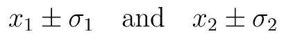

但是现在我们有了它们，问题来了:什么是对 ***x*** 的最佳估计？我们将尝试以最简单的方式回答——通过尝试找到两个测量值之间的最佳线性组合:

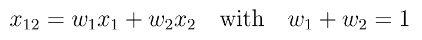

现在问题来了:w1 和 w2 的最佳值是多少？幸运的是，有多种方法可以达到相同的结果。我将展示两种不同的方法:一种使用拉格朗日乘数，另一种是概率方法。

# 使用拉格朗日乘数法寻找最佳权重

**TLDR** :我们会选择不确定性最小的权重；

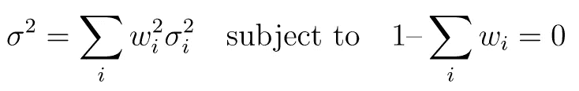

抛开约束…为什么是这个公式？**简答:**这是定义为 ***x*** 的随机变量的实际方差。如果我们假设这两个随机变量是独立的，我们很快就能明白为什么——这个假设在现实世界的大部分时间都成立。我的意思是，如果一个里程表和另一个里程表发生混乱，那么我们就有大麻烦了…远远超过我们的哲学假设😉。

## 推导线性组合的均值和方差

这是 Bienaym 的公式[ [2](https://en.wikipedia.org/wiki/Variance#Sum_of_uncorrelated_variables_(Bienaym%C3%A9_formula) ]。让我们在这里快速推导一下:

首先，独立随机变量的线性组合的平均值。通过使用期望的线性度:

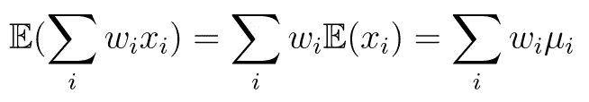

其次，方差:

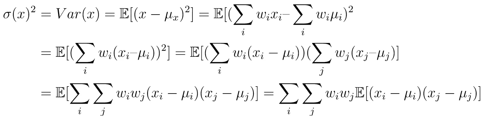

使用独立性属性，我们可以看到:

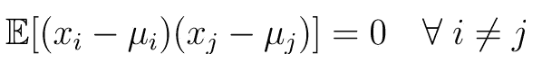

因此，方差平方关系简化为:

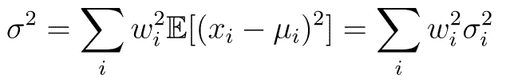

求解拉格朗日函数:

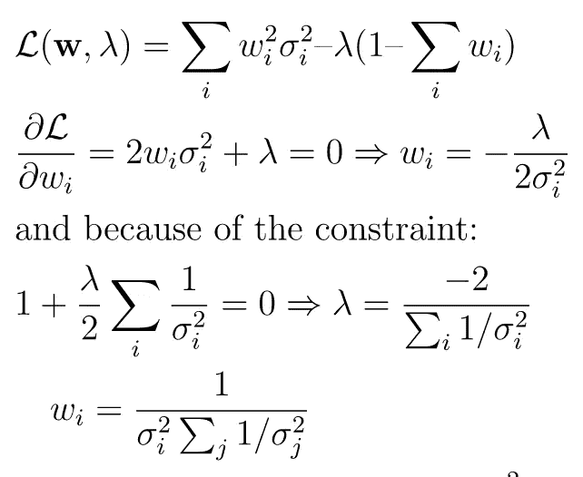

当我们将获得的公式应用于具有两个测量值的情况下的 ***w*** 时，我们得到:

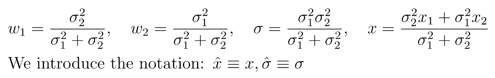

我们引入带帽符号的原因是为了更好地强调那些**估计的**值。从现在开始，我们将使用帽子符号。

顺便提一下，看看拉格朗日公式是如何让我们得到一些非常直观的东西的:权重与方差的倒数成正比，这在统计学中通常被称为**精度**(换句话说，它编码了测量的*重要性*)。

# 从概率上寻找最佳权重

回到我们最初的例子，我们有两个噪声测量值，我们试图**估计**我们分布的平均值 x hat。假设测量是独立的，我们可以使用一点贝叶斯统计作为我们的优势:

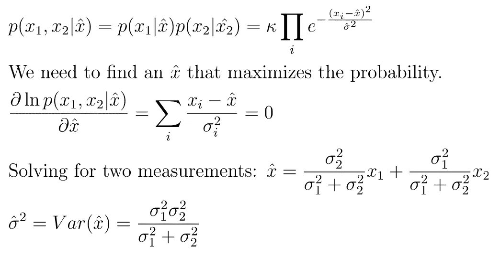

# 卡尔曼滤波器

从更简单的角度来看，卡尔曼滤波器实际上是在系统理论的背景下对加权高斯测量方法的系统化。这是传感器融合问题的解决方案。实际上，这种滤波器用于需要根据其当前内部状态(或信念)以及来自测量的新信息来调整下一个估计状态的设备。因此，该滤波器是递归的，因此具有反馈控制回路。

## 推导卡尔曼增益

为了捕捉卡尔曼滤波器的递归性质，在我们的 1D 例子中，我们必须对描述估计均值和方差的方程进行一些修改。

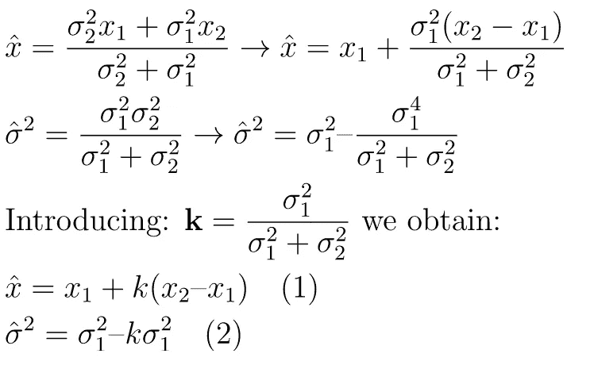

**k** 是 1D 版的**卡尔曼增益**。

但是，卡尔曼并没有像上面写的那样。他更一般化，使用了 N 维版本的卡尔曼增益。为了简单起见，我将从上述方程的 1D 形式和卡尔曼增益到 N 维形式画一个简单的平行线。因此，方差将变成协方差，并且普通除法运算是与倒数相乘:

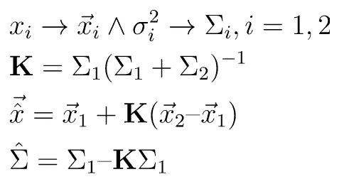

**K** 是 N 维版本的**卡尔曼增益**。

现在，在全面推导卡尔曼滤波方程之前，我们需要引入一些符号并做一个快速的数学回顾:

## 协方差矩阵与另一个常数矩阵相乘

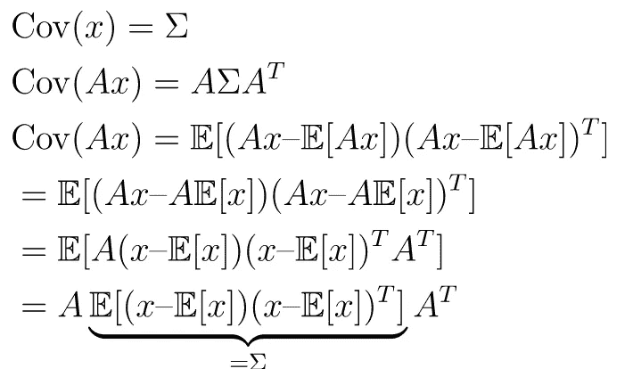

# 推导卡尔曼滤波方程

重要的是要知道，卡尔曼滤波器在两个不同的阶段工作:估计**阶段**(根据当前状态和一些外部因素提供关于下一个状态的预测)和修正**阶段**，使用实际测量来改进预测。

## 评估阶段

*   为了捕捉变化，当前状态(在时间 k1)将带来下一个状态**预测**(在时间 k)，我们将使用矩阵 **F** 。
*   类似地，为了捕捉外部因素的影响，我们将使用不同的矩阵， **B** ，而向量 **u** 用于因子本身。
*   为了捕捉由外部噪声引起的与状态的关系，我们将定义一个高斯噪声， **Q** 。

我们可以用上面的符号来定义预测态的方程。上标减号“-”表示我们谈论预测(*先于*估计)。

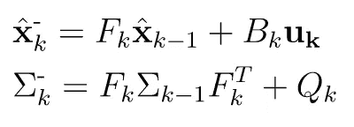

## 校正阶段

另一个关键点是进行测量的传感器，尽管它们可能遵循相同的状态，但它们可能使用不同的测量尺度。因此，我们需要将预测带入传感器的空间(这样每个人都在同一页上)。

*   为此，我们将通过矩阵 **H** 引入一个新的变换。
*   正如我之前所说，传感器的精度有限。为了表达这一点，我们将引入一个协方差矩阵， **R** 。这些测量值的平均值将是所用的最终值(平均值是最佳估计值)， **z** 。

实际上，通过应用从预测空间到传感器空间的变换，我们获得:

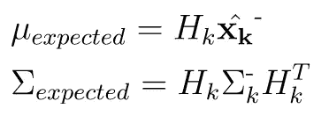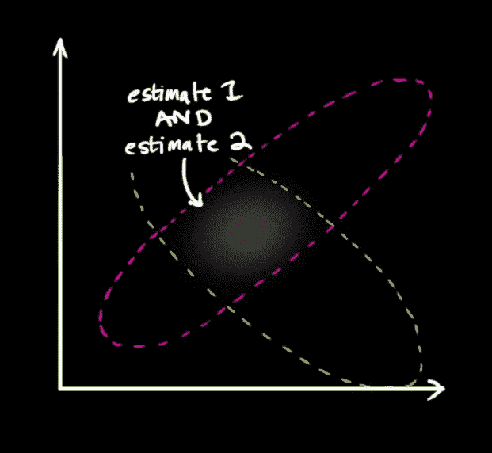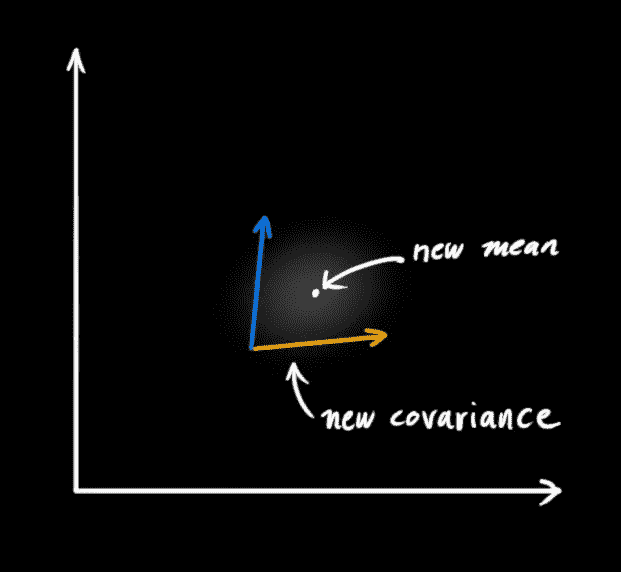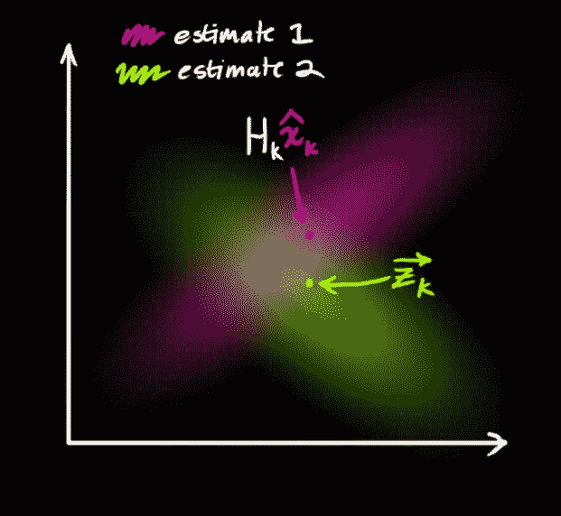

a)预测值和测量值及其相关的不确定性；b)从预测和测量分布获得的联合概率分布；c)新获得的平均值和协方差是最佳估计量。

上面的三张图片来自一篇很棒的文章，也是关于卡尔曼滤波器的(也很直观👍)[https://www . bzarg . com/p/how-a-Kalman-filter-works-in-pictures/](https://www.bzarg.com/p/how-a-kalman-filter-works-in-pictures/)。

我们现在可以将所有东西放在一个包中:

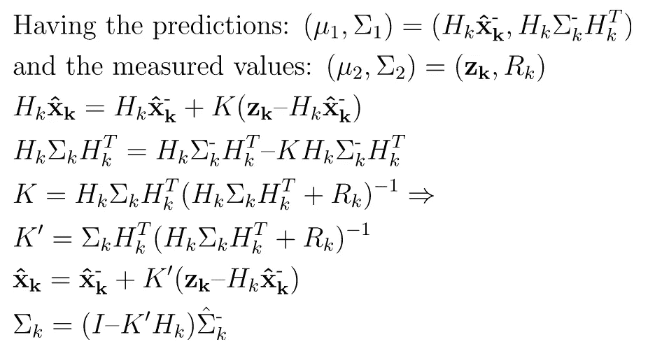

# 扩展卡尔曼滤波器(EKF)

你可能已经注意到，到目前为止我们讨论的一切基本上只是一个奇特的**线性**模型。如上所示，我们只处理线性变换，将一个状态空间变换到另一个状态空间，等等。不幸的是，绝大多数现实世界的问题本质上都是非线性的。

对我们来说幸运的是，我们可以用一个非线性模型做一些有趣的事情，这样，至少在很短的时间间隔内，我们可以用一个更简单的线性模型来近似它。一个技巧是使用一阶泰勒近似(因为它是线性的)。我们将使用泰勒的广义版本，因此第一个系数实际上将是雅可比矩阵(而不是公共导数)。话虽如此，将基本卡尔曼滤波器推广到扩展卡尔曼滤波器版本(EKF)还是很简单的。

更准确地说，我们用一些非线性向量函数***F******H***来改变线性变换**F****B****H**。

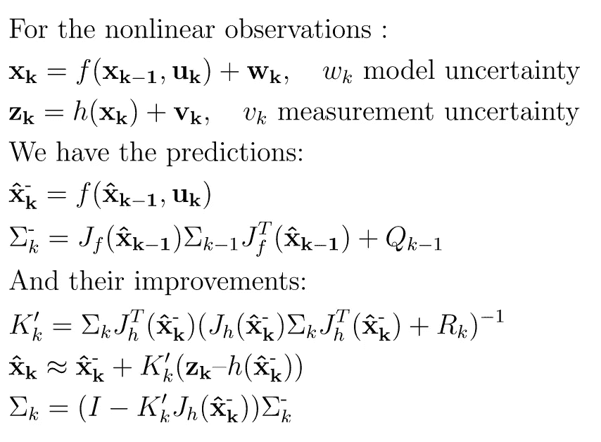

# 结论

原来如此！卡尔曼滤波器后面的方程的完整推导。你可能已经注意到了，我试图避免密集的数学形式主义。为了严谨的推导，我建议看一下原论文，是大师自己做的[[https://www . cs . unc . edu/~ Welch/Kalman/media/pdf/Kalman 1960 . pdf](https://www.cs.unc.edu/~welch/kalman/media/pdf/Kalman1960.pdf)。如果你有任何建议，或者你看到任何错误，请在评论中告诉我。

# 文献学

1.  [https://indico . CERN . ch/category/6015/attachments/192/632/Statistics _ Gaussian _ I . pdf](https://indico.cern.ch/category/6015/attachments/192/632/Statistics_Gaussian_I.pdf)
2.  [https://www . bzarg . com/p/how-a-Kalman-filter-works-in-pictures/](https://www.bzarg.com/p/how-a-kalman-filter-works-in-pictures/)
3.  [http://vision . psych . umn . edu/users/kers ten/kers ten-lab/courses/psy 5038 wf 2009/Mathematica notebooks/Lect _ 27 _ Kalman/Kalman . pdf](http://vision.psych.umn.edu/users/kersten/kersten-lab/courses/Psy5038WF2009/MathematicaNotebooks/Lect_27_Kalman/kalman.pdf)
4.  米（meter 的缩写））s·格雷瓦尔，奥格斯·p·安德鲁斯，*卡尔曼滤波:使用 Matlab 的理论和实践*