# 内核技巧和无限维。

> 原文：<https://medium.com/analytics-vidhya/the-kernel-trick-and-infinite-dimensions-7ecd91cee6ef?source=collection_archive---------3----------------------->

如果你曾经接触过机器学习理论，你可能会遇到术语*内核方法*，以及它们如何将原始输入空间转换到更高维度的空间(有时是*无限*)，以便使用被称为*内核技巧*的东西来执行回归/分类任务。这似乎有点“神奇”，让我困惑了很长时间。然而，我最终认为我已经理解了这一点，这就是为什么我想分享我的观点。

一种常见的线性参数模型被称为*线性回归*，其中一些输出作为某个输入向量 **x** 和一些参数 **w** 的某种线性组合的函数给出。我们通常将初始数据划分为训练集和测试集，并在训练集上调整回归参数 **w** ，直到我们对结果满意为止。然后，我们扔掉训练集，使用测试集来评估其总体性能，并使用 **w** 来预测新的、新鲜的未见过的数据。

让我们以岭回归为例:

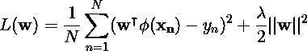

这是我们试图最小化的损失函数，用参数 **w** 表示。如果我们取这个函数相对于 **w** 的梯度，我们得到如下结果:

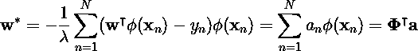

注意我们如何将 w 重写为 a 的函数。如果我们将其代入原始损失函数，我们得到以下结果:

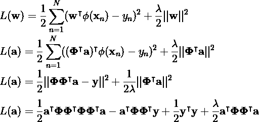

注意 phi 的重复模式。矩阵**φ**是映射到某个扩展特征空间的每个初始数据点 **x** 。自身被转置的 **phi** 的乘积表示每个数据点与其自身和所有其他数据点的点积(在各个变换 phi(x)下)。这个乘积也被称为*克*矩阵 **K.** 我们继续根据 **K** 重写损失函数:

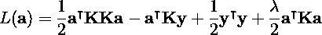

如果我们计算这个函数相对于 **a** 的梯度，并将其设置为零，我们得到:

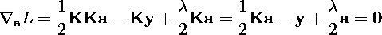

如果我们重新排列并求解 **a** ，我们最终得到 **:**

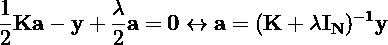

我们设法用 **a** 来重新表述这个问题，这样我们可以看到解决方案只能用 **K** 和**y**来表示。这是*对偶*表示，但是为什么这是一件好事呢？**鼓声** 进入*内核绝招*。

在简单的情况下，φ(**x**)表示恒等式变换φ(**x**)=**x**。这意味着 **K** 的每个条目只是训练集中每个数据点的点积。由于 **K** 是 n 乘 n 矩阵，这似乎只会使事情变得更糟(因为当使用高斯-乔丹算法 *)* 时，对 n 乘 n 矩阵求逆的计算复杂度是*o(n^3*，然而，当训练集的维数 d 远大于样本数量( *D > > N* )时，我们可以看到，解决对偶问题比原始问题更有效。

但是什么是*绝招*？

如果我们将点积视为相似性的度量，我们可以想象, **K** 中的每个条目给我们一个度量，即每个向量对 **x** 和 **z** 在原始 D 维空间中有多相似。但是如果我们要扩展到更高维度的空间呢？

存在一些流行的核，例如多项式核:

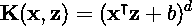

为简单起见，我们设置 b = 1 和 d = 2，这样内核中的每个条目都变成:

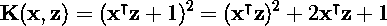

我们看到每一项都是点积和加法的平方。然而，如果我们根据点积重写每个条目，我们可以看到它实际上代表了更高维空间中的比较:

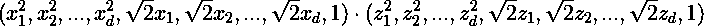

更正:我在这里漏掉了 sqrt(2)*(交叉项)的总和

这是内核的伎俩！我们发现一些映射 **K** 允许我们在更高维度中比较原始数据集**，而不需要在扩展的特征空间中实际计算点积的额外工作。**

无限维的核呢？

还有一个非常流行的内核叫做 RBF(径向基函数),看起来像这样:

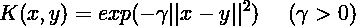

我们从扩展正方形开始:

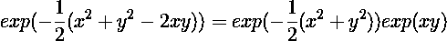

如果你还记得微积分，你知道我们可以用泰勒展开式来近似一个函数:

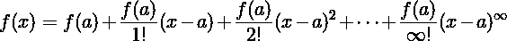

幸运的是，当 f(x)是指数函数时，展开很容易:

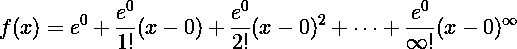

如果我们简化上面的表达式，我们得到:

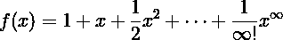

我们用这个展开式代替最后一个 exp(xy)项，这样初始公式就变成:

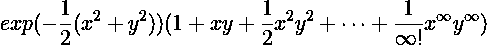

现在像这样替换表达式的左手因子:

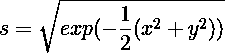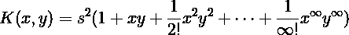

正如多项式核可以重写为点积一样，RBF 也可以:

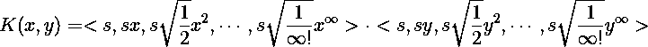

这意味着 RBF 将每一对数据点映射到一个无限的核中，更重要的是，我们不必实际计算这些(无限)点积。

注意，不是所有的函数都是有效的内核函数，有一些条件必须适用，如果你感兴趣，我可以推荐 M. Bishop 的“模式识别和 ML”的第 6.2 章。

感谢阅读！