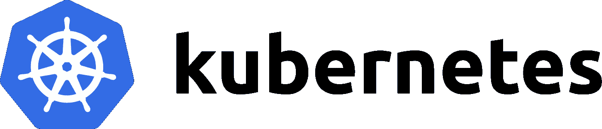

# 库伯内特控制飞机

> 原文：<https://medium.com/analytics-vidhya/the-kubernetes-control-plane-f4bf460c848f?source=collection_archive---------4----------------------->

[https://buddy.works/blog/thumbnails/gke-authentication.png](https://buddy.works/blog/thumbnails/gke-authentication.png)

[https://kubernetes.io](https://kubernetes.io)

我们来看看 kubernetes 内部是如何进行沟通的。

kubectl 命令是用户与之交互的东西，也是用来与 kubernetes 后端建立内部连接的东西。该命令首先需要配置适当的凭证和 kubernetes 集群的位置。

$> kubectl 获取 pod

*   这将通过 HTTPs 向集群发送一个 API 调用
*   API 响应通过 HTTPS 发送回控制台，并显示给用户。

让我们进一步深入了解后端到底发生了什么。请看下图:

Kubernetes 控制平面

# 主人:

*   主节点对集群做出全局决策，它们还检测集群事件并做出响应，例如当部署的现场“副本”不符合要求时启动新的 pod。(副本规定了在任何给定时间点要保留的相同节点结构的数量)
*   主组件，设置脚本通常在同一台机器上启动所有主组件，为了简单起见，不在这台机器上运行用户容器。

# 主组件:

1.  Kube API 服务器:

*   接受查看或更改集群状态的命令，包括启动 pod 的命令。
*   它验证请求并确定它们是否被授权和有效，从而管理准入控制。
*   这是 master 的组件，它接收 API 调用并适当地为其提供服务。
*   Kube API 服务器也与 kubelet 建立连接。(kubelets 将很快介绍..坚持住！).

2.etcd:

*   这是集群数据库。
*   它可靠地存储集群的状态，包括关于集群配置的所有信息和更多的动态信息，如哪些节点需要运行等。
*   如图所示，kube API 服务器直接与 etcd 交互。
*   如果您的 Kubernetes 集群使用 etcd 作为其后备存储，请确保您有一个安全的数据备份计划。

3.kube-调度程序:

*   它的任务是将 pod 调度到节点上，并评估每个 pod 的需求。
*   评估完成后，它必须选择最合适的节点。
*   实际上，它并不真正将 pod 启动到节点上，而是寻找没有分配节点的 pod，然后简单地将该节点的名称写入 pod 对象。(这更像是一个经理在一家餐馆里，根据要求，一看到有桌子空着或空着，就进行预订)。
*   因为它是一个调度程序，所以它也跟踪所有 pod 的状态。还要考虑硬件、软件和策略约束。

4.Kube 控制器经理:

*   它通过 kube API 服务器持续监控集群的状态。
*   当当前状态与所需状态不匹配时，它会进行更改以达到所需状态。(虽然进行了预订，但由于没有空桌，经理决定增加一张桌子来容纳顾客)。
*   它被称为控制器管理器，因为 Kubernetes 对象是由称为控制器的代码循环维护的。
*   如果某个节点离线，控制器还会与重要信息进行通信。

5.Kube 云管理器:

*   云控制器管理器运行与底层云提供商交互的控制器。
*   cloud-controller-manager 允许云供应商的代码和 Kubernetes 的代码相互独立地发展。在之前的版本中，Kubernetes 的核心代码依赖于特定于云提供商的功能代码。
*   它负责负载平衡、按需存储卷等功能。

# 该节点:

到现在为止，我们都知道什么是节点，如果不是的话，我很惊讶你是如何理解这一点的… ( [快速阅读 1](/@ajinkyabhanudas/overview-the-google-kuberenetes-engine-4c849c851da7?source=friends_link&sk=c1d217c83379ed69d504dfdf8119bc41) ，[快速阅读 2](/@ajinkyabhanudas/kubernetes-features-and-why-gke-provides-an-improvised-orchestration-solution-to-kubernetes-5a038f436e5a) )。

# **节点组件:**

1.  库伯莱:

*   它是每个节点上的 kubernetes 代理。
*   当需要开始一个 pod 时，需要一个连接 kubelet。
*   kubelet 使用容器运行时来启动 pod，监控它的生命周期，检查准备情况，等等。
*   Kubelet 向 kube API 服务器报告。
*   关于 GKE 需要注意的一点是，它只利用 Docker 容器运行时。

2.Kube-proxy:

*   它是运行在集群中每个节点上的网络代理。
*   它维护集群中各单元之间的网络连接。(kube-proxy 维护节点上的网络规则，这允许它维护网络连接)。

所有这些加在一起形成了 Kubernetes 控制平面。现在，您应该对这些组件如何交互以及它们执行什么任务有了清晰的理解。

在下一篇文章中，我们将尝试了解 kubernetes 中的操作和更多的 kubectl 命令，以及它是如何工作的。在那之前，继续学习:)