# 你在 SVM 最不需要的博客

> 原文：<https://medium.com/analytics-vidhya/the-last-blog-you-will-read-on-svm-8598cf3d0603?source=collection_archive---------14----------------------->

*关于支持向量机的简单而全面的阅读*

大多数监督学习算法在大多数情况下的性能是非常相似的。然而，更重要的是可用数据的规模，以及您拥有的技能，如特征工程或正则化技术。

支持向量机或 SVM，有时促进一种更干净的方法来学习线性和非线性复杂函数。

***现在让我们试着了解一下*** 的 SVM 是怎么一回事

我们将举一个例子，根据电子邮件中的单词来分类一封电子邮件是垃圾邮件(y=1)还是非垃圾邮件(y=-1)。

下面显示的是我们在讨论 SVM 时要考虑的输入数据。值 1 表示该单词存在于电子邮件中，0 表示该单词不存在。

y 列表示该电子邮件是垃圾邮件还是非垃圾邮件。

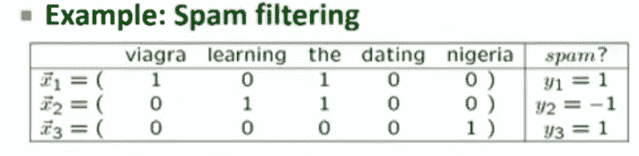

因此，我们面临着二元分类的挑战。我们将使用线性模型来构建分类器。

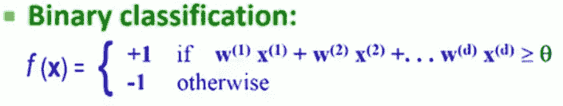

如果输入的加权组合大于某个阈值，我们会将该电子邮件分类为垃圾邮件，否则我们会将其分类为非垃圾邮件。

**因此我们的目标是找到 W 的值来定义函数 *f(x)***

我们现在的目标是定义一个超平面— f(x ),通过找到 w 的值来将垃圾邮件与非垃圾邮件进行分类。

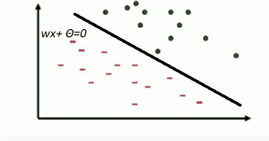

更详细地说，这是一个线性分类器的例子，每个单词都有一个与每个特征相关联的权重。

如果特征和权重的加权和为正，我们预测值+1 为垃圾邮件，否则-1 为非垃圾邮件。

问题是，我们如何找到 W 的值？

让我们使用我们的训练数据 x，输入特征和标签 y。

> **我们的目标是定义一条线，将我们的数据最好地分类为垃圾邮件/非垃圾邮件。**

但是我们如何找到最佳路线呢？

从下面的例子可以看出 ***有很多可能的线*** 可以选择做我们的分类器。

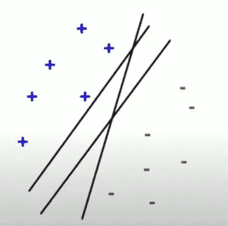

> 选择这条线的理由是，离分隔线越远，我们的分类就越有把握，反之亦然。

例如，A 点和 C 点都不是垃圾邮件，但是我们对 A 点不是垃圾邮件的信心比 C 点高。

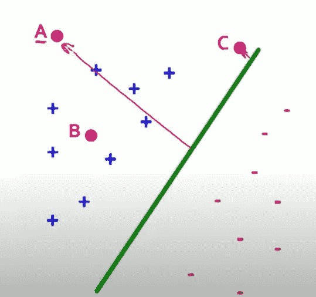

所以现在我们想找到具有最大边距的线，或者使线中最近点的距离最大化的线。

我们将边缘定义为距离决策边界最近的例子的距离。我们将决策边界的值称为γ。

下图左图中的γ比右图中的γ小得多

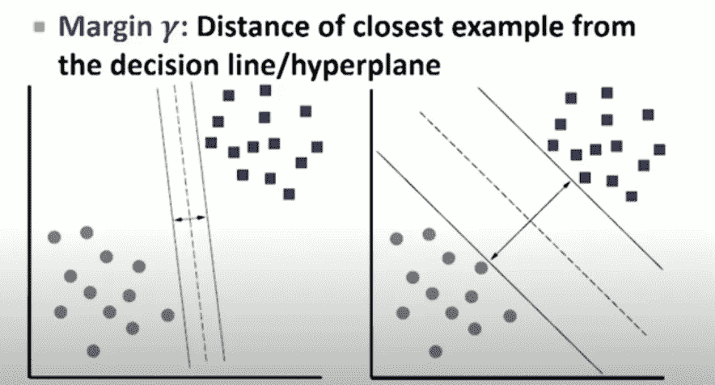

但是我们如何计算γ呢？

下图中我们的参考是线 *L* 和数据点 *A.*

A 离 L 有多远？

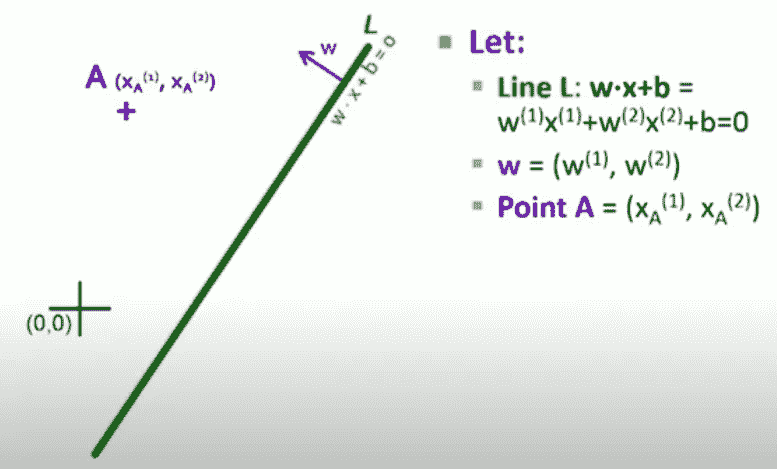

从数学上可以看出，A 点到 L 的距离为 **wA+b.**

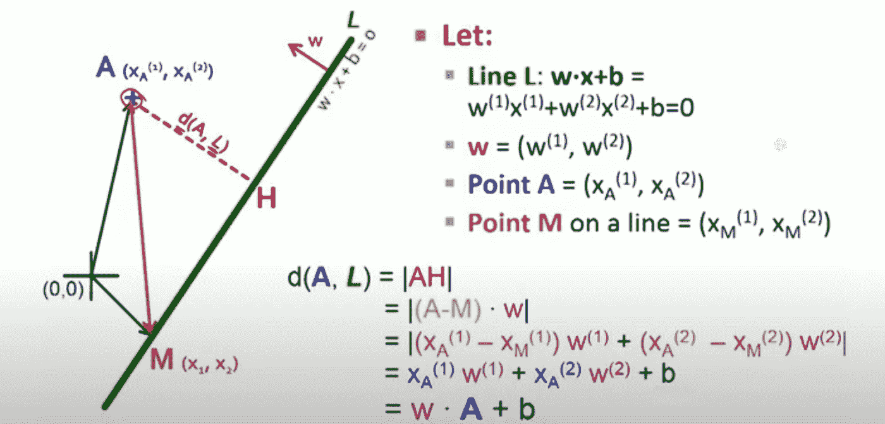

所以现在我们能够找到 **γ，**，我们可以继续寻找 w，并定义具有最大余量的分离平面。

求 W 的条件是:

**对于我们所有的数据点，如果数据点 *i* 具有最小的 *γ，*我们会想要最大化点 *i* 的γ。**

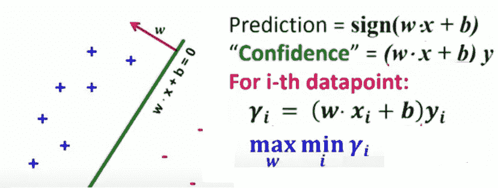

我们可以把它写成一个优化问题，目标是找到 **γ，**，这样对于每个训练样本，最大训练样本的值至少是 **γ。通过找到γ，我们将因此找到 w**

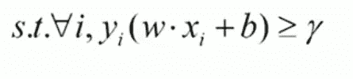

**术语*支持向量*从何而来？**

名称*支持向量*来自于我们的大间隔分类器仅由非常少的点(或向量)定义的事实。

在下面的例子中，分类器只能由三个点定义，我们可以安全地忽略所有其他的点。或者我们可以说向量由 3 个点支撑。

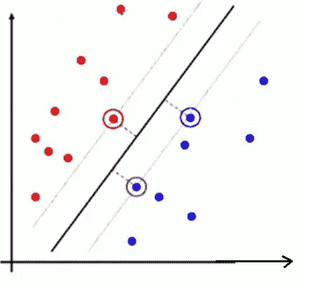

通常如果我们有 *d* 维数据，我们需要 *d+1* 支持向量来定义我们的线。

让我们假设我们有一个数据点 X，我们已经计算了点 X 的 **γ** 。

从下面的等式可以看出，如果我们缩放 w，γ也会缩放。这将给出对γ的错误估计，并影响我们的成本函数。

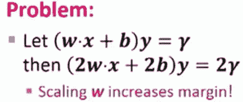

解决这个问题有两个步骤

1.  我们使用归一化的 W；

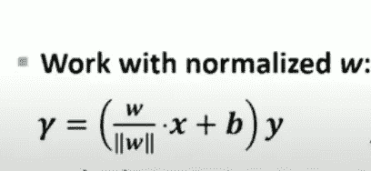

2.我们将支持向量定义如下:

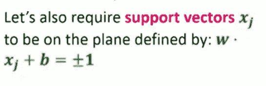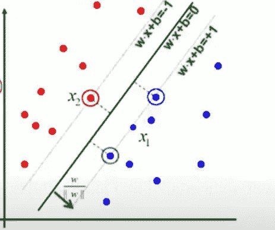

我们如何计算 **γ？**

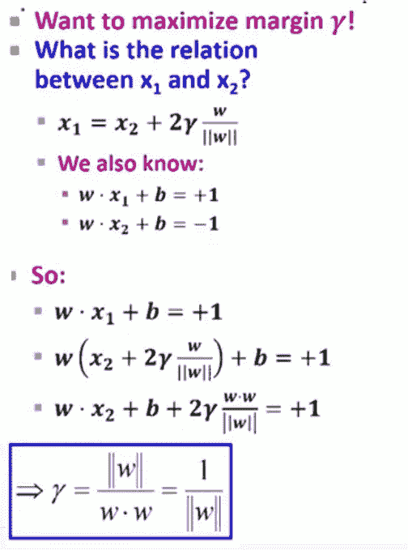

因此，我们的约束条件变为:

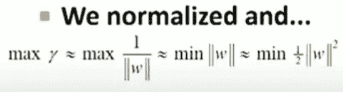

现在最大化 **γ** 的问题变成了:

*   最小化向量 *w 的长度；*还有
*   保持我们对所有数据点分类的置信度大于 1 的约束。

**这叫做硬约束 SVM**

> S **oft 边缘分类器**

到目前为止，我们假设总是有可能找到一条线来区分积极和消极的情况。然而，大多数真实数据集没有这样的超平面。参见下面的数据集:

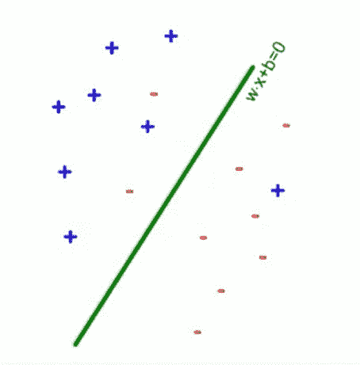

在这种情况下，我们需要引入一个与错误数量相关的惩罚 C，同时保持较高的利润。

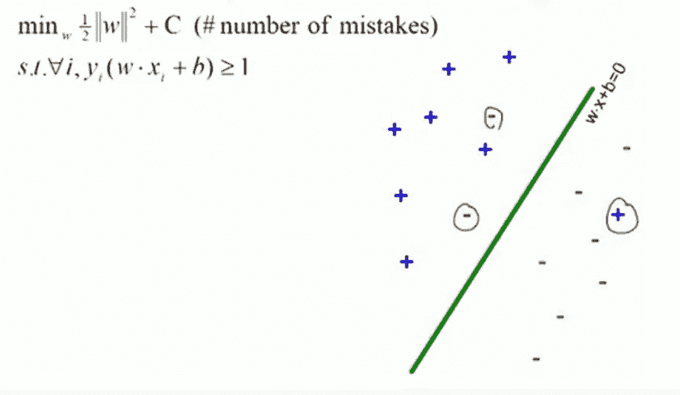

因此，现在的目标是定义一个超平面，给出良好的利润，但允许犯一些错误。

但不是所有的错误都是平等的。我们将使用**松弛变量** ε、**或对错误分类数据的惩罚。**

ε是从页边距的另一侧到数据点本身的距离。

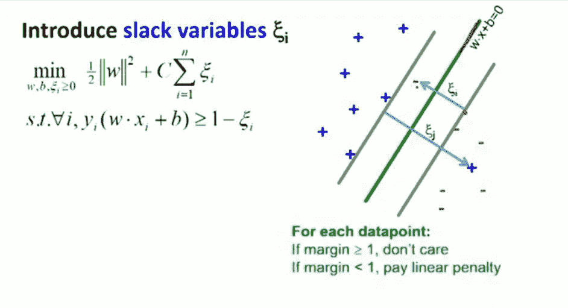

现在我们的目标是找到 *w，b，ε* 以达到最优化。如果 x 在边缘的错误一边，我们招致ε的损失。

> C 被称为松弛惩罚，因为它作为一个调整参数，我们希望最大限度地提高利润率，而不是惩罚我们的分类错误。

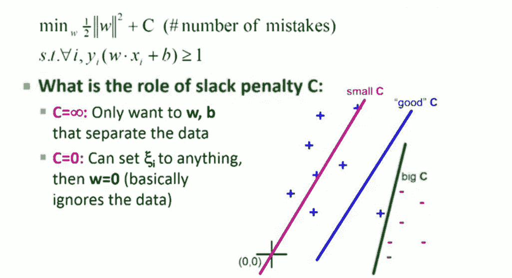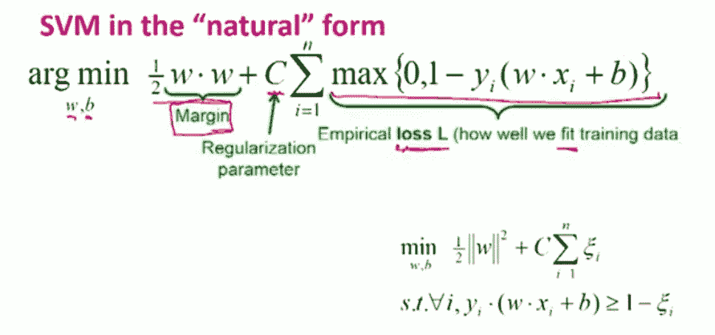

SVM 的损失函数被称为铰链损失，它看起来像下面的红线。损失函数铰接在标记为 *K:* 的点上

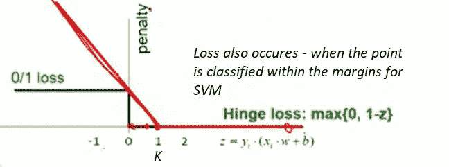

> ***一旦我们解决了我们的成本函数，我们就会得到我们想要和需要的所有支持。***

如果这个博客有助于你了解 SVM，请鼓掌。编码快乐！:)