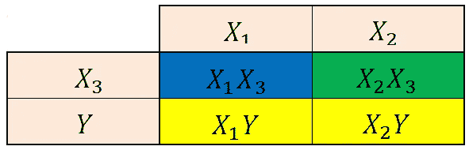

# 回答这个条件概率问题的最后一个解释

> 原文：<https://medium.com/analytics-vidhya/the-last-explanation-you-will-ever-need-to-answer-this-conditional-probability-question-f39f8e93086c?source=collection_archive---------16----------------------->

> **问题:一对夫妇有两个孩子，假设其中一个孩子是女孩，那么两个孩子都是女孩的概率是多少？**

提示，答案不是 50%。在这篇文章中，我将从一个不同的角度来阐述这个问题。首先，我将简要介绍人类遗传密码及其储存方式。然后，我用和不用条件概率公式来回答问题。

我们身体中的每个细胞都包含一本大食谱，里面保存着身体生存所需的几乎每种蛋白质(甚至更多)的食谱。我们称这本食谱为遗传密码，在人类中，它是由 DNA 分子组成的。这本书由称为染色体的部分组成。有 46 条染色体，23 对。其中 22 对被称为常染色体，在男性和女性之间是相似的，而第 23 对被称为性染色体。

图 1——核型，人类染色体成对排列并按大小编号。来源:[美国国家医学图书馆](https://ghr.nlm.nih.gov/primer/basics/howmanychromosomes)。

前 22 对按大小编号。性染色体在大小上明显不同，并有独特的名称(图 1)。一般来说，每个人都会从父母那里得到一份随机的染色体拷贝，尽管自然突变也会发生。女性通常被描述为拥有两条“X”染色体，而男性则拥有一条“X”和一条“Y”染色体作为其第 23 对染色体。简而言之，女性性染色体对由从父母那里获得的两条不同的“X”染色体组成。男性性染色体对由来自母亲的 X 染色体和来自父亲的 Y 染色体组成(图 2)。

图 2-人类性染色体的分离。蓝色背景代表雌性后代，黄色背景代表雄性后代。

图 3 —条件概率公式。来源:[耶鲁大学](http://www.stat.yale.edu/Courses/1997-98/101/condprob.htm)。

条件概率是假设一个事件已经发生，而另一个事件已经发生的概率，假设这些事件不是相互独立的(图 3)。在这个问题中，我们假设孩子的性别已经决定，父母知道他们孩子的性别([男孩女孩悖论](https://en.wikipedia.org/wiki/Boy_or_Girl_paradox#Second_question))，问题中的事件相互依赖。

## 催单

> 问:一对夫妇有两个孩子，假设其中一个孩子是女孩，那么两个孩子都是女孩的概率是多少？

## 解答-使用条件概率公式

将其转化为我们的情况，假设其中一个孩子是女孩，有两个女孩的概率等于有两个女孩的概率除以至少有一个女孩的概率(图 4)。样本空间，S = {(G，G)，(G，B)，(B，G)，(B，B)}，其中在元组中 G 是女孩，B 是男孩。有两个女孩和至少有一个女孩的事件的交集当然是有两个女孩— P(A ∩B) = {(G，G)}。以及至少有一个女孩的事件— P(B) = {(G，G)，(G，B)，(B，G)}。

图 4 —条件概率公式。事件 A，父母有两个女孩。事件 B，父母至少有一个女孩。

## 树形图

树形图是帮助可视化这类问题的好方法，因为它们有助于绘制整个事件空间。树中的每个分支代表我们事件空间中的一个可能的结果。更多的时候，树形图被用在简单的情况下，比如这个，因为它们会很快变得复杂。对于这个问题，我创建了一个四分支树形图(图 5)。图 5 中的每个矩形显示一个事件(女孩或男孩)，以及该事件发生的概率(通常，生女孩和生男孩的概率相同)。

图 5–描述事件空间的树形图。

图 6——假设父母已经有一个女孩，使用图 5 中的树形图计算两个孩子都是女孩的概率。

所以，回头参考条件概率公式和组成解的事件(图 4)。事件 A 和 B，有两个女孩的事件{(G，G)}，用树的右支表示，有一个女孩，然后又有一个女孩(1/2 x 1/2，图 5)。事件 B，父母至少有一个女孩的事件，是三个右分支{(G，G)，(G，B)，(B，G)}的累积结果。如果第一个孩子是女孩，第二个孩子的性别无所谓。因此，两个右分支(1/2×1/2，两次，图 5)都是事件的一部分。此外，如果第一个孩子是男孩，第二个孩子只能是女孩(1/2 x 1/2，图 5)。现在，当我们划分这些结果时，我们得到相同的结果，1/3(图 6)。

我发现简单地将数字插入条件概率公式的典型解决方案不太直观。希望下一个解决方案能帮助你更好地理解为什么答案不是 50%。

## 解决方案—不同的视角

关于性染色体有四种可能的后代；两个女孩和两个男孩(图 2)。因为我们已经知道父母有一个女孩(例如，蓝色矩形，图 6)。我们现在必须从剩下的三个可能的孩子中找出另一个女孩的概率。两个男孩和一个女孩(两个黄色矩形和一个绿色矩形，图 6)。因此，在父母已经有一个女孩的情况下，有另一个女孩的概率是从剩下的三个可能的孩子(绿色和黄色方框，图 6)中挑选一个女孩(例如，绿色方框，图 6)的概率的 1/3。

图 6-人类性染色体的分离。蓝框代表我们已知的雌性后代。黄色方框代表雄性后代，绿色方框代表样本空间中剩余的雌性后代。

总之，概率是我们根据过去的信息给出的表达式，新信息可以改变这些表达式。正确回答这个问题最重要的部分在于确认我们得到了一条改变初始概率的信息。当解决概率问题时，你应该寻找“给定”这个词“给定”事件提供的新信息通常意味着你正在处理条件概率问题，初始概率已经改变。