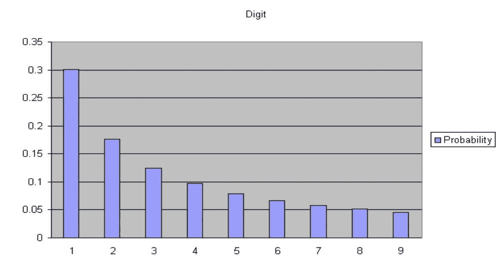
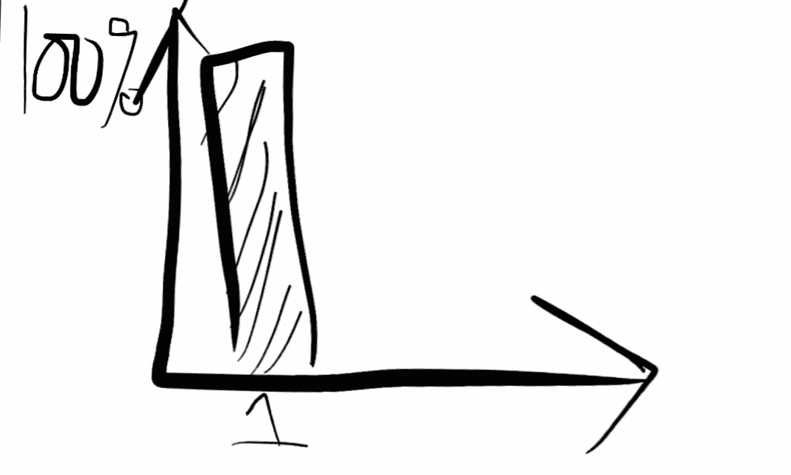
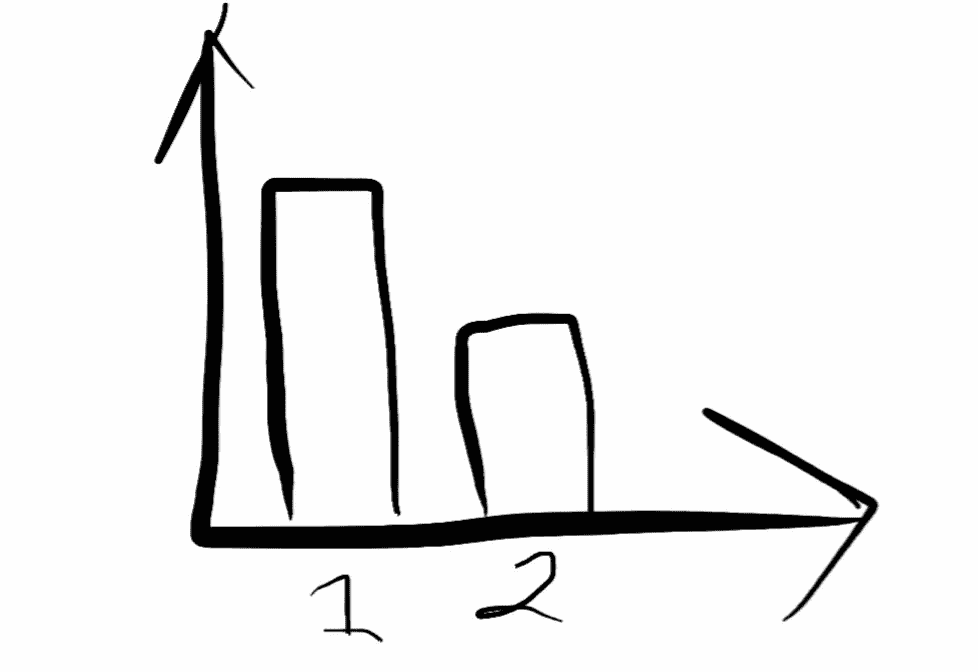
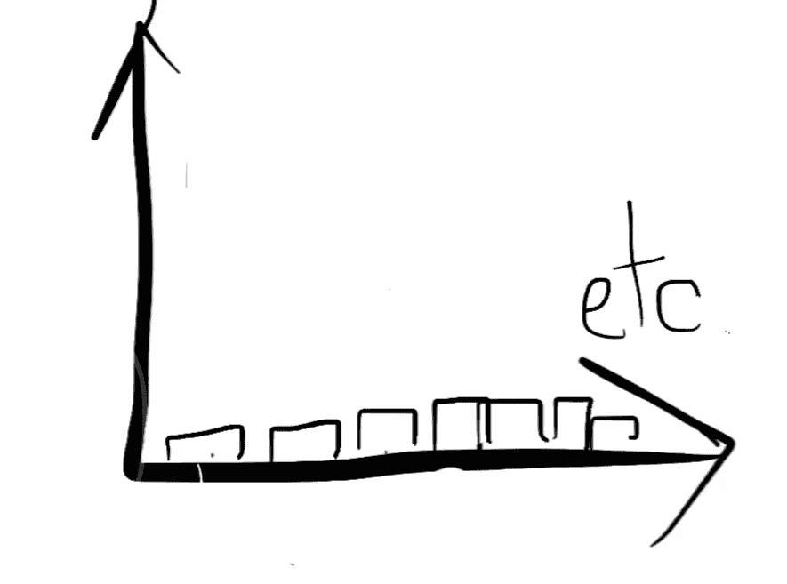

# 你从未听说过的自然法则

> 原文：<https://medium.com/analytics-vidhya/the-law-of-nature-youve-never-heard-of-d7cca167119a?source=collection_archive---------25----------------------->

这是更令人惊讶的自然法则之一:以 1 开头的数字比其他任何数字都多。

我以前遇到过几次本福特定律，但今天是我第一次完全理解它。

这太不直观了。本福德定律指出，在足够大的自然产生的数字集合中，更多的数字将以较小的数字开始，而不是较大的数字。因此，在任何相当大的数据集中，以 1 开头的数字比 2 多，以 2 开头的数字比 3 多，以此类推。在大型数据集中，本福德定律预测前导数字为 1 的数字出现的频率是以 9 开头的数字的 6 倍。

本福特定律。来源:[维基百科](https://en.wikipedia.org/wiki/Benford%27s_law)

本福德定律在大范围的自然现象中非常稳定，*只要它们跨越几个数量级*。更疯狂的是，它是尺度不变的。如果你改变你用来测量的单位，测量值会改变，但是本福特定律保持不变。

在很长一段时间里，我觉得这很疯狂。为什么大自然会偏爱以低位开头的数字？当然，每个数字应该是均匀分布的，六和七应该和八和九一样常见。今天，我又碰到了本福特定律，一个便士掉了下来。

本福特定律如果换个基就更好理解了。如果我们用二进制来收集我们所有的记录，本福德定律是微不足道的。除了零，每个二进制数都是从 1 开始的。因此，对于任何数据集，几乎 100%的数字都以 1 为前导数字。

以 2 为基数的本福特定律。一切从 1 开始。

现在想象我们用基数 3 代替。作为参考，下面是以 3 为基数的数字 1 到 20:{ 1，2，10，11，12，20，21，22，100，101，102，110，111，112，120，121，122，200，201，202}。

基数为 3 的本福德定律。

因为我们是以 3 为基数，1 到 20 的数字已经跨越了 3 个数量级。我们可以开始看到本福德定律的出现:在我们的样本中，只有 7 个数字以 2 开头；从 1 开始有 13 个。

每上升一个数量级，就从最小的数字开始计数。这意味着你有更多的机会数一而不是二。如果您的数据跨越几个数量级，最大的数据点更可能从 1 开始，而不是从 2 开始，因为您必须跳过所有以 1 开始的数字，才能得到以 2 开始的数字。因此，从 1 开始的数字要比从 2 开始的多。同样的论点也适用于更高的基数。

除非你的数据完全符合一个数量级范围(例如，正好在 1 到 999 之间)，否则本福德定律成立。即使是这种情况，改变测量数据的尺度和单位，也会使数据偏离更均匀的分布，进入本福德体系。

在更高的基数上，本福特定律就不那么严格了。作为一个极端的例子，假设我们使用的基数是 100 万。我们将使用不同的字符来记录以 10 为基数的从 1 到 999，999 的每个数字。除非我们的数据集跨越一百万的许多次方，否则我们将得到一个统一的数字分布——每个以一百万为基数的字符将被使用一次或者根本不被使用。

在百万进制中，大多数事物都是均匀分布的。

本福德定律适用于电费、街道地址、股票价格等等。当数据由幂定律生成时，它尤其适用。不过，有些东西它并不适用——最明显的是，由心理阈值设定的数字(现在购买只需 9.99 美元！).

本福德的法律甚至被用来打击网络犯罪。所有进出你银行账户的支付都将趋向于类似本福特的分布。他们的时间戳也是如此！通过检查观察到的支付数据是否遵守本福特定律，可以抓住使用随机数生成欺诈性支付的罪犯。

我想知道你是否能利用本福德定律在市场上赚钱。二元期权允许你赌一只股票会涨还是会跌，但不能赌它涨的幅度。如果有期权可以让你赌一种证券价格的领先位数，你也许可以用本福特式的策略赚钱。

无论是购买股票，还是计算脸书的朋友，本福德定律都是一样的。孤独的数字往往在游戏中保持领先。

*最初发表于*[T5【xsrus.com】](http://www.xsrus.com/)*。*