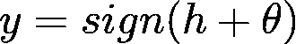

# 学习问题:大脑和机器的比较

> 原文：<https://medium.com/analytics-vidhya/the-learning-problem-comparison-between-brain-and-machine-339c8de6635a?source=collection_archive---------19----------------------->

## 第一章:神经元和感知器


左边来源:[https://www . extreme tech . com/WP-content/uploads/2016/01/connectome . jpg](https://www.extremetech.com/wp-content/uploads/2016/01/connectome.jpg)；右边:[https://cluster data . nl/WP-content/uploads/2018/01/maxresdefault-1 . jpg](https://clusterdata.nl/wp-content/uploads/2018/01/maxresdefault-1.jpg)—本人修改

**这是致力于从根本上分析和分解学习问题的系列文章的第一章。在这样做的时候，我想强调生物领域和人工领域之间的比较。特别是，作为一名物理学家，我对理解涌现和自组织现象感兴趣，这些主题通常与复杂系统相关(例如大脑或深度神经网络)。因此，中心思想将是:展示如何以自下而上的方式应用充分理解的解决方案(例如，单个神经元),以理解复杂的情况。为了建立一个坚实的结构来解决这个问题，我们需要两个工具:数学建模和模拟(又名编码)。我将从头开始讲述这一切，让我们开始吧！**

> 如果你不能解决一个问题，那么有一个更简单的问题你可以解决:找到它。( **George Pólya，关于理解、学习和教学问题解决的数学发现)**

物理学传统上忠实于这一理念:复杂的情况优先在简单的解决方案之上进行研究。甚至在更抽象的层面上，在讨论与认知过程的约束的一般性质有关的问题时，物理学家可能会觉得，例如，自然语言对于一个起点来说是太复杂的主题。他很可能试图构建一个越来越复杂的结构，这个结构由具有认知味道的简单过程的明确实现组成。*选择这些阶段的一个主要标准是它们的可分析性。它们的性质可以用非抽象的方式来研究，避免了复杂性的模糊性所带来的神秘结论。*

这样，为了理解学习问题，我们应该处理它的基本单元。特别是，我们将比较*神经元*和*感知器*。让我们继续第一个。

## 神经元:理解复杂性的生物候选者[1]

对生物学背景的简短描述是必要的，尽管在未来很长一段时间内，它不可能超越[艾瑞克·坎德尔的](https://neurology.mhmedical.com/book.aspx?bookid=1049)对神经科学的描述(因此，你可以查看这篇杰出的文章以获得该领域的总体概述)。这里将只总结那些对于模型的构造是必不可少的特征。

基本元素自然是*神经元*和*突触*。人类神经系统中有相当多种类的神经元——在大小、结构和功能上都有差异。作为上下文的选择，为了当前的目的，我们将考虑“典型”类型的神经元。如果基本原理取决于单个神经元的结构，物理学就不太可能对它们的阐明有多大贡献。超过一定水平，复杂的功能必然是大量简单元素相互作用的结果。


图 1A 来源:[https://www . Forbes . com/sites/Andrea Morris/2018/08/27/scientists-discover-a-new-type-of-brain-cell-in-humans/](https://www.forbes.com/sites/andreamorris/2018/08/27/scientists-discover-a-new-type-of-brain-cell-in-humans/)—本人修改


图 1B 来源:[https://IB . bio ninja . com . au/standard-level/topic-6-human-physiology/65-neurons-and-synapses/neurons . html](https://ib.bioninja.com.au/standard-level/topic-6-human-physiology/65-neurons-and-synapses/neurons.html)

图 1 描绘了一个神经元及其示意图。神经元通过突触进行通信，突触是沿着*突触前*神经元的*轴突*的点，在这些点上，神经元可以将已经在其*胞体*中执行的计算结果传递给*树突*或者甚至直接传递给*突触后*神经元的胞体。输出部分是轴突。通常只有一个轴突离开胞体，然后在下游重复分支，与许多突触后神经元沟通。

现在，从我们的角度来看，神经元和突触的*动力学*，非常类似于电信号在电缆中的传播，基于以下序列:

*   神经轴突处于全有或全无状态。在第一种状态下，它基于在胞体中对来自树突的信号进行求和的结果，传播信号*尖峰*，或*动作电位*。传播信号的形状和振幅非常稳定，并在轴突的分支点复制。此外，轴突中行进冲动的存在阻断了第二次冲动传递的可能性。
*   当行进信号到达轴突的末端时，它导致*神经递质—* 我们的先兆 *—* 分泌到突触末端。
*   神经递质穿过突触到达突触后神经元膜，并与*受体*结合，从而导致后者打开，允许离子电流渗透。
*   突触后电位( **PSP** )以分级的方式向细胞体扩散，在细胞体中，来自所有连接到突触后神经元的突触前神经元的输入被相加。如果在短时间内到达的 PSP 的总和超过某个*阈值*，尖峰发射的概率变得很大。

在发放尖峰信号之后，神经元需要时间来恢复。我们将这段时间命名为*绝对不应期*，在此期间，神经元不能发出第二个棘波(大自然以这种方式设定了最大棘波频率，*事实上*限制了神经元在固定时间内可以处理的信息量)。

前面的描述表明，神经元将计算结果传递给其他神经元的唯一方式是通过神经递质的释放。为了数学建模，我们将做一个强有力的假设，即:**阈下电位不会导致神经递质**的释放。换句话说，神经递质仅由尖峰释放。

既然我们已经对神经元的功能有了基本的介绍，我们可以看看一个数学模型，即*漏积分点火* ( **LIF** )神经元。对于那些对这个模型背后的“重”数学感兴趣的人，我将简要地介绍它。

## 从数学角度看漏积分发射模型[2]

处理神经元模型的标准方法是*电路模拟*。这是相当技术性的，但我会尽量保持低水平。对于你们中已经学过*电子学* *101* 的人来说，这只是一个简单的𝑅𝐶电路的快速回顾。

我们之前一直在谈论发生在体细胞中的求和(有时称为*整合*)过程，它与触发超过某个临界阈值的动作电位的机制相结合，是神经元动力学的核心。

现在让我们深入数学，以便建立一个神经元动力学的现象学模型。我们把临界电压描述为正式的*阈值* 𝜽.如果*电压* 𝑢(𝑡(所有输入的总和)从下面到达𝜽，我们说神经元触发了一个尖峰。在这个模型中，我们有两个不同的组成部分，它们都是定义动力学所必需的:首先，一个描述潜在𝑢(𝑡演化的方程；第二，产生尖峰信号的机制。

下面是积分点火模型类中最简单的模型，由两部分组成:描述𝑢(𝑡演化的线性微分方程和尖峰脉冲点火的阈值。

变量𝑢(𝑡)描述了我们的神经元电位的即时值。在没有任何输入的情况下，电位处于静止状态𝑣。如果神经元接收到一个输入(一个*电流* ) 𝐼(𝑡)，电位𝑢(𝑡将偏离其静止值。

为了得出将瞬时电压𝑢(𝑡-𝑣与输入电流𝐼(𝑡联系起来的等式，我们使用电学理论中的基本定律。如果将电流脉冲(𝐼(𝑡)注入神经元，额外的电荷将使细胞膜带电。细胞膜将因此充当*电容* 𝐶.的*电容*电荷会慢慢地从细胞膜中漏出，因为这个梯子不是一个完美的绝缘体。我们可以通过在我们的模型中增加一个有限泄漏电阻𝑅来考虑这一点。

代表泄漏积分点火模型的基本电路由电容器𝐶 *与由电流𝐼(𝑡驱动的电阻器𝑅*并联组成)；参见图 2


图 2 —来源:[https://neuronaldynamics.epfl.ch/online/Ch1.S3.html](https://neuronaldynamics.epfl.ch/online/Ch1.S3.html)。左边:被细胞膜(大圆圈)包围的神经元接收(正)输入电流𝐼(𝑡，这增加了细胞内的电荷。相应的电路显示在底部。右边:细胞膜对阶跃电流的反应(上)和平滑的电压信号(下)

为了分析电路，我们使用*电流守恒定律*并将电流分成两部分:


第一个分量是通过线性电阻𝑅的电流，它可以通过*欧姆定律*计算得出。第二个元件对电容器𝐶.充电因此，通过对电容器使用*欧姆定律*和*电流-电压关系*，我们得到:


幸运的是，在𝑢(𝑡，这是一个线性微分方程，很容易求解，特别是如果我们考虑一个恒定的输入电流𝐼(𝑡=𝑖，从𝑡 = 0 开始，到时间𝑡 = 𝚫.结束为了简单起见，我们假设在时间𝑡 = 0 时膜电位处于其静止值𝑢(0) = 𝑣.

0


If the input current never stopped, the potential would approach for 𝑡→ ∞ to the asymptotic value 𝑢(∞)=𝑣 +𝑅𝑖. We can understand this result by taking a look at Figure2 right-side bottom. Once a plateau is reached, the charge on the capacitor no longer changes. All input current must then flow through the resistor. Additionally, for notation purposes we usually denote [*RC* 的解为𝜏](https://en.wikipedia.org/wiki/RC_time_constant) ，实际上是我们电路的时间常数。现在我们已经介绍了我们的成分，是时候开始烘烤一些代码了。

## 让我们编码一个泄漏的整合和发射神经元

我们将使用 [*Brian2*](https://brian2.readthedocs.io/en/stable/index.html) ，这是一个非常高效的 *Python* 库，用于模拟尖峰神经网络(即生物神经网络)，您可以按照官方[说明](https://brian2.readthedocs.io/en/stable/introduction/install.html)轻松安装。

我经常使用 [*Jupyter 笔记本*](https://jupyter.org) 来运行 *Python* 脚本:这是一个交互式环境，让你编码并集成 *Markdown* 和各种专门为科学计算和机器学习设计的有用插件。

一旦你准备好安装，你可以开始导入 Brian2。

```
import brian2 as br2
```

之后，我们将定义我们模型的一些全局参数: *N* 是神经元的数量；*τ*是先前定义的电路时间常数(即𝜏=*RC)；v_r* 为静息膜电位(即𝑣)； *I_c* 为恒定输入电流(即𝑖)； *v_th* 为尖峰临界电压(即阈值𝜗)

```
N = 1tau  = 10 *br2.ms
v_r = 0 *br2.mV
I_c = 18 * br2.mV#v_th is a string, it's going to be clear in a while
v_th = "v > 15*mV"
```

你应该注意到，在定义变量时，我们也设置了物理单位。

因此，我们可以勾画出动力学: *Brian2* 让你写描述你的模型的方程，你也必须指定单位(我知道电流在这里显然是用*伏特*来测量的——这是一个挑战，但一切都是为了一致性)

```
eqs = '''
dv/dt = -(v-I)/tau : volt
I : volt
'''
```

通过调用 [*神经元组*](https://brian2.readthedocs.io/en/stable/reference/brian2.groups.neurongroup.NeuronGroup.html?highlight=NeuronGroup) ，我们正在创建一组神经元(这里我们有 *1* 神经元)，它们具有之前定义的动力学、 *v_r* 和 *I_c* 作为我们神经元的特征。为了记录它的活动，我们调用 [*StateMonitor*](https://brian2.readthedocs.io/en/stable/reference/brian2.monitors.statemonitor.StateMonitor.html?highlight=StateMonitor) ， *v_trace* 可以用来提取时间和电压值，我们很快就会看到。

```
lif = br2.NeuronGroup(N, model = eqs, threshold =v_th, reset = 'v = 0*mV')
lif.v = v_r   
lif.I = I_cv_trace = br2.StateMonitor(lif, 'v', record = True)
```

最后一步是运行模拟并绘制结果。如前所述，我们从 *v_trace* 中提取时间作为我们的 x 轴和电压( *v[0]* 指的是第一个——也是唯一一个——神经元)。你必须小心物理单位——再一次——并且记住为了绘图我们需要一个维度数据。

```
br2.run(0.1*br2.second)br2.figure(1)
br2.plot(v_trace.t[:]/br2.ms, v_trace.v[0]/br2.mV)
br2.xlabel('Time (ms)', fontsize = 24)
br2.ylabel('v (mV)', fontsize = 24)
br2.yticks([0,4,8,12,16])

br2.show()
```

结果就是一连串的尖峰信号。你应该使用参数来观察不同种类的行为。


我们已经描述了一个相当生物学的尖峰神经元模型，但是从这个领域到人工领域的过渡是什么呢？再来说说*感知器。*

## 感知机:理解复杂性的人工候选者[3] [4]

通过继续使用复杂系统的范式，从明斯基和 Papert 的书:

> 尽管我们没有同样详尽的“学习”理论，但我们至少可以证明，在“学习”、“适应”或“自组织”确实发生的情况下，它的发生可以被彻底阐明，并且不带有复杂系统的神秘的鲜为人知的原则的暗示。是否有这样的原则我们无法知道。但是感知机没有提供证据；我们分析它的成功为这个论点增加了另一个旁证，即起作用的控制论过程是可以理解的，而那些不能理解的过程是可疑的。

正如上面的引文所暗示的和图灵所大力提倡的，心理现象只不过是一个非常复杂的结构在相对简单的过程上运作的表达。这是大脑正式化的第一个想法。

这样看来，感知机是人工智能的第一块砖。我们将形式化生物神经元，*事实上*得到感知器，然后引入*罗森布拉特的感知器学习算法。*

我们现在关注单个神经元的*逻辑*结构。前面几节的描述提出了以下方案:


图 3

*   有一个*处理单元*，大圆圈，代表的是躯体。
*   许多输入线在逻辑上连接到 soma，如图 3 中的输入箭头所示。它们代表树突和突触。
*   输入通道由它们从与之相连的输入变量( ***x*** )接收的信号激活。这些变量是我们的突触前轴突，它们具有内在的*逻辑*性质，因为它们可以激活通道(携带尖峰信号)或不激活它(突触前神经元中的亚阈值活动)。

对于每一个输入行，我们关联一个参数*w*——下标指的是不同的输入通道。每个 *w* 的数值实际上是突触后电位( **PSP** )的数量，如果通道被激活，这些电位将被添加到细胞体。

此外，还有一条单独的*逻辑*输出线(图 3 中的输出箭头)。它表达了一个逻辑事实，即我们的神经元产生一个相关的输出——一个尖峰。

我们可以按以下方式安排该单元的操作:

*   在给定的时刻，一些逻辑输入被激活。
*   soma 接收一个输入，该输入是已激活通道的 **PSP** 值的线性和——变量 *x* 指示通道是激活( *x = 1* )还是非激活( *x = -1* )
*   将 **PSP** 的总和与神经元的阈值进行比较，如果超过阈值，则输出通道被激活。

形式上，我们会得到:


用 *h* 作为我们神经元的 PSP，用 *n* 作为突触前神经元的数量。数学上 *h* 不过是 [*点积*](https://en.wikipedia.org/wiki/Dot_product) 。

无论如何，由我们的小“机器”实现的操作可以表示为:



用*符号*作为[符号函数](https://en.wikipedia.org/wiki/Sign_function)，𝜽作为我们神经元的阈值。 *H* 基本上是 *1* 如果它的自变量( *h+* 𝜽)为正，为负则为-1——更准确地说，是 *0* 如果 *h +* 𝜽 = 0。在我们的生物学类比中，变量 *y* 表示在输出轴突中是否会出现尖峰。

既然我们的感知机已经成型，我们就可以讨论这个数学结构如何参与学习过程。下面介绍一下*罗森布拉特的感知器学习算法。*

## 感知器的学习过程[4]

神经元和感知器之间有一个明显的相似之处，但是我们如何使用这个阶梯模型来学习呢？我们将展示感知器可以用来解决*分类*问题，即它可以告诉你，*如果我们有两组点*，一个点属于一组还是另一组。我们可以说，这个问题可以被认为是一个二元(是/否)决策，其中上面定义的变量 *y* (输出值)是这两个二元值中的一个( *yes = 1* ， *no = -1* )。

根据前面将 *h* 定义为点积，更清楚的是 ***x*** 形式上是一个向量(输入向量*)。 ***x*** 的每一个部件，用机器学习的术语来讲，叫做*特征、*。同理 ***w*** 是矢量*重量*矢量*。阈值项𝜽通常被称为*偏置项*。在简化符号的方向上，我们将按照以下方式对*和*进行扩充，包括 ***x*** 和 ***w*** :**

**

*基本上就是通过将求和从 *i = 0* 扩展到 *i = n* 。*

*我们将要构建的学习算法将考虑所有这些术语，特别是术语*学习*特别指的是找到 ***w*** 分量的最佳值，以便实现可能的最佳分类。看看下面图 4 中的*二维*(此处 ***x*** 只有两个分量)问题就都清楚了。*

**

*图 4——左边:错误分类的数据。右边:完全保密的数据。*

*因此，在实践中，分类意味着找到一种方法来区分我们拥有的两种不同“类型”的数据。每种数据由不同的*标签*(上图中的加号或减号)指定。可以说，这是一个*两个标签*的分类问题。*

*是时候介绍一下*感知器学习算法* ( **PLA** )，它会根据数据确定*应该是什么样的。这种学习算法包括简单的*迭代*方法。通过涉及术语“迭代”，我们将在我们的模型中引入一个新参数，即*时间*。在迭代 *t* 时，其中 *t* *= 0，1，2* …，有一个*权向量*的当前值，称之为 ***w*** *(t)。*算法挑选一个点，与其标签相关联，当前被错误分类，调用它( **x** *(t)* ， *y(t)* )，并使用它来更新 ***w*** *(t)。*由于例子分类错误，我们有*y(t)≠sign(****w****(t)****x****(t))，*其中点代表点积。**

***权重更新规则*如下:**

********

**图 5 —最后一次更新**

**该规则将边界向正确分类***x****(t)*的方向移动，如上图所示。该算法继续进一步迭代，直到数据集中不再有错误分类的点。有了这个关于 **PLA** 的直观视图，现在是时候编写代码了。**

## **让我们编写感知器学习算法**

**我们将通过编写一个简单的 *Python* 脚本从头开始实现 **PLA** 。让我们用 *Jupyter* 打开一个新的笔记本，开始导入 *matplotlib.pyplot* 和 *numpy***

```
**import matplotlib.pyplot as plt
import numpy as np** 
```

**我们将使用[*numpy . rand(*](https://docs.scipy.org/doc/numpy-1.15.1/reference/generated/numpy.random.rand.html)*)创建一个由 *5 个*点组成的二维随机数据集(有两个可能的标签， *-1* 和 *+1* )。*为了重现结果，我们将固定随机种子——你实际上可以选择每一个整数， [*137* 对于物理学家来说有着特殊的意义](https://en.wikipedia.org/wiki/137_(number)#In_physics)。**

```
*# Setting the random seed 
np.random.seed(seed = 137)# Generate x1 and x2, coordinates of our points
number_of_points = 5
x1 = np.random.rand(number_of_points)
x2 = np.random.rand(number_of_points)# We have two labels, namely -1 and 1
possible_ys = np.array([-1,1])# We randomly build the label y to point (x1,x2) association 
y = np.random.choice(possible_ys, number_of_points)*
```

*数据由三元组值表示。*

```
*# We create data as triplets of values
data = []
for i in range(number_of_points):
    data.append((x1[i],x2[i],y[i]))*
```

*您可以通过执行下面一行来查看您的数据，您将得到:*

```
*# Taking a look at data
data*
```

**

*下一步是绘制它们，用“-”表示对应于“-1”的标签，用“+”表示对应于“1”的标签*

```
*# Plotting our data 
plt.plot([x1 for (x1,x2,y) in data if y==-1], [x2 for (x1,x2,y) in data if y==-1], '_', mec='r', mfc='none')
plt.plot([x1 for (x1,x2,y) in data if y==1], [x2 for (x1,x2,y) in data if y==1], '+', mec='b', mfc='none')*
```

**

*之后，我们可以从学习模型开始。首先要做的是初始化权重，通常一个“小”的随机值是更快收敛的最佳解决方案。*

```
*# Initializing the weight vector
w = np.random.rand(3)*10e-03*
```

*因此，我们定义函数" *predict"* ，它只不过是*符号(****w****(t)****x****(t))**

```
*def predict(x1,x2):
    # w[0] is the threshold value, x0 = 1 
    h= w[0] + w[1]*x1 + w[2]*x2

    if h<0:
        return -1
    else:
        return 1*
```

*学习模型的最后一部分是对应于*权重更新规则*的函数“fit”。本质是:对于每个点，我们将预测标签与实际标签进行比较，如果它们不相等，则更新*权重向量*的每个分量。*

```
*def fit(data):
    stop = False

    while stop == False:
        stop = True

        for x1,x2,y in data:        
            ypredict= predict(x1,x2) 
            if y != ypredict: 

                stop = False

                w[1]= w[1] + x1*y
                w[2]= w[2] + x2*y
                w[0]= w[0] + y* 
```

*通过对我们的数据应用函数“*fit*”,**PLA**将收敛到一个解。如果是这种情况，我们将得到一个打印的“成功！”作为下一个单元格的输出。*

```
*fit(data) # Check if the model is predicting correct labels
for (x1, x2, y) in data:
    if predict(x1,x2) != y:
        print('FAIL')
        break
else:
    print('SUCCESS!')*
```

*最后但同样重要的是，我们可以绘制我们的结果。" *f(x)* "是由 **PLA** 给出的线的函数形式(你可以通过应用简单的代数计算得到——通过解释 *x2* 的表达式得到*事实上*)。*

```
*def f(x):
    return -(w[0] + w[1]*x)/w[2]d = range(0,2)
plt.plot(d, [f(x) for x in d])plt.plot([x1 for (x1,x2,y) in data if y==-1], [x2 for (x1,x2,y) in data if y==-1], '_', mec='r', mfc='none')
plt.plot([x1 for (x1,x2,y) in data if y==1], [x2 for (x1,x2,y) in data if y==1], '+', mec='b', mfc='none')*
```

**

*这样，我们解决了一个简单的分类问题，也就是说，我们一直在学习！*

## *结论*

*我们已经到达了冒险的终点:我们已经走过了神经元的数学模型及其实现。考虑到这一点，我们一直从它那里获得灵感，以便使神经元形式化并构建感知机。不过要小心，感知器不是一个生物学上合理的模型。神经元和质子之间的关系更类似于鸟类和飞机之间的关系。在这里,“飞行”的问题实际上是学习的问题，但是，对于一架完全可靠的飞机来说，道路要比这长得多。*

*特别是感知器有一个*固有的问题，*如果没有重大的改变，这个问题是不可克服的。Minsky 和 Papert 非常清楚地指出了这个问题，以至于人工智能的研究已经中断了很长时间。因此，我想请你指出这个严重的感知机的局限性。我认为，通过查看上一节中的代码并调整 *np.random.seed()* 和 *number_of_points，您可以抓住问题的直觉。*试试看，然后告诉我！*

## *参考*

*[1]阿米特博士(1989 年)。*大脑功能建模:吸引子神经网络的世界*。剑桥:剑桥大学出版社。*

*[2]伍尔夫拉姆·郭士纳、沃纳·m·基斯特勒、理查德·诺德和利亚姆·帕宁斯基。2014.神经元动力学:从单个神经元到认知的网络和模型。美国纽约剑桥大学出版社。*网络版:*[https://neuronaldynamics.epfl.ch/online/index.html](https://neuronaldynamics.epfl.ch/online/index.html)*

*[3]马文·明斯基和西摩·帕佩特。1988.感知器:扩展版。麻省理工学院出版社，美国马萨诸塞州剑桥。*

*[4]弗兰克·罗森布拉特。1962.神经动力学原理；感知器和大脑机制理论。华盛顿，斯巴达书籍*

*[5]亚塞尔·阿布·穆斯塔法、马利克·马格东·伊斯梅尔和林轩天。2012.从数据中学习。AMLBook。*