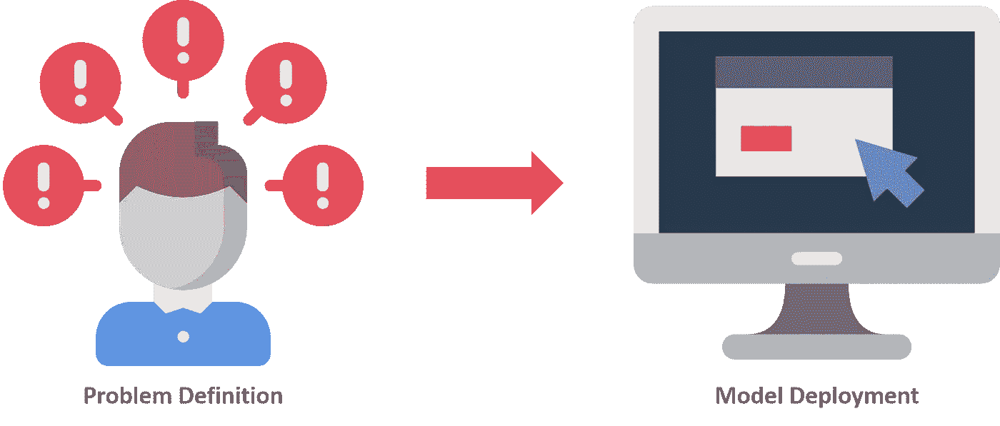

# 从头开始构建预测 Web 应用程序的生命周期

> 原文：<https://medium.com/analytics-vidhya/the-lifecycle-to-build-a-web-app-for-prediction-from-scratch-bec1632b5f27?source=collection_archive---------4----------------------->

## 从问题定义到模型部署，一步一步指导您构建用于预测的 web 应用程序。

数据科学生命周期是为大数据问题和数据科学项目而设计的。一般来说，数据科学项目由七个步骤组成，即问题定义、数据收集、数据分析