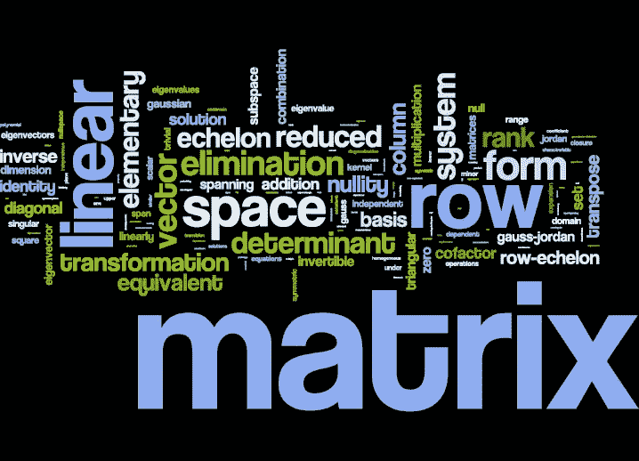

# 线性代数对 ML 的热爱:或者说基的改变、特征分解和 PCA 是如何完美地结合在一起的！

> 原文：<https://medium.com/analytics-vidhya/the-linear-algebraic-love-for-ml-or-how-change-of-basis-eigendecomposition-pca-all-come-f3d37715978c?source=collection_archive---------10----------------------->

图片来源: [Mathconceptions](https://mathconceptions.wordpress.com/2013/06/12/word-clouds-indicate-retention/)

当我们处理向量空间时，我们经常互换使用向量和向量坐标的概念。但这是两个截然不同的概念。矢量的坐标总是相对于基底而言的。

而如果我们省略了基，自然会假设它是标准基{(0，1)，(1，0)}。为了本文的目的，我们称标准基坐标系为 CS-1。CS-1 中的一个向量，通常写为:

它也可以写成矩阵形式:

所以上面的坐标实际上代表了矢量 **a** ，并且可以写成:

# 基础的改变:

现在，让我们考虑第二个坐标系 CS-2，其基向量如下所示，该坐标系:

另一个坐标系统可以被认为是一个由它自己的基本向量构成的向量空间。如果你有一个由标准坐标系 CS-1 表示的默认向量空间作为你的锚点，你可以把这个第二向量空间看作是应用一个或多个变换(平移、旋转等)后的结果。)在缺省向量空间上。

并考虑 CS-2 中的一个向量，其坐标 w.r.t. CS-2 已给定。这写为其基本向量的线性组合，看起来像:

但最后一个等式是向量在 CS-2 中是如何表示的。我们更了解 CS-1，对吗？所以为了在 CS-1 中转换这个向量，我们首先要在 CS-1 中表示 CS-2 的基向量。从变换的角度来看，这就像说，标准基向量， **i** 和 **j** 如何被变换为 **b1** 和 **b2** 。让我们说:

上面最后一个等式中的矩阵被称为基矩阵的**变化。我们得到了用 CS-1 表示的向量。**

在一般形式下，我们可以说:

简单地说，我们可以说，变换矩阵(基矩阵的变化)给出了新坐标系(CS-2)的基向量——用原始坐标 CS-1 表示。

# 分解转换:

在讨论本征分解之前，我们需要理解，一个变换可以分解为多个依次应用的变换，这将产生与原始变换相同的效果。

也就是说，不是应用原始的复杂变换 **A** ，而是通过将它带到不同的向量空间(由另一组基( **M** )来尝试应用等效的更简单的变换( **B** )，然后将变换后的向量带回我们的原始向量空间( **M^-1** )。

其中:

**M** :基矩阵的改变

**B** :备用上的简单转换

**M^-1** :基矩阵的逆变换

# 特征分解:

这里不得不引用一个实对称变换矩阵的有趣性质:一个 *n×n 实*对称矩阵有 *n 个*线性无关且正交的特征向量(即特征向量相互垂直)，它有 *n 个*实特征值对应于那些特征向量。所以特征向量也跨越了整个 n 维空间。换句话说，这些特征向量可以用作同一个 *n* -dim 空间的基向量。

此外，实对称矩阵可以正交对角化。这就是所谓的 ***【谱定理】*** 。有趣的事实:这个名字是因为，矩阵的特征值被称为它的“谱”——解释为什么会这样，需要触及 Banach 空间，泛函分析，量子力学中的本征态等。—这些都不在本文作者的讨论范围之内！

回到我们之前的位置，通过正交对角化，矩阵 **A** 可以分解为:

其中 **D** 为对角矩阵，其对角元素无非是 **A** 的特征值。而这个方程叫做 a 的 ***【特征分解】*** 。

直接引用[Ref。] *“也就是说，A 的行为就像一个对角矩阵，当我们改变坐标时:更准确地说，标准基中的映射 x - > Ax，当写成 M 的坐标时，与[xm] - > D[xm]相同。”*

因此，结合上述思想，我们可以说，当变换矩阵是实对称的时，相应的变换可以分解成 3 个更简单的变换:旋转、缩放、逆旋转。也就是说，它通过以下方式变换一个向量:将其带到本征基坐标，沿着其本征向量拉伸或收缩该向量(拉伸或收缩的量与对应的本征值成正比)，然后将其带回我们的标准坐标。

# 主成分分析(PCA):

PCA 可以从多个参照系来解释——最大化方差或最小化重构误差。这里我们将看到 PCA 被解释为协方差矩阵的特征分解。让数据矩阵和转换矩阵定义如下:

该变换给出为:

求这个变换矩阵的协方差矩阵:

**V** 是原始数据矩阵变换前的协方差矩阵。

最佳变换 **W** 将把协方差(变换后)减少到一个对角矩阵(意味着，在变换后，变量之间没有相关性)

为了使 **WVW^T** 成为对角矩阵，

**W** :特征基:作为基的 **V** 的特征向量。

因此，数据点从 Rd 变换到 Rk，其中 Rk 是原始协方差矩阵 **V** 的 k 个特征向量所跨越的子空间。

从上面的思路流中，你可以看到几个看似不相关的概念如何融合在一起，以帮助理解特定的机器学习构造。

# 参考资料:

[https://www.math.wustl.edu/~freiwald/309orthogdiag.pdf](https://www.math.wustl.edu/~freiwald/309orthogdiag.pdf)