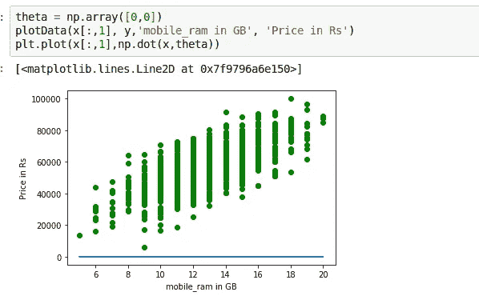

# 线性回归成本函数

> 原文：<https://medium.com/analytics-vidhya/the-linear-regression-cost-function-4042d2e562ba?source=collection_archive---------21----------------------->

在完成 Andrew ng 课程第 1 周之后，我决定在中期报告中写一写线性回归成本函数和梯度下降法，但由于缺乏自信，我无法写下来。现在 5 个月后，我打算尝试一下，所以我现在在这里。

# 主题

1.线性回归定义

2.价值函数

3.梯度下降

## 线性回归

线性回归是监督学习的一种，它总是处理 ***连续数据集*** 。而他最亲密的朋友逻辑回归处理的是 ***离散数据集。***

连续和离散数据集示例(来源于 google)

线性回归定义为因变量和一个或多个因变量之间的关系

x-mobile 型号、像素范围、ram..etc，y-基于年份的价格示例

## 故事时间

最好简单点，我会根据一个故事来解释一切。现在，我的朋友 Deepak 想买一部新手机，但是他不知道应该买哪一款。但是他最关心的是他想要更多的内存来玩哈巴狗。作为一名数据科学家初学者，根据移动数据集，我可以告诉他，哪些是他可以购买的基于 ram 规格的移动设备。

手机 _ 内存(功能)手机 _ 价格(实验室)

让我们根据现有的数据集来绘制数据。

现在，我们根据现有的数据集绘制了图表，基于此，我们可以告诉我们的朋友，他可以购买哪个手机，等等，我是在开玩笑。

事实上，我们可以告诉一些价格，但它不会是完美的预测，所以我们将使用线性回归来找到 ram 和价格之间的关系，然后我们可以预测。

现在我们需要画一条直线，根据 ram 大小告诉我们价格是多少。我们可以根据下面像铅笔一样的孩子来画

这不是正确的方法

这里图片来了一个线性方程来绘制我们的数据的线性线。

> ***(y = mx+c)或(y = theta_0 + theta_1*x)或 y = (X * theta)
> m —其中 as 斜率 dy/dx
> c — x 相交***

现在，我们向数据集添加了一条线来预测手机价格，但我们不确定这条线对我们朋友的价格预测有多好。如果它将错误的价格预测为 20GB ram 为 6000 RS，6GB ram 为 20000 RS 怎么办。因此，我们应该检查我们的模型预测得有多好，因此**成本函数**出现在这里，以显示我们基于这条线得到了多少错误率。

代价函数或最小二乘误差函数或均方误差是相同的。(来源于谷歌图片)

让我们编写一个 python 代码来计算成本函数

让我们假设θ=[0.0，0.0]那么我们的直线将是平坦的

让我们假设θ=[1000，6000]，那么我们将滑动

