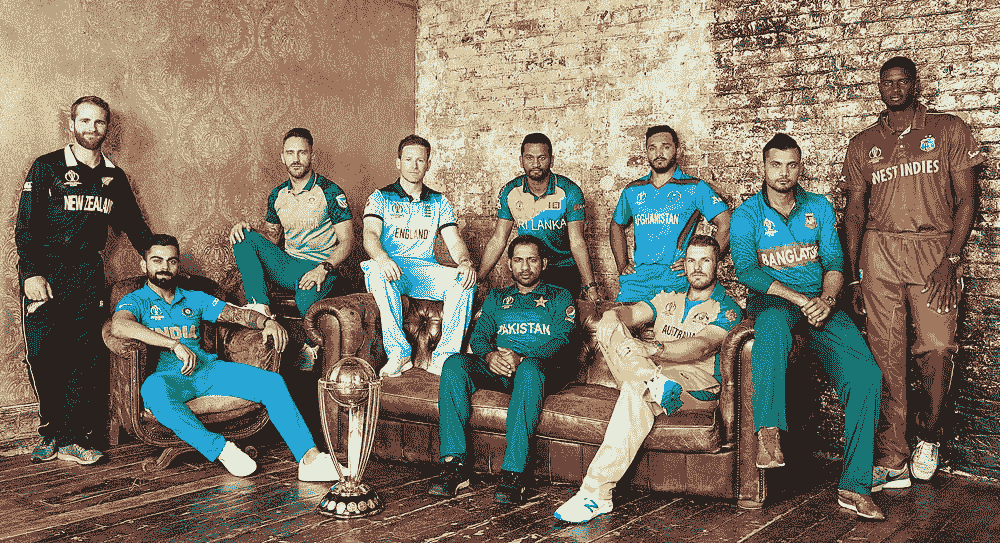
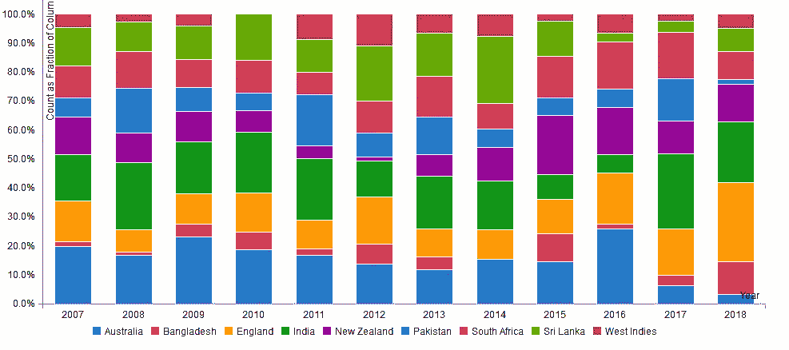
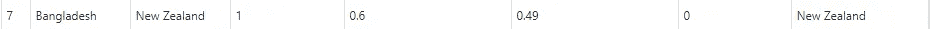
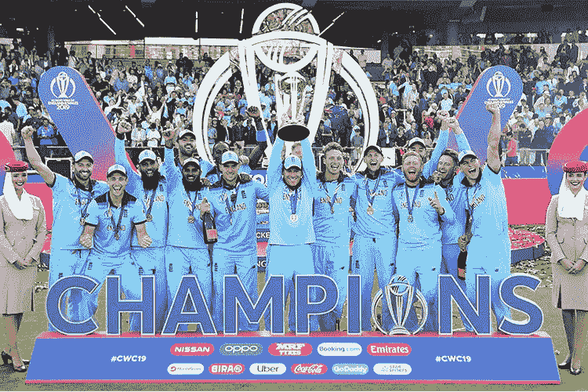

# 对板球的热爱

> 原文：<https://medium.com/analytics-vidhya/the-love-of-cricket-45b9a7d09d07?source=collection_archive---------18----------------------->

## ICC 世界杯 2019 预测游戏:面向运动爱好者的机器学习项目。

板球在印度不仅仅是一项运动，它是许多人的生活。

ESPN 板球世界杯

在这篇文章中，我在 2019 年 ICC 板球世界杯期间对我的项目有了一些了解。

过去 10 年 ODI(国际一日赛)的数据是如何预测冠军的！甚至在扔火柴之前。

在世界杯期间，我们多次观察到，当两支强队在操场上发生冲突时，完全准确并不是正确的衡量标准。举个例子，如果说 2019 年世界杯决赛，英格兰对新西兰。

然而，新西兰在世界杯比赛中表现出色，成为决赛的有力竞争者。

> 但是，最终，世界顶级板球排名队赢得了 2019 年世界杯。我们的预测是英格兰赢得 2019 年世界杯的概率是 74.12%，新西兰赢得 2019 年世界杯的概率是 25.8%。如果我们的结果概率接近 50%，我们会更高兴，因为比赛进入了决赛，两支球队都非常接近赢得奖杯。

thejakartapost.com

如何使用该项目是在我的 Github 知识库上的自述文件中提到的— [板球世界杯 2019](https://github.com/RutvijBhutaiya/Cricket-World-Cup-2019/blob/master/README.md)

该研究的目的是根据球队过去的个人表现预测 ICC 世界杯 2019 年板球比赛。

从数据收集开始，在这项研究中，我们的方法是根据过去的 ODI 比赛结果预测 ICC WC 2019 比赛。现在，像澳大利亚、印度、新西兰等更强的球队会表现得更好，像巴基斯坦、西印度群岛等更弱的球队会灭亡——我们不是说这个——但我们过去的 ODI 比赛数据研究揭示了 2019 年世界杯的强弱球队竞争者。

因此，我们决定研究 2007 年至 2018 年的 ODI 比赛。为了收集数据集，我们跟随 [HowStats](http://www.howstat.com/cricket/home.asp) 。

在数据收集之后，重要的任务出现了，这就是数据清洗。出于清理的目的，我们非常频繁地使用“测试到列”函数[基本上我们使用一些 excel 函数来清理整个数据集]。

在数据清理之后，我们根据 ODI 匹配进行数据探索和模式识别。我们还假设，团队比赛的次数越多，ODI 体验就越高，这导致了团队的整体表现。

个人团队根据年度赢得绩效。

根据过去的 ICC 板球世界杯结果，你可以看到 2011 年世界杯决赛是在印度和斯里兰卡之间进行的。在这几年中，澳大利亚是决赛的有力争夺者，但斯里兰卡是如何进入决赛的呢？这是因为印度在第二季度的决赛中淘汰了澳大利亚。斯里兰卡在半决赛中对阵新西兰，斯里兰卡以 5 个三柱门的优势获胜。

同样，2015 年世界杯，基于上面的柱状图，我们可以看到新西兰从 2012 年到 2014 年是如何脱颖而出，在 2015 年 WC 总决赛挑战澳大利亚的。

经过数据分析，我们建立了有监督的机器学习模型来预测 2019 年 ICC 世界杯的比赛结果。

出于研究目的，由于缺乏数据，我们没有考虑阿富汗团队。

鲍比·斯蒂文森在 [Unsplash](https://unsplash.com?utm_source=medium&utm_medium=referral) 上拍摄的照片

对于游戏的预测，我们使用了随机森林(RF)和逻辑回归(LR)技术。

对于监督学习技术 RF，我们将团队 A 和团队 B 的类别变量创建为虚拟变量。

目标变量是团队。A .赢了，这是 A 队赢得特定比赛的次数，计为“1 ”, A 队输掉特定比赛的次数，计为“0”。这里，计数“0”表示 B 队赢得了一场特定的比赛。因此，我们使用库函数 randomForest()为训练数据集构建了一个随机森林模型。调整模型后，我们预测了“类”类型和“概率”类型的结果。

同样，对于逻辑回归，我们为 2007 年至 2018 年的 ODI 比赛创建了一个训练数据集，并为目标团队创建了虚拟变量。a .带所有自变量的韩元变量。

> **我们还实时预测了四分之一决赛、半决赛和决赛的结果**。这意味着我们存储了 WC 2019 已完成比赛的数据，并在其上应用了机器学习模型。

总之，我们比较了两种模型的性能。

*   随机森林预测了 34 个匹配中的 23 个: **67.6%正确**
*   逻辑回归预测 34 个匹配中的 22 个正确: **64.7%正确**

**注:少数比赛未包括在预测赛中，比赛因下雨而取消。**

然而，很少有比赛是势均力敌的，例如，就球队获胜的概率%而言。

来源:gulftoday.ae

最终世界顶级板球排名队获得 2019 年世界杯冠军。我们的预测是英国赢得 2019 年世界杯的概率是 74.12%，新西兰赢得 2019 年世界杯的概率是 25.8%——[来自逻辑回归](https://github.com/RutvijBhutaiya/Cricket-World-Cup-2019/blob/master/Logistic%20Regression%20Prediction%20Final.csv)的结果和[来自随机森林](https://github.com/RutvijBhutaiya/Cricket-World-Cup-2019/blob/master/Random%20Forest%20Prediction%20Final.csv)的结果。

如果我们的结果概率接近 50%，我们会更高兴，因为比赛进入了决赛，两支球队都非常接近赢得奖杯。

详细学习请访问 Github 知识库— [板球世界杯 2019](https://github.com/RutvijBhutaiya/Cricket-World-Cup-2019) 。

 [## Github |机器学习|数据科学 I 项目

### 这个网页反映了我对机器学习和数据科学项目及其实施的理解。

rutvijbhutaiya.wixsite.com](https://rutvijbhutaiya.wixsite.com/newage)