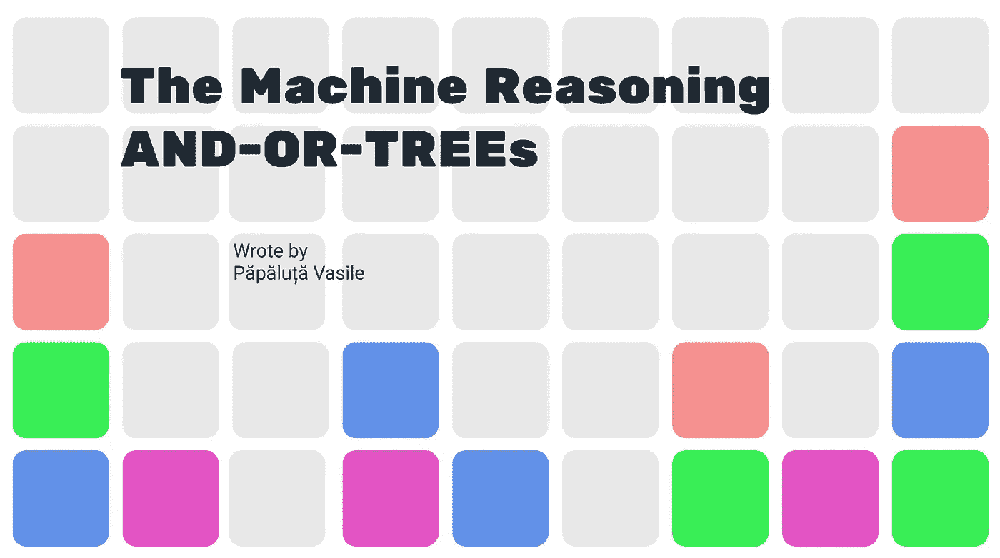
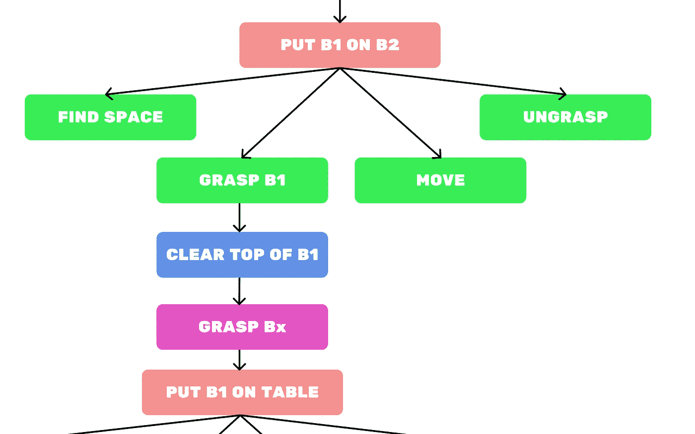

# 机器推理

> 原文：<https://medium.com/analytics-vidhya/the-machine-reassoning-2d606f25e00c?source=collection_archive---------14----------------------->

不久前，我在麻省理工学院开设了人工智能课程。在那里，我找到了我的问题的起点——如何在人工智能系统中建模推理？如何让一个程序激发为什么或如何做一个动作？

**环境**

代理在其中工作的环境是一个二维矩阵。在这个矩阵的底部是一些方块，每个方块占据矩阵的一个单元。

环境的表现

代理人在这个世界上的任务是把某个块放到另一个块上。但是，有时块会被其他块阻塞。为了解决这个问题，代理必须释放这些块:必须在顶部的块和必须在他下面的块。

**代理动作**

代理可以采取以下操作之一:

*   PUT-ON:此方法允许代理将一个块放置在另一个块上。
*   GRASP:该方法允许代理从环境中获取一个块。
*   MOVE:如果代理不需要这个块，这个方法允许代理将这个块放在最低的可用位置，或者将这个块放在目标块上。

每次采取行动后，代理使用与或树保存其行动。你可以在这个[资源库](https://github.com/ScienceKot/Reassoning.git)中看到完整的代码。

**与或树**

这些树是保存特定环境中代理的所有动作和选择的数据结构。这些结构允许询问代理一些关于它在这个环境中的行为的问题。

与或树的结构

不幸的是，这些“树”只允许我们问两种类型的问题:

*   你为什么这么做？
*   你是怎么做到的？

**为什么提问:**

要回答关于代理采取的操作的“为什么”问题，我们需要返回或启动一个节点。例如，通过问“你为什么去掉 B1？”系统会回答“因为我必须清除 B2 的顶部”。代理这样做是因为节点“清除 B2 的顶部”是代理启动方法“清除 B1 的顶部”。

**如何提问:**

为了回答关于代理如何采取行动的问题，我们需要向前或向下移动一个节点。因此，如果你问代理人“你是如何清除顶部 B2 的”，代理人会回答“通过清除 B1”。
简单，是吗？

**结论。**

因此，使用与或树，你可以在你的人工智能或非人工智能系统中添加一些推理，使它们更加智能。它允许系统解释它的决定。

此外，这也是调试和发现系统异常的好方法。

谢谢你，