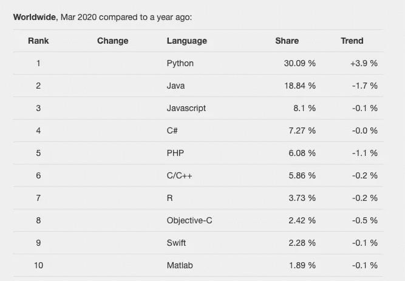
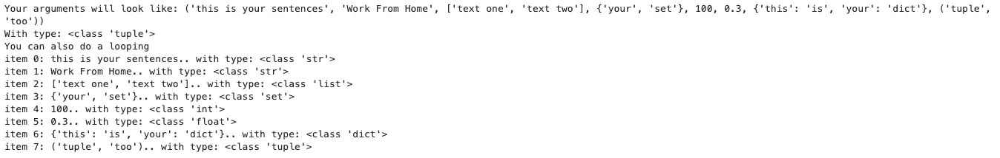
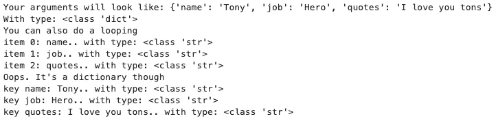
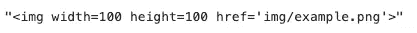

# Python 中星号的魔力

> 原文：<https://medium.com/analytics-vidhya/the-magic-of-asterisks-in-python-aed3538deef9?source=collection_archive---------5----------------------->

## 包装和拆包


Artem Maltsev 在 [Unsplash](https://unsplash.com?utm_source=medium&utm_medium=referral) 上拍摄的照片

Python 现在是基于 PYPL 的最流行的编程语言。下图说明了一切。



基于 2020 年 3 月 PYPL 的编程语言流行度。

现在，python 是如何在当今如此流行的？是因为魔法！是的，python 的魔力为开发者提供了一些特性。星号(*)就是其中一个神奇之处。

# 1.魔术 1:打包

我们经常使用`print`来显示对象到流文件的输出。如果你查看[打印函数](https://docs.python.org/3.7/library/functions.html#print)的文档，参数`*objects`是一个**打包参数**。比方说，你想打印一个变量`text = "Work From Home"`并添加一个前缀`sentence:` 。你可以写:

```
>>> text = "Work From Home"
>>> print("sentence:", text)
sentence: Work From Home
```

这是因为你传递给`print`的参数都打包在变量`objects`中。变量`object`中的星号(*)前缀用于告诉 python 这是一个打包参数，“亲爱的 python，接受所有参数！”。这与传递多个参数的方式相同。所以，你可以传递任意数量的参数到函数中。

```
>>> print("this", "could", "work", "too.", "But,", "a", "waste", "of", "time")
```

> 这怎么可能呢？

现在，让我们创建自己的函数来解开这个谜团。

该函数将接受您传递的任意数量的参数。我们打印整个对象，我们会看到它是什么类型，我们会做一个循环(等等，什么？).如果将这些长参数传递给函数，

```
demystify_single_asterisk(a, text, ["text one", "text two"], {"your", "set"}, 100, .30, {"this": "is", "your": "dict"}, ("tuple", "too"))
```

我们将有一个输出如下。



非常酷的魔术！

原来 Python 把我们的打包参数当成了一个`tuple`。因此，我们可以像任何其他元组一样执行任何操作，比如索引或循环。

这个星号(*)给了我们很酷的魔力。我们再加一个星号做双星号(**)怎么样？

如果你曾经使用过 Matplotlib `[plot](https://matplotlib.org/api/_as_gen/matplotlib.pyplot.plot.html#matplotlib.pyplot.plot)` [函数](https://matplotlib.org/api/_as_gen/matplotlib.pyplot.plot.html#matplotlib.pyplot.plot)，你可能会遇到一个名为`**kwargs`的参数。这也是一个包装论点，作为包装论点`*args`的补充。您可能试图将一个关键字参数`label`传递到函数中，但是在参数列表中找不到它。这是由双星号打包参数处理的。让我们创建另一个类似于上一个的函数来解开这个谜团。

> [**关键字参数**](https://docs.python.org/3.7/glossary.html) 是前面带有标识符的参数(如`*name=*`

现在，试着用下面的参数调用这个函数。

```
demystify_double_asterisk(name="Tony", job="Hero", quotes="I love you tons")
```

我们会得到这样的输出。



因此，在一个参数前面加上两个星号(**)会将其视为一个打包参数，从而生成一个 Python 字典。关键字名称将作为字典键，参数将作为字典值。因此，当我们通过`name='Tony'`时，Python 会像对待字典一样对待它`{'name': 'Tony'}`。我们以上论点的完整字典如下。

```
{'name': 'Tony', 'job': 'Hero', 'quotes': 'I love you tons'}
```

通过创建我们自己的函数，比如制作一个 HTML 标签，这种魔法是多么有用的一个例子(很大程度上受 T [雷伊·亨纳](https://treyhunner.com/2018/10/asterisks-in-python-what-they-are-and-how-to-use-them/#Asterisks_for_packing_arguments_given_to_function)的启发)。

```
def make_tag(tag_name, **attr):
    attributes = [f"{name}={value}" for name, value in attr.items()]
    return f"<{tag_name} {' '.join(attributes)}>"
```

如果你想做一个图像标签，你只需要输入下面的语法。

```
make_tag("img", width=100, height=100, href="'img/example.png'")
```



# 2.魔术 2:拆包

当然，从语法上来说，打包论证的相反魔法是**解包**。解包会很好，解包，所有 python 可迭代。让我们再次使用`print`功能。如果您像下面这样定义一个列表`my_list`，然后打印它，您将得到

```
>>> my_list = ["write", "from", "home"]
>>> print(my_list)
['write', 'from', 'home']
```

现在，如果您在打印函数中的`my_list`前加上一个星号(*)，您将得到

```
>>> print(*my_list)
write from home
```

神奇！

在`my_list`前的星号(*)将把`my_list`中的项目解包成传递给打印函数的独立参数，因此它将像我们传递像`print('write', 'from', 'home')`这样的参数一样工作。让我们开始吧！

在这里，我创建了一个简单的函数`demystify_unpack`，它接受打包在`iterables`中的任意数量的参数。这个函数只打印参数和数据类型。

```
def demystify_unpacking(*iterables):
    print(iterables, type(iterables)
```

然后我们通过`my_list`和`*my_list`作为参数。这两个实验的输出分别是:

```
>>> (['write', 'from', 'home'],) <class 'tuple'>
>>> ('write', 'from', 'home') <class 'tuple'>
```

正如我们所知，任何数量的参数都会被`iterables`打包，因此类型总是一个元组。不同之处在于`my_list`传递一个列表，但是`*my_list`会先解包它，然后传递多个参数，就像我们将`'write', 'from', 'home'`传递给函数一样。

另一个使用这种魔力的实用程序，当它用于在赋值中解包 iterable 时(首次在 [PEP 3132](https://www.python.org/dev/peps/pep-3132/#id8) 中介绍)。这里有一些例子。

```
>>> seq = ["write", "and", "work", "from", "home", "is", "awesome"]
>>> a, b, c, *d = seq
>>> print(a)
write
>>> print(b)
and
>>> print(c)
work
>>> print(d)
['from', 'home', 'is', 'awesome']
```

操作员左侧将从`seq`分配项目，其中`a`为第一个项目，`b`为第二个项目，`c`为第三个项目。对于变量`d`，由于解包的魔力，我们将获得所有剩余的项目。你可能想尝试另一个赋值，比如`*k, l, m = seq`，结果`k`等于`['write', 'and', 'work', 'from', 'home']`。

# 就是这样！

在本文中，我们只讨论了打包和解包，但是仍然存在其他的魔法，比如在`list`或`dict`文字中的星号，以及在只有关键字的参数和只有关键字的位置参数中的用法。我们将在下一篇文章中讨论它们。

# 参考资料和资源

[1] Trey Hunner，[Python 中的星号:它们是什么以及如何使用它们](https://treyhunner.com/2018/10/asterisks-in-python-what-they-are-and-how-to-use-them/#Positional_arguments_with_keyword-only_arguments) (2018)

[2] [人教版 3132](https://www.python.org/dev/peps/pep-3132/#id8) (2007)