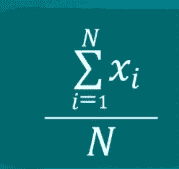
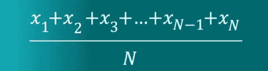
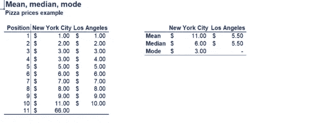

# 集中趋势的主要衡量标准:平均值、中位数、众数

> 原文：<https://medium.com/analytics-vidhya/the-main-measures-of-central-tendency-mean-median-mode-79e8db036217?source=collection_archive---------17----------------------->

## 它包含平均值、中间值、众数

**表示**————**——是简单平均数。**
平均值可以通过将所有分量相加然后除以分量的个数来计算。

计算平均值的公式

平均值是集中趋势的常用度量，但它有一个很大的缺点，即它很容易受到异常值的影响。

集中趋势

从上面的截图中，我们可以说纽约市的价格是洛杉矶的两倍，因为一个价格，即 66 的平均值受到影响。

因此，我们可以说平均值不足以得出明确的结论。

但是为了克服这一点，我们可以计算中间值。

**中值——中值是有序列表中第(n +1)/2 位的数字。**

**众数— —众数是最常出现的值。**

我们可以说纽约市的比萨饼的价格是 3 美元，因为它在纽约市的单子上出现的次数最多。

但是在洛杉矶的列表中，没有任何值经常重复出现，所以在该列表中没有模式。每个价格只出现一次。
我们说没有模式。或者我们可以说 10 模式

但是一个有经验的统计学家不会这样做，他总是说没有模式。

***最后我们讨论一个问题:***

**哪种方法最好？**
——没有最好的，但是只用一个绝对是最差的！