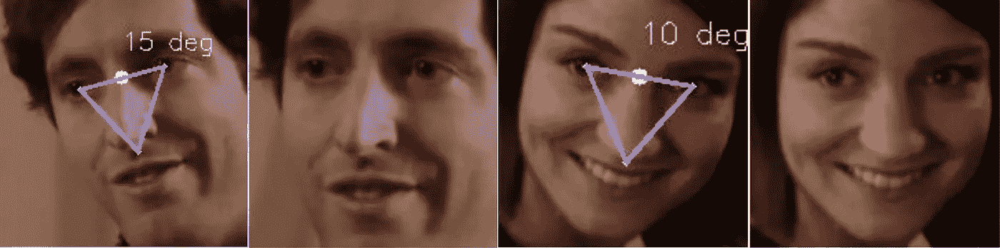

# 对齐面孔背后的数学和代码

> 原文：<https://medium.com/analytics-vidhya/the-math-and-code-behind-aligning-faces-59fcd6664a8c?source=collection_archive---------9----------------------->

面部对齐是许多机器学习和深度学习应用的先决条件。我们将用 OpenCV 和 dlib (python 绑定)来解决这些问题。所以让我们开始吧。

**首先要做的事情**

在继续之前，我想展示一下我们将在这篇文章中做些什么。

图为输入未对齐图像和输出对齐图像，视频来源:[硅谷](https://g.co/kgs/NKQC5d)