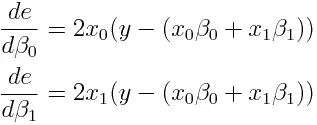

# 线性回归背后的数学

> 原文：<https://medium.com/analytics-vidhya/the-math-behind-linear-regression-fe1306bf0d8c?source=collection_archive---------23----------------------->

在这篇文章中，我们将深入研究线性回归的数学。我会尽量不使用多元微积分把背后的方程解释透彻。希望最终我们能够用 python 编写我们自己的线性回归类。作为先决条件，你需要知道基本的微分和矩阵乘法，你会很好地跟进。那我们开始吧。


# 什么是线性回归？

简而言之，如果我不得不这么说，那么线性回归就是寻找预测变量(x)和因变量(y)之间的线性关系的过程。需要注意的一点是，当我说线性时，我指的是一次方程。所以一个有 p 列的预测器将有一个形式方程


# 寻找解决方案:

先说最简单的情况。一个数据点和一个预测值。然后，


我们可以定义一个值始终为 1 的预测值 x₀。这将有助于我们在前进时简化方程式。所以现在这个等式会变成


**(方程式 1)**

如果我们定义一个行矩阵 X


和列矩阵β


那么做 Xβ会给出


它看起来很像等式 1 的 RHS。那如果我们定义 Y = [y]呢？然后我们可以写作


**(方程式 2)**

现在让我们把这个放在一边，专注于等式 1。我们知道这个等式不成立。除非有人给出正好位于一条直线上的点，否则这永远不会发生。那么下一个最好的选择是什么？我们可以最小化与原始值的差异/误差。我们将使用平方误差作为误差度量。(选择这个作为误差度量有很多好的理由。如果你想了解它，我会附上一些链接)

所以我们的误差函数是，


注意误差是β0 和β1 的函数。那是因为数据点已经给了。我们唯一能改变的是系数。我们的目标是尽量减少误差。如果你还记得微积分的话，我们对一个函数求导，然后把它设置为 0 来找到最小点。因为这里有两个变量，我们将对β0 和β1 做偏导数。



如果你熟悉微积分，这是一个相当简单的微分。我想让你注意一件事。看看在每一行中 x0 和 x1 是如何按行主顺序排列的，但是在外面相乘的 x0 和 x1 是按列主顺序排列的。有印象吗？是啊！矩阵的转置。

我们知道表达式[y-(x0β0 + x1β1)]与 Y-Xβ相同。如果我们将列向量 de/dβ定义为


然后我们可以将矩阵形式的方程修正为


**(方程式 3)**

好吧！但是如果我们有两个数据点呢？然后我们将误差定义为两点的误差之和。这些我就不多解释了，不过和我们之前做的很像。


看起来有点复杂。但我们确实有一个简单的公式，如公式 3 所示。如果我们只是扩展定义呢？

y 成为一个列向量


X 变成了一个矩阵


转置操作在 x 上仍然有效。如果我们计算等式 3 的 RHS，我们有


很酷吧？我们也可以简单地通过观察外围的 x [ᵢ](https://www.compart.com/en/unicode/U+1D62) ⱼ的排列方式和它们在 Xᵀ.的排列方式一样来完成

因此，我们已经验证了将数据点的数量增加到 2，矩阵方程仍然有效。实际上，对于给定的任何数量的预测值和数据点，这都是正确的。我们的导数是


现在我们可以让导数等于 0 来得到最小值。但是把一个矩阵等同于 0 是什么意思呢？简单。如果我们有一个条目(普通数学)，那么我们做 x=0。如果两点说 x，y 那么[x y] = [0 0]。

由于 de/dβ有 p+1 个条目(每个预测值和β0 有一个系数)，零/空向量 O 将为


酷毙了。我们正在到达那里。现在求解 de/dβ = O，我们有


然后…就这样。我们有我们想要的公式。多亏了 numpy 库，用 python 实现所有这些实际上相当容易。让我们把它编码。

# 代码:

我们可以测试性能，并将其与 sci-kit learn LinearRegression 库进行比较，以检查它的执行情况。我们可以使用均方误差作为我们的性能指标。(从某种意义上来说，我们应该这样做，因为这是我们试图最小化的)。

下面是实现这一点的代码

**输出:**

```
MSE of LinearRegressor 27.13405546067299
MSE of Sklearn Implementation 27.134055460672986
```

瞧！！结果是一样的。这是意料之中的，因为这正是 sci-kit learn Library 中实现线性回归的方式。所以在你到处使用你的回归类之前，这里有几点你应该记住。

# 警告:

虽然这种方法非常快速和准确，但也不是没有问题。主要有两个缺点。

1.  还记得我说过在最简单的情况下，取 1 个数据点和 1 个预测值吗？这实际上是不成立的。想想吧。在 2D，如果我们不得不画一条线，我们至少需要 2 分。在 3D 中，对于一个平面，我们至少需要 3 个点。所以 X 有 p 个预测值，那么我们至少需要 p+1 个点(作为 p 个预测值轴和一个 y 轴)。经验法则是 n>p。
2.  其次，如果我们有两个相关的列，比如说*x*[*ᵢ*](https://www.compart.com/en/unicode/U+1D62)*=c*xⱼ*(其中 c 是某个常数)，那么我们的方法就行不通。还记得方程中的 XᵀX)⁻吗？如果我们有两个相关的列，就不能计算这个值。这个解释有点复杂。一个简单直观的解释是，

“正如我们有*x*[*ᵢ*](https://www.compart.com/en/unicode/U+1D62)*=c*xⱼ*那就是说 *x* [*ᵢ*](https://www.compart.com/en/unicode/U+1D62) 可以通过 *xⱼ* 来预测。所以在 X 矩阵中，我们有 p-1 个预测值。但是我们已经将 X 定义为具有 p 列的预测值。所以 X 矩阵将作为 0 或零矩阵(阅读奇异矩阵)。正如我们所知，0⁻，即 1/0，是无法计算的。”

实际上，即使我们可以将预测值列评估为多个列的线性组合，也是如此，例如，如果我们有


那么逆也不能被评估。这不是一个大问题，除非在运行回归之前删除任何相关的列。

这些就是为什么有时我们可能需要使用梯度下降的原因。我们可以在以后的文章中讨论这个问题。🙂

您可以通过下面的链接在我的 github repo 中找到本文的代码。

```
[https://github.com/Samarendra109/ML-Models/blob/master/linear_model/LinearRegressor.py](https://github.com/Samarendra109/ML-Models/blob/master/linear_model/LinearRegressor.py)
```

感谢您完成这篇文章。这是我第一篇关于媒介的文章。我打算写更多关于机器学习的文章。如果你喜欢这篇文章，请鼓掌。请在评论中留下你的想法。建议和意见将不胜感激。