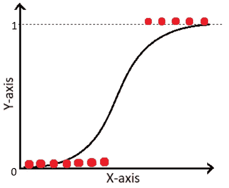
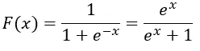
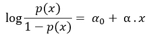
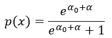
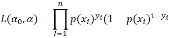
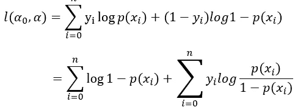
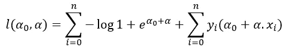
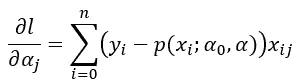

# 逻辑回归背后的数学

> 原文：<https://medium.com/analytics-vidhya/the-math-behind-logistic-regression-c2f04ca27bca?source=collection_archive---------2----------------------->

在我的前四篇博客中，我谈到了线性回归，成本函数，梯度下降，以及一些评估线性模型性能的方法。现在，在这个博客中，我们将开始学习分类模型，其中第一个是逻辑回归。

# 什么是逻辑回归？

一种统计模型，通常用于借助逻辑函数对二元因变量进行建模。逻辑函数的另一个名称是 sigmoid 函数，由下式给出:

此函数帮助逻辑回归模型将值从(-k，k)压缩到(0，1)。逻辑回归主要用于二元分类任务；但是，它可以用于多类分类

# 为什么我们称一个分类模型为逻辑回归？

这背后的原因是，就像线性回归一样，逻辑回归是从一个线性方程开始的。然而，该方程由对数比组成，该对数比进一步通过 sigmoid 函数，该函数将线性方程的输出压缩到 0 和 1 之间的概率。而且，我们可以决定一个决策边界，并使用这个概率来执行分类任务。例如，假设我们基于给定的数据集预测明天是否会下雨，如果应用逻辑模型后，概率为 90%，那么我们可以肯定地说明天很可能会下雨。另一方面，如果概率是 10%，我们可能会说明天不会下雨，这就是我们如何将概率转换为二进制。

# 逻辑回归背后的数学

我们可以从假设 p(x)是线性函数开始。然而，问题是 p 是应该从 0 到 1 变化的概率，而 p(x)是无界的线性方程。为了解决这个问题，让我们假设 log p(x)是 x 的线性函数，并且进一步，为了将它限制在(0，1)的范围内，我们将使用 logit 变换。因此，我们将考虑 log p(x)/(1-p(x))。接下来，我们将使这个函数是线性的:

求解 p(x)后:

为了使逻辑回归成为线性分类器，我们可以选择某个阈值，例如 0.5。现在，如果我们在 p ≥ 0.5 时预测 y=1，在 p<0.5 时预测 y=0，就可以将误分类率降到最低。这里，1 和 0 是类。

由于逻辑回归预测概率，我们可以用似然性来拟合它。因此，对于每个训练数据点 x，预测的类是 y。如果 y=1，y 的概率是 p；如果 y=0，y 的概率是 1-p。现在，可能性可以写成:

通过取对数，乘法可以转换为求和:

此外，在放入 p(x)的值后:

下一步是取上述似然函数的最大值，因为在逻辑回归的情况下，实现了梯度上升(与梯度下降相反)。

## 最大似然估计

通过最大化似然函数来估计概率分布参数的一种方法，目的是增加观察数据出现的概率。我们可以通过对上述方程的不同参数进行微分并将其设置为零来找到 MLE。例如，关于参数α的一个分量(即 a_j)的导数由下式给出:

希望这篇文章能帮助你理解逻辑回归背后的数学基础。

# 参考

木材编号广义可加模型:介绍:2017 年 5 月 18 日。

 [## 逻辑回归

### 在统计学中，逻辑模型(或 logit 模型)用于模拟某一类或某一事件的概率…

en.wikipedia.org](https://en.wikipedia.org/wiki/Logistic_regression#:~:text=Logistic%20regression%20is%20a%20statistical,a%20form%20of%20binary%20regression%29.)  [## 最大似然估计

### 在统计学中，最大似然估计(MLE)是一种估计概率分布参数的方法

en.wikipedia.org](https://en.wikipedia.org/wiki/Maximum_likelihood_estimation#:~:text=In%20statistics%2C%20maximum%20likelihood%20estimation,observed%20data%20is%20most%20probable.)  [## Sigmoid 函数

### sigmoid 函数是一种具有特征“S”形曲线或 sigmoid 曲线的数学函数。一个普通的…

en.wikipedia.org](https://en.wikipedia.org/wiki/Sigmoid_function#:~:text=A%20sigmoid%20function%20is%20a,given%20in%20the%20Examples%20section.)