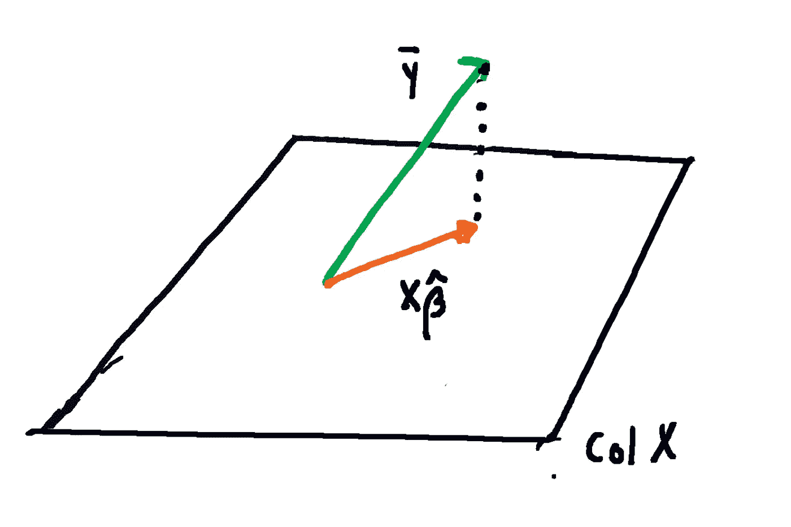
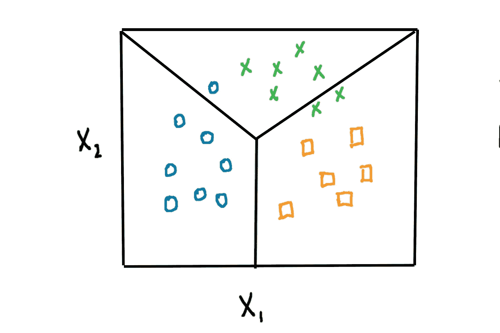
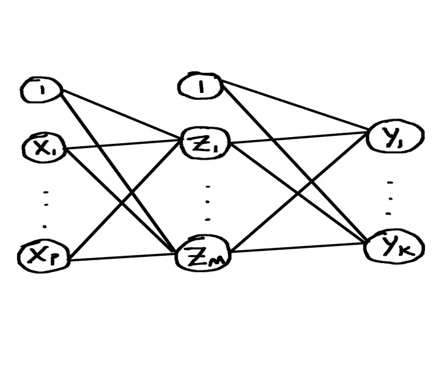
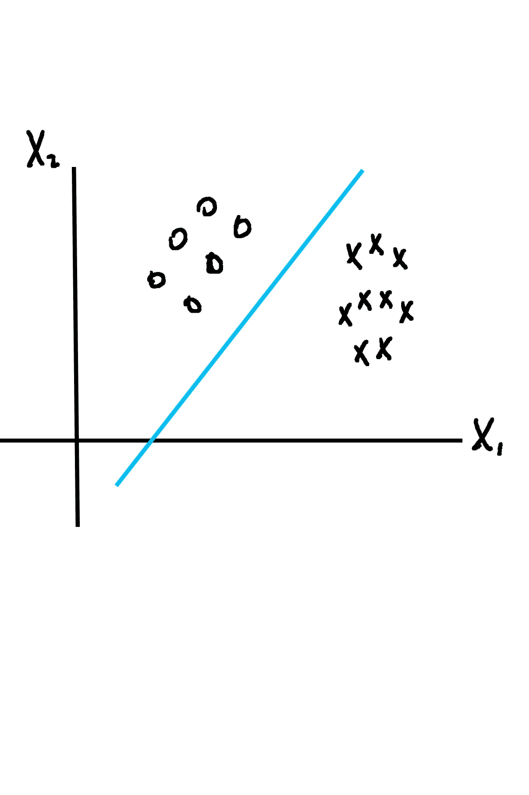
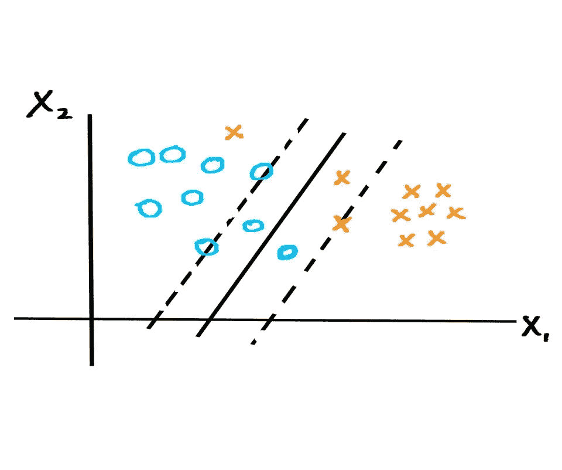
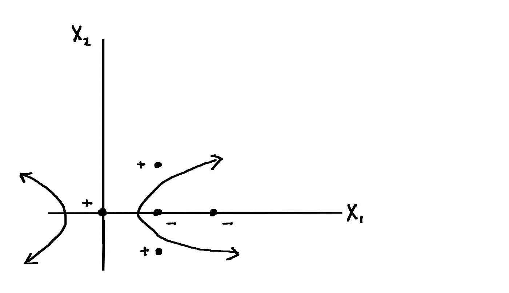

# 机器学习背后的数学

> 原文：<https://medium.com/analytics-vidhya/the-math-behind-machine-learning-2e38d8718d17?source=collection_archive---------0----------------------->

让我们看看机器学习中的几种技术以及在这个过程中使用的数学主题。

# 1.线性回归

在线性回归中，我们试图为一组给定的数据点找到最佳拟合线或超平面。我们使用一组参数作为权重，通过输入变量的线性组合来模拟线性函数的输出。

通过最小化残差平方和来找到参数。我们通过将残差平方和的导数的向量设置为零向量来找到临界点。通过二阶导数检验，如果残差平方和在临界点的 Hessian 是正定的，那么残差平方和在那里有一个局部最小值。

在上面的过程中，我们使用了导数、二阶导数测试和 Hessian，这些都是来自多变量微积分的概念。我们也可以使用线性代数找到最小化问题的解决方案。

设 **X** 是矩阵，其中行是我们的数据输入，从每行 1 开始， **y** 是我们数据输出的向量。我们想要一个矢量 **β** ，使得 **Xβ** 接近于 **y** 。

换句话说，我们想要一个向量β，使得 Xβ和 y 之间的距离‖Xβ-y‖最小。使距离最小的向量β是 Xβ是 y 在 X 的列空间上的投影。这是因为 y 在 X 的列空间上的投影是 X 的列空间中最接近 y 的向量。

然后，我们利用欧几里德 N-空间可以分成两个子空间的事实:

1.  X 和的列间距
2.  X 的列空间的正交补，

事实是，欧几里得 N-空间中的任何向量都可以分别唯一地写成 X 的列空间和 X 的列空间的正交补中的向量之和，从而推导出 y-Xβ与 X 的列正交。

从这里，我们可以得出矩阵方程

> X^T Xβ=X^T y

如果 X^T X 是正定的，那么 X^T X 的特征值都是正的。所以 0 不是 X^T X 的特征值。由此可见，X^T X 是可逆的。然后，我们可以求解β的矩阵方程，结果与使用多元微积分得到的结果相同。

在我们刚刚讨论的解决方案中，使用了范数、投影、列空间、子空间、正交补、正交性、正定性、特征值和可逆性的概念。这些是来自线性代数的概念。

我们还利用了欧几里德 N-空间可以分解成两个子空间的事实，即 X 的列空间和 X 的列空间的正交补空间，并且欧几里德 N-空间中的任何向量可以分别唯一地写成 X 的列空间和 X 的列空间的正交补空间中的向量之和。

# 2.分类

让我们转向分类问题。在分类问题中，我们希望确定一个数据点属于哪个类。用于分类问题的方法之一是线性判别分析。

## 2.1)线性判别分析

在线性判别分析中，我们估计 **Pr⁡(Y=k|X=x)** ，给定输入变量 x 为 x，y 为类 k 的概率，这叫做后验概率函数。一旦我们有了固定 x 的所有这些概率，我们选择概率 Pr⁡(Y=k|X=x 最大的类 k。然后我们把 x 归为 k 类

使用贝叶斯规则，我们可以根据π_k=pr⁡(y=k(Y=k 的先验概率)和 f _ k(x = x 的概率，假定 y = k)重写后验概率函数

我们假设 X 给定 Y=k 的条件分布是多元高斯分布 N(μ_k，σ)，其中μ_k 是类特定的均值向量，σ是 X 的协方差，所以 f_k (x)可以用μ_k 和σ来改写。

现在，我们得到π_k、μ_k 和σ的估计值，从而得到 p_k (x)的估计值。我们根据估计的 p_k (x)最大的类 k 对 x 进行分类。
如果我们设置类 k1 的判别函数等于类 k2 的判别函数，我们得到一个分离类 k1 和 k2 的超平面。如果我们对每一对类都这样做，我们会得到一组将类彼此分开的分离超平面:

在线性判别分析中，我们使用后验概率函数、先验概率、贝叶斯规则、多元高斯分布、特定类别的均值向量和协方差，这些都是概率论中的概念。

## 2.2)逻辑回归

解决分类问题的另一种方法是逻辑回归。正如在线性判别分析中一样，我们想要估计 Pr⁡(Y=k|X=x)并选择该概率最大的类 k。我们直接估计概率，而不是像线性判别分析那样使用贝叶斯规则间接估计概率。

假设只有 0 和 1 两个类，让 p(x)=Pr⁡(Y=1|X=x).在逻辑回归中，我们假设对数比数是 x 分量的线性函数。假设对数比数是 x 分量的线性函数，参数为β_0，β_1，…，β_p，我们可以求解 p(x)作为参数和 x 分量的函数。如果我们有参数β_0，β_1，…，β_p 的估计值，我们就可以得到 p(x)的估计值。

我们观测数据的概率是参数β_0，β_1，…，β_p 的函数，称为似然函数。我们通过最大化似然函数来寻找参数的估计。最大化似然函数相当于最大化似然函数的对数。为了最大化对数似然函数，我们使用牛顿-拉夫森方法。

对数似然函数 L(β)是β=(β_0，β_1，…，β_p)的实值函数。所以 l 是从 R^(p+1)到 r 的函数，而且，l 是两次连续可微的。所以我们可以应用多元牛顿-拉夫森方法。

在 0 和 1 两个类别的情况下，如果 x 的估计概率大于，我们将 x 分类为 1 类。设置(β_0) ̂+(β_1) ̂x_1+(β_2) ̂x_2=0 给我们一个决策边界，对应的估计概率等于。下面是它可能的样子:

三角形属于 0 类，正方形属于 1 类；决策线以上的区域对应于类别 0(其中估计概率小于)，决策线以下的区域对应于类别 1(其中估计概率大于)。

在逻辑回归中，我们使用似然函数，一个来自概率论的概念，和多元牛顿-拉夫森方法，一个来自多元微积分的概念。

接下来，我们将研究一种既能解决回归问题又能解决分类问题的方法。在人工神经网络中，我们使用线性和非线性函数的组合来模拟我们的输出函数。

# 3.神经网络

输出函数可以用神经网络图来表示。

包括常数 1 在内的输入单元将形成输入层。我们采用输入单元的线性组合，包括常数 1，然后对其应用激活函数 h 以获得新的单元。h 是可微的(可能是非线性的)函数。我们这样做，比如说，M 次；我们现在有 M 个隐藏单元，这些组成了一个隐藏层。看图，线性组合中的权重由连接两个单元的线段表示。我们可以继续这个过程，取前一层中单元的线性组合，并对每个线性组合应用激活函数，以创建新的隐藏单元，从而创建下一个隐藏层。在某一点上，我们有最后一层，称为输出层，我们为每个输出单元 Y_k 使用激活函数 g _ k。g _ k 是来自前一层的单元的所有线性组合的函数。

通常，激活函数 h 被选择为逻辑 sigmoid 函数或 tanh 函数。输出激活函数 g_k 将根据问题的类型而不同，无论是回归问题、二元分类问题还是多类分类问题。

到目前为止，我们已经构建了依赖于输入 x 的输出值 Y_k，它包含一系列未知参数。我们现在的目标是使用我们的训练数据找到未知参数的值，使误差最小化。对于二元分类，我们通过最大化与我们的观察数据的概率相关联的似然函数来找到参数的估计；这相当于最小化所谓的交叉熵误差函数。类似地，对于多类分类，我们通过最大化与我们的观察数据的概率相关联的似然函数来找到参数的估计；这相当于最小化所谓的多类交叉熵误差函数。对于回归，我们通过最小化平方和误差函数找到参数的估计。

为了最小化误差函数，我们使用梯度下降，这需要找到误差函数的梯度。为了找到误差函数的梯度，我们使用反向传播。

在人工神经网络中，概率论中似然函数的概念用于分类问题。来自多变量微积分的梯度下降用于最小化误差函数。在反向传播过程中，使用多变量链规则。

# 4.支持向量机

让我们看看支持向量机解决分类问题的方法。这个想法是，我们有一堆数据点，比如说两个类，我们希望用一个决策边界来分隔它们。例如，数据点可能很容易被这样的线分开:

如果数据点可以很容易地用直线或超平面分离，我们找到离这些点尽可能远的分离超平面，这样就有很大的余量。这就需要最大化余量，最终成为一个凸优化问题。为了解决这个凸优化问题，我们使用拉格朗日乘子，一个来自多变量微积分的概念。一旦我们找到最大边缘超平面，我们可以根据点位于超平面的哪一侧来分类新点。这种分类点的方法被称为最大间隔分类器。

如果数据点不能被超平面分离，我们仍然可以尝试找到一个超平面来分离大部分的点，但可能有一些点位于超平面的边缘内或错误的一侧。情况可能是这样的:

就像在最大间隔分类器的情况下，我们希望我们的超平面尽可能远离超平面正确一侧的每个点。因此，边缘上或边缘外但在超平面正确一侧的点将尽可能远离超平面。边缘内部但在超平面正确一侧的点将尽可能远离超平面，并尽可能靠近边缘边界。对于那些位于超平面错误一侧的点，我们希望这些点尽可能靠近超平面。

正如在最大间隔分类器的情况下，我们想要最大化间隔，使得超平面的正确侧上的点离超平面尽可能远。

我们不仅希望最大限度地提高利润，还希望最大限度地减少对利润的侵犯。这个问题变成了一个凸优化问题，并使用拉格朗日乘子来解决。

一旦我们找到分离超平面，称为软边超平面，我们可以根据点位于超平面的哪一侧来分类新点。这种对点进行分类的方法称为软边界分类器。

如果数据点不是线性可分的，并且分离两个类的决策边界似乎是非线性的，我们可以使用所谓的支持向量机，或支持向量机分类器。想法是考虑更大的特征空间，该更大的空间中的数据点与原始数据点相关联，并且将支持向量分类器应用于更大的特征空间中的该组新的数据点。这将在扩大的特征空间中给我们一个线性判定边界，但在原始特征空间中给我们一个非线性判定边界。通过将任何新点发送到更大的空间并使用线性判定边界来对其进行分类。以下是需要支持向量机的情况:

在解决软间隔分类器的凸优化问题的过程中，出现点积；在支持向量机的方法中，我们用一种叫做核的东西来代替点积。核本质上是一个函数，可以表示为输入值图像在某种变换 h 下的内积。这种用核代替点积的方法称为核技巧。

内核 K 应该是有效的内核；也就是说，应该存在对应于 K 的特征空间映射 h。根据 Mercer 定理，K 是对称半正定的就足够了。

在支持向量机方法中，扩大的特征空间可以是非常高维的，甚至是无限维的。通过直接使用内核，我们不必处理特征映射 h 或扩大的特征空间。

在支持向量机的方法中，我们看到使用了点积和对称半正定的概念；这些概念来自线性代数。为了解决凸优化问题，使用拉格朗日乘子；这个概念来自多变量微积分。

# 结束注释

在本文中，我们研究了机器学习技术背后的数学:线性回归、线性判别分析、逻辑回归、人工神经网络和支持向量机。

关于机器学习背后的数学的更多细节，请访问:[机器学习的数学书籍](https://gum.co/VVZsI?source=post_page---------------------------)