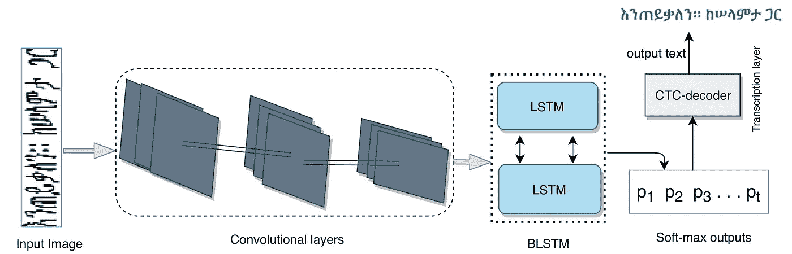

# 机器学习背后的数学

> 原文：<https://medium.com/analytics-vidhya/the-math-behind-machine-learning-331a4603838d?source=collection_archive---------22----------------------->

当谈到机器学习时，数学有多重要？

我们许多人开始关注编码部分，以提高编程技能。

机器学习在最近 5 年已经成为一个有争议的领域，特别是在*‘深度学习’*的炸弹之后。在这种广泛的热潮中，对于该领域的任何初学者来说，理解机器学习的基础及其核心方面都很重要，这是*引领* it 走到今天这一步，以及*核心*将引领**机器**引领世界。

> 在本文中，我将尝试涵盖机器学习背后的一个简单而有效的数学部分，即仅使用概率简单规则的模型的概率视图。

今天，我看到了下面这张图片:

或许..ML 的主人。

概率的五大法则。主要是，所有的程序员在他们的高中或大学都上过概率课。看似简单，这些简单的规则构成了机器学习最重要的法则。

为了让事情更清楚，我将开始陈述一些使用这些概率规则的例子(如上图所示)和其他例子。

> CTC 算法

CTC(Connectionist Temporal class ification)是基于概率法则的序列到序列模型中使用的有趣算法之一。例如，它的工作原理如下:

设 x 是一个字母(x:字母)，w 是一个单词(w:单词)

问题是:单词 w 中有字母 x 的概率是多少？

p(x/w) =？。这里的答案决定了算法将采取的下一步。

现在，为了知道它的重要性，检查 CTC 在机器学习的以下子领域中的影响:

> 手写文本识别、语音识别

在这些模型中使用 ctc 的原因是，它们主要依赖于下一步的概率来决定当前的步骤。

[来源](https://www.mdpi.com/2076-3417/10/3/1117/htm)

上图显示了手写解码模型的基本架构。首先，卷积层用于提取手写图像的特征。接下来，它们的输出被馈送到双向 lstm 层，简单地保存当前特征(字母)以便与下一个特征(字母)进行比较。在这种情况下，我们说字母 x1 知道后面跟着(或经过)字母 x2 的概率是多少？看到了吗？简单的概率低导致温柔和伟大的模型，将世界带入另一个未来！

最后，在预测了字母的模式后，它们将进入决策树，CTC 模型负责选择正确的单词模式。

概率是研究不确定性的科学。机器学习是通过使不确定性“大部分”确定来解决不确定性的科学。

这两个因素构成了一个伟大的组合。

> 总之，永远不要低估数学的力量。它能创造奇迹。