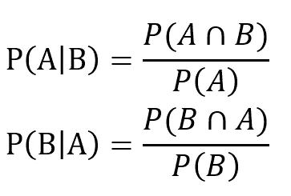
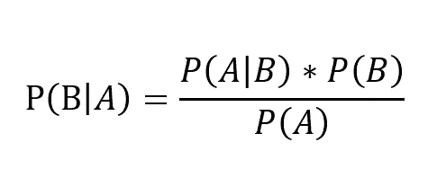
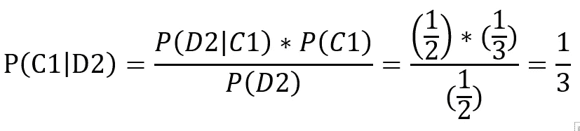
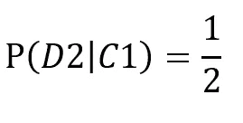
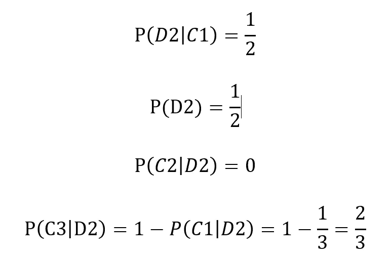
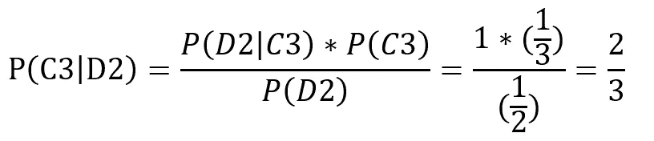
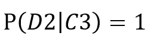
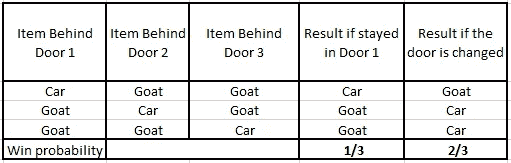

# 蒙蒂·霍尔问题背后的数学

> 原文：<https://medium.com/analytics-vidhya/the-math-behind-monty-hall-problem-ef7489ce7f20?source=collection_archive---------15----------------------->

当我们问一位统计学家概率如何改变了人类决策的视角时，他/她可能会给你的第一个例子是著名的蒙蒂霍尔问题。在这篇文章中，我将讨论这个游戏以及概率是如何帮助决策的。所以我们来玩游戏吧！

弗洛里安·范·杜恩在 [Unsplash](https://unsplash.com?utm_source=medium&utm_medium=referral) 上拍摄的照片

> **是一档始于 1963 年的美国电视游戏节目由斯蒂芬·哈托斯和[蒙蒂·霍尔](https://en.wikipedia.org/wiki/Monty_Hall)创作制作。蒙蒂·霍尔担任该节目主持人近 30 年。**

## **游戏**

**游戏的参赛者被要求从所示的三扇门中选择一扇门打开。一扇门后会有一个奖品(比如一辆汽车)，而另外两扇门各有一只山羊。假设参赛者选择了 1 号门。然后主人会从剩下的两扇门中打开一扇门。假设主人打开 2 号门，里面有一只山羊。参赛者有机会在 1 号门和 3 号门之间改变他/她的观点。这里的决定是参赛者是否应该改变他/她最初的选择。这就是我们在这篇文章中要解决的问题。**

****

**照片由 [Akriti Singh](https://unsplash.com/@akriti_singh?utm_source=medium&utm_medium=referral) 在 [Unsplash](https://unsplash.com?utm_source=medium&utm_medium=referral) 拍摄**

## **争议**

**《游行》杂志的专栏作家玛丽伊琳·沃斯·莎凡特发表了她的发现，解释了为什么参赛者应该在 1990 年改变最初的选择。但是很大一部分公众和毕业生反对她的答案。去读她的文章吧。[https://web . archive . org/web/20130121183432/http://marilynvossavant . com/game-show-problem/](https://web.archive.org/web/20130121183432/http://marilynvossavant.com/game-show-problem/)**

## **理解贝叶斯定理**

**贝叶斯定理是分析领域中最基本的概念之一，有着广泛的应用。它通常在决策过程中起着至关重要的作用。让我们考虑两个事件 A 和 b。相关的条件概率由下式给出:**

****

> **事件 A 的条件概率给定 B ( P(A|B))是给定 B 已经发生的概率。它通常被定义为 A 和 B 的联合概率(A 和 B 一起发生的概率)与 A 的边际概率(事件 A 的概率)之比**

**使用以上两个等式，我们可以表明**

****

**上面的等式解释了贝叶斯定理。因此，对于事件 B，我们可以在提供附加信息时更新关联的概率(这里 A 是附加信息)。**

## **贝叶斯定理中的关键术语**

1.  **先验概率(P(B)，P(A)) -没有任何附加信息的概率值**
2.  **后验概率(P(B|A))-在给定附加信息 A 的情况下，事件 B 的概率**
3.  **P(A|B)-如果 B 为真，观察到 A 的可能性**

## **解决问题**

**让 C1、C2 和 C3 分别成为汽车在门 1、门 2 和门 3 后面的事件。假设 D1、D2 和 D3 分别是参赛者要求蒙蒂打开 1、2 和 3 号门的事件。C1、C2 和 C3 事件的先验概率为**

**C1 = C2 = C3 = 1/3**

**假设参赛者选择了 1 号门，然后蒙蒂打开 2 号门，露出一只山羊。后验概率 P(C1|D2)(假定门 2 有一只山羊，汽车在门 1 后面的概率)由下式给出，使用贝叶斯定理，**

********

**如果汽车在 1 号门后面，主人可以打开 2 号门或 3 号门**

****

**由此我们可以理解，改变最初的选择可以提高中奖的概率。还有，**

********

**如果汽车在 3 号门后面，而参赛者选择了 1 号门，主持人必须以概率 1 打开 2 号门**

****

**表格解法**

**希望你喜欢阅读！关注更多有趣的文章:)**