# 行动反向下注的数学案例

> 原文：<https://medium.com/analytics-vidhya/the-mathematical-case-for-action-reverse-bets-648db5353428?source=collection_archive---------10----------------------->

随着体育博彩继续进入主流，越来越多的市场参与者正在寻求建立统计优势的分析方法。一种方法涉及用于预测体育赛事结果的量化模型。另一种策略是利用营销促销创造的套利机会。

然而，这篇文章将研究一种利用杠杆来提高预期盈利能力的策略，简单地使用一个典型的在线体育博彩提供的菜单。

具体来说，我们将讨论**行动反向下注**的经济学。

> T 他的文章假设了对体育博彩数学的基本理解，所有这些都包含在我们关于[博彩经济学](/analytics-vidhya/bookmaking-economics-8710d25a42a5)的讨论中。

考虑以下两场 NFL 比赛和相应的赔率:

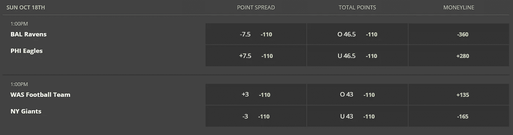

资料来源:DraftKings

进一步想象一下，我们坚信两个热门都将覆盖各自的价差，乌鸦-7.5 /巨人-3，并希望在这些结果上总共冒险 100 美元。我们可以用多种不同的方式下注，每种方式都有不同的风险特征和可变性水平。

## 直注

对两个事件结果下注的最直观的方法是对每个事件直接下注。假设有 50%的可能性，任何团队覆盖任何传播，我们可以很快地把一个表解释我们的赌注的期望值(EV)。

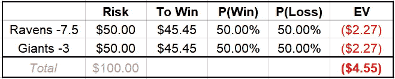

我们将我们希望冒险的 100 美元分成两个 50 美元的点差赌注。我们发现每一次下注的期望值是相同的，每 100 美元的赌注产生 4.55 美元的长期亏损。

*   **最高利润**:90.90 美元
*   预期损失: $4.55
*   **最大损失:** $100.00

# **Parlay**

在其他市场中，parlay 通常被称为“累积器”，是一种由多个预测组成的赌注，所有这些预测都必须正确，下注者才能获胜。

在 DraftKings，由-110 赌注组成的两条腿的牌局将支付+265。因此，我们可以类似地对 EV 建模如下:

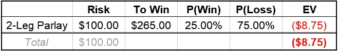

*   **最高利润**:265.00 美元
*   **预期损失:** $8.75
*   **最大损失:** $100.00

正如我们所看到的，赌博以预期损失为代价增加了最大可能的利润。

# 如果更好

“如果下注”是一种多回合赌注，其中游戏结果决定后续回合是否有动作，而不管实际事件发生的顺序。

例如，我们可以用逻辑下赌注:

***如果(乌鸦-7.5) →那么(巨人-3.0)***

我们将在乌鸦队-7.5 上赌 100 美元，然后，只有乌鸦队回补，我们才会在巨人队-3 上再赌 100 美元。我们可以用一个树形图来想象可能的结果:

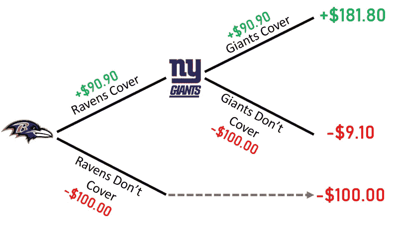

第一注押在乌鸦队身上。如果他们没有覆盖，我们损失 100 美元，过程终止。如果他们成功回补，我们将赢得我们的赌注，然后在巨人身上再赌 100 美元来回补差价。

因为每个团队预计覆盖 50%的概率，所以我们可以快速评估 EV:

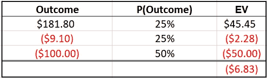

*   **最大利润**:181.80 美元
*   **预期损失:**6.83 美元
*   **最大损失:** $100.00

我们可以看到，在保持预期盈利能力的同时最大限度地提高潜在收益方面，如果下注可以作为直赌和讨价还价之间的中间地带。

# 动作反转

一个**行动逆转**是通过组合两个同时对同一组结果下的 if 赌注来完成的。在我们的例子中，我们将把 100 美元的最大损失分成两个 If 赌注，每个赌注的最大损失为 50 美元。

其中一个赌注将与上一节中显示的示例相同，而另一个将完全相反:

*   投注#1: ***如果(乌鸦-7.5) →那么(巨人-3.0)***
*   投注#2: ***如果(巨人-3.0) →那么(乌鸦-7.5)***

通过两个树形图，我们可以直观地看到这些赌注:

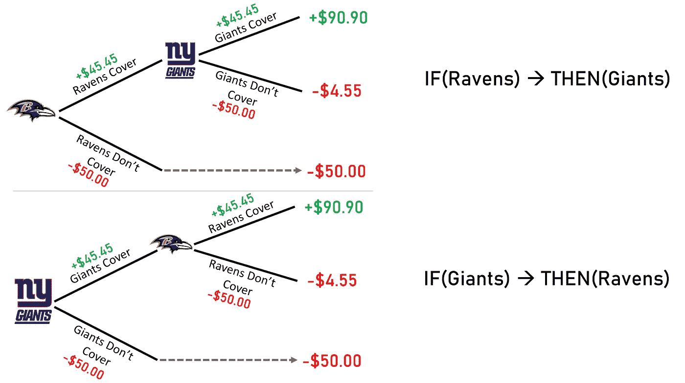

我们可以快速整理出一个矩阵，展示每个潜在场景的结果:

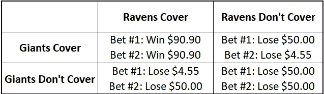

然后，我们可以汇总结果来总结我们的结果:

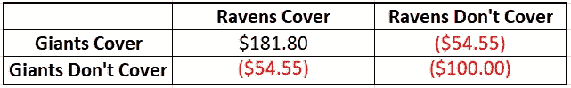

现在，我们可以像组装其他下注类型一样组装 EV 表:

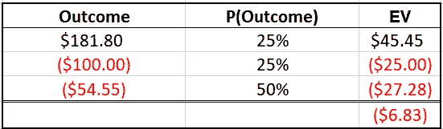

*   **最大利润**:181.80 美元
*   **预期损失:** $6.83
*   最大损失:100.00 美元

与单一 if bet 相比，action reverse 似乎提供了类似的回报曲线，至少从期望值的角度来看是这样。

# 波动性

然而，期望值并不能说明全部情况。正如金融市场的情况一样，预期回报的可变性与预期本身一样重要。

正如我们在[风险管理蒙特卡罗模拟介绍](/@lloyddanzig/an-intro-to-monte-carlo-simulation-for-sports-betting-risk-management-in-excel-c951a144f13a)中更详细讨论的那样，我们可以使用随机数生成器来进一步了解这一经济决策。

我们可以迭代 10，000 次模拟，并查看每次模拟的利润或损失:

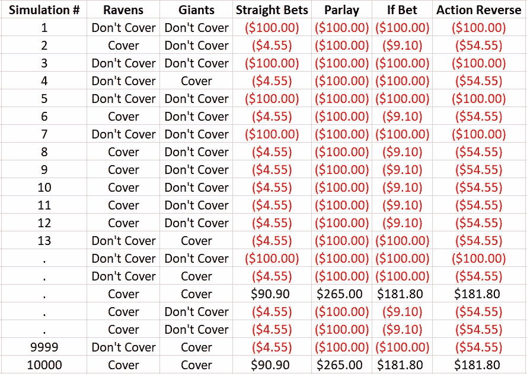

这允许我们计算预期支出的标准偏差，并向我们的表中添加最后一列:

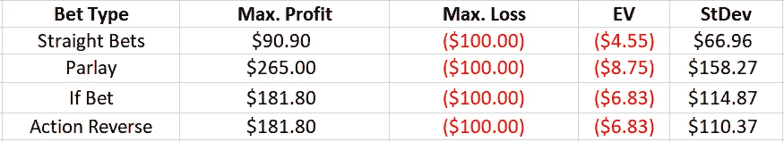

通过这张决赛桌，我们可以看到为什么有些下注者会被反转牌吸引。它们类似于赌博，在相同的最大损失水平下，与直赌相比，它们提供了更大的收益。与其他多航段方案相比，反向行动被认为是最有利可图的(即最无利可图的)，也是最不稳定的。

虽然行动反向下注可能是直接下注的拙劣替代品，但鉴于本质上不同的风险状况，与赌博相比，它们显然提供了令人信服的经济效益，尽管后者更受欢迎。

**本文之前发布的版本包含一个错别字，导致 If 投注的 EV 不正确，现已更正。*