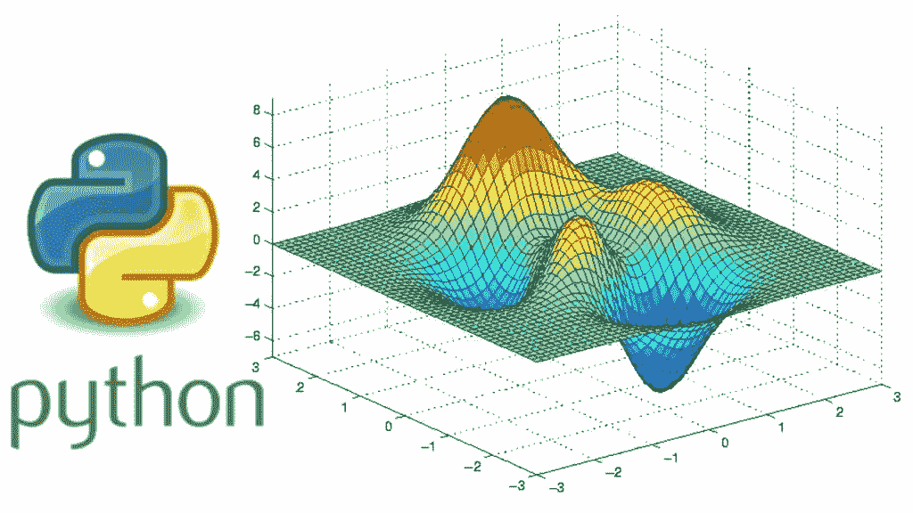
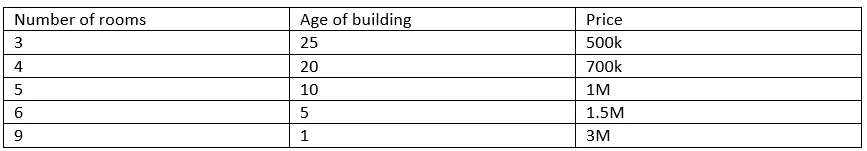
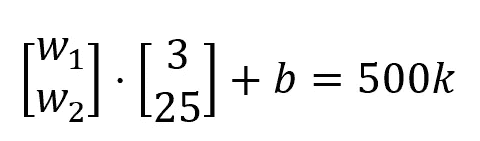
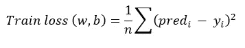
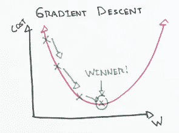
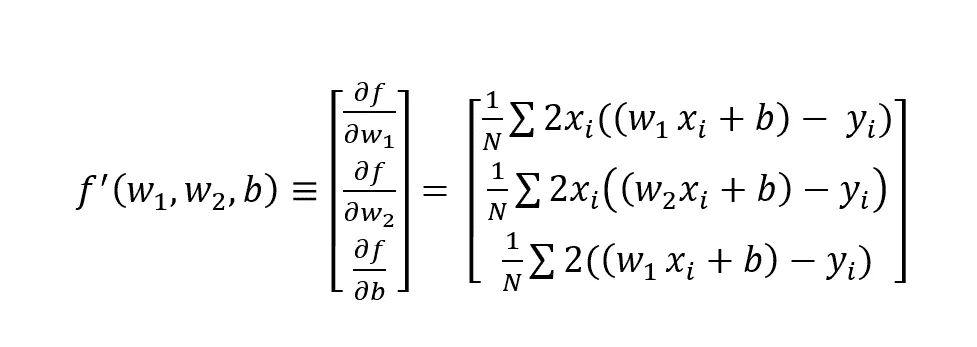
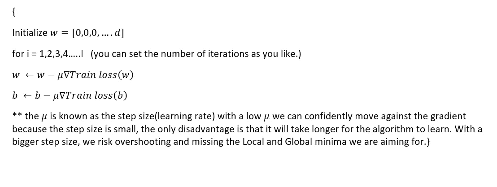
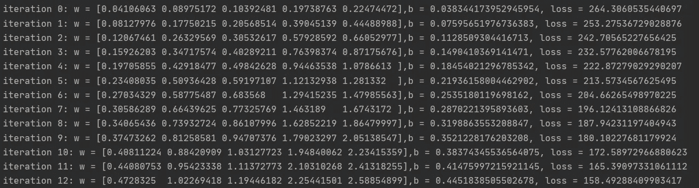
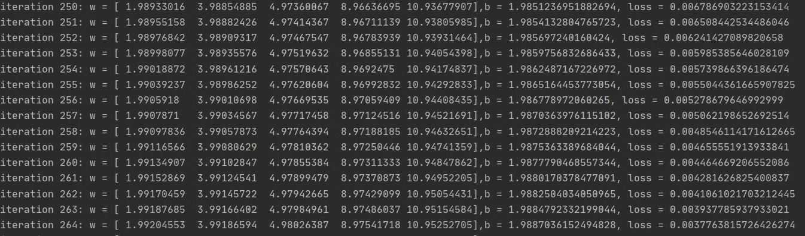

# 梯度下降背后的数学

> 原文：<https://medium.com/analytics-vidhya/the-mathematical-essence-of-ml-4182f3d172c3?source=collection_archive---------28----------------------->



[https://laconicml . com/random-gradient-descent-in-python/](https://laconicml.com/stochastic-gradient-descent-in-python/)

在这个时代，由于 Pytorch、TensorFlow 和 scikit-learn 等开源机器学习库，部署机器学习算法变得相对简单，而无需真正掌握驱动 ML 的核心数学概念。

我无法创造的东西，我不明白——理查德·费曼

作为一名工科学生，数学的力量一直让我着迷，学习算法背后的核心概念帮助我调整了许多需要微调的超参数。我写这篇文章的原因是为了帮助你看到最优化的数学之美。为此，我将尝试解释 ML 背后的主要算法，即梯度下降。这种算法如此强大，以至于它的变体被用在我们每天听到的强大的神经网络中。

在本文中，我假设您已经熟悉线性回归的基本原理。但是提醒一下，这里有一个公式:*y = wφ(x)+b*

对于一个输入*φ(x)*，其特征向量为:

*φ(x)=[φ1(x)、..，φd(x)]—*你可以简单地把*φ(x)*看成高维空间中的一个点*。*

*b :* 只是我们引入的偏差，让我们的模型更强大。你可以把它想成线方程中的截距。

直觉:



总体思路是找到一组 *W 的*(权重)和一个最能描述上述数据的偏差。

让我们考虑第一个数据点，如您所见，它的特征向量是二维的，这意味着有两个特征会影响结果。

第一个数据点的矩阵表示:



我们的目标是找到一个权重向量和一个偏差，使模型的预测和𝕪i 的真实值之间的误差最小化

现在我们必须引入一种方法，让模型知道训练过程是否在正确的方向上进行。为此，我们将引入一个称为列车损失的函数，该函数取决于两个变量 *w 和 b:*



# 这一切背后的学问在哪里？

有趣的部分来了，学习。我们如何教导数百万个硅晶体管针对上述功能进行优化？这就是梯度下降的作用。首先，我们来看看梯度下降的图形直觉。



[https://ml-cheat sheet . readthedocs . io](https://ml-cheatsheet.readthedocs.io)

虽然上图只考虑了 1 维特征向量，但是这个概念可以扩展到数千维。这个图表基本上是在描绘变量和它的成本函数之间的关系。在这种情况下，对成本函数的唯一变量进行简单求导就足够了。在我们的例子中，我们有成千上万的变量，需要偏导数。不要让名字吓到你；偏导数就是对影响成本函数的不同变量取不同的导数，下面我将计算我们的问题所需的偏导数:



## **算法:**

最后，我们几乎做到了，下面算法的简单性会让你震惊，但同时，让你体会到矩阵演算的强大



我们到了压轴戏，现在让我们用 python 来实现这一切。

在这个 python 程序中，我将使用随机数生成器来创建虚构的 d 维特征向量。下一步将是分配真实偏差和真实权重向量。该程序将执行点积运算，以找到数据点。最终目标是找到权重向量和我初始化的偏差。
实际权重和实际偏差如下:

```
trueWeight = np.array([2, 4, 5, 9, 11])
trueBias = 2
```



在前 12 次迭代中预测的权重和偏差。

在 250 次迭代之后，模型接近实际的权重向量和偏差，损失几乎接近零。



# 密码

```
import numpy as np

trueWeight = np.array([2, 4, 5, 9, 11])
trueBias = 2
d = len(trueWeight)
data = []
for i in range(5000):
    x = np.random.randn(d)
    y = trueWeight.dot(x) + trueBias
    data.append((x, y))

# For gradient descent
def l(w,b):      #here we are calculating the cost function Train loss.
    return sum((w.dot(x) + b - y)**2 for x, y in data) / len(data)

def df(w,b):   #calculating the partial derivatives.
    return sum(2*(w.dot(x) + b - y) * x for x, y in data) / len(data), sum(2*(w.dot(x) + b - y) * 1 for x, y in data) / len(data)

#the gradient descent algorithm
def gradientdescent(F, dF, d):
    w = np.zeros(d)
    b = 0
    eta = 0.01
    for i in range(1000):
        loss = l(w,b)
        gradientw , gradientb = df(w,b)
        w = w - eta * gradientw
        b = b - eta * gradientb

        print(f'iteration {i}: w = {w},b = {b}, loss = {loss}')

gradientdescent(l, df, d)
```

# 带什么

本文旨在展示 ML 中使用的最重要技术背后的简单数学概念。我希望我能激发你对最优化和数学的兴趣。快乐学习:)

## 提高 ML 所需数学知识的来源: