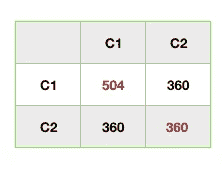

# 主成分分析背后的数学

> 原文：<https://medium.com/analytics-vidhya/the-mathematics-behind-principle-component-analysis-feef17d87348?source=collection_archive---------39----------------------->

PCA 背后的数学基础知识。

# 简介:-

主成分分析背后的逻辑是*降低数据集的维度*。我们的数据集中有如此多的要素或列，它们对预测没有太大的帮助，并且它们对数据没有太多的了解，因为哪个模型需要花费大量时间来计算和预测结果。因此，在主成分分析的帮助下，我们将转换一组新的特征，这些特征既有序又不相关。

为了理解 PCA 背后的数学，我们有一些关于我们将要用来降低维数的术语的知识。

*   平均
*   差异
*   协方差
*   线性转换
*   特征值
*   特征向量

## **的意思是:-**

平均数是统计学中最基本的量。这些方法告诉我们测量的中心在哪里。
假设有一个 X 列，其中有 10 个学生的体重记录。
{ a1，a2，a3 ....... a10 }

**μA = 1/n(a1 +...+a10)**

## **方差:-**

在差异中，我们了解测量的分布有多广？
在这种情况下，我们从平均值和平方值计算每个差值，然后取平均值，得到方差。

var(A)= 1/n(a1μA)2+…。+(an-μA)2

## 协方差:-

在协方差的帮助下，我们将找到任意两列之间的**关系。在这里我们可以看到一列与另一列是如何变化的。**

Cov(A，B)= 1/n-1**{**(a1-μA)(B1-μB)+…+(an-μA)(bn-μB)**}**

**线性变换:-**

线性变换就像一个能将一个平面映射到另一个平面的函数。这个概念真的有助于更高的维度。

让我们举一个例子来更好地解释。

矩阵看起来像:-

一个 2×2 的矩阵，在第一个平面上有一个坐标(x，y)，在第二个平面上经过线性变换后坐标变成(9x+4y，4x+3y)。

在给定的图中，我们有两个平面，第一个在变换之前，第二个在变换之后，你可以看到在变换之前用蓝色显示的向量，在变换之后，蓝色向量的方向没有改变，该向量被称为特征向量，但是在变换之后，平面被拉伸了某个因子(即向量的大小)，即特征值。如果是二维，则有两个特征向量和两个特征值，如果是三维，则有三个特征值和特征向量。

**特征值和特征向量:-**

我们要找的只是**方阵**的特征值。满足这个的方程是 ***{ A v = λ v }，*** *其中*
{这里 a 是方阵，I 是单位矩阵，λ是特征值， ***⃗v 是特征向量*** 。}
**det|A-λI|=0** 为特征方程。所以特征方程的根是特征值，每个特征值都有一个特征向量。
求特征向量:- X 是满足 **|A-λI |X=0** 的任意非零特征向量，则 X 是特征向量**。**

假设我们有两列(C2 C1)二维数据，一个数据集中有 100 行，因此我们将根据给定的数据绘制散点图
这里有两个图:-

第一个散点图看起来像这样

x 轴(水平轴)是 C1，Y 轴(垂直轴)是 C2。这里我们看到，与 Y 轴或 C2 相比，数据的 X 轴或 c1 变化较高(意味着 C1 解释了整个数据的最大方差)。这意味着 C1 比 C2 更了解这些数据。从这里我们得出结论，列 C1 有高方差的数据。因此，为了降低数据集的维度，我们很容易从数据集中移除 C2。

但是如果两个维度或列的变化量相等，那么我们如何去掉其中的一个呢？请参见下面的情况:-

这里我们看到数据的 X 轴或 C1 变量等于 y 轴或 C2。这意味着没有变异的差异，那么在哪个基础上，或者我们如何从数据集中删除其中一个来降低维数？

现在是实现 PCA 的时候了，它帮助我们在以前列的线性组合的基础上创建一组新的列，但是我们如何理解图形呢？为此你必须回答一件事，你需要什么？您的答案是—我们需要一个与其他列或维度相比差异较大的列或维度。这样我们就可以很容易地删除方差较小列。假设我们把那个轴旋转θ角，你会看到新的 X 轴是 C1，Y 轴是 C2。

蓝色部分是在前一个表格的基础上新增的两个轴表格。现在，您可以很容易地看到，将轴旋转一定角度θ后，其中一个轴或列的数据变化较大(表示该特定列解释了整个数据的最大方差)，而另一个轴或列的数据变化较小。

在图示中，我们很容易地从一个新轴旋转该轴，然后我们看到方差较小的轴被移除。所以如果你要观想这个，你会看到；-
这里的轴是我们数据集中的列。
以前我们有两列或轴或维度，旋转后我们有两列或轴或维度。
将轴旋转θ角来创建一个新轴与实现 PCA 是一样的，首先我们在前一列的线性组合的基础上创建一组新列。

***所以现在我们的兴趣是了解我们如何知道新的一组列是基于先前的线性组合，以及我们如何知道哪一列具有最大方差或解释整个数据的最大方差？***

为了回答所有这些问题，我们要理解这背后逻辑。

假设我们有 2 维数据集，其中有 2 列和 5 行。在这个数据集中，我们将减少维度。

为了更好地理解，我们在这里取了一个小数据集

这里，C1 和 C2 是两列，我们将找到这两列的平均值:-**C1 列的平均值是 60，C2 列的平均值是 66。**

现在我们要找到整个数据集的协方差，它给出了不同列之间的关系，并制作数据集的协方差矩阵。

Cov(A，B)= 1/n-1**{**(a1-μA)(B1-μB)+…+(an-μA)(bn-μB)**}**

这里我们看到红色的对角线是 504，360 分别是 C1 和 C2 的方差。黑色表示不同列的协方差。看了上表后，我们很容易说 C1 的方差大于 C2。**在这里，我们可以很容易地从数据集**中移除 C2，但是假设我们有一个**协方差矩阵**，看起来像下面这样

现在，我们看到 C1 和 C2 的方差相同，都是 504，因此我们无法从数据集中删除任何一个。

因此，为了选择它们中的任何一个，我们现在要在协方差矩阵的帮助下，计算特征值和特征向量。

*众所周知，特征向量是在进行线性变换时方向不变的向量，每个特征向量都与特征值相关联，特征值是在变换过程中被拉伸的因子。*

**这里是特征向量的表示&特征值。** 方程是 ***{ A v = λ v }***
其中 A =变换矩阵，v 是特征向量，λ是特征值，这里的协方差矩阵是一个方阵。

为了使这个表达式成立，求特征值和特征向量。如我们所见，左侧是矢量乘法，右侧是标量乘法。现在做两边矩阵向量乘法，我们要重写这个等式 **A v = λI v** 其中 I 是单位矩阵。

所以我们安排这个方程 **( A - λI ) v = 0** 这里 **v** 是非零特征向量。因此，我们知道，如果与矩阵相关的线性变换进入低维(*这里我们有两列，表示 2 维(表示现在是平面，但进入低维后表示它变成线*),对应于零行列式的 ***表示当* 【det(A-λI)= 0**时发生

现在我们要从二次方程中找到λ it 的值，所以有两个根λ1 和λ2，这是特征值。

从这个方程中，我们找到了根的两个值

我们知道每个特征值都有一个特征向量。现在是时候从每个特征值中找出特征向量了。

我们有这个方程**(a-λI)v = 0 对于λ的每一个值，都有一个满足给定方程的** v 向量，并且⃗v 是一个特征向量。

所以你可以解这个方程，看起来像这样

从这个给定的方程中找到所有特征值的 x y 的特征向量 v，但是这里有两个特征值λ1 和λ2，因此将有两个特征向量，一个是当我们用λ1 的值代替λ时，另一个是当我们用λ2 代替λ时，并且在特征向量的帮助下，形成一组新的列或特征的轴，并且特征值表示在变换期间特定特征向量*伸展的因子。*

现在我们有了两个我们想知道的关于向量的东西，也就是方向和大小，这里特征向量给出了方向(意味着向量拉伸或变化的方向)，特征值给出了大小(意味着向量拉伸或变化的程度)。

这种逻辑的最后一部分是，我们将按照特征值递减的方式对特征向量进行排序，并选择 K 个维度或特征来训练您的模型并预测结果。因此，我们得出结论，具有最低特征值的特征向量承载关于数据分布的最少信息，并且那些是我们想要丢弃的。

## 简短摘要:-

*   首先，我们有一个更高维度的数据，我们可以用这个更高维度的数据训练我们的模型，我们也可以预测结果，但这需要很多时间和空间来预测。
*   因此，我们希望降低该数据集的维数，因为我们使用主成分分析来帮助我们删除那些没有显示太多方差的列，或者那些关于数据的信息较少的列，或者那些不能解释整个数据的最大方差的列。
*   现在，在主成分分析中，我们首先要找出每一列的平均值。从而我们可以使用该平均值来找到协方差矩阵，其中对角元素是该特定列的**方差，其余的是该特定列与其他列的协方差。我们都知道协方差矩阵是一个方阵。**
*   现在，在找到协方差矩阵(也是一个方阵)之后，是时候借助于等式**(A-λI)v = 0**来找到用于创建具有一组新特征的轴的特征向量和特征值了，我们知道 v 是非零向量，但是矩阵与非零向量的乘积是零，这意味着等式的这一部分(A-λI)是零，这发生在
    det( A-λI )=0 时。
*   因此，在使方程等于零之后，它变成二次方程，因为这里只有 2 维数据或 2 个特征(如果我们用 3 维数据工作，它形成三次方程)，所以上述方程有两个根，即 **λ1 和λ2。**
*   现在，在找到特征值后，我们将找到每个特征值的特征向量，并在该特征向量的帮助下，形成一组新列或特征的轴，该特定特征值表示该特定特征向量拉伸的因子。
*   最后按特征值降序对特征向量进行排序，选择 K 个特征向量来训练模型并预测结果。

## 结论:-

最后我们得出结论，协方差矩阵、特征向量和特征值是我们需要定义主成分分析的最重要的东西。
对于高维，PCA 是降维的最好方法之一。