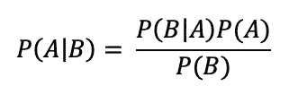

# 使用朴素贝叶斯的垃圾邮件检测机制

> 原文：<https://medium.com/analytics-vidhya/the-mechanics-of-spam-email-detection-using-naive-bayes-96c6b730d36e?source=collection_archive---------4----------------------->


由 [Yogas 设计](https://unsplash.com/@yogasdesign?utm_source=medium&utm_medium=referral)在 [Unsplash](https://unsplash.com?utm_source=medium&utm_medium=referral) 上拍摄的照片

垃圾邮件检测是自然语言处理中的一项常见任务，我们可以使用 Python 中的 Scikit-learn 轻松地建立模型并进行邮件过滤。但是，如果我们不使用 Scikit-learn 的魔力，垃圾邮件检测是如何工作的呢？让我们从头开始看看垃圾邮件检测是如何工作的。



这个例子是我从 packtpub 的免费机器学习书籍《Python 机器学习示例》(作者 Yuxi(Hayden) Liu)中找到的。我会尽可能简单地解释，因为我自己学习的时候觉得很难。

> 我们开始吧

给定如下四封电子邮件


我们的任务是预测 ID 号为 5 的电子邮件的测试用例是否是垃圾邮件。

首先，我用我们的训练数据做一个单词包。什么是一袋单词？单词包的简单含义是描述单词在文档中出现的文本表示。

这是我们之前给出的电子邮件列表中的单词包


我们为电子邮件中出现的每一个单词加 1，如果一个单词在电子邮件中没有出现，我们就加 0。

从我们的单词包中，我们会得到训练数据中每个单词的概率。要获得一个单词的概率，我们可以通过将一个单词的总出现次数除以训练数据中所有单词的总出现次数来计算它。我们可以通过合计表中的*【total】*行(黄色行)来计算它，我们将得到 13 个单词的出现次数。

p(点击)= 3/13 = 0.231

P(win) = 1/13 = 0.077

p(奖金)= 4/13 = 0.308

p(会议)= 2/13 = 0.154

p(设置)= 1/13 = 0.077

p(自由)= 2/13 = 0.154

现在我们将把我们的单词包分为垃圾单词包和非垃圾单词包


罐头猪肉


不是垃圾邮件

我们可以很容易地计算出每个单词出现在垃圾邮件和非垃圾邮件列表中的概率。

垃圾邮件类别中的总字数= 9

非垃圾邮件(NS)类别中的总字数= 4

如果我们计算一个单词在垃圾邮件分类中的概率，我们会发现概率为零，这使得我们无法计算贝叶斯方程，因为乘法因子为零。为了消除零乘法因子，即看不见的项，我们将每个项频率设置为初始值 1，因此


其中 6 来自每个术语的一个额外计数(点击、赢取、奖励、会议、设置、免费)

所以，我们可以计算出测试邮件是垃圾邮件的概率。


并且测试邮件不是垃圾邮件的概率


**P(NS | free setup meeting free)>P(S | free setup meeting free)**这样我们就可以分类测试邮件是**不是垃圾邮件。**(在真实案例中并没有那么简单，但就目前而言，这已经足够了)

这是 Python 3 语法，使用朴素贝叶斯从头开始进行简单的垃圾邮件检测。

首先，导入我们需要的库

```
import pandas as pd
from collections import Counter
```

将电子邮件培训数据插入 panda 的数据框架。

```
data = {'email':  ['Click Win Prize', 'Click meeting setup meeting','Prize free prize','Click prize free'],
        'is_spam': ['yes', 'no','yes','yes']
        }
data = pd.DataFrame(data)
```

小写的电子邮件，在一个真实的情况下，我们可能需要词干和词汇化过程，但对于这个例子，我们不需要。

```
data["email"] = data["email"].apply(lambda str : str.lower())
```

我们的数据帧看起来会像这样


计算垃圾邮件和非垃圾邮件的概率

```
sum_s = 0
sum_ns = 0
for i in data["is_spam"]:
    if i == "yes":
        sum_s += 1
    else:
        sum_ns += 1

prob_s = sum_s/len(data)
prob_ns = sum_ns/len(data)
```

做一袋文字专栏

```
data["bow"] = data["email"].str.split().apply(Counter)
```


计算某个单词在每个垃圾邮件和非垃圾邮件类别中的总出现次数

```
sum_bow_s = {}
sum_bow_ns = {}i=0
for bow in data["bow"]:
    for key in bow:
        if data["is_spam"][i] == "yes":
            if key in sum_bow_s:
                sum_bow_s[key] += bow[key]
            else:
                sum_bow_s[key] = bow[key]
        else:
            if key in sum_bow_ns:
                sum_bow_ns[key] +=bow[key]
            else:
                sum_bow_ns[key] = bow[key]
    i += 1
```

计算垃圾邮件和非垃圾邮件类别中的单词/术语总数

```
term_occurences_s = 0
term_occurences_ns = 0
for key in sum_bow_s:
    term_occurences_s += sum_bow_s[key]
for key in sum_bow_ns:    
    term_occurences_ns += sum_bow_ns[key]
```

计算训练数据中的唯一单词/术语

```
temp = []
unique_term = 0
for bow in data["bow"]:
    for key in bow:
        if key not in temp:
            unique_term += 1
            temp.append(key)
```

计算训练数据中每个单词的概率

```
sum_bow = {}
term_occurences = 0
for bow in data["bow"]:
    for key in bow:
        if key in sum_bow:
            sum_bow[key] += bow[key]
        else:
            sum_bow[key] = bow[key]
        term_occurences += bow[key]prob_bow = {}
for key in sum_bow:
    prob_bow[key] = sum_bow[key]/term_occurences
```

我们将训练数据中每个单词的概率存储在一个名为 prob_bow 的字典中


最后，计算给定单词垃圾邮件或非垃圾邮件概率的语法

```
def split(words):
    return words.split()def lower(words):
    return words.lower()def probSpam(email):
    email = split(lower(email))
    likelihood = 1
    evidence = 1
    for term in email:
        if term in sum_bow_s:
            likelihood *= (sum_bow_s[term]+1)/(term_occurences_s+unique_term)
        else:
            likelihood *= 1/(term_occurences_s+unique_term)
        evidence *= prob_bow[term]
    likelihood_prior = likelihood*prob_s
    posterior = likelihood_prior/evidence
    return posteriordef probNotSpam(email):
    email = split(lower(email))
    likelihood = 1
    evidence = 1
    for term in email:
        if term in sum_bow_ns:
            likelihood *= (sum_bow_ns[term]+1)/(term_occurences_ns+unique_term)
        else:
            likelihood *= 1/(term_occurences_ns+unique_term)
        evidence *= prob_bow[term]
    likelihood_prior = likelihood*prob_ns
    posterior = likelihood_prior/evidence
    return posterior

print(probSpam("Free setup meeting free"))
print(probNotSpam("Free setup meeting free"))
```

我们通过调用 **probSpam** 函数计算给定单词垃圾的概率，通过调用 **probNotSpam** 函数计算给定单词不是垃圾的概率。

结果是


只是与我们的人工计数略有不同。

你可以在这个 GitLab 链接上找到完整的代码

[https://gitlab.com/DeaVenditama/naivebayes](https://gitlab.com/DeaVenditama/naivebayes)刮痕

本教程到此结束，请在下方留下您的反馈和建议！

谢谢你