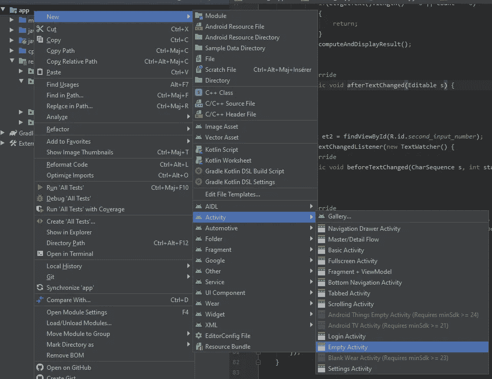
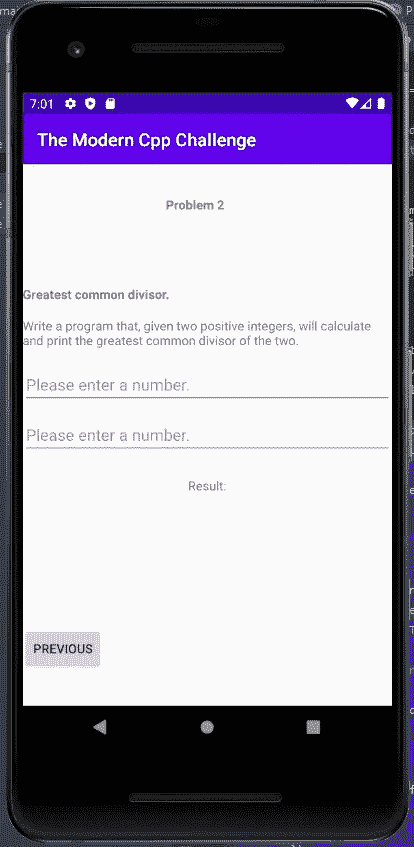

# 现代 Cpp 对手机的挑战——最大公约数

> 原文：<https://medium.com/analytics-vidhya/the-modern-cpp-challenge-on-mobile-greatest-commont-divisor-e7558229dcc7?source=collection_archive---------40----------------------->


由[克里斯托弗·罗拉](https://unsplash.com/@krisroller?utm_source=medium&utm_medium=referral)在 [Unsplash](https://unsplash.com?utm_source=medium&utm_medium=referral) 拍摄的照片

你好！我是 Xavier Jouvenot，这是关于[现代 C++挑战](https://amzn.to/2QdYmvA)的系列文章的第二部分。在这篇文章中，我将解释我如何在 C++中解决第二个问题，以及我如何在一个 Android 项目中集成该解决方案。

第二个问题的目标很简单。我们必须计算用户给定的两个正整数的最大公约数，我们打印给用户。该解决方案将在 C++中计算，获取用户输入和显示结果的界面将由 Android Studio 框架处理。

我鼓励你阅读本系列的前一部分[，因为我们将继续我们在其中创建的程序。](https://10xlearner.com/2020/03/23/the-modern-c-challenge-on-mobile-the-first-problem/)

# C++解决方案

实现寻找两个数的最大公约数的算法并不简单…这是标准给出的字面意思！😉事实上，在 C++17 中，函数 [std::gcd](https://en.cppreference.com/w/cpp/numeric/gcd) 就是这么做的！

所以我们所要做的，就是包含 std 中的“header”并使用 [std::gcd](https://en.cppreference.com/w/cpp/numeric/gcd) 函数。

如果您使用的是 C++标准的旧版本，那么您必须实现它。如果你想的话，我可以向你推荐这个关于它的[栈交换帖子](https://codereview.stackexchange.com/questions/66711/greatest-common-divisor)。🙂

# Android Studio 上的用户界面

与解决方案的 C++实现不同，用户界面需要做一些工作。事实上，我们希望能够在我们的应用程序中找到第一个问题和第二个问题的解决方案。

为了实现这一目标，我们需要做两件事:

*   添加一个新活动，其中将显示第二个问题并计算解决方案
*   添加按钮，以便能够从第一个问题进入第二个问题。

# 针对新问题的新活动

要创建新活动，您只需右键单击您的应用程序文件夹架构，然后转到如下所示的`Empty Activity`:



然后，指定您的新活动的名称(我将我的活动命名为`Problem_2`)，并单击`Finish`创建您的新活动。

好吧，但具体来说，那是什么意思？首先，如果你打开文件`AndroidManifest.xml`，你可以看到你的活动已经在这里声明了:

```
<activity android:name=".Problem_2"></activity>
```

然后，如果您查看您的 Java 文件，那么一定已经创建了一个新文件，其中有一个以您的新活动命名的类。在向用户显示结果之前，我们将在这个类中处理用户输入，并将它们交给 C++算法。

最后，在您的资源的子文件夹`layout`中，您可以看到一个新的 xml 已经被添加。当用户查看第二个问题时，这个 xml 将包含我们希望在屏幕上显示的所有元素。

就像在[第一个问题](https://10xlearner.com/2020/03/23/the-modern-c-challenge-on-mobile-the-first-problem/)中一样，我们所需要的就是`EditText`和`TextView`来获取用户输入并向用户显示解决方案，所以如果你还没有阅读过 [it](https://10xlearner.com/2020/03/23/the-modern-c-challenge-on-mobile-the-first-problem/) ，我鼓励你去阅读一下。

# 将两项活动联系起来

现在我们已经为我们的问题创建了新的活动，我们需要能够通过我们的应用程序访问它。最简单的方法是在第一个问题界面上创建一个按钮，转到第二个问题界面。

为此，我们首先在第一个活动中添加回调，即按钮将调用的函数。这个函数看起来像这样:

```
public void goToNextProblem(View v) {
  Intent intent = new Intent(this, Problem_2.class);
  startActivity(intent);
}
```

在这个函数中，我们创建了一个`Intent`,并将第二个活动的类提供给它。然后，我们开始这个活动。很简单，不是吗？！🙂

现在我们有了回调，让我们在活动中创建一个按钮，并将其链接到回调。这可以通过将以下元素添加到第一个活动的布局中来实现:

```
<Button android:id="@+id/button"
  android:layout_width="wrap_content"
  android:layout_height="wrap_content"
  android:onClick="goToNextProblem"
  android:text="@string/button_next"
  app:layout_constraintBottom_toBottomOf="parent"
  app:layout_constraintEnd_toEndOf="parent"
  app:layout_constraintHorizontal_bias="0.95"
  app:layout_constraintStart_toStartOf="parent"
  app:layout_constraintTop_toTopOf="parent"
  app:layout_constraintVertical_bias="0.954" />
```

这里重要的是我们用回调函数的名字设置了字段`android:onClick`。这样，当用户点击按钮时，就会触发我们的功能。

您可以在第二个活动中做同样的事情，以便能够回到第一个活动。瞧，对于前两个问题，你有了一个合适的用户界面。我们所要做的就是把用户界面和 C++算法联系起来。

# 使用 C++本机代码

在这一部分，我们将看看第二个活动的 Java 类。

```
public native String Gcd(int i, int j);private int extractNumberFromEditText(EditText et) {
  assert et.getText().length() != 0 : "The EditText must not be empty";
  return Integer.parseInt(et.getText().toString());
}private void computeAndDisplayResult() {
  EditText et1 = findViewById(R.id.first_input_number);
  EditText et2 = findViewById(R.id.second_input_number);
  int firstNumber = extractNumberFromEditText(et1);
  int secondNumber = extractNumberFromEditText(et2);
  TextView tv = findViewById(R.id.result);
  tv.setText(getString(R.string.result_placeholder, Gcd(firstNumber, secondNumber)));
}
```

如果你读过我关于第一个问题的解决方案的[博文，这部分并没有带来新的。首先，我们声明 C++库中链接的函数`Gcd`。然后我们有一个方法来获取用户输入的`EditText`,我们从用户输入中提取输入，我们获取要显示结果的`TextView`,我们计算结果并显示它。](https://10xlearner.com/2020/03/23/the-modern-c-challenge-on-mobile-the-first-problem/)

但与第一个问题不同的是，这段代码是在私有函数中。不在`EditText`回调中。这是因为一件重要的事情。如果只有一个输入用户，我们就无法计算 GCD 算法。我们必须确保两个用户输入都被填充。

回调看起来是这样的:

```
EditText et = findViewById(R.id.first_input_number);
et.addTextChangedListener(new TextWatcher() {
  @Override
  public void beforeTextChanged(CharSequence s, int start, int count, int after) { } @Override
  public void onTextChanged(CharSequence s, int start, int before, int count) {
    EditText et = findViewById(R.id.second_input_number);
    if(et.getText().length() == 0 || count == 0) { return; }
    computeAndDisplayResult();
  } @Override
  public void afterTextChanged(Editable s) { }
});
```

所以对于第一个`EditText`，当文本改变时，我们检查的是新文本不为空(`count == 0`)以及第二个`EditText`不为空(`et.getText().length() == 0`)。如果没有空的，我们调用我们的函数来计算和显示结果。如果一个是空的，我们什么也不做，直接返回。对于第二个`EditText`，代码是相似的，只有`EditText`id 发生变化。😉

# 结论

因此，我们现在有一个应用程序可以解决前两个问题[现代 C++挑战](https://amzn.to/2QdYmvA)并在 Android Studio 上学习新东西，对于这个问题，这是我的真正目的，因为 C++算法已经集成到 C++标准中。

你可以注意到，在这篇文章中所写的解决方案，并没有包括制作一个运行程序的所有源代码，而只是解决这个问题的源代码中有趣的部分。如果你想从头到尾看到节目，你可以上我的 [GitHub 账号](https://github.com/Xav83/TheModernCppChallenge_AndroidStudio/tree/v0.0.2_SecondProblem)，探索完整解决方案，如果你想添加评论或提问，在你看这篇文章的平台上，它也会帮助我提高我的文章质量。

感谢大家阅读这篇文章，直到我的下一篇文章，有一个精彩的一天😉



# 有趣的链接

- [现代 C++挑战赛](https://amzn.to/2QdYmvA)
- [std::gcd 文档](https://en.cppreference.com/w/cpp/numeric/gcd)-[Github 发布](https://github.com/Xav83/TheModernCppChallenge_AndroidStudio/tree/v0.0.2_SecondProblem)

*原载于 2020 年 3 月 30 日*[*http://10xlearner.com*](https://10xlearner.com/2020/03/30/the-modern-cpp-challenge-on-mobile-greatest-commont-divisor/)*。*