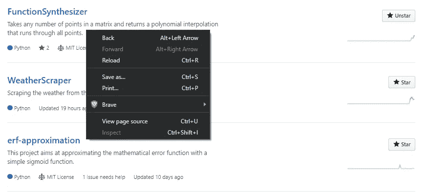
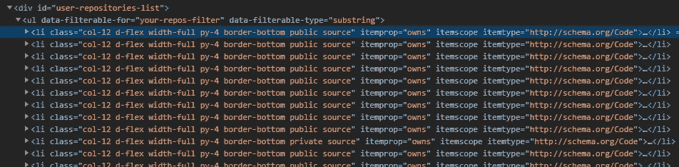
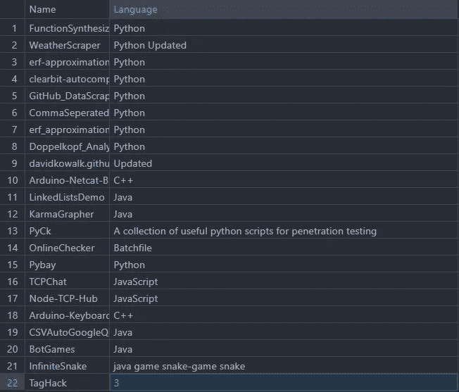

# 网页抓取的现代方式。

> 原文：<https://medium.com/analytics-vidhya/the-modern-way-of-web-scraping-requests-html-2567ba2554f4?source=collection_archive---------1----------------------->


Python 是您工具箱中的优秀工具，它使许多任务变得更加简单，尤其是在数据挖掘和操作方面。作为一名自由职业者，人们经常出于同样的原因来找我:Python 很难，代码就像一碗意大利面条一样容易理解，初学者通常无法理解。"为什么我需要 3 个不同的库来从网站上下载一些数据？"这是非常不幸的，因为网络抓取是科学家们几乎每天都会用到的东西，尤其是数据。

在本教程中，我将向你展示带有 ***请求的网页抓取的基础知识——html***，从网站上抓取数据的现代方式。

# 设置

在你安装了 [Python](http://python.org/) 之后，你需要导入我将在这里与 pip 一起使用的库。打开您的终端(Windows 上的 Powershell，Mac 上的 terminal)并键入:

```
pip install requests-html
```

然后创建一个名为 *app.py* 的文本文件。这是你的申请文件。您可以使用任何普通的文本编辑器来编辑这个文件。我会推荐 [Atom](https://atom.io/) 、 [Sublime Text](https://www.sublimetext.com/) 或者 [Visual Code](https://code.visualstudio.com/) 。写入您的文件:

```
import requests-html
import csv
```

requests-html 比 urllib 和 beautiful-soup 更有优势，因为它更容易使用，并且将两者的特性结合到一个库中。

# 提取数据

现在，我们都设置好了，我们可以继续下载数据:

```
from requests_html import HTMLSession
session = HTMLSession()
```

会话像普通的 web 浏览器一样请求网站，最重要的是，它看起来也像一个浏览器。让我们给我们的会议一个网站刮:

```
url = [https://github.com/davidkowalk?tab=repositories](https://github.com/davidkowalk?tab=repositories)
response = session.get(url)
```

这将下载你的页面的所谓来源，在这种情况下，我的 GitHub 配置文件。让我们下载我的库的所有名字！在您选择的浏览器中打开网站，右键单击其中一个列表项并选择 *Inspect-Element。*



现在，您应该可以看到编译后的页面源代码。



列表在一个 id 为*“用户-存储库-列表”*的 *< div >* 元素中，我们来搜索一下。

```
container = response.html.find(“#*user-repositories-list”, first=True)* list = container.find(“li”)
```

这将返回所有存储库的列表。#是 id 标签的 html 标记。现在，对于每一个列表，我们都希望找到存储库的名称及其要写入文件的语言。首先，我们将准备数据结构。该列表应该包含一个标题，然后我们想追加我们的数据点。

```
sheet = [[“Name”, “Language”]]
```

现在让我们遍历列表中的所有元素，找到名称和语言。

```
for item in list:
    elements = item.text.split(“\n”)
    name = elements[0]
    lang = elements[2] sheet.append([name, lang])
```

*elements* 是列表中每一项的所有信息的数组。例如，对于第一项，它看起来像这样:

```
[‘FunctionSynthesizer’, ‘Description’, ‘Python’, ‘2’, ‘License’, ‘Apr 15, 2020’]
```

第一个元素(编号 0)是名称。该语言位于第三位，所以它的 id 为 2。

# 保存您的数据

现在我们有了一个我们想要的所有信息的二维列表。我们要做的就是把它写在一个文件里。CSV 是一种开放的表格格式，可以用 Excel 或类似的程序打开。用 Python 实现的 CSV-Package 可以用来轻松地读写文件:

```
with open(“Filename.csv”, “w”, newline=’’, encoding=’utf-8') as file:
    writer = csv.writer(file)
    writer.writerows(sheet)
```

现在，您可以在终端中运行您的应用程序:

```
python app.py
```

这会生成一个可以用 Excel 打开的 CSV 文件。



你可能会注意到这不是 100%干净的。并非所有字段都选择正确，因为这种方法依赖于特定的格式，而这种格式并不总是能够实现。作为练习，尝试自己解决这个问题。

您可以参考的文档

*   [请求-HTML](https://pypi.org/project/requests-html/) 和
*   [Python CSV](https://docs.python.org/3/library/csv.html)

请求——HTML 有更多的特性，比如异步数据收集、JavaScript 支持和自动重定向。如果你想更深入地了解网络抓取，这无疑是一个很好的工具。

如果你有任何进一步的问题，请在下面随意评论，我会尽量回复你。