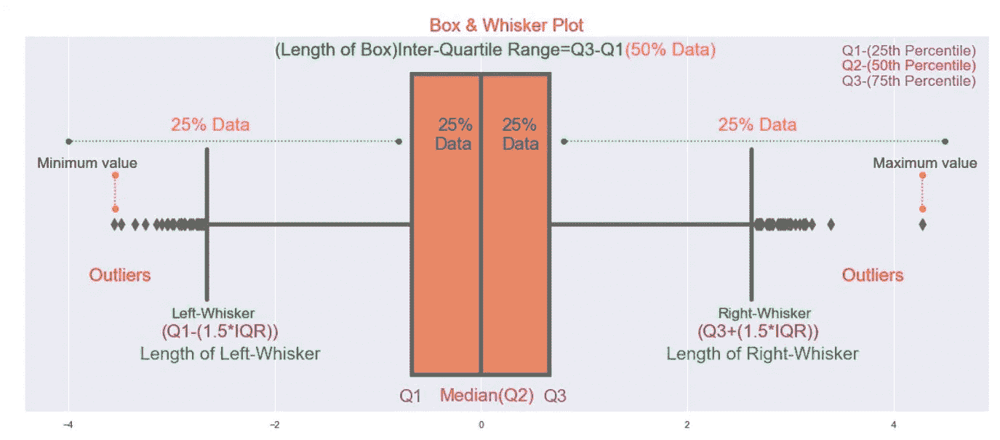
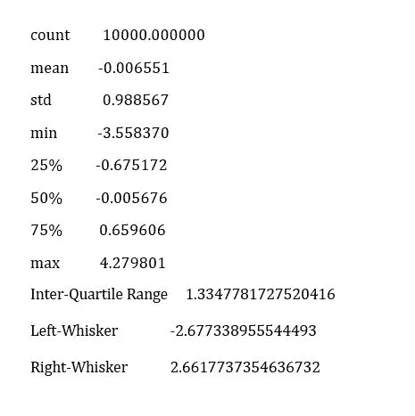
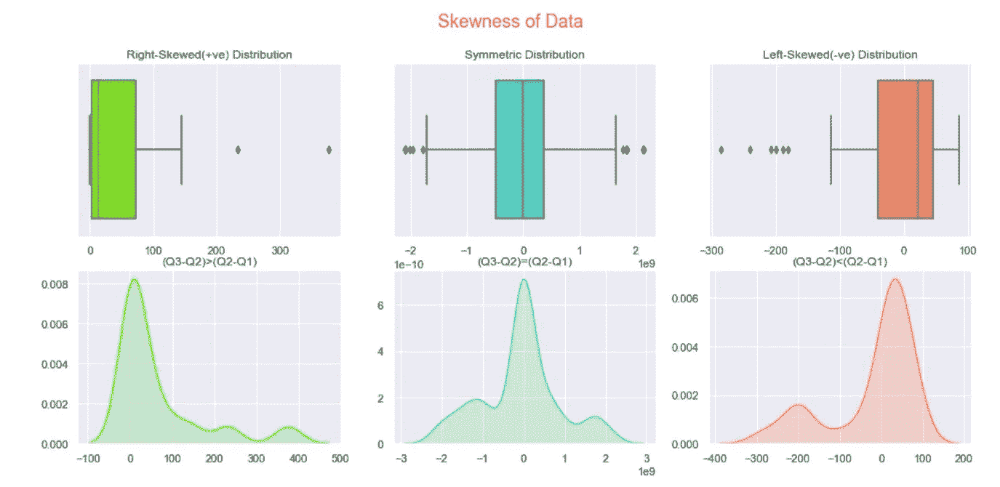
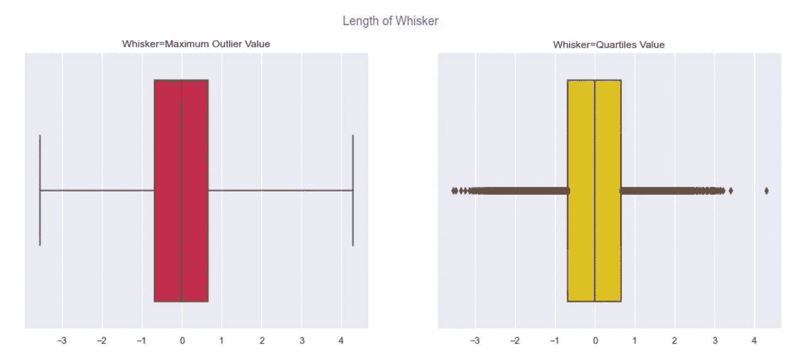

# 庞大的数据

> 原文：<https://medium.com/analytics-vidhya/the-monolith-of-data-dfa01ccb79?source=collection_archive---------25----------------------->

B 牛须图是一种图形表示，可用于理解量化(数字)数据中的分布、可变性、偏斜度和异常值的存在。一般来说，它也被称为 5 点总结的图形表示。(最小、最大、中间、第 25 百分位&第 75 百分位)

盒须图

上述盒须图的摘要

## 这个方框图揭示了什么？

*   数据集中的最小值和最大值。
*   中位数
*   四分位值
*   数据的偏斜度
*   晶须值
*   极端值

***最小值和最大值可以从图中得到解释。所以射程(Max。值—最小值。值)可以很容易地被看到。***

方框揭示了一些重要的信息

*   **四分位数 1(Q1)**–*第 25 个百分位数(显示前 25%的数据)* ***25:75 比率***
*   **四分位数 2(Q2)**–*第 50 百分位或* ***中位数(将数据分成相等的两半)50:50 比率***
*   **四分位数 3(Q3)**–*第 75 个百分位数(显示前 75%的数据)比率为 75:25*
*   **四分位区间- (Q3-Q1)-** *包含中位数附近的中间 50%的数据。(* ***也称盒子长度*** *)*
*   **(Q3-Q2)和** *各包含 25 %的数据。它还揭示了数据的偏斜度。*

## 用箱线图解释偏斜度

箱线图的偏斜度

箱线图还揭示了基于(第三季度-Q2)和(Q2-Q1)之间差异的数据偏斜度。

*   ***(Q3-Q2)>(Q2-Q1)****→右偏分布或正偏分布。*
*   ***(Q3-Q2)=(Q2-Q1)****→对称分布。*
*   ***【Q3-Q2】<【Q2-Q1】****→左偏分布或负偏分布。*

方框仅显示 50%的数据，其他 50%的数据由须状物表示。因此，最好了解一下 whisker 以及它揭示了哪些数据。

## 胡须是什么？

> 胡须就像盒子的帮手。它用于获取盒子周围的重要数据，并将数据留在其边界之外，这些数据称为异常值，用点表示。

## 须手张开多远是对的？

*   ***红色方框图*** 显示胡须值被设置为数据集中的最小值和最大值。因此晶须抓住了所有的极值点，因此在数据集中似乎没有异常值。
*   ***黄色方框图*** 显示触须值设置为四分位值(Q1 & Q3 ),因此触须不会抓取四分位 1 和四分位 3 以外的值。因此，在该图中，出现在方框外的所有值都被视为异常值。

在这两种情况下，胡须都做得不好。

因此，须手的正确值必须基于以下公式

> **左须=(Q3-(1.5*IQR)) &右须=(Q3+(1.5*IQR))**

通过使用这个公式，我们可以识别异常值，还可以获取关于变量的必要和重要信息。

> **箱线图的唯一缺点是它不能显示所有的数据点，但它是获得数据的快速 5 点汇总的最好方法。**

## 上面可视化的代码是 [***这里是***](https://github.com/CSKOUSHIK/Box-Whisker-Plot)