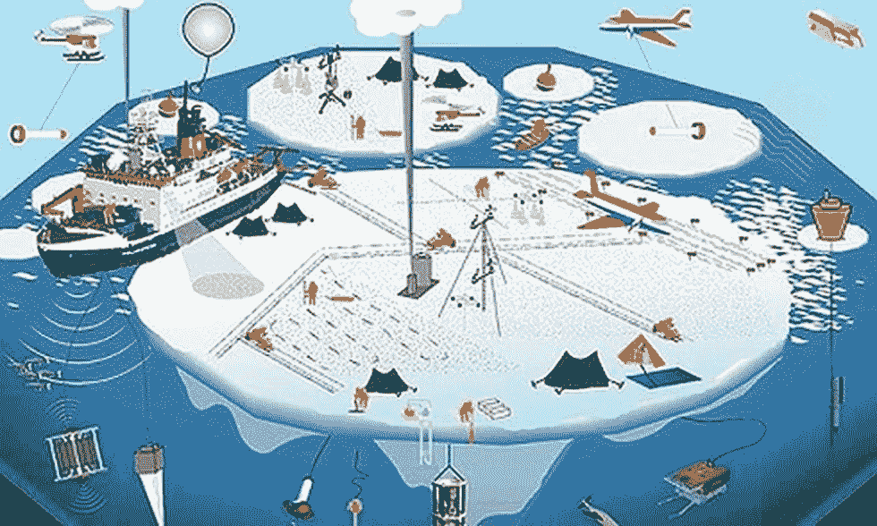

# 马赛克探险——历史上最大的极地探险

> 原文：<https://medium.com/analytics-vidhya/the-mosaic-expedition-largest-polar-expedition-in-history-4b5c177d4dfe?source=collection_archive---------14----------------------->

## 通过近距离观察北极，获得更好地理解全球气候变化的基本见解。

图片来自 v [ajiramias](https://vajiramias.com/current-affairs/mosaic-mission/5d9aa4011d5def18d9f0bc23/)

开始历史上最大的极地考察，德国研究破冰船**极地号**从挪威的特罗姆瑟起航，用一年的时间在北冰洋漂流…