# 数据科学家最基本的基本技能

> 原文：<https://medium.com/analytics-vidhya/the-most-basic-fundamental-skills-for-data-scientist-a7f4c3690977?source=collection_archive---------24----------------------->

## 要成为数据科学家，编码是必须的。但是，知道如何安装 python 和 Jupyter Notebook 是“必须的”。

要开始数据科学世界的第一步，我们需要了解两个最基本的数据科学软件， **python** 和 **Jupyter Notebook** 。这篇文章的目的是为如何在你的电脑上安装这些程序提供基本的指导。

# **PYTHON**

取自 Phyton.org

Python 是世界上最流行的编程语言之一。它被认为是一种高级语言编码，擅长处理大数据。在下载 python 之前，您需要了解几个信息:

## 检查你的电脑操作系统。除了 Windows 之外，所有操作系统都已经默认安装了 python。

为了检查 Python 是否已经安装在你的设备上，打开命令行(或者终端),输入`python --version`就可以知道可用性和版本。

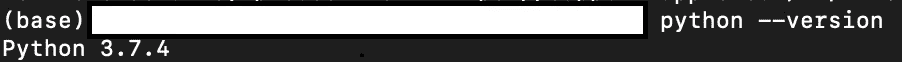

**终端**中的 python 版本示例

通常，大多数装有默认 python 的计算机都是 2.7 系列。但是，如果你想更新你的 python 到 3.8 系列，只需下载最新的 python(将在下一个过程中解释)。你一安装，系统就会自动更新。对于 window 用户来说，由于你的操作系统中没有默认的 python，所以下载 python 是****必须的。****

## ****Python 2.x 和 Python 3.x，该下载哪个？****

**实际上，这完全取决于你的主要目标。如果你想学习 basic，python 2.x 可以帮助你丰富基本功。但是，根据我的研究，python 3.x 更容易使用，许多公司开始使用 python 3 而不是 python 2。Branford (2018)预测，2020 年美国将有更多公司使用 python 3。所以，我推荐你下载使用 python 3.x。**

# **如何安装 Python:**

****去 python 官方网站** [**下载你想要的 python**](https://www.python.org/downloads/) **版本。文件输出将是 exe。****

**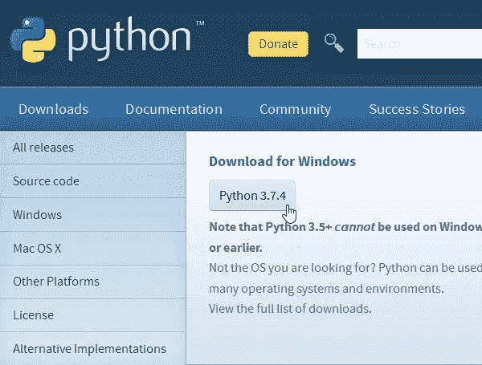**

**从直接网站下载 Python**

**下载后，将文件移动到你想要放置 python 程序的永久位置。然后打开设置。**

**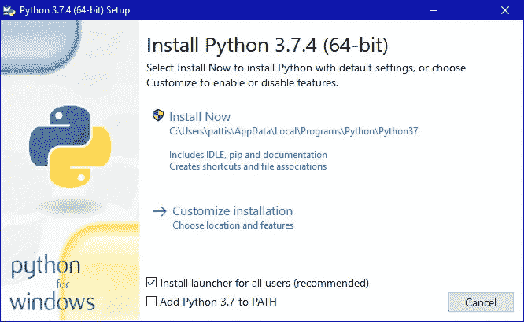**

**UI Phyton 安装页面**

**打开包启动安装程序，别忘了给你的 python 添加路径。通过添加路径，python 应用程序知道在哪里可以找到您的 python。如果您有旧版本的 python,“立即安装”可能显示为“立即升级”。**

**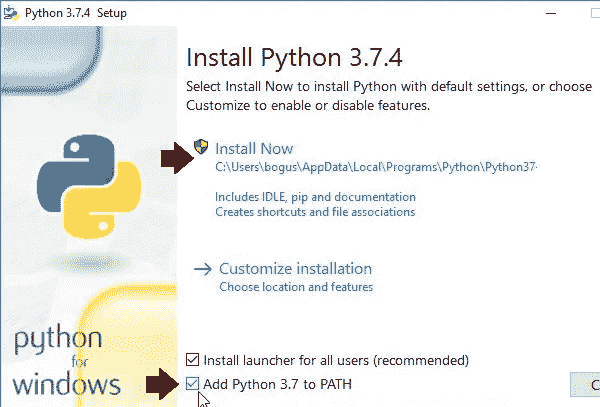**

****按照说明操作(默认设置)。几分钟后，你的电脑里就会有 python 了。****

**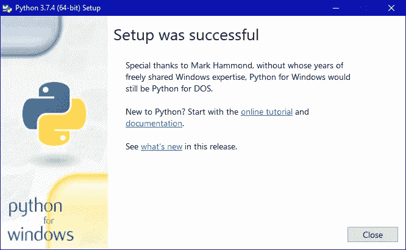**

**完成 Python 安装**

****验证****

**要尝试验证安装，请打开终端(mac)或命令提示符(windows)并键入 **python。****

**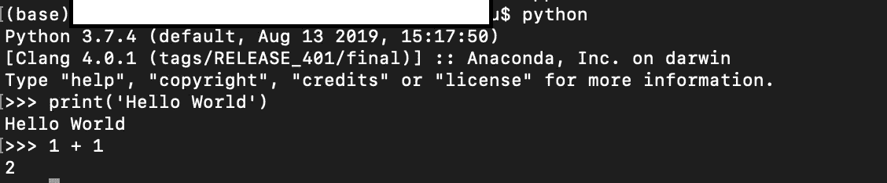**

**Python 终端截图**

**大家可以看到，从终端截图来看，电脑中安装了 python 3.7.4。还有，你可以在终端里直接用 python，别忘了找乐子！(比如我们输入 print('Hello World)，他们会直接在终端打印输出 Hello World。)**

# **Jupyter 笔记本**

**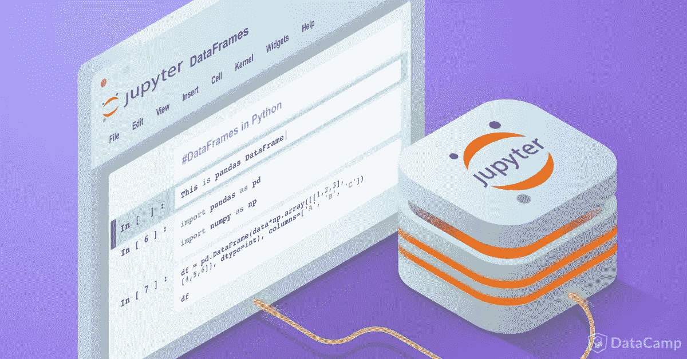**

**摘自 DataCamp 网站**

**Jupyter Notebook 是一个开源的 web 应用程序，允许您创建和共享包含实时代码、方程、可视化和叙事文本的文档(Geeks & Geeks，2020)。Jupyter 是众所周知，因为它易于使用，可以在没有互联网的情况下执行，并在一次安装中为数据科学家和机器学习带来了许多工具(python，R)。**

**Jupyter 笔记本可以用两种方式安装， **Anaconda** 和 **PIP。但是在这篇文章中，我只解释了 anaconda，因为安装 Anaconda 将帮助我们为数据科学家下载最重要程序。所以，下面是下载 Anaconda 和 Jupyter 的步骤:****

****打开链接**[**Anaconda.com/downloads**](https://www.anaconda.com/download/)**。选择一个你使用的操作系统(在 windows，mac，dan OS 之间)。现在，你只能下载 python 3.8 版的 Anaconda。因为文件相当大(大约 400 MB)。****

**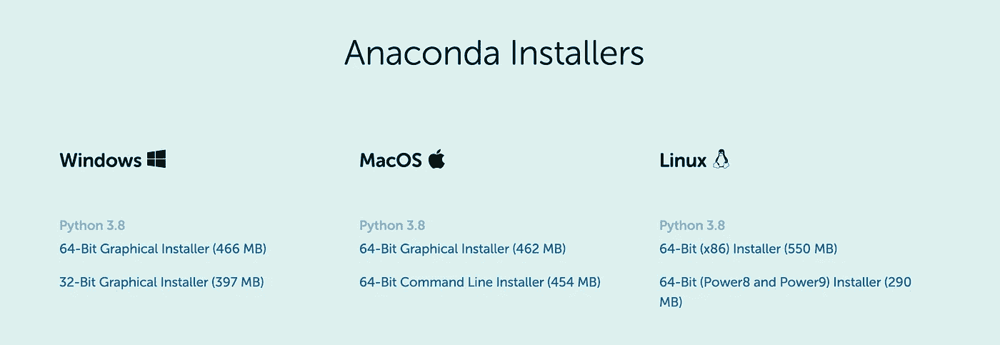**

**Anaconda 安装程序**

****下载完成后，打开安装程序，Anaconda 安装文件就会打开。****

**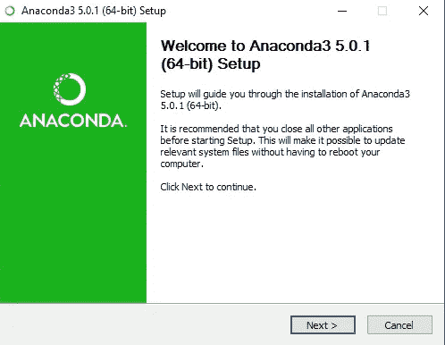**

**Anaconda 中的欢迎安装页面**

****按照说明操作(默认设置)。选择安装位置****

**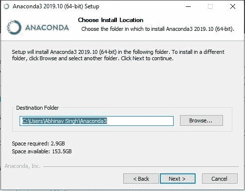**

**安装位置 Anaconda**

****如果你曾经在你的笔记本电脑上安装过 python，不要勾选高级 Anaconda 安装标签*中的【V】*‘将 Anaconda 添加到我的 PATH 环境变量中’。然后继续该过程直到安装。******

**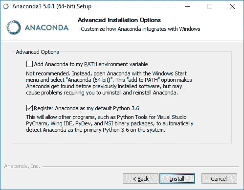**

**高级 Anaconda 安装选项卡**

**安装完成后，你可以在开始菜单中找到 Anaconda Navigator。**

**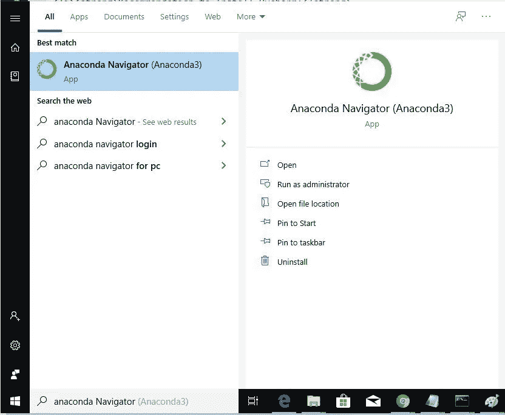**

**点击 Jupyter 笔记本中的“安装”按钮。安装完成后，点击“启动”,欢迎来到数据科学的世界！**

**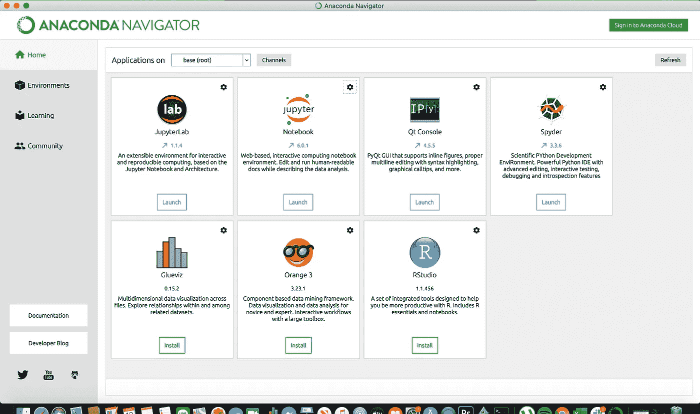**

**蟒蛇的用户界面**

**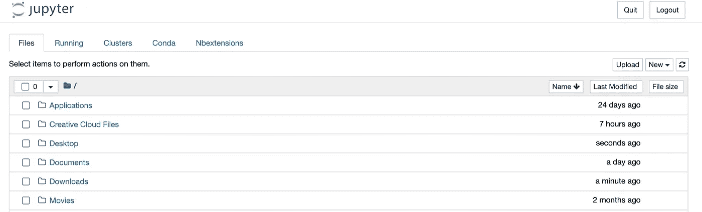**

**Jupyter 笔记本的用户界面**

****记住！！！当你打开 Jupyter 笔记本时，终端或命令提示符会自动打开。Jupyter 笔记本使用后不要关闭终端，用终端保存数据。****

**通过了解如何正确安装 python 和 Jupyter Notebook，你就为成为未来的数据科学家做好了准备。恭喜你，祝你学习之旅好运！！！**

**关于作者:**

**Ravelto Wangistu 是印度尼西亚大学心理学毕业生。现在，他是印度尼西亚 IYKRA 的数据科学团队的一员。要了解更多关于 IYKRA 的信息，请[点击此按钮](https://iykra.com/)或打开 https://www.linkedin.com/company/iykra/。**

**如果您有任何问题，请随时通过 [Linkedin](https://www.linkedin.com/in/raveltowangistu/) 联系我。**

# ****参考:****

** [## Python 2 vs Python 3:我该学哪个？

### 作为初学者，你应该学哪个——Python 2 vs Python 3？在本指南中，我们解释了哪些是你应该学习的，以及…

learntocodewith.me](https://learntocodewith.me/programming/python/python-2-vs-python-3/#2018-differences-of-python2-vs-3)  [## 安装- Anaconda 文档

### 在安装 Anaconda 个人版之前，请阅读下面列出的系统要求。如果你不想要…

docs.anaconda.com](https://docs.anaconda.com/anaconda/install/)  [## Python 下载和安装说明

### 您可能希望在继续之前打印这些说明，以便在下载和…

www.ics.uci.edu](https://www.ics.uci.edu/~pattis/common/handouts/pythoneclipsejava/python.html)  [## 如何在 Windows 上安装 Python

### 所以你想学编程？Python 是最常见的入门语言之一，因其独特的融合而广受欢迎…

opensource.com](https://opensource.com/article/19/8/how-install-python-windows)  [## 如何在 windows 上安装 Anaconda？- GeeksforGeeks

### Anaconda 是一个开源软件，包含 Jupyter，spyder 等，用于大型数据处理，数据…

www.geeksforgeeks.org](https://www.geeksforgeeks.org/how-to-install-anaconda-on-windows/)  [## 安装- Anaconda 文档

### 在安装 Anaconda 个人版之前，请阅读下面列出的系统要求。如果你不想要…

docs.anaconda.com](https://docs.anaconda.com/anaconda/install/)**