# 您需要的最全面的 K-Means 聚类指南

> 原文：<https://medium.com/analytics-vidhya/the-most-comprehensive-guide-to-k-means-clustering-youll-ever-need-2a570ff2c0a3?source=collection_archive---------5----------------------->

我喜欢从事[推荐引擎](https://www.analyticsvidhya.com/blog/2018/06/comprehensive-guide-recommendation-engine-python/?utm_source=blog&utm_medium=comprehensive-guide-k-means-clustering)的工作。每当我在一个网站上遇到任何一个推荐引擎，我都迫不及待地想把它分解开来，了解它是如何工作的。这是成为数据科学家的众多好处之一！

这些系统真正让我着迷的是我们如何将相似的物品、产品和用户分组在一起。这种分组或细分适用于各行各业。这就是聚类概念在数据科学中如此重要的原因。

聚类帮助我们以一种独特的方式理解我们的数据——通过将事物分组到一起——你猜对了——聚类。

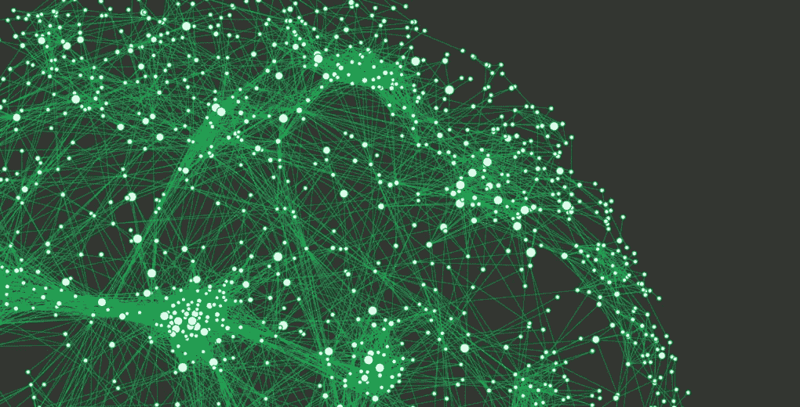

在本文中，我们将全面介绍 k-means 聚类及其组件。我们将了解聚类、它的重要性、它的应用，然后深入研究 k-means 聚类(包括如何在真实数据集上用 Python 执行它)。

*在综合的“* [*应用机器学习*](https://courses.analyticsvidhya.com/courses/applied-machine-learning-beginner-to-professional/?utm_source=blog&utm_medium=comprehensive-guide-k-means-clustering) *”课程中了解更多关于聚类和其他机器学习算法(监督和非监督)的信息。*

# 目录

1.  什么是集群？
2.  聚类是如何成为无监督学习问题的？
3.  集群的属性
4.  聚类在现实场景中的应用
5.  了解不同的聚类评估指标
6.  什么是 K-Means 聚类？
7.  在 Python 中从头开始实现 K-Means 聚类
8.  K 均值算法面临的挑战
9.  K-Means ++为 K-Means 聚类选择初始聚类质心
10.  如何在 K-Means 中选择合适的聚类数？
11.  在 Python 中实现 K-Means 聚类

# 什么是集群？

让我们从一个简单的例子开始。一家银行希望向其客户提供信用卡优惠。目前，他们会查看每个客户的详细信息，并根据这些信息决定向哪个客户提供哪个服务。

现在，该银行可能拥有数百万客户。分别看每个客户的详细情况再做决定有意义吗？肯定不是！这是一个手动过程，需要花费大量时间。

那么银行能做什么呢？一种选择是将顾客分成不同的群体。例如，银行可以根据收入对客户进行分组:

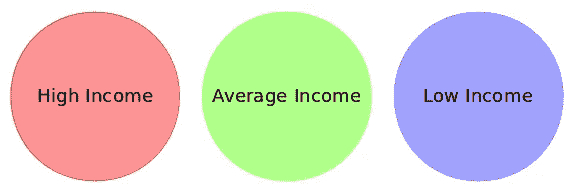

你能明白我的意思吗？该银行现在可以制定三种不同的策略或报价，每组一种。在这里，他们只需要制定 3 个策略，而不是为单个客户制定不同的策略。这将减少工作量和时间。

我上面展示的组被称为集群，创建这些组的过程被称为聚类。形式上，我们可以说:

> 聚类是根据数据中的模式将整个数据分成组(也称为簇)的过程。

你能猜出聚类是哪种学习问题吗？是有监督的还是无监督的学习问题？

想一想，利用我们刚刚看到的例子。明白了吗？聚类是一个无监督的学习问题！

# 聚类是如何成为无监督学习问题的？

假设您正在进行一个项目，您需要预测一个大型超市的销售额:

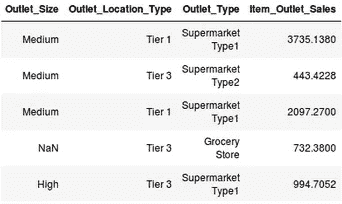

或者，在一个项目中，您的任务是预测贷款是否会被批准:

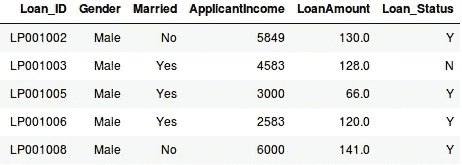

在这两种情况下，我们都有一个固定的预测目标。在销售预测问题中，我们要根据*奥特莱斯大小、奥特莱斯位置类型*等来预测 *Item_Outlet_Sales* 。而在贷款审批问题中，我们要根据*性别、婚姻状况、客户收入等*来预测 *Loan_Status* 。

> *所以，当我们有一个目标变量要基于给定的一组预测器或自变量进行预测时，这样的问题就叫做监督学习问题。*

现在，可能会有这样的情况，我们*没有*可以预测任何目标变量。

> *这样的问题，没有任何固定的目标变量，被称为无监督学习问题。在这些问题中，我们只有自变量，没有目标/因变量。*

**在聚类中，我们没有可预测的目标。我们查看数据，然后尝试将相似的观察结果组合起来，形成不同的组。因此这是一个无监督的学习问题。**

我们现在知道什么是集群和集群的概念。接下来，让我们看看在形成集群时必须考虑的这些集群的属性。

# 集群的属性

再举个例子怎么样？我们将像以前一样选择想要细分客户的银行。为简单起见，假设银行只想使用收入和债务进行细分。他们收集了客户数据，并使用散点图将其可视化:

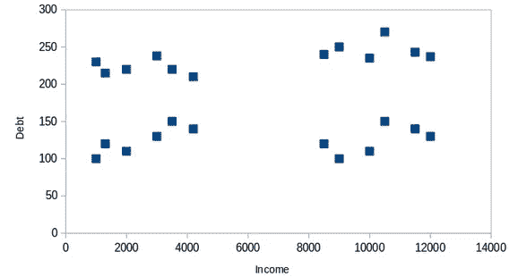

在 X 轴上，我们有客户的收入，y 轴代表债务金额。在这里，我们可以清楚地看到，这些客户可以分为 4 个不同的群，如下所示:

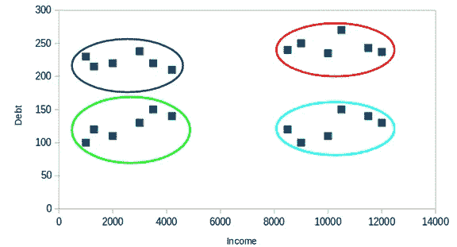

这就是聚类帮助从数据中创建分段(聚类)的方式。银行可以进一步使用这些聚类来制定策略并向其客户提供折扣。让我们来看看这些星团的特性。

## 属性 1

**一个聚类中的所有数据点应该彼此相似。**让我用上面的例子来说明一下:

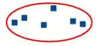

如果特定集群中的客户彼此不相似，那么他们的需求可能会有所不同，对吗？如果银行给他们同样的提议，他们可能不喜欢，他们对银行的兴趣可能会降低。不理想。

在同一个集群中拥有相似的数据点有助于银行进行有针对性的营销。你可以从日常生活中想到类似的例子，并思考集群将如何(或已经如何)影响商业战略。

## 属性 2

**来自不同集群的数据点应该尽可能的不同。**如果你掌握了上述属性，这在直觉上是有意义的。让我们再举一个同样的例子来理解这个属性:

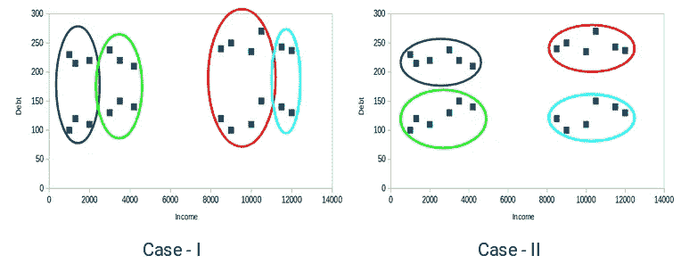

你认为这些案例中哪一个会给我们更好的分类？如果你看看案例一:

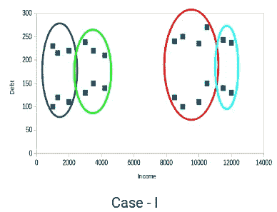

红色和蓝色集群中的客户彼此非常相似。红色聚类中的前四个点与蓝色聚类中的前两个客户共享相似的属性。他们收入高，负债值高。这里，我们对它们进行了不同的分类。然而，如果你看看案例二:

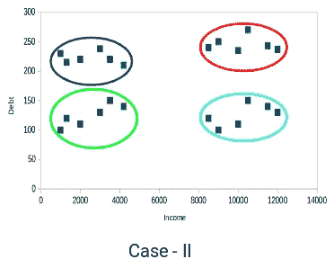

红色聚类中的点与蓝色聚类中的客户完全不同。红色聚类中的所有客户都具有高收入和高债务，而蓝色聚类中的客户具有高收入和低债务价值。显然，在这种情况下，我们有更好的客户群。

因此，来自不同聚类的数据点应该尽可能互不相同，以获得更有意义的聚类。

到目前为止，我们已经了解了什么是集群以及集群的不同属性。但是我们为什么需要集群呢？让我们在下一节中澄清这个疑问，看看集群的一些应用。

# 聚类在现实场景中的应用

聚类是行业中广泛使用的技术。实际上，它正被用于几乎每个领域，从银行业到推荐引擎，从文档聚类到图像分割。

## 客户细分

我们之前讨论过这一点——聚类最常见的应用之一是客户细分。这不仅仅局限于银行业。这一战略是跨职能部门的，包括电信、电子商务、体育、广告、销售等。

## 文档聚类

这是集群的另一个常见应用。假设您有多个文档，并且需要将相似的文档聚集在一起。聚类帮助我们将这些文档分组，使得相似的文档在相同的聚类中。

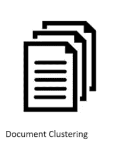

## 图象分割法

我们还可以使用聚类来执行图像分割。这里，我们试图将图像中相似的像素组合在一起。我们可以应用聚类来创建在同一组中具有相似像素的聚类。

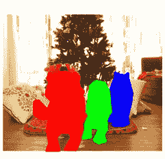

你可以参考[这篇文章](https://www.analyticsvidhya.com/blog/2019/04/introduction-image-segmentation-techniques-python/?utm_source=blog&utm_medium=comprehensive-guide-k-means-clustering)来看看我们如何利用聚类来完成图像分割任务。

## 推荐引擎

聚类也可以用在[推荐引擎](https://www.analyticsvidhya.com/blog/2018/06/comprehensive-guide-recommendation-engine-python/?utm_source=blog&utm_medium=comprehensive-guide-k-means-clustering)中。假设你想给朋友推荐歌曲。你可以看看那个人喜欢的歌然后用聚类找到相似的歌最后推荐最相似的歌。

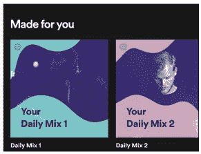

我相信你已经想到了更多的应用。你可以在下面的评论区分享这些应用。接下来，让我们看看如何评估我们的集群。

# 了解不同的聚类评估指标

集群的主要目的不仅仅是建立集群，而是建立好的、有意义的集群。我们在下面的例子中看到了这一点:


在这里，我们只使用了两个特征，因此我们可以很容易地看到并决定哪一个集群更好。

不幸的是，现实世界的场景并不是这样的。我们将有大量的功能可以使用。让我们再次以客户细分为例——我们将有客户的收入、职业、性别、年龄等特征。对我们来说，将所有这些特征可视化并决定更好和更有意义的集群是不可能的。

这是我们可以利用评估指标的地方。让我们讨论其中的一些，并了解如何使用它们来评估我们的集群的质量。

## 惯性

回想一下我们上面提到的集群的第一个属性。这就是惯性所评价的。它告诉我们一个集群中的点有多远。因此，**惯性实际上是从一个簇的质心开始计算该簇内所有点的总和。**

我们对所有的集群进行计算，最终的惯性值是所有这些距离的总和。集群内的这个距离被称为**集群内距离**。所以，惯性给了我们星团内距离的总和:

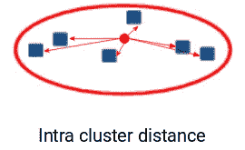

现在，你认为一个好的集群的惯性值应该是多少？小惯性值好还是我们需要更大的值？我们希望同一个集群中的点彼此相似，对吗？因此，**它们之间的距离应该尽可能的小**。

> 记住这一点，我们可以说惯性值越小，我们的聚类就越好。

## 邓恩指数

我们现在知道惯性试图使星系团内的距离最小化。它正试图制造更紧凑的星团。

让我这么说吧——如果一个聚类的质心和该聚类中的点之间的距离很小，这意味着这些点彼此更近。所以，惯性确保了团簇的第一个性质得到满足。但是它并不关心第二个特性——不同的集群应该尽可能地互不相同。

这就是邓恩指数可以发挥作用的地方。

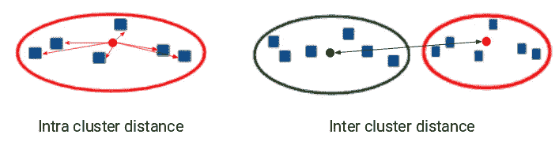

除了质心和点之间的距离，**邓恩指数还考虑了两个集群之间的距离**。两个不同簇的质心之间的距离被称为**簇间距离**。让我们看看邓恩指数的公式:

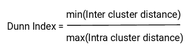

> *邓恩指数是最小类间距离和最大类内距离的比值。*

我们想最大化邓恩指数。邓恩指数的值越大，聚类越好。让我们理解邓恩指数背后的直觉:

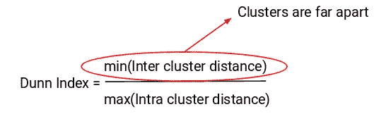

为了最大化邓恩指数的值，分子应该是最大的。这里，我们采用最小的集群间距离。因此，即使是最近的聚类之间的距离也应该更大，这将最终确保聚类彼此远离。

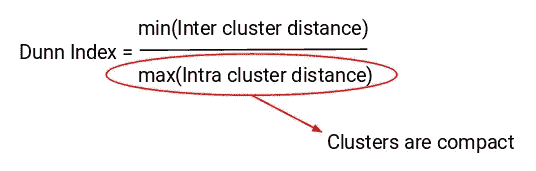

此外，分母应该最小，以最大化邓恩指数。这里，我们取最大的星团内距离。同样，直觉在这里也是一样的。聚类质心和点之间的最大距离应该最小，这将最终确保聚类是紧凑的。

# K-均值聚类简介

我们终于到了这篇文章的核心部分！

回想一下聚类的第一个属性——它表明一个聚类中的点应该彼此相似。因此，**我们的目标是最小化一个聚类中的点之间的距离。**

> *有一种算法试图最小化聚类中的点与其质心的距离 k-means 聚类技术。*

K-means 是一种基于质心的算法，或基于距离的算法，其中我们计算距离以将一个点分配给一个聚类。在 K-Means 中，每个聚类都与一个质心相关联。

> **K-Means 算法的主要目标是最小化点与其各自聚类质心之间的距离总和。**

现在让我们举一个例子来理解 K-Means 实际上是如何工作的:

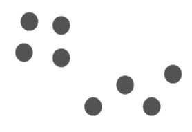

我们有这 8 个点，我们想应用 k-means 为这些点创建聚类。我们可以这样做。

## 步骤 1:选择聚类数 k

k-means 的第一步是挑选聚类数 k。

## 步骤 2:从数据中随机选择 k 个点作为质心

接下来，我们随机选择每个聚类的质心。假设我们想要 2 个集群，那么这里 k 等于 2。然后我们随机选择质心:

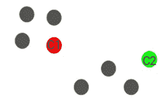

这里，红色和绿色的圆圈代表这些集群的质心。

## 步骤 3:将所有点分配给最近的聚类质心

初始化质心后，我们将每个点分配给最近的聚类质心:

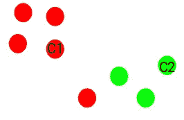

您可以看到，靠近红点的点被分配给红色簇，而靠近绿点的点被分配给绿色簇。

## 步骤 4:重新计算新形成的簇的质心

现在，一旦我们将所有的点分配给任何一个簇，下一步就是计算新形成的簇的质心:

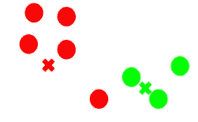

这里，红色和绿色的十字是新的质心。

## 第五步:重复第三步和第四步

然后，我们重复步骤 3 和 4:

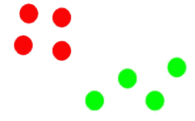

*计算质心并基于所有点与质心的距离将所有点分配给聚类的步骤是单次迭代*。但是等等——我们什么时候应该停止这个过程？它不能运行到永远，对不对？

# K-均值聚类的停止准则

基本上有三个停止标准可以用来停止 K-means 算法:

1.  新形成的簇的质心不会改变
2.  点保持在同一个群集中
3.  达到最大迭代次数

如果新形成的聚类的质心没有变化，我们可以停止该算法。即使在多次迭代之后，如果我们得到所有聚类的相同质心，我们可以说该算法没有学习任何新的模式，这是停止训练的信号。

另一个明显的迹象是，即使在多次迭代训练算法之后，如果这些点仍然在同一个聚类中，我们应该停止训练过程。

最后，如果达到最大迭代次数，我们可以停止训练。假设我们将迭代次数设为 100。该过程在停止之前将重复 100 次迭代。

# 从头开始在 Python 中实现 K-Means 聚类

是时候启动我们的 Jupyter 笔记本(或您使用的任何 IDE)并开始使用 Python 了！

我们将研究大型超市的销售数据，你可以在这里下载。我鼓励你在这里阅读更多关于数据集和问题陈述[。这将有助于你想象我们正在做什么(以及我们为什么这样做)。任何数据科学项目中两个非常重要的问题。](https://datahack.analyticsvidhya.com/contest/practice-problem-big-mart-sales-iii/?utm_source=blog&utm_medium=comprehensive-guide-k-means-clustering)

首先，导入所有需要的库:

```
#import libraries
import pandas as pd
import numpy as np
import random as rd
import matplotlib.pyplot as plt
```

现在，我们将读取 CSV 文件并查看前五行数据:

```
data = pd.read_csv('clustering.csv')
data.head()
```

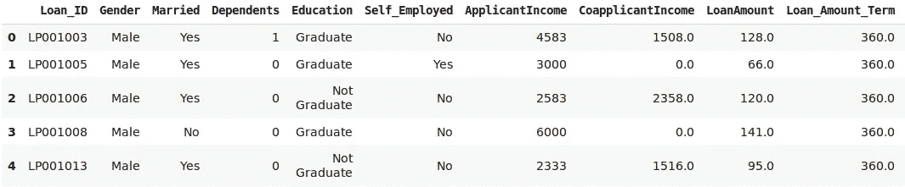

对于本文，我们将只从数据中提取两个变量——“贷款金额”和“申请收入”。这也将使可视化步骤变得容易。让我们挑选这两个变量并可视化数据点:

```
X = data[["LoanAmount","ApplicantIncome"]]
#Visualise data points
plt.scatter(X["ApplicantIncome"],X["LoanAmount"],c='black')
plt.xlabel('AnnualIncome')
plt.ylabel('Loan Amount (In Thousands)')
plt.show()
```

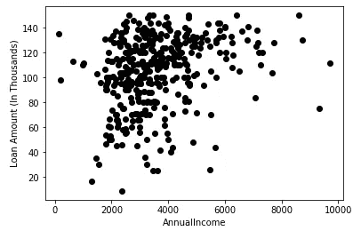

K-Means 的步骤 1 和 2 是关于选择簇的数量(K)和为每个簇选择随机质心。我们将挑选 3 个集群，然后从数据中选择随机观察值作为质心:

```
# Step 1 and 2 - Choose the number of clusters (k) and select random centroid for each cluster

#number of clusters
K=3

# Select random observation as centroids
Centroids = (X.sample(n=K))
plt.scatter(X["ApplicantIncome"],X["LoanAmount"],c='black')
plt.scatter(Centroids["ApplicantIncome"],Centroids["LoanAmount"],c='red')
plt.xlabel('AnnualIncome')
plt.ylabel('Loan Amount (In Thousands)')
plt.show()
```

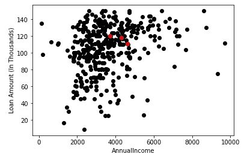

这里，红点代表每个星团的 3 个质心。请注意，我们已经随机选择了这些点，因此每次运行这段代码，您可能会得到不同的质心。

接下来，我们将定义一些条件来实现 K-Means 聚类算法。让我们先来看看代码:

```
# Step 3 - Assign all the points to the closest cluster centroid
# Step 4 - Recompute centroids of newly formed clusters
# Step 5 - Repeat step 3 and 4

diff = 1
j=0

while(diff!=0):
    XD=X
    i=1
    for index1,row_c in Centroids.iterrows():
        ED=[]
        for index2,row_d in XD.iterrows():
            d1=(row_c["ApplicantIncome"]-row_d["ApplicantIncome"])**2
            d2=(row_c["LoanAmount"]-row_d["LoanAmount"])**2
            d=np.sqrt(d1+d2)
            ED.append(d)
        X[i]=ED
        i=i+1

    C=[]
    for index,row in X.iterrows():
        min_dist=row[1]
        pos=1
        for i in range(K):
            if row[i+1] < min_dist:
                min_dist = row[i+1]
                pos=i+1
        C.append(pos)
    X["Cluster"]=C
    Centroids_new = X.groupby(["Cluster"]).mean()[["LoanAmount","ApplicantIncome"]]
    if j == 0:
        diff=1
        j=j+1
    else:
        diff = (Centroids_new['LoanAmount'] - Centroids['LoanAmount']).sum() + (Centroids_new['ApplicantIncome'] - Centroids['ApplicantIncome']).sum()
        print(diff.sum())
    Centroids = X.groupby(["Cluster"]).mean()[["LoanAmount","ApplicantIncome"]]
```

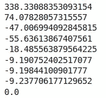

这些值可能会在我们每次运行时发生变化。这里，当两次迭代后质心不变时，我们停止训练。我们最初将 *diff* 定义为 1，在 while 循环中，我们将这个 *diff* 计算为前一次迭代和当前迭代中的质心之差。

当这个差值为 0 时，我们停止训练。现在让我们想象一下我们得到的集群:

```
color=['blue','green','cyan']
for k in range(K):
    data=X[X["Cluster"]==k+1]
    plt.scatter(data["ApplicantIncome"],data["LoanAmount"],c=color[k])
plt.scatter(Centroids["ApplicantIncome"],Centroids["LoanAmount"],c='red')
plt.xlabel('Income')
plt.ylabel('Loan Amount (In Thousands)')
plt.show()
```

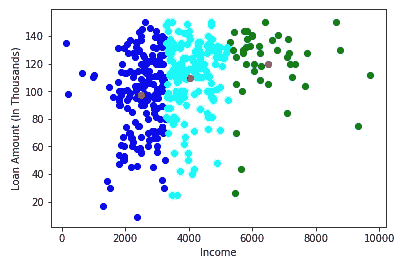

厉害！在这里，我们可以清楚地看到三个集群。红点代表每个星团的质心。我希望你现在对 K-Means 的工作原理有一个清晰的理解。

但是，在某些情况下，该算法可能无法很好地执行。让我们来看看在使用 k-means 时可能会遇到的一些挑战。

# K 均值聚类算法面临的挑战

**我们在使用 K-Means 时面临的一个常见挑战是聚类的大小不同**。假设我们有以下几点:

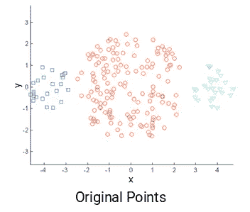

左侧和最右侧的集群与中央集群相比尺寸较小。现在，如果我们对这些点应用 k-means 聚类，结果将如下所示:

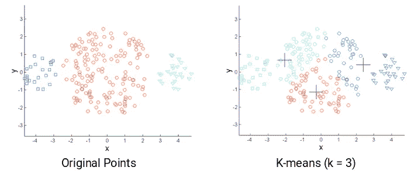

k-means 的另一个挑战是原始点的密度不同时。假设这些是原始点:

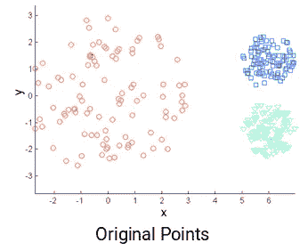

这里，红色簇中的点分散开，而其余簇中的点紧密地聚集在一起。现在，如果我们对这些点应用 k-means，我们将得到这样的聚类:

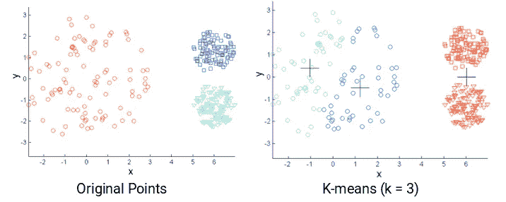

我们可以看到，紧凑点已经被分配到一个集群。而松散分布但在同一聚类中的点被分配给不同的聚类。不理想，所以我们能做些什么呢？

**解决方案之一是使用更多的集群。**因此，在上述所有场景中，我们可以使用更大的数量，而不是使用 3 个集群。也许设置 k=10 可能会导致更有意义的集群。

还记得我们如何在 k-means 聚类中随机初始化质心吗？这也有潜在的问题，因为我们可能每次都得到不同的集群。因此，为了解决这个随机初始化的问题，有一种叫做 **K-Means++的算法可以用来为 K-Means 选择初始值，或者初始聚类质心。**

# K-Means++为 K-Means 聚类选择初始聚类质心

在某些情况下，如果聚类的初始化不合适，K-Means 会导致任意坏的聚类。这就是 K-Means++有所帮助的地方。**它规定了在使用标准 k-means 聚类算法之前初始化聚类中心的过程。**

使用 K-Means++算法，我们优化了随机选取聚类质心的步骤。在使用 K-Means++初始化时，我们更有可能找到一个与最优 K-Means 解决方案相竞争的解决方案。

使用 K-Means++初始化质心的步骤是:

1.  第一个聚类是从我们想要聚类的数据点中统一随机选择的。这类似于我们在 K-Means 中所做的，但不是随机选取所有的质心，我们只是在这里选取一个质心
2.  接下来，我们计算每个数据点(x)到已经选择的聚类中心的距离(D(x))
3.  然后，以 x 与(D(x))2 成比例的概率从数据点中选择新的聚类中心
4.  然后我们重复步骤 2 和 3，直到选择了 *k* 个簇

让我们举个例子来更清楚地理解这一点。假设我们有以下几点，我们想在这里建立 3 个集群:


现在，第一步是随机选取一个数据点作为聚类质心:

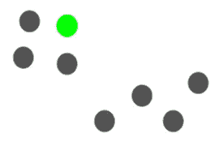

假设我们选择绿点作为初始质心。现在，我们将计算每个数据点与质心的距离(D(x)):

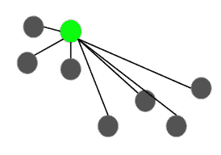

下一个质心将是其平方距离(D(x)2)离当前质心最远的那个质心:

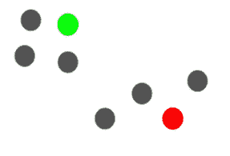

在这种情况下，红点将被选为下一个质心。现在，为了选择最后一个质心，我们将获取每个点到其最近质心的距离，并且具有最大平方距离的点将被选择为下一个质心:

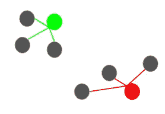

我们将选择最后一个质心为:

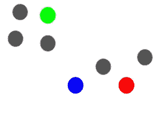

初始化质心后，我们可以继续 K-Means 算法。使用 K-Means++初始化质心有助于改进聚类。尽管相对于随机初始化，它在计算上是昂贵的，但是随后的 K-均值通常收敛得更快。

我敢肯定，有一个问题是你从本文开始就一直在想的——我们应该创建多少个集群？也就是说，在执行 K-Means 时，聚类的最佳数量应该是多少？

# K-Means 聚类中如何选择合适的聚类数？

在使用 K-Means 时，每个人都有一个最常见的疑问，那就是选择正确的聚类数。

因此，让我们来看看一种技术，它将帮助我们为 K-Means 算法选择正确的聚类值。让我们以之前看到的客户细分为例。概括地说，该银行希望根据客户的收入和债务金额对其进行细分:

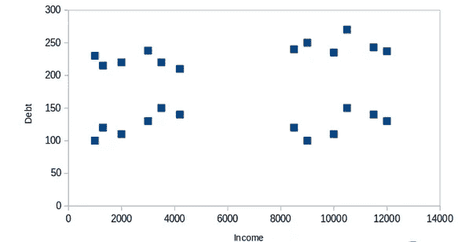

在这里，我们可以有两个群集来区分客户，如下所示:

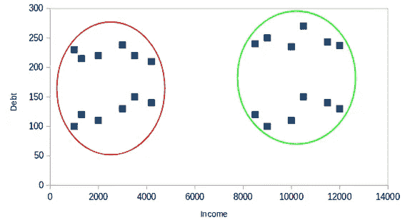

所有低收入的客户都在一个聚类中，而高收入的客户在第二个聚类中。我们也可以有 4 个集群:

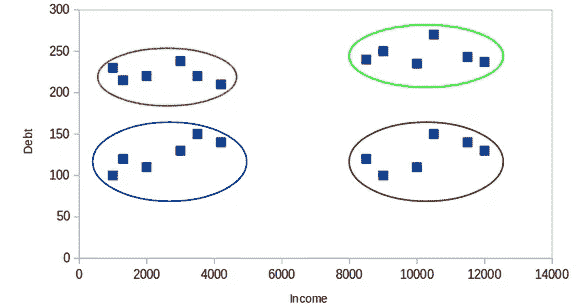

这里，一个分类可能代表低收入和低债务的客户，另一个分类代表高收入和高债务的客户，依此类推。也可以有 8 个集群:

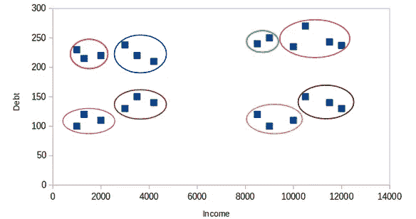

老实说，我们可以有任意数量的集群。你能猜到最大可能的集群数量是多少吗？我们可以做的一件事是将每个点分配到一个单独的簇中。因此，在这种情况下，聚类的数量将等于点或观测值的数量。所以，

> 聚类的最大可能数量将等于数据集中的观察数量。

但是，我们如何决定最佳的集群数量呢？**我们可以做的一件事是绘制一个图表，也称为肘形曲线，其中 x 轴将代表集群的数量，y 轴将是一个评估指标。**暂且说惯性吧。

您也可以选择任何其他评估指标，如邓恩指数:

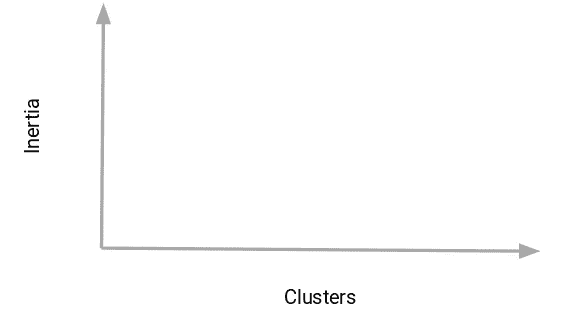

接下来，我们将从一个小的集群值开始，比如说 2。使用两个集群训练模型，计算该模型的惯性，最后绘制在上图中。假设我们得到的惯性值约为 1000:

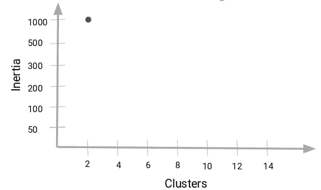

现在，我们将增加聚类数，再次训练模型，并绘制惯性值。这是我们得到的情节:

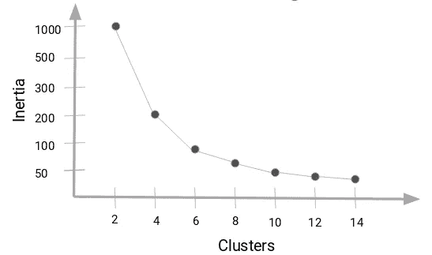

当我们将群集值从 2 更改为 4 时，惯性值急剧下降。随着我们进一步增加簇的数量，惯性值的这种减少减少并最终变得恒定。所以，

> **惯性值的减少变得恒定的聚类值可以被选择为我们的数据** *的正确聚类值。*

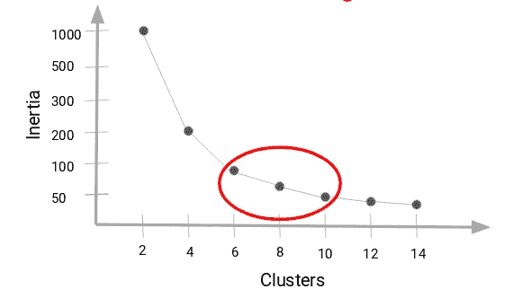

在这里，我们可以选择 6 到 10 之间的任意数量的集群。我们可以有 7 个、8 个甚至 9 个集群。**在决定聚类数量时，您还必须考虑计算成本。如果我们增加聚类数，计算成本也会增加。所以，如果你没有很高的计算资源，我的建议是选择数量较少的集群。**

现在让我们用 Python 实现 K-Means 聚类算法。我们还将看到如何使用 K-Means++来初始化质心，并将绘制肘形曲线来决定数据集的正确聚类数。

# 在 Python 中实现 K-Means 聚类

我们将研究批发客户细分问题。您可以使用[此链接](https://archive.ics.uci.edu/ml/machine-learning-databases/00292/Wholesale%20customers%20data.csv)下载数据集。这些数据存放在 UCI 机器学习资料库中。

**这个问题的目的是根据批发分销商的客户在不同产品类别(如牛奶、食品杂货、地区等)上的年度支出对他们进行细分。**那么，我们开始编码吧！

我们将首先导入所需的库:

```
# importing required libraries
import pandas as pd
import numpy as np
import matplotlib.pyplot as plt
%matplotlib inline
from sklearn.cluster import KMeans
```

接下来，让我们读取数据并查看前五行:

```
# reading the data and looking at the first five rows of the data
data=pd.read_csv("Wholesale customers data.csv")
data.head()
```

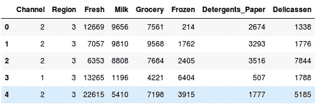

我们有顾客在不同产品上的消费明细，如牛奶、杂货、冷冻食品、洗涤剂等。现在，我们必须根据提供的详细信息对客户进行细分。在此之前，我们先来看一些与数据相关的统计数据:

```
# statistics of the data                       
data.describe()
```

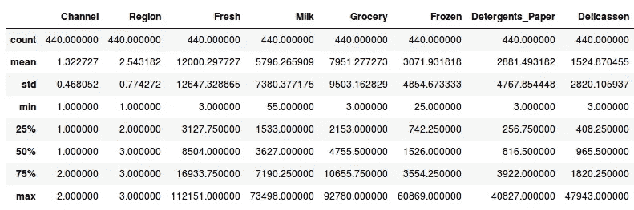

在这里，我们看到数据的大小有很大的变化。像渠道和地区这样的变量具有较低的量级，而像生鲜、牛奶、杂货等这样的变量。具有更高的量级。

由于 K-Means 是一种基于距离的算法，这种数量级的差异会产生问题。因此，让我们首先将所有变量放在同一个数量级:

```
# standardizing the data
from sklearn.preprocessing import StandardScaler
scaler = StandardScaler()
data_scaled = scaler.fit_transform(data)

# statistics of scaled data
pd.DataFrame(data_scaled).describe()
```

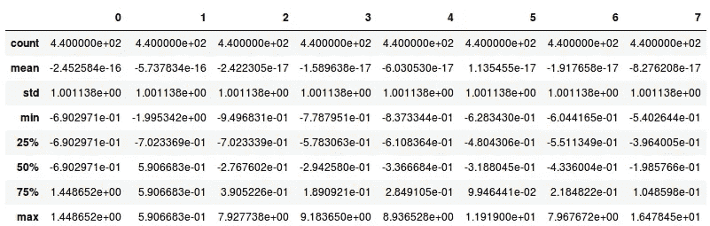

现在震级看起来差不多了。接下来，让我们创建一个 *kmeans* 函数，并对数据进行拟合:

```
# defining the kmeans function with initialization as k-means++
kmeans = KMeans(n_clusters=2, init='k-means++')

# fitting the k means algorithm on scaled data
kmeans.fit(data_scaled)
```

我们已经初始化了两个集群，请注意，这里的初始化不是随机的。我们已经使用了 k-means++初始化，它通常会产生更好的结果，正如我们在上一节中所讨论的那样。

我们来评估一下形成的集群有多好。为此，我们将计算群集的惯性:

```
# inertia on the fitted data
kmeans.inertia_
```

输出:。58660 . 68868686861

我们得到的惯性值接近 2600。现在，让我们看看如何使用肘形曲线来确定 Python 中的最佳集群数量。

我们将首先拟合多个 k 均值模型，在每个连续的模型中，我们将增加聚类的数量。我们将存储每个模型的惯性值，然后绘制它以可视化结果:

```
# fitting multiple k-means algorithms and storing the values in an empty list
SSE = []
for cluster in range(1,20):
    kmeans = KMeans(n_jobs = -1, n_clusters = cluster, init='k-means++')
    kmeans.fit(data_scaled)
    SSE.append(kmeans.inertia_)

# converting the results into a dataframe and plotting them
frame = pd.DataFrame({'Cluster':range(1,20), 'SSE':SSE})
plt.figure(figsize=(12,6))
plt.plot(frame['Cluster'], frame['SSE'], marker='o')
plt.xlabel('Number of clusters')
plt.ylabel('Inertia')
```

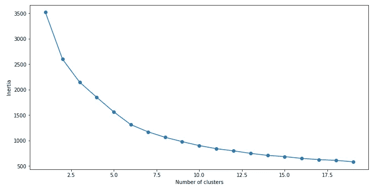

你能从这张图上看出最佳聚类值吗？看上面的肘形曲线，**我们可以选择 5 到 8** 之间的任意数量的簇。让我们将聚类数设置为 6，并符合模型:

```
# k means using 5 clusters and k-means++ initialization
kmeans = KMeans(n_jobs = -1, n_clusters = 5, init='k-means++')
kmeans.fit(data_scaled)
pred = kmeans.predict(data_scaled)
```

最后，让我们看看上面形成的每个聚类中的点的值计数:

```
frame = pd.DataFrame(data_scaled)
frame['cluster'] = pred
frame['cluster'].value_counts()
```

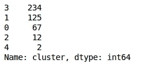

因此，有 234 个数据点属于聚类 4(索引 3)，然后有 125 个数据点属于聚类 2(索引 1)，依此类推。这就是我们如何在 Python 中实现 K-Means 聚类。

# 结束注释

在本文中，我们讨论了最著名的聚类算法之一——K-Means。我们从头开始实现它，并一步一步地观察它的实现。我们研究了在使用 K-Means 时可能面临的挑战，也看到了 K-Means++在初始化聚类质心时是如何有用的。

最后，我们实现了 k-means 并查看了肘形曲线，这有助于在 K-Means 算法中找到最佳的聚类数。

如果你有任何疑问或反馈，欢迎在下面的评论区分享。请确保您查看了全面的' [**应用机器学习**](https://courses.analyticsvidhya.com/courses/applied-machine-learning-beginner-to-professional/?utm_source=blog&utm_medium=comprehensive-guide-k-means-clustering) '课程，该课程将带您从机器学习的基础到高级算法(包括关于部署您的机器学习模型的整个模块！).

*原载于 2019 年 8 月 19 日*[*https://www.analyticsvidhya.com*](https://www.analyticsvidhya.com/blog/2019/08/comprehensive-guide-k-means-clustering/)*。*