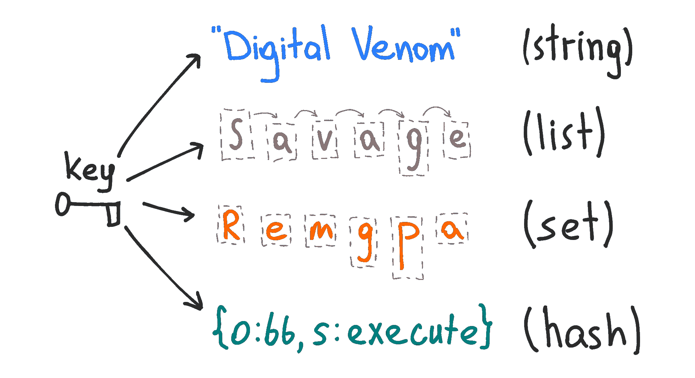

# 您必须了解的最重要的 Redis 数据结构

> 原文：<https://medium.com/analytics-vidhya/the-most-important-redis-data-structures-you-must-understand-2e95b5cf2bce?source=collection_archive---------1----------------------->

redis 数据结构

> *Redis 是一个开源的(BSD 许可的)、内存中的数据结构存储，用作数据库、缓存和消息代理。它支持数据结构，如字符串、哈希、列表、集合、带有范围查询的排序集合、位图、超级日志和带有 radius 查询的地理空间索引。*

**Redis** 是世界上**最流行的**内存数据结构服务器。为了…