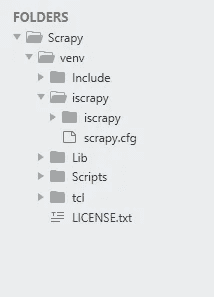
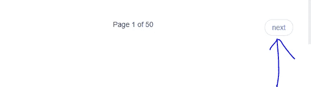
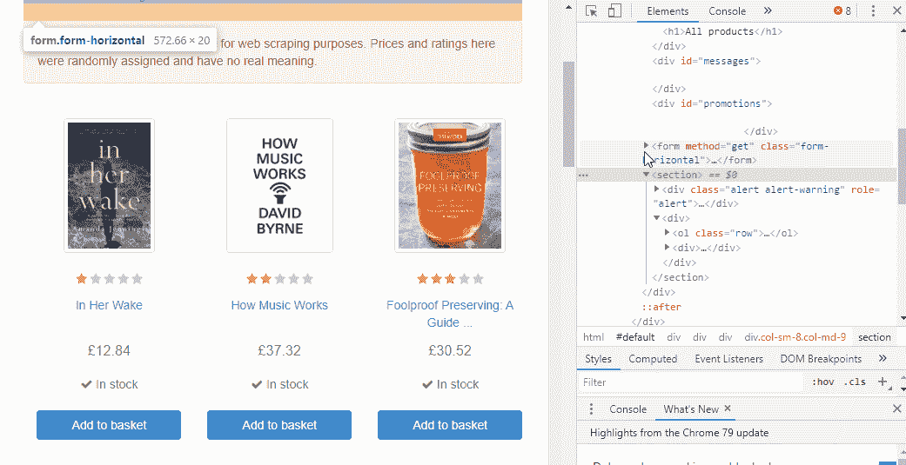
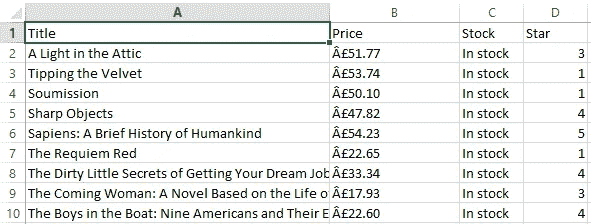

# 使用 Python Scrapy 框架的 Web 抓取背后最有见地的故事

> 原文：<https://medium.com/analytics-vidhya/the-most-insightful-story-behind-web-scraping-using-pythons-scrapy-framework-9ac0a2769fbe?source=collection_archive---------7----------------------->

Python 是一种出色的解释语言，可用于小型和大型产品。这很容易学。另外，这可以作为通向不同编程语言和框架的垫脚石。

想象一下，你被指示从一个网站上提取大量数据，你想尽可能快地完成。如果不手动访问每个网站并获取数据，你会怎么做？

嗯，“网络抓取”就是答案。网络抓取只是使这项工作更容易和更快。

在这篇文章中，您将简要了解使用 [scrapy](https://scrapy.org/) 框架进行 web 抓取，并通过一些演示项目了解如何从网站中提取数据。

# 网页抓取是如何工作的？

要了解网页抓取的工作原理，您需要遵循以下基本步骤:

1.  找到您想要抓取的 URL
2.  检查页面
3.  查找要提取的数据
4.  写代码
5.  运行代码并提取数据
6.  以要求的格式存储数据

# 为什么是 Scrapy？

我知道你在想:

> 为什么我要用 Scrapy 而不是一些很酷的库比如 [BeautifulSoup](https://www.crummy.com/software/BeautifulSoup/) 和 [lxml](http://lxml.de/) ？

是啊！如果您觉得使用 BeautifulSoup 或 lxml 更舒服，您可以轻松地使用它们。BeautifulSoup 和 lxml 是用于解析 HTML 和 xml 的库。Scrapy 是一个用于编写网络蜘蛛的应用程序框架，可以抓取网站并从中提取数据。毕竟，它们只是解析可以从任何 Python 代码导入和使用的库。

换句话说，把 BeautifulSoup 或 lxml 比作 Scrapy 就像把 [jinja2](http://jinja.pocoo.org/) 比作 [Django](https://www.djangoproject.com/) 。

# 刮的时间到了

## 创建新目录来存储项目文件:

首先，我们需要创建一个包含我们所有作品的文件夹。从开始菜单打开 anaconda 提示符，然后进入桌面目录:

将目录名设为 Scrapy。

## 创建虚拟环境

为我们的项目创建一个虚拟环境总是一个好主意。您可以按照以下步骤创建自己的虚拟环境:

这将在 Scrapy 文件夹中创建一个新文件夹。您可以使用“dir”命令来检查它。要在 Windows 上激活 virtualenv，激活脚本位于脚本文件夹中:

让我们在虚拟环境中安装 Scrapy。

这将在虚拟环境中安装所有必需的软件包。

在你开始刮之前，你必须建立一个新的刮项目。输入要存储代码的目录，然后运行:

这将在`project_dir`目录下创建一个零碎的项目。

## 生成一个蜘蛛

蜘蛛是你定义的类，Scrapy 用它从网站上抓取信息。

在本文中，我们将废弃一个演示[网站](http://books.toscrape.com/)。

您可以从项目内部使用`scrapy`工具来控制和管理它们。

例如，创建一个新的蜘蛛:

## 写一个[蜘蛛](https://docs.scrapy.org/en/latest/topics/spiders.html#topics-spiders)来抓取一个站点

运行上述命令后，它将在 spiders 文件夹中创建一个 is Thespider.py 文件。

这是我们的目标文件，我们将在其中编写 python 代码来提取数据。

现在我们需要做一些事情。首先，我们需要在 start_urls 中给出正确的 URL。为此，请点击页面底部的“下一步”,转到网站的第二页。

之所以转到第 2 页，是因为，它显示了网站的完整网址。

[http://books.toscrape.com/catalogue/page-2.html](http://books.toscrape.com/catalogue/page-2.html)

现在把这个网址放在 start_urls 上。你可以这样改变页码来询问要刮多少页:

我们需要将信息存储在某个地方，因此我们将定义一个名为“data”的空字典。

示例:

数据= {}

现在回到网站，选择您想要使用 web inspect element 废弃的元素。

## 在表格中循环

一页有 20 本书。所以我们应该用一个循环来遍历它。但是我们通过什么循环呢？如果我们检查整行，我们会看到所有的 books 表都在

…

所以我们的循环应该找到每个标签，然后获取内容。

现在让我们按 HTML 元素提取数据，如下所示:

对于开始评级，我们需要给每一个不同的值。

在我们的例子中，我们可以定义一个字典，并将它作为我们自己的字典，以便更有效地存储开始评级，如下所示:

'一':1，'二':2，'三':3，'四':4，'五':5

如此接近，现在让我们从网站上抓取数据。使用下面的命令开始爬行。

这将生成一个包含书名、价格、可用性状态和星级的 CSV 文件。

我已经废弃了另外两个资源的数据。

1.  [http://quotes.toscrape.com/](http://quotes.toscrape.com/)
2.  [https://www.flipkart.com/](https://www.flipkart.com/)

在 [**找到代码 GitHub**](https://github.com/ishritam/Web-Scraping-using-Python-s-Scrapy-Framework) 。

恭喜你。您刚刚在技能列表中添加了一项新技能。现在，是时候去一些合法的网站来获得这项技能了。

# 参考:

【https://docs.scrapy.org/en/latest/index.html 