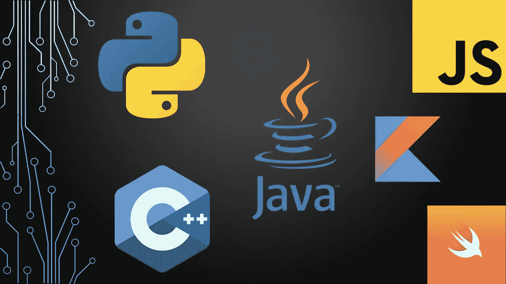
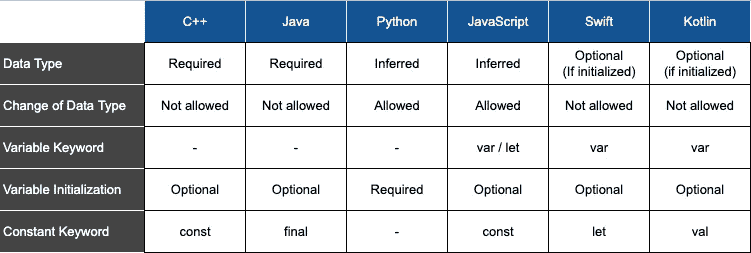

# 多语言开发者——用 6 种编程语言定义变量和常量

> 原文：<https://medium.com/analytics-vidhya/the-multilingual-developer-defining-variables-and-constants-in-6-programming-languages-c5a58ea72616?source=collection_archive---------12----------------------->



在这个系列中，我将记录 6 种最流行的编程语言之间的区别。这 6 种语言是 C++、Java、Python、JavaScript、Swift 和 Kotlin。如果您已经熟悉这些语言中的一种或多种，本系列可以让您更容易地学习其他语言，了解它们与您已经知道的语言有何不同和匹配。

现在，让我们从基础开始。让我们从探索如何在每种语言中定义变量和常量开始。

# C++

为了在 C++中定义一个**变量**，我们使用数据类型，后跟变量名和可选的初始值*。例如，要定义一个名为`x`的变量，类型为`int`(整数)，初始值为`5`，我们使用:*

```
int x = 5;
```

像在*几乎*每种语言中一样，初始值在变量定义中是可选的，这意味着下面的定义也是正确的:

```
int x;
```

在 C++中，即使变量被初始化，数据类型也是必需的。然而，C++11 引入了关键字`[auto](https://en.cppreference.com/w/cpp/language/auto)`来减轻显式指定数据类型的需要，如果可以从初始值推断出数据类型的话。例如，上面的例子可以用关键字`auto`重写为:

```
**auto** x = 5;  // int data type is inferred
```

请注意，在这种情况下仍然需要单词`auto`。以下内容不能用于 C++中的变量定义，会导致编译错误，指出变量未定义。

```
x = 5;
```

要在 C++中定义一个**常量**，我们只需在定义前添加`const`关键字，如下所示:

```
**const** int x = 5;
```

# Java 语言(一种计算机语言，尤用于创建网站)

在 Java 中，我们定义变量**的方式和在 C++中一样:**

```
int x = 5;
```

同样，数据类型是必需的，但初始化是可选的。

然而，为了定义一个**常量**，我们在定义前添加了`final`关键字:

```
**final** int x = 5;
```

# 计算机编程语言

与 C++和 Java 不同，Python 不需要数据类型。数据类型总是从初始值中推断出来。为了在 Python 中定义一个**变量**，我们简单地初始化它:

```
x = 5
```

此外，通过将变量赋给不同类型的新数据，可以在代码的不同部分之间改变变量的数据类型。Python 中允许以下内容:

```
x = 5           # x is an integer# Some Codex = "Hello"     # x is now a string
```

显然，变量的初始化在 Python 中是必需的，因为初始化实际上是定义。否则，您将只有变量名，这将导致错误，因为变量没有定义。

另一方面，Python 不支持常量。也就是说，没有办法告诉解释器不允许变量的重新赋值。为了定义一个**常量**，开发人员依靠命名约定来避免意外更改常量的值，方法是对变量使用 camelCase 名称，对常量使用 ALL_CAPS 名称:

```
**X** = 5
```

Python 3.8 引入了`[typing.Final](https://docs.python.org/3/library/typing.html#typing.Final)`来指示类型检查器，如 [mypy](http://mypy-lang.org/) ，名称不能被重新赋值。然而，根据文件，它*并不妨碍重新分配*:

> 这些属性没有运行时检查。详见 [PEP 591](https://www.python.org/dev/peps/pep-0591) 。

下面的代码会正常运行，但是类型检查器会报告一个错误。

```
from typing import FinalX**: Final** = 5X = 3    # error reported by type checker
```

# Java Script 语言

JavaScript 有两个关键字用于定义一个**变量**，即`let`和`var`。这两个关键字的主要区别在于定义变量的范围，即`let`定义了一个块范围的局部变量。变量的数据类型是从变量的值中推断出来的，但是初始化是可选的。以下任何定义都是可以接受的。

```
**let** x;**let** x = 5;**var** x;**var** x = 5;
```

与 Python 类似，可以通过将变量重新赋值为不同类型的值来更改变量的数据类型。

```
x = 5           // x is an integer/*  Some Code  */x = "Hello"    // x is now a string
```

为了定义一个**常量**，我们使用了`const`关键字，当然，在这种情况下需要初始化。

```
**const** x = 5;
```

# 迅速发生的

在 Swift 中，`var`关键字用于定义一个**变量**。如果变量是初始化的，那么数据类型是可选的，可以从值中推断出来。

```
**var** x = 5
```

如果变量未初始化，则必须按如下方式提供数据类型:

```
var x: **Double**
```

为了定义一个**常量**，我们使用了`let`关键字:

```
**let** y = 4
```

# 科特林

最后但同样重要的是，Kotlin 使用关键字`var`和`val`分别定义变量和常量。

```
**var** x = 5     // variable**val** y = 3     // constant
```

与 Swift 类似，如果变量已初始化，则数据类型是可选的，否则是必需的:

```
var x: **Int**
```

# 摘要

下表总结了 6 种语言在定义变量和常量时的比较。



6 种语言中的变量和常量定义