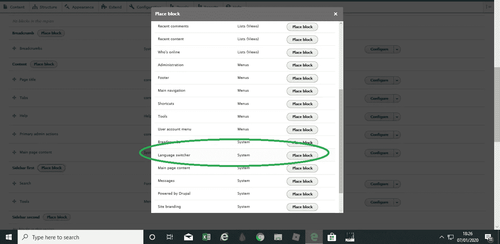

# 多语言功能——语言不再是 Drupal 8 的障碍…

> 原文：<https://medium.com/analytics-vidhya/the-multilingual-functionality-language-is-no-longer-a-barrier-with-drupal-8-dce52182068a?source=collection_archive---------12----------------------->

# 简介；

不同的语言

在本教程中，我们将看看 **Drupal-Core 多语言模块**。这个模块基本上允许建立支持**不同人类语言**的网站，如英语(通常是默认语言)、法语、印地语、中文、德语等。

因此，相同的内容可以用不同的语言观看，从而促进了全球对任何活动领域的理解。

例如，电子商务网站可以使用这种令人难以置信的模块以多种语言显示其网站内容，从而增加其客户群。

团结世界

总而言之，很明显这个模块真的很有用，可以帮助一个网站的开发者和用户…

在进一步延迟之前，让我们看看如何安装、配置和使用 Drupal-Core 多语言模块。

# 安装过程；

**注意；我亲自在 Drupal 8(在 Pantheon 上)的一个新安装上安装了这个模块，我使用英语作为我的默认语言，如下所示；**

选择英语作为我的默认语言

安装 drupal 后，我按照以下步骤安装模块。

页（page 的缩写）s；本教程并不局限于 Pantheon 上的 Drupal 安装，它同样适用于 Drupal 8 的本地主机安装。

以下是我遵循的步骤；

> **启用该模块；**

鉴于这是一个 Drupal 核心模块，没有必要单独下载。它可以直接在您页面的`admin/modules/`部分找到…

因此，要启用它，请前往`admin/modules/`并查找“多语言”，如下所示；

核心多语言模块

如您所见，有四个模块需要启用。

让我们快速看一下这些模块的功能(升序)；

1.  **语言-** 这提供了最基本的核心功能，允许在同一站点上安装多种语言
2.  **接口翻译-** 这基本上允许你翻译代码中的文本。例如，在模块或主题中找到的文本。
3.  **上下文翻译-** 这允许翻译所有类型的内容，包括节点、分类、块等等
4.  **配置翻译-** 这个挺直接的。它允许翻译所有的 Drupal 配置文本。

现在您已经了解了每一项的意义和目的，请启用所有四项…

所有四个模块都已启用

一旦完成，您就可以继续进入下一个级别**‘配置阶段……**

# **配置阶段；**

**在 Drupal 站点上安装好模块后，继续进行配置。**

**首先前往`admin/config`，查找“区域和语言”，如下图；**

****

**区域和语言**

**所有关于 Drupal-Core 多语言模块的配置都将在这里完成。**

**为了**易于理解**，我们将分别查看高效配置所需的主要组件；**

> ****语言；****

**该部分进一步分为如下所示的“**列表**和“**检测选择**”；**

****

**语文科**

****列表；****

**在列表`list/languages`中，你可以添加任何你希望你的网站使用的语言。(除了默认语言)**

**默认情况下，只有一种语言**被选为 Drupal 安装时的默认语言(在我的例子中是英语，正如你在上面看到的)****

**要添加新语言，只需点击“**添加语言**”按钮，您将有 100 多种语言可供选择，如下所示；**

****

**选择语言。**

**如果列表中没有您想要的语言，您可以选择创建一个**自定义语言**。**

*****下面我会告诉你怎么做****；***

****检测和选择；****

**本节将允许您配置在任何时间点加载特定页面时应该使用的语言。**

**配置选项如下所示:**

****

**检测和选择**

**正如你所看到的，URL 和选择的语言对我来说已经足够了。基本上，这两个设置完成了以下工作:**

****URL-** 它查看 URL 路径并确定应该加载哪种语言。比如增加**。对 URL 路径的 fr 通常意味着加载法语。下面我们就来仔细看看**下面的那个**。****

****选定语言**；—这一个基于用户语言选择加载语言**

**页（page 的缩写）s；您应该根据您的需要和要求选择这些配置设置中的任何一个**

**例如，启用**浏览器**设置会以我当前使用的浏览器的相同语言加载我的网站页面(假设 url 路径没有添加语言前缀)…但是这不适合我，我没有添加。**

> ****内容语言和翻译；****

**这是配置选项的另一部分。这个部分主要处理*内容类型*、*分类词汇表*、*用户配置文件*的语言设置，或者您站点上任何其他受支持的元素。**

**例如，如果您希望文章是可翻译的，您应该首先启用内容，然后启用文章，如下所示；**

****

**启用内容和文章**

**上述配置设置将允许我的文章是可翻译的…**

> ****用户界面翻译和配置翻译****

**用户界面翻译用于定制翻译文件的导入和/或定制界面翻译**

**另一方面，配置翻译用于翻译站点上所有具有可翻译文本的配置项，如站点名称、角色名称等。**

**这基本上是你应该知道能够配置多语言模块…**

# **建立我的多语言网站；**

**现在你知道了如何使用配置设置，让我们快速看一下我使用 Drupal 构建一个简单的多语言站点的**配置**和**步骤**；**

> ****我的配置；****

****语言；****

**首先，我添加了 2 种现有的额外语言，即**法语**和**印地语**，如下所示；**

****

**添加法语和印地语**

**概括地说，百分比数字代表了实际上已经被翻译成所需语言的界面数据的百分比。**

****注；印地语和法语之间的界面翻译差异仅仅是因为 Drupal 拥有更大的法语“数据库”,因为更多的用户贡献了法语而不是印地语…换句话说，需要更多的志愿者来贡献印地语 xD****

**我还添加了一种自定义语言，即“毛里求斯克里奥尔语”，因为它不在语言选项列表中。**

**页（page 的缩写）s；毛里求斯克里奥尔语是我们在我国毛里求斯常用的语言。它的写作是非常有限的，但并不流行。**

**要添加自定义语言，只需点击“添加语言”，选择自定义语言并指定详细信息，如下所示；**

****

**设置毛里求斯克里奥尔语**

**一旦我完成了设置我的**语言配置**，它看起来如下；**

****

**语言配置集**

****注；我添加了毛里求斯克里奥尔语，但是网站的 0%已经被翻译成那种语言，因为 Drupal 没有关于那种语言的信息。****

**我对克里奥尔语的“书面”了解也非常有限，因为在毛里求斯我们主要使用法语和英语作为“书面语言”。**

****我加了一个自定义语言，主要是为了试验****

**我的内容语言和翻译配置**；****

**我没有改变任何东西，只启用了内容(文章)的翻译，正如你在上面的图片中看到的。**

> ****放置语言切换器块****

**该模块用于在已配置的语言之间切换。**

**要设置该块，进入`admin/structure/block`，选择要添加块的区域，点击放置块…如下图；**

****

**添加语言切换器块**

**这就是添加语言切换器块的方法。我先把它放在了**侧边栏。****

> **创建一些内容**

**我开始创建一些内容类型(文章),并使用如下所示的文本进行翻译；**

****

**创建内容类型**

**创建一些内容类型，点击翻译(绿色圆圈)，选择你想把这个**内容**翻译成的语言，添加翻译文本，你就可以开始了；**

****

**法语也是一样**

**页（page 的缩写）s；我用和我提到的**相同的步骤**创建了更多的**内容**，最后在我的主页上测试；**

**英文页面；**

****

**英文页面**

**法文版；**

****

**法语页面**

**印地语页面；**

****

**印地语页面**

**有用！！！**

**就是这样，我就是这样安装了 **Drupal-Core 多语言模块，**对其进行了配置，并使用它构建了一个简单的**多语言站点****

**注意；当我测试完 **Drupal-Core 多语言模块后，**我修改了我的内容并安装了一个主题。**

**页（page 的缩写）s；起初，我使用了 **slick -carousel** 模块，但是它没有给出我期望的结果……因此我安装了一个主题并对其进行了定制，以便建立我的网站**

# **综上所述；**

**我觉得这个模块真的很不可思议，很有用。我希望你们也会喜欢使用它。**

**此外，这个任务帮助我结合了我以前获得的许多技能…简而言之，我利用了我通过做许多不同的任务获得的许多背景知识，并能够制作这个关于我的国家的网站…**

**谢谢你的阅读。说完了，再见，祝你旅途愉快…**