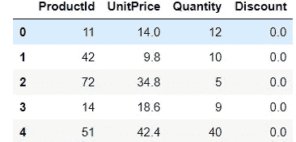
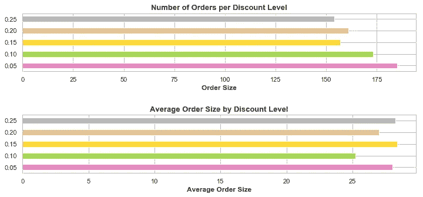
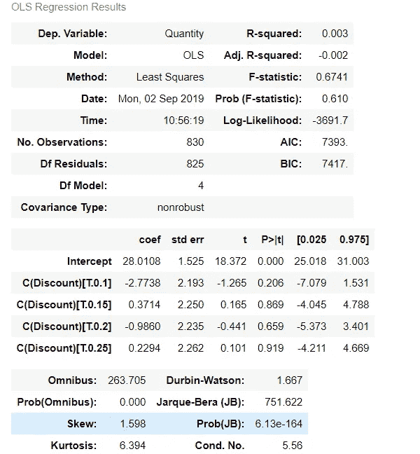
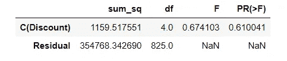

# 多重比较问题

> 原文：<https://medium.com/analytics-vidhya/the-multiple-comparisons-problem-11482dd08197?source=collection_archive---------18----------------------->

## 使用 Northwind 数据库了解问题以及如何避免


在 [Unsplash](https://unsplash.com?utm_source=medium&utm_medium=referral) 上由 [Austin Distel](https://unsplash.com/@austindistel?utm_source=medium&utm_medium=referral) 拍摄的照片

想象以下场景:你是一名数据科学家，被要求协助一家公司更好地了解其业务的不同方面。这可能包括员工绩效、产品销售和客户人口统计。你的工作是进行实验，尽可能多地从结果中学习，并提出商业建议。

通常，这是通过定义几个有用的指标或细分来实现的。这两种策略都有助于你更好地了解企业。在细分的情况下，您可以运行统计分析来发现重要的发现。这意味着深入挖掘以获得更好的见解。然而，这样做的代价很高，因为你做的比较越多，就越有可能得出错误的结论。这是一个常见的错误，被称为**多重比较**问题。在这篇文章中，我将强调这个问题是如何影响你的统计分析的，以及纠正它的技巧。

**北风数据库**

对于这个项目，我使用了 Northwind 公司的数据库来获得一些有价值的商业见解。Northwind 数据库是 Microsoft 为一家虚构的专门从事食品和饮料分销的公司创建的示例数据库。该数据库包含一系列关于公司活动的信息，包括其客户、产品、订单和客户统计数据。我对理解折扣如何影响订单很感兴趣。所以，我决定问的一个问题是:

## 折扣如何影响订单数量？

这个问题突出了一个多重比较的例子，因为您需要比较不同的折扣级别并多次执行相同的分析。

**陈述假设**

为了回答这个问题，我首先需要创建两个假设:零假设和替代假设。

零假设:折扣水平不影响订单数量

替代假设:折扣水平确实会影响订单数量(增加或减少订单数量)

alpha 水平(当假设为真时拒绝零假设的概率)设置为 0.05。

**获取数据**

既然我们已经设置了假设和 alpha 值，我们可以从下面的模式中提取相关数据:

[https://raw . githubusercontent . com/learn-co-students/DSC-mod-3-project-online-ds-pt-041519/master/north wind _ ERD _ updated . png](https://raw.githubusercontent.com/learn-co-students/dsc-mod-3-project-online-ds-pt-041519/master/Northwind_ERD_updated.png)

为了回答这个问题，我需要从上面模式的订单细节表中提取产品 id、折扣、单价和数量

```
#import relevant libraries
import sqlite3
import pandas as pd
import numpy as np
import matplotlib.pyplot as plt
from matplotlib.dates import DateFormatter
import matplotlib.dates as mdates
from statsmodels.graphics.factorplots import interaction_plot
import seaborn as sns
import scipy.stats as stats
import statsmodels.api as sm
from statsmodels.formula.api import ols
from statsmodels.stats.multicomp import pairwise_tukeyhsd
from statsmodels.stats.multicomp import MultiComparison
from statsmodels.stats.power import TTestIndPower, TTestPower
import warnings
warnings.filterwarnings(‘ignore’)
import scipy as sp#connect to database
conn = sqlite3.connect('Northwind_small.sqlite')
c = conn.cursor()#create list of tables
c.execute("""SELECT name from sqlite_master WHERE type = 'table';""")
tables = c.fetchall()
tables = [i[0] for i in tables]c.execute("""SELECT ProductId, UnitPrice, Quantity, Discount FROM OrderDetail""")
discounts = pd.DataFrame(c.fetchall())
discounts.columns = [column[0] for column in c.description]
discounts.head()
```



图 1:折扣数据框架

接下来，我需要检查是否有折扣:

```
query = 'DiscBool != 0' #removing the non-discounted orders
discounted = discounts.query(query)
discounted.head(3)
```

因为这个问题与折扣级别有关，所以我检查了折扣级别的数量。仔细研究后，我发现大多数折扣都在 0 到 25 之间，幅度为 0.05。这些订单数量保持不变，而其他较小的折扣级别则有所下降。

**探索数据**

现在，相关数据已经被正确提取和分组，我可以开始研究它了。下面的代码块显示了打折订单和未打折订单之间的订单数量和平均订单规模的图表:

```
#Viewing difference between discount levels against number of orders and average order size visually
#fig, axes = plt.subplot(1, 2, figsize = (12,5))
fig, axes = plt.subplots(2, 1, figsize=(12,5))
sns.set_style('whitegrid')
#Grouping dataframe
discounted.groupby(['Discount'])['Quantity'].count().plot(kind = 'barh', ax = axes[0], color=['#E78AC3', '#A6D854', '#FFD92F', '#E5C494', '#B3B3B3', '#66C2A5'])
discounted.groupby(['Discount'])['Quantity'].mean().plot(kind = 'barh', ax = axes[1], color=['#E78AC3', '#A6D854', '#FFD92F', '#E5C494', '#B3B3B3', '#66C2A5'])
#Plot 1 labels
axes[0].set_title('Number of Orders per Discount Level', fontweight = 'bold', fontsize = 13)
axes[0].set_xlabel('Order Size', fontweight = 'semibold')
axes[0].set_ylabel('')
axes[0].set_yticklabels(['0.05', '0.10', '0.15', '0.20', '0.25'])#Plot 2 labels
axes[1].set_title('Average Order Size by Discount Level', fontweight = 'bold', fontsize = 13)
axes[1].set_xlabel('Average Order Size', fontweight = 'semibold')
axes[1].set_ylabel('')
axes[1].set_yticklabels(['0.05', '0.10', '0.15', '0.20', '0.25'])
fig.subplots_adjust(hspace = .75);
fig.savefig('discountlevels.png', bbox_inches = 'tight')
```



图 2:不同折扣级别的图表

图表显示，不打折的商品越多，订单数量越多，但打折商品的平均订单规模也越大。

**假设检验**

为了回答折扣是否影响订货量的问题，使用了方差分析。ANOVA 或方差分析生成多个组的统计分析。

```
#fitting using statsmodels ols
lm = ols('Quantity ~ C(Discount)', discounted).fit()
lm.summary()
```



图 3:折扣级别的方差分析表

上表显示了不同折扣级别的 p 值。下一步是进行 Tukey 测试。Tukey 检验是一种单步统计检验，用于找出彼此显著不同的均值。对于多重比较，我们需要为不同的折扣级别创建数据框。

```
#ANOVA analysis to test multiple comparisons test
sm.stats.anova_lm(lm, typ = 2)
```



图 4: Tukey 表结果

结果表给出了所有折扣级别的组合对，以进行比较，并给出了平均差异以及该平均差异是否拒绝了零假设或未能拒绝零假设。在 Northwind 项目的例子中，我发现在大多数情况下，产品定价的折扣水平不会影响订单数量。这些折扣有可能对收入产生负面影响。

**结论**

在进行统计分析或检查研究时，多重比较问题是一个需要牢记的重要问题。因为如果我们足够努力地寻找，我们可能会在不存在相关性的地方发现相关性。人类非常善于发现模式，并可能犯在随机噪音中发现意义的错误。从商业角度来看，意识到这一点意味着更仔细地分析索赔，并做出更理性的决策。