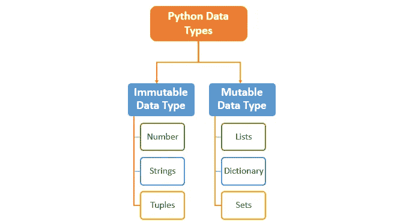

# Python 的可变性问题

> 原文：<https://medium.com/analytics-vidhya/the-mutability-question-with-python-582c5fbe3b35?source=collection_archive---------15----------------------->

## 可变或不可变的对象，为什么？


python 中的对象分为两种类型: ***可变*** 和 ***不可变*** 。为了更好地理解它们的含义和它们之间的区别，让我们介绍一些基本的工具和概念。

## **I. Id 和类型**

*   **id :** 一个对象 Id 或 ***identity*** 是对象在内存中的地址，一旦创建就唯一且不可更改，Python 为我们提供了函数***【Id()’***，返回一个对象的身份，以及一个 Id 的比较工具***‘is’***。(注意， ***'是'*** 通常与逻辑符号 ***'=='*** 混淆，而它们没有相同的效果，第二个比较被拖对象的 ***值*** ，而 ***'是'*** 比较它们的 id)
*   **类型:**每一个物体都有其唯一不变的类型，它回答了这样的问题:这个物体有大小吗？一个长度？解析器？长度计算器？嗯，我们确信它有一个类型支持关于对象的所有数据。Python 给了我们“type()”函数，它打印出一个对象的类型。

## 二。可变对象

简单地说，可变对象是指在创建后可以改变的对象。在 Python 中，我们计算 3 种不同的可变对象:

**。列表:**顾名思义，列表类型是不同类型对象列表。我们可以访问一个列表，删除一个元素，添加一个元素或者改变一个现有元素的值(因为列表的元素通常是不可变的，所以我们在内存中创建了另一个对象，而没有修改现有的对象)，这要感谢它的可变特性。在下面的示例中，我们可以看到适用于列表的不同操作:

```
>>> my_list = [1, 2, 3]
>>> my_list.append('string')
>>> my_list.pop(my_list[0])  #this operation deletes the element                  from the list and not from the memory as my_list[0] is int : an immutable object
>>> my_list
[2, 3, 'string']
```

**。字典是一个无序的、可变的和有索引的集合。在 Python 中，字典是用花括号写的，它们有键和值。**

**。集合:**集合是一种无序的集合数据类型，它是可迭代的、可变的并且没有重复的元素。

## 三。不可变对象

不出所料，Python 中的不可变对象是一个不可改变的、不可到达的对象，我们不能访问它从而修改它。换句话说，修改这个对象的值会导致为另一个对象分配空间。我们认为 Python 中有 3 个不可变对象:

*   **Int :** 整数存储数值。这里有一个我们应用这个概念的简单例子:

```
>>> x = 55
>>> id(x)
94000217707880
>>> x = 18
>>> id(x)
140060181730800
```

正如我们注意到的，对先前创建的对象进行更改会导致创建另一个具有另一个 id 的对象。

*   **元组:**我们可以说 Python 中的元组是列表的不可变版本，因为它们几乎是相同的东西，除了元组是不可变的，并且是用圆括号而不是方括号创建的。
*   **字符串:**字符串只是一系列不可改变的字符，因此在 Python 语言中是不可变的。



## 四。为什么这很重要，Python 对待可变对象和不可变对象有什么不同:

*   这很重要因为程序员有他自己的理由创建不可改变的对象，以防止它们被修改，从而创建不可改变的对象，或者创建其他大小和元素可变的对象，从而选择可变的对象，换句话说，上下文使我们做出的选择有意义。
*   **Python 如何处理它们:**我们已经介绍了“is”和“==”操作符，这将有助于我们了解 Python 处理这两种类型对象的不同方式。事实上下面的例子解释了很多:

```
>>> string_1 = "immutable"
>>> string_2 = "immutable"
>>> string_1 == string_2
True
>>> string_1 is string_2
True
```

这里我们注意到 string 类型的不可变对象有两个指针；string_1 和 string_2 都指向内存中的同一个位置。事实上，使用 id()函数会得到相同的整数。

而在下一个例子中，我们看到了相反的情况:

```
>>> list_1 = [1, 2, 3]
>>> list_2 = [1, 2, 3]
>>> list_1 == list_2
True                       #the tow lists share the same value
>>> list_1 is  list_2      # But they point to different locations
False
```

## 动词 （verb 的缩写）参数如何传递给函数，这对可变和不可变对象意味着什么

在这一部分中，我们将看到每当我们对别名(分配给对象的标签)进行更改时，对象的可变性质是如何影响原始对象的:

```
>>> list_1 = [1, 2, 3]
>>> list_2 = list_1
>>> list_2.pop(list_2[0])
>>> list_1
[2, 3]
```

方法 pop(本例中是类 list 的函数)能够对原始对象 list_1 进行更改，这是因为我们将一个位置地址传递给了函数 pop()，这是 list_1 所在的位置，因此更改将发生在第一个 list 及其所有别名上，因为它们实际上只是指向它。

另一方面，不可变对象如果赋给另一个变量，将永远不会改变，因为与可变对象相反，这里我们处理的是原始对象的副本，因此是一个完全不同的内存位置，传递给函数 Python 将创建一个相同值的新对象，并对其进行更改。