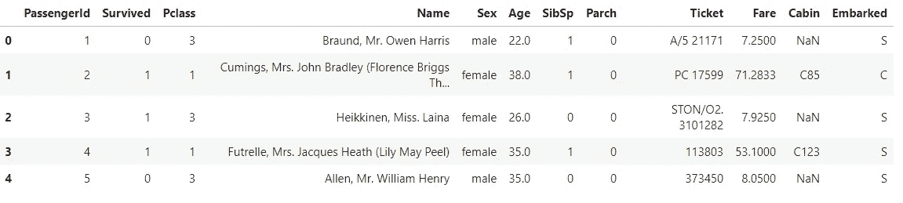
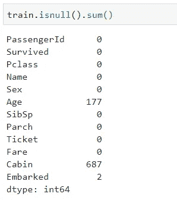
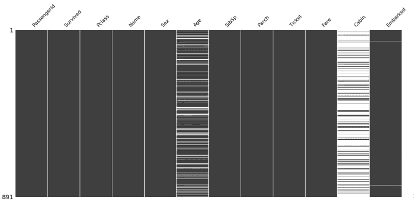
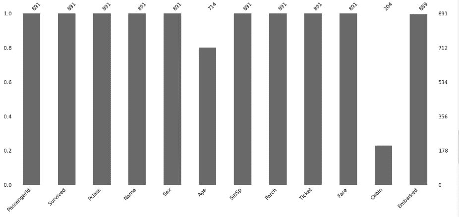

# 丢失数据之谜

> 原文：<https://medium.com/analytics-vidhya/the-mystery-of-missing-data-d80e4c118031?source=collection_archive---------18----------------------->

*这不是模型的问题，而是我们提供了什么(数据)。秘密就在里面。*


缺失数据

在现实世界中，我们遇到的数据并不像我们预期的那样美好。它将包含一些丢失的值。因此，在进行任何分析之前，我们需要删除这些丢失的值(实际上不是通过删除这些条目来删除，而是实际处理它们，删除这些条目可能是我们想要选择的最后一个选项)。

处理缺失数据的方法有很多，但在此之前，我们需要识别缺失数据，在此之前，我们需要知道什么是缺失数据。所以我们的第一个问题是:

# **什么是缺失数据，为什么我们会关心它？**

在捕获数据时，有时可能会发生数据未被捕获的情况。现在，这可能是由于损坏的数据、从源提取数据时的失败或任何其他故障而发生的。这可能导致数据缺失，称为**缺失数据。**

人们常说，数据越漂亮，模型就越精确(这里的漂亮是指好的数据)。因此，如果我们提供给模型的数据不完整，那么模型将无法捕捉数据的全部关键，因此我们的模型将是差的。因此，我们关心我们给模型的数据。

# 我们如何识别缺失的值？

有多种方法可以识别缺失值:

*   ***使用 df.isnull()或 df . ISNA()****——这两种方法会给出相同的结果。*

我们将使用巨大的数据集来演示例子。

```
train = pd.read_csv('data/train.csv')
train.head()
```



```
train.isnull().sum()
```



所以我们可以看到年龄，客舱和登船栏有缺失值。

*   ***使用缺失无库:***

```
# Use pip install missingno to install this library
import missingno as msnomsno.matrix(train)
```



在该图中，白线表示缺失值。

```
msno.bar(train)
```



上图显示了一个双轴图，左边显示了从 0 到 1 的比例，右边显示了行号。年龄列的值为 0.8，即 80%不为空，891 个值中有 741 个值。客舱列有 20%的值，即 80%为空值，891 个值中有 204 个值。

# **如何处理这些缺失值？**

有不同的技术来处理缺失值:

1.  **插补:**

估算值有不同的方法:

*   ***传统的 df.fillna()方法。***

在这种情况下，我们用一些值(通常是平均值、中值或众数)替换缺失值。

```
train.Age.fillna(value= train.Age.mean())
```

这将通过平均值替换年龄列中缺少的值，类似地，我们可以用众数和中位数替换。

我们也可以使用插值来填充缺失的值。

```
train.Age.fillna(method= 'ffill')
```

`'ffill'`代表“向前填充”并将上一个有效观察向前传播到下一个有效观察。另一个选择是`'bfill'`，它以同样的方式工作，但方向相反。

*   ***使用简单估算器。***

```
from sklearn.impute import SimpleImputer

# Using SimpleImputerfunction to replace NaN 
# values with mean of that parameter value 
imp=SimpleImputer(missing_values=np.NaN, strategy="mean" )
train['Age']=imp.fit_transform(train[["Age"]]).ravel()
```

在这里，您可以自由选择任何策略，即均值、中值等。

**2。创建独特的类别:**

我们也可以创建一个单独的类别。例如，对于客舱栏，我们可以创建一个新类别“未知”。我们正在为缺失值创建一个单独的类。我们可以乘坐*列车。Cabin.fillna('unknown')* 创建这个单独的类别。

**3。预测缺失值:**

我们可以使用机器学习算法来预测丢失的值。例如，在我们的例子中，我们可以使用线性回归来预测“年龄”。我们可以尝试不同的算法，并检查哪种算法的精确度最高。

**4。删除整列:**

如果我们遇到一个场景，其中大多数值为空(大多数的定义因人而异)，例如，如果一个列有超过 75%的值为空，那么保留该列就没有意义。在这种情况下，我们应该删除列。

总而言之，

我们将遇到的大多数数据集都有缺失值，使用智能的方法来处理这些缺失值将会产生一个准确而健壮的模型。拥有良好的领域知识也有助于我们决定如何处理这些缺失的价值。

欢迎在下面留下你的评论或问题，或者你可以在 Linkedin 上找到我。