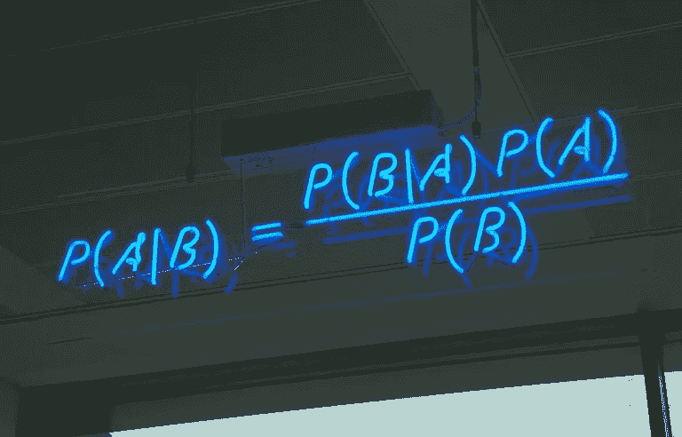

# 朴素贝叶斯的天真

> 原文：<https://medium.com/analytics-vidhya/the-naivety-of-naive-bayes-72c2a1738f80?source=collection_archive---------25----------------------->

开发者希望通过机器学习实现的是让计算机拥有自己的思想，学会自己做决定。根据该领域的现状，这样的目标需要在先进的 GPU 上运行复杂的算法，这反过来又需要巨额投资。在开发的早期阶段，计算机系统的简单性导致了简单的 ML 算法——线性回归……