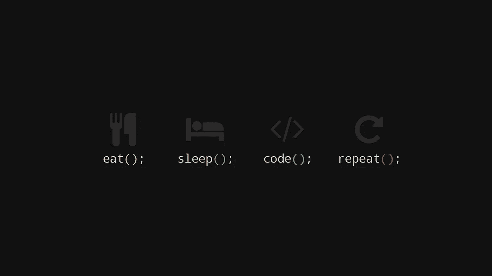

# 简洁代码的本质；声明式编程

> 原文：<https://medium.com/analytics-vidhya/the-nature-of-concise-code-declarative-programming-3aeda135977e?source=collection_archive---------29----------------------->

## 理解它的好处，以及从 Javascript 到 React 的转变

来源:[链接](https://www.google.com/search?q=programming%20animation%20wallpaper&tbm=isch&hl=en&hl=en&tbs=rimg%3ACYdOnxaDiCBPYeS_1cKvU1DA7&sa=X&ved=0CAIQrnZqFwoTCPCv_pbCr-sCFQAAAAAdAAAAABAW&biw=1792&bih=872#imgrc=jKKFRk4QUtgULM)

随着许多公司正在或打算将他们的服务转移到网上，对网络开发人员的需求变得越来越重要。许多寻求进入这一职业的人被大量的编程语言和框架所困扰…