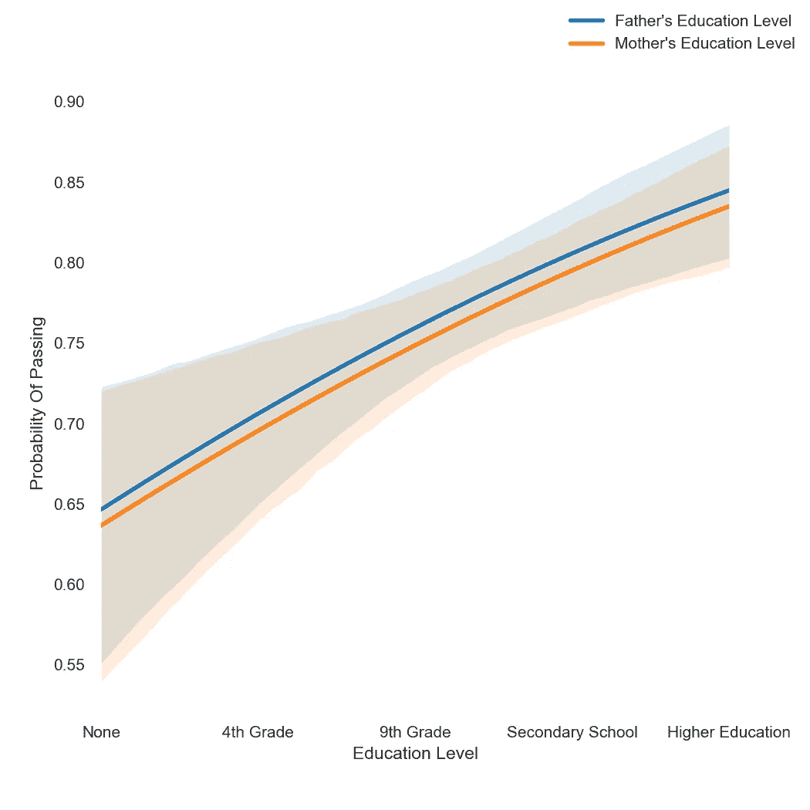
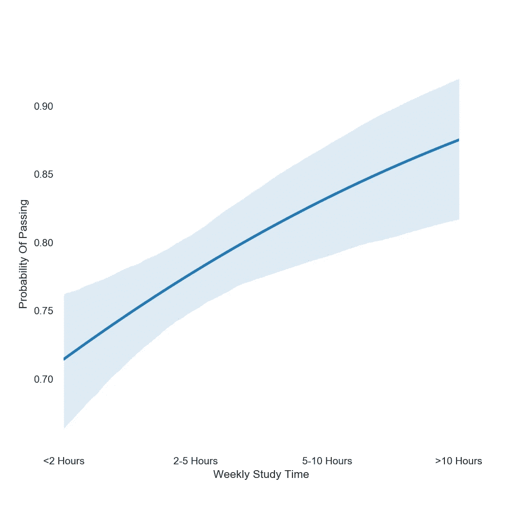
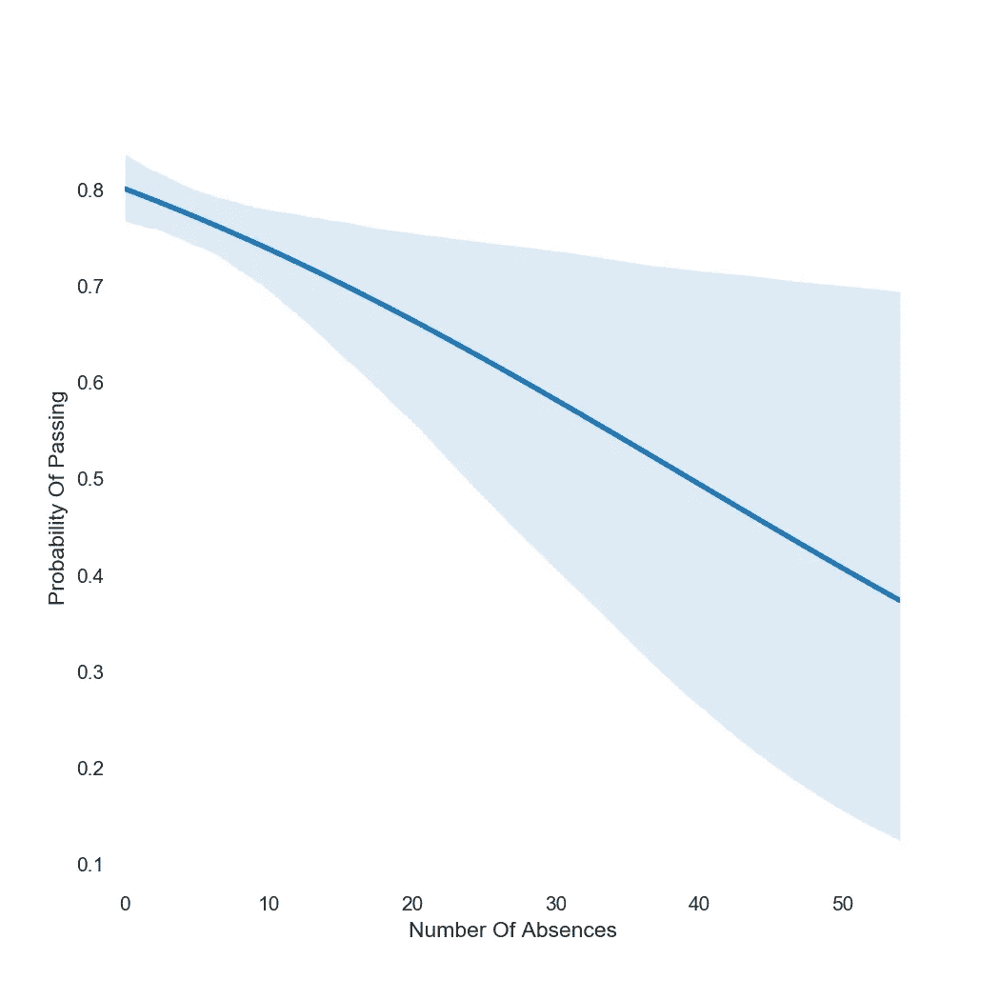

# 预测学生表现

> 原文：<https://medium.com/analytics-vidhya/the-nature-of-trying-to-predict-student-success-is-tricky-16168faba8ec?source=collection_archive---------16----------------------->

试图预测学生成功的本质是棘手的。很难解释家庭生活、个人生活、心理健康、教育质量和学习习惯中的各种因素。尽管如此，我觉得有某些普遍的因素帮助和阻碍学生。虽然这些因素可能会随着学生之间的文化和个人差异而增加或减少，但学生的成功与这些因素之间仍然存在非零的相关性，这使得它们值得研究。

正是考虑到这一点，我开始了这个项目。我的数据由 [UCI](https://archive.ics.uci.edu/ml/datasets/Student+Performance) 提供，由[米尼奥大学的保罗·科尔特斯](http://www3.dsi.uminho.pt/pcortez/Home.html)提供，包括从葡萄牙两所中学收集的学生人口统计、教育和社会特征。我处理这些数据的灵感来自保罗·科尔特斯和爱丽丝·席尔瓦的作品[，这里有](http://www3.dsi.uminho.pt/pcortez/student.pdf)。

# 该过程

我的目标是预测一个二元班级，一个学生在年底是通过还是不及格(在数据中表示为一年最后一个学期的成绩 G3 是否大于或等于 10)，并以一种在实际课堂中可能有价值的方式这样做；我相信，一个教育工作者可以利用类似的过程，以便更好地促进对可能在学业上有风险的学生的早期干预。

在这个过程中，我拟合了 XGBClassifier 和 LogisticRegressionCV 模型，并且这样做了两次；一次没有早期学期成绩(G1 和 G2)，一次有，以比较早期干预在考虑和不考虑同期学业成绩的情况下有多有效。

我为这些模型的性能选择的度量标准是精确度，表示为所有正面预测中真正正面预测的数量。

这意味着我在最大限度地减少假阳性预测，即有多少学生可能会不及格，但被预测会及格，因此可能得不到他们可能需要的帮助；错误地预测一个学生的失败比错误地预测一个学生的成功危害要小得多，准确地预测一个学生将通过考试比准确地预测那些将失败的学生帮助要小得多。

# 结果呢

对于我的基线，我选择了零或多数类基线。具有最多观察值的类被用作所有预测的结果。这给了我们 0.78 的精度，对于本质上的猜测来说还不错，但是还有很大的改进空间。

我对我的两个模型都进行了交叉验证，并且在最初得分的基础上得到了显著的提高。然而，我的 XGBClassifier 始终返回与 LogisticRegressionCV 相等或更低的分数，并且容易过度拟合，因此不会被包括在内。

## 不考虑更早的成绩

我的模型在验证和测试中返回了大约. 85 的一致精度。在没有学生成绩的先验知识的情况下，这是精确度的显著提高。这种增长仅仅来自于老师在学生为老师做任何工作之前可能掌握的关于新学生的信息，例如出勤记录、年龄、以前的失败等。

## 考虑到早期的成绩

当第一学期和第二学期的成绩包括在内时，验证分数攀升至~.96，我的最终测试分数攀升至~ . 95；再次，精确度的显著攀升，尽管在现实世界的场景中，增加的精确度可能不太有价值，因为在那个点上可能为时已晚，无法有效地为挣扎的学生提供早期干预。

# 洞察力

通过探索这些数据和创建这个模型的过程，我发现了几件有趣的事情，如果不令人惊讶的话。

首先，学生父母的教育水平是他们学业成功的重要指标。父母受过良好教育的学生成绩一直较高，通过率也明显较高。这可能表明受过教育的家庭可以获得更多的手段，或者受过教育的父母有更大的能力帮助他们的孩子学习。

父母教育对学生通过概率的影响

第二，每周学习时间对学生成功的影响表现出一个非常有趣的特点；虽然平均而言，花更多的时间学习确实增加了学生通过考试的机会，但超过某一点后，进一步学习与学生成绩的可变性增加密切相关。

学习时间对学生通过概率的影响

对于许多学生来说，似乎可能存在一个收益递减点，在这个点上，花更多的时间学习可能不会导致更好的记忆，可能会以其他因素(睡眠、压力等)为代价。)对性能有影响。

第三，缺课次数，虽然平均来说是学生成功的一个指标，但在极端情况下，接近可笑的可变性水平。

缺课对学生通过概率的影响

正如所预料的那样，大量缺勤与绩效下降有关；很难从你很少上的课上学到东西。然而，在预测学生的成功方面，大量缺课远不如少量缺课有用。

经常缺课可能是家庭生活不稳定因素的一个指标，或者是缺乏兴趣或渴望成功。然而，这也可能是慢性疾病或受伤的结果，这些疾病或受伤不一定会阻止学生做必要的事情来取得成功，而不管出勤情况如何。

# 结论

似乎有许多因素，学术上的和其他方面的，可以用来相当精确地预测学生的成功。我相信这些因素具有一定的普遍性，这将允许教育工作者应用类似上面详述的模型，以便更好地帮助可能有困难的学生。该模型可以在不同的时间应用于不同程度的功效，但在所有情况下都应该提供比仅仅猜测更大的价值。

我想再次确认，上面使用的数据[在这里](https://archive.ics.uci.edu/ml/datasets/Student+Performance)，是由[米尼奥大学](http://www3.dsi.uminho.pt/pcortez/Home.html)的保罗·科尔特斯提供的。

我的作品[在这里](https://github.com/austiezr/DS-Unit-2-Build/blob/master/Austin_Robinson_DS_12_Unit_2_Build.ipynb)，灵感来自保罗·科尔特斯和爱丽丝·席尔瓦的作品[在这里](http://www3.dsi.uminho.pt/pcortez/student.pdf)。