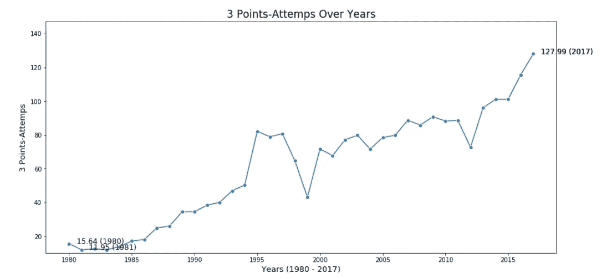
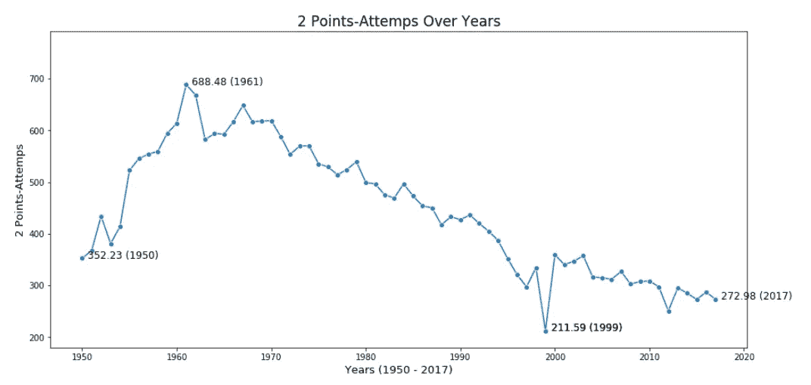
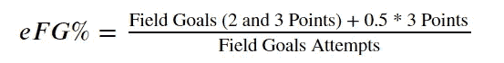
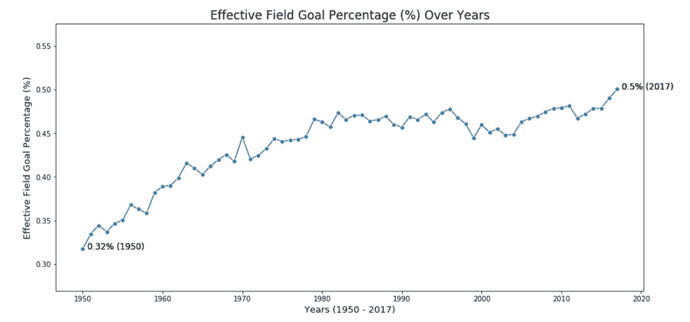
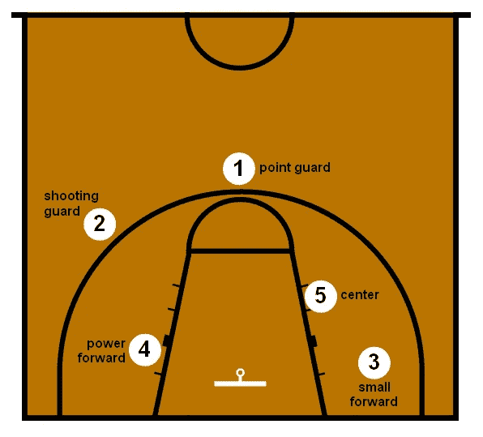
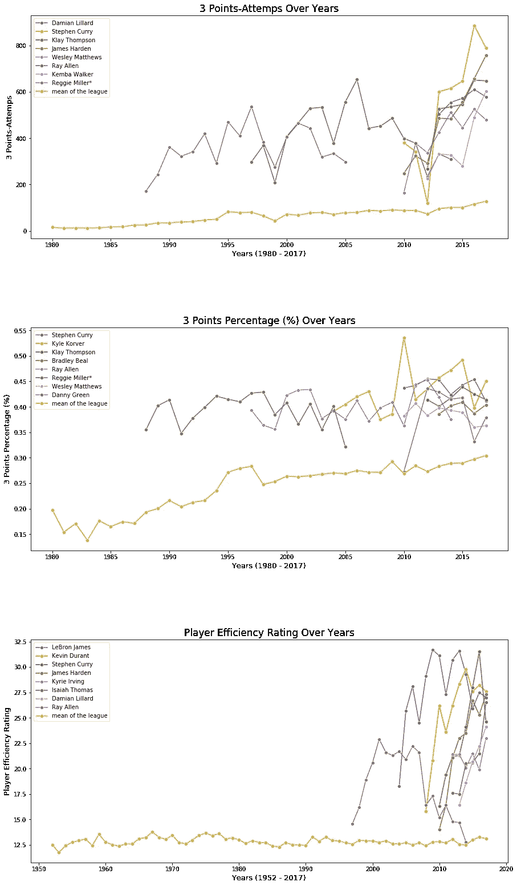
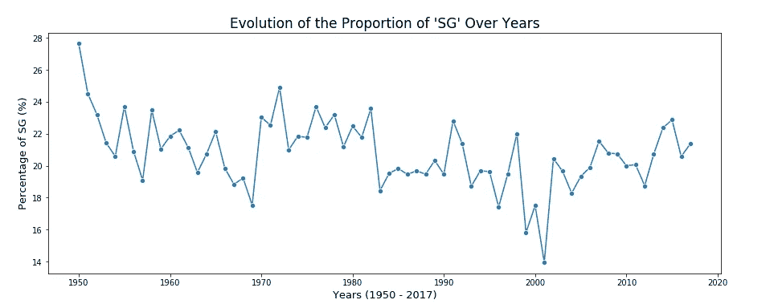
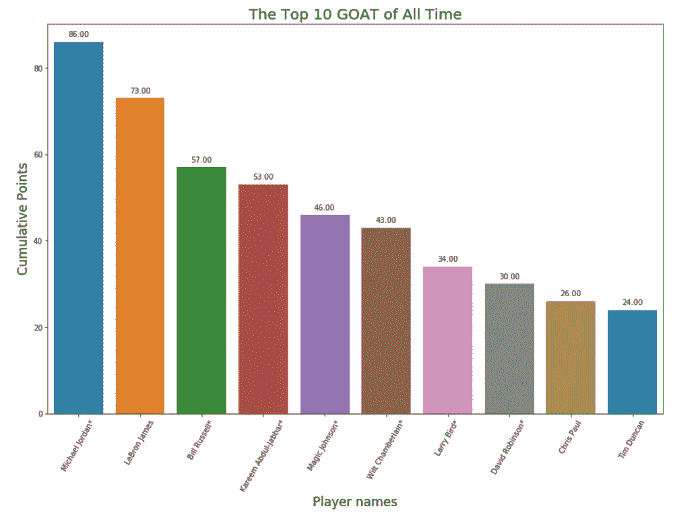
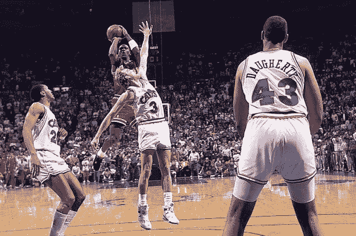

# 数据分析下的 NBA

> 原文：<https://medium.com/analytics-vidhya/the-nba-under-data-analysis-4e2e726038b0?source=collection_archive---------18----------------------->

一个基于篮球参考提供的数据的项目。

斯伯丁——NBA 比赛用球

# 介绍

NBA(国家篮球协会)成立于 1949 年，由两个联盟合并而成；美国篮球协会 (BAA)和美国国家篮球联盟(NBL)。这是世界上最广为人知的联盟。

由于有一个庞大而详细的数据集，涵盖了从 1950 年到 2017 年的球员统计数据(来自 [Kaggle](https://www.kaggle.com/drgilermo/nba-players-stats) ),作为一个篮球迷(特别是关于 NBA)，我一直想调查联盟的统计数据，以展示趋势，甚至回答具体的问题。

以下是一些例子:

> “三分球已经成为基本。”
> 
> "斯蒂芬·库里革新了篮球吗？"
> 
> "迈克尔·乔丹是山羊吗(史上最伟大的)？"

虽然这些问题不能仅仅通过统计数据来回答，而且应该考虑不可测量的因素(如心态、球员的心态、篮球场外的投资……)但我把揭示不会说谎的方面作为一项挑战。

# 第一部分。三分球已经成为基础。

提醒读者篮球是什么，它是一项团队运动。两队各有五名队员，他们试图通过一个高出地面 10 英尺的篮圈投篮得分。很容易理解，你离篮筐越近，得分就越容易。然而，最近的趋势表明，玩家更愿意从远处投篮。

如果一个球超出了三个 - **点的**-**线**，即围绕篮筐的指定弧线(距其中心 7.24 米)，则被视为 3 分，而不是 2 分。它被正式引入 1979-1980 赛季。与正常投篮的 2 分相比，它给团队得分带来 3 分。

图 1-联盟历年平均 3 分出手次数

图 2-联盟历年平均 2 分的尝试

1980-2017 年间 **3 分出手次数乘以 8(从 16 次出手到 128 次)**！

此外，自 2012 年以来，最大的增长是显而易见的，NBA 似乎正在走向一场更专注于三分球的比赛。事实上，从 1960 年**开始，2 分的尝试就减少了(从 689 减少到 273)** 。年复一年，防守不断加强，使得球员上篮的可能性越来越小。

通常情况下，我认为射击距离越远，精确度就越低。然而，多年来玩家的统计数据表明我错了。

有效字段目标百分比(%)

图 3 —有效领域目标百分比公式

代表一个球员给球队带来积分的效率。这一统计调整了一个事实，即一个 3 分的投篮得分比一个 2 分的投篮得分多一分。

举个例子，假设玩家 A 用 2 个三分 10 中 4，而玩家 B 用 0 个三分 10 中 5。每个球员将有 10 分的投篮命中率，因此将有相同的有效投篮命中率(50%)。

图 4-联盟历年平均有效投篮命中率

从上面的图表中，我可以理解**玩家已经变得越来越准确**。这也可以解释为 NBA 变得越来越有选择性，这只能提高联盟的整体水平。

**随着射手(但实际上所有球员)变得越来越准确，为什么不试着得到更多的 3 分而不是 2 分(因为 3 比 2 大！)，作为篮球运动中的主要目标还是要比对面球队多得分？**

# 第二部分。斯蒂芬·库里革新了篮球。

接下来是向斯蒂芬·库里的过渡。在看到三分球变得至关重要后，一名球员被认为是这种新打法的旗手。

众所周知，斯蒂芬·库里是一名优秀的射手(一些人认为他是有史以来最好的射手)。他打控卫(PG)和得分后卫(SG)(但主要是 PG)。2010 年进入联盟，至今(2020 年)依然活跃。

这是一个代表篮球位置的图像。

图 5-篮球中的位置

控球后卫是组织者，他将队友置于得分位置。它经常冲向篮筐，为队友打开空间或得分，但大多数时间它都呆在弧外。

在过去，比赛更多的是集中在大个子身上(大前锋/中锋位置)，因为篮球是高个子球员的比赛。得分最简单的方法仍然是靠近篮筐。

然而，从 2010 年左右开始，比赛开始更多地以控卫为中心，这表明了他不仅仅是一个组织者，也可以是一个得分手。

我刚刚证明了这种趋势会进一步发展，而且**的三分球尝试自 2010 年**以来一直在强劲增长。让我们挖掘出一些有价值的数据，关于有史以来最优秀的长距离射手:

*   3 分-多年来的尝试
*   多年来的 3 分百分比(%)(投篮得分超过尝试次数)
*   球员效率等级(来自最佳三分射手)——由 ESPN.com 专栏作家[霍林格](http://sports.espn.go.com/keyword/search?searchString=John_Hollinger)开发的等级

要考虑最好的 3 分射手，至少需要 4 个赛季，平均职业生涯至少 300 次尝试。

图 6——史上最佳射手

*   大多数顶级的**三分射手都是过去十年的。**
*   **雷·阿伦**和**雷吉·米勒**似乎是远射的**前驱(唯一的球员，除了凯尔·科沃尔不是近十年来的)。这也是他们被认为是最佳射手的众多原因之一；前兆，稳定的统计数据，作为枪手的寿命，...**
*   **斯蒂芬·库里在尝试次数排名中领先(相对于活跃年数)**并拥有**非常高的转化率**(排名第 2，仅次于凯尔·科沃尔)。他目前在三分球命中率方面排名第二，仅次于雷·阿伦。
    请注意，凯尔·科沃尔不在尝试次数的前 10 名之列。
*   最后但同样重要的是，即使他远投很多(3 分-出手次数约为联盟平均值的 6 倍)，**他的效率评级仍保持在顶级水平，这意味着他的远投对他的球队很有价值**。它的曲线形状遵循勒布朗詹姆斯(谁进入了有史以来最伟大的辩论)。

雷·阿伦和雷吉·米勒可能已经开始引入三分球，但库里将它带到了另一个水平，在尝试和百分比转换方面有着疯狂的高数据。他还证明，通过他的“球员效率评级”可以看出，这种比赛是可能的，以便获胜。

不止他一个人，金州勇士全队都把三分球作为他们打球的基础。事实上，另一个讨论中的射手是克莱·汤普森，他是斯蒂芬·库里的队友。

他们一起连续 5 年进入总决赛，获得了 3 次 NBA 总冠军。尽管他们在 2016 年没有赢得冠军，但他们在 NBA 历史上的常规赛中取得了最好的成绩，73 胜 9 负，人们会说这没有价值，因为最终没有赢得冠军。

这种打球哲学创造了一个王朝，从 NBA 开始改变了打球方式。

图 7——多年来“SG”位置的演变

我们也可以注意到，它影响了自 2010 年以来 SG 加入联盟的数量。

换句话说，作为一群球员中的领袖，斯蒂芬·库里将组合后卫(控球后卫/得分后卫)带到了过去十年以来 NBA 最重要的角色，作为组织者，但也作为射手。

# 第三部分。迈克尔·乔丹是山羊吗？

这是每个人都想回答的问题:迈克尔·乔丹是有史以来最伟大的吗？

**显然，答案仅限于统计数据，许多外部因素没有考虑在内**(这些因素肯定会对讨论产生巨大影响)。

首先，我根据提供的统计数据定义了一个简单的算法。考虑的最少季节是 8。

我考虑了以下特征:

*   球员对球队的价值，如“赢球份额”——对球员赢球次数的估计。
*   “玩家效率等级”。
*   在其他统计因素中，给球员的个人奖励，由我自己添加到数据中(仅针对专家讨论中考虑的最佳球员)。它涉及冠军的数量，进入决赛的数量，“常规赛最佳球员”和“决赛”的数量，…

更多信息可以在[这里](https://www.basketball-reference.com/about/glossary.html)找到，关于所用统计的定义。

从大小为 10 的山羊排名来看，在他的统计类别中，最好的玩家得到 10 分，而最后一个玩家得到 1 分(排名 10)。我总结了每个类别中玩家的所有分数，得出了下面的图表:

图 8——有史以来排名前十的山羊

*   有趣的是，我们注意到迈克尔·乔丹/勒布朗·詹姆斯和其他前 10 名球员之间确实存在差距。今天，关于山羊的讨论真的存在于他们两人之间。
*   只考虑了一些统计变量。克里斯·保罗不应该排在山羊的前 10 名。尽管他没有个人奖项，但他是有史以来最好的组织者之一(他的绰号是点神，来自控球后卫)。因此，他对团队成功的贡献是重要的。
*   相反，沙奎尔·奥尼尔或科比应该进入前 10 名(许多专家给出的意见)。科比·布莱恩特被视为一只孤独的狼，强壮但与队友并不亲密。他投出了很多高难度的球。另一方面，他的心态使他成为最令人印象深刻和最受尊敬的球员之一。然而，从统计学的角度来看，他对球队的贡献并不大。

令人惊讶的是，仅仅考虑一些重要的因素(这仍然是统计数据)，尽管篮球不仅仅是统计数据，我们的排名在某种程度上接近当前“谁是有史以来最伟大的人”的辩论。

就我个人而言，我会选择迈克尔·乔丹——因为他堪称楷模的效率；6 次总冠军/ 6 次 NBA 总决赛，勒布朗·詹姆斯——他统治了篮球所有可能的领域超过 16 年，卡里姆·阿布杜尔·贾巴尔——对我来说是 NBA 历史上最好的中锋，也是 NBA 累计得分最多的球员。

# 结论

在某些方面，我对调查 NBA 的演变很感兴趣。

*   我发现**玩家变得比过去更准确**。
*   **远距离投篮已经成为 NBA 的基础**。事实上，从上一代开始，如果你不发展出一个好的投篮，就很难在 NBA“生存”。随着防守的提高，上篮不再那么容易了。
*   这个分析中没有透露的是**游戏变得更快了**，并且经常以远距离射门结束。
*   **斯蒂芬·库里**，在他那一代球员的另一个名单中，**正式介绍了这种新的玩法**，尽管它已经有了像**雷·阿伦**或**雷吉·米勒这样的球员。**

我也试着从统计学的角度来回答这个关于有史以来最伟大的问题。根据我的简单实现，迈克尔·乔丹领先，勒布朗·詹姆斯紧随其后。

我让你自己拿主意！

欲了解更多信息并了解整个项目，请点击查看[。](https://github.com/Adlef/NBA_Analysis)

迈克尔·乔丹[ [来源图片](https://www.nytimes.com/2015/05/04/sports/basketball/decades-after-a-famous-shot-the-fall-guy-is-still-recovering.html)