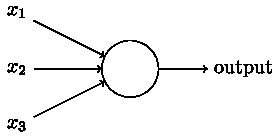
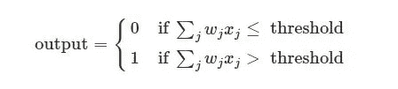

# 在神经网络中需要激活函数以及隐藏层

> 原文：<https://medium.com/analytics-vidhya/the-need-for-activation-function-along-with-hidden-layers-in-a-neural-network-8b37b4bffa42?source=collection_archive---------4----------------------->

人工神经网络或连接主义系统是由构成动物大脑的生物神经网络模糊启发的计算系统。这种系统通过考虑例子来“学习”执行任务，通常没有用特定于任务的规则来编程。

简而言之，**神经网络**是一系列算法，通过模拟人脑运作方式的过程，努力识别一组数据中的潜在关系。**神经网络**能适应变化的输入；因此，**网络**无需重新设计输出标准就能产生最佳结果

有许多类型的神经网络。著名的有

*   前馈神经网络——人工神经元。
*   径向基函数神经网络。
*   多层感知器
*   卷积神经网络
*   递归神经网络(RNN)——长短期记忆
*   模块化神经网络

所有上述网络中的基本单元是一个感知器。那么什么是感知器呢？

感知机是在 20 世纪 50 年代和 60 年代由科学家弗兰克·罗森布拉特发明的，受到了沃伦·麦卡洛克和沃尔特·皮茨早期作品的启发。

那么感知机是如何工作的呢？感知器接受几个二进制输入，x1，x2，…x1，x2，…，并产生一个二进制输出:

基本感知器

在所示的例子中，感知器有三个输入，x1，x2，x3。一般来说，它可以有更多或更少的输入。罗森布拉特提出了一个计算产量的简单规则。他引入了*权重*，w1，w2，…w1，w2，…，实数表示各自输入对输出的重要性。神经元的输出，00 或 11，取决于加权和
∑*j*w*j*x*j*是否小于或大于某个*阈值*。就像权重一样，阈值是一个实数，它是神经元的一个参数。用更精确的代数术语来说:

这就是感知器的工作原理！

感知器由 4 部分组成。

1.输入值或一个输入图层

2.权重和偏差

3.净和

4.激活功能

**权重显示了特定节点的强度。**

添加到净和的**偏差值**允许您上下移动激活函数曲线。

# 那么激活函数基本上是什么呢？

激活函数是决定神经网络输出的数学方程。**该函数附属于网络中的每个神经元，并根据每个神经元的输入是否与模型的预测相关来确定它是否应该被激活(“触发”)。激活函数也有助于将每个神经元的输出标准化到 1 和 0 之间或-1 和 1 之间的范围**

激活函数是馈送当前神经元的输入和去往下一层的输出之间的数学“门”。它可以像阶跃函数一样简单，根据规则或阈值打开或关闭神经元输出。或者它可以是将输入信号映射成神经网络运行所需的输出信号的变换。

激活函数的**主要**目的是**将非线性**引入神经元的输出。我们都知道，一个神经网络包含许多隐含层，以不同的权重作为它们的参数。现在**为什么我们需要非线性进入神经网络？**

没有非线性激活函数的神经网络本质上只是线性回归模型。**证明？**

**如果我们使用线性激活函数或不使用激活函数，神经网络的隐藏层将变得无用，因为两个或多个线性函数的组合本身就是一个线性函数**

> 使用非线性激活函数的另一个原因是不可能使用反向传播(梯度下降)来训练使用线性激活函数的模型——函数的导数是一个常数，与输入 x 无关。因此不可能回过头来了解输入神经元中的哪些权重可以提供更好的预测。

因此，非线性激活函数也被用作**它们允许反向传播，因为它们具有与输入相关的导数函数。**

激活功能对输入进行非线性转换，使其能够学习和执行更复杂的任务。

激活功能有很多种，如**乙状激活** **功能**、 **ReLu** 、 **Softmax** 等。

所以问题是非线性激活函数如何在网络中引起非线性？

让我们以 ReLu 激活功能为例

激活的阈值简单地为零: *R(x) = max(0，x)，即如果 x < 0，R(x) = 0，并且如果 x > = 0，R(x) = x*

ReLU 函数

Relu 输出不是一条直线，它在 x 轴弯曲。更有趣的一点是，**这种非线性**的后果是什么？简单来说，线性函数允许您使用直线来剖析特征平面。但是**利用 Relu 的非线性，我们可以在特征平面上构建任意形状的曲线。**

有了 Relu，分类边界不再是一条穿过 x-y 位置的直线。x 轴下方的部分**被切掉**，产生 ***角度*区域**

绘制函数 max(0，-5–2x)

我们可以放入不同的权重来观察它如何影响决策区域。

**relu 组，也称为网络的“隐藏层”，因为它们隐藏在输入和输出之间，产生这些角度决策区域**。通过应用线性模型**将所有这些角度区域加在一起**来构建最终输出。

例如，在下图中，我们添加了四个 ReLU 函数**ReLU(-4–2x+y)、ReLU(4+2x+y)、ReLU(4-x-2y)&ReLU(9+2x-y)**

最终输出是这个任意形状的决策边界，用绿色突出显示。

绿色分类边界是近似的

> 激活函数集合逼近任何曲线的这种精致能力是所有类型的神经网络模型的最终垫脚石

****隐藏层数**越多**越准确**这个近似值越小**越小**就是封闭的区域或者决策边界。因此**增加更多的隐藏层数**总是会导致更好的预测(分类)。使用 20–30 或更多数量的 ReLUs 使决策边界更加“非线性”和“平滑”,从而改善分类。**

**总结就是神经网络有能力建立 ***任意形状的分类边界*** ，这使得它们成为深度学习领域非常有用的工具。**