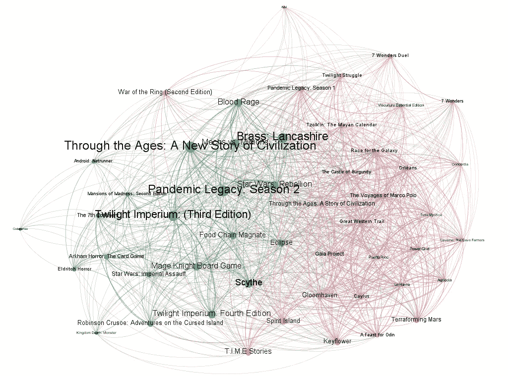
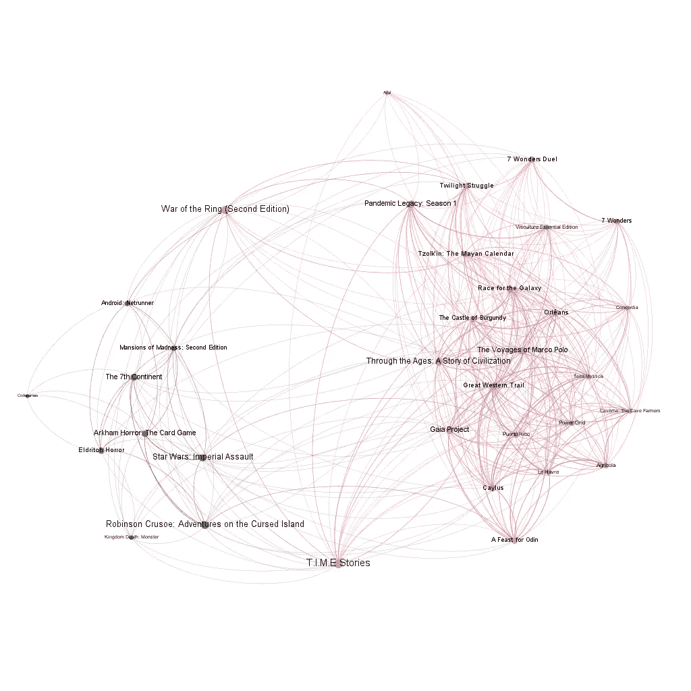

# 最受欢迎的桌游网络

> 原文：<https://medium.com/analytics-vidhya/the-network-of-the-most-popular-board-games-c036b41b519?source=collection_archive---------20----------------------->

桌游社区规模庞大且充满活力。设计师们不断提出新的想法，每年在世界各地举行年会，有成千上万的人参加。 [Kickstarter](https://www.kickstarter.com/) ，最受欢迎的众筹平台之一，也有越来越多的棋盘游戏，有趣的是，其十个最受资助的项目中有三个是棋盘游戏！

棋盘游戏有许多类型，有许多特点，它们共同构成了一个网络——就像电网、互联网、道路网和世界上许多其他东西一样。

来自 https://gifer.com/en/1YJ[的 GIF](https://gifer.com/en/1YJ)

但是让我们回到棋盘游戏！因此，我在这里的目标是通过分析在最大的棋盘游戏在线网站[棋盘游戏极客](https://boardgamegeek.com/)上获得最佳评级的 50 款游戏，来提供一些网络科学的基本概念。

桌游极客(2018)上评分最高的 50 款桌游网络

网络的节点是棋盘游戏。如果两个游戏有一个共同的特点，例如两个游戏都可以在 12 岁以上玩，或者两个游戏的玩家人数都在 2 到 4 人之间，那么这两个游戏之间就有联系。桌游极客存储了关于游戏的以下特性:

*   类型
*   比赛时间
*   玩家数量
*   建议的最小年龄
*   复杂度(在[0，5]区间内的数字，越高，游戏越难)

由于复杂度的值通常有两位小数，它们很少完全相同，所以我认为如果两个游戏的复杂度之差小于 0.15，那么这两个游戏的复杂度相同。

这是一个**加权**网络。因为我们有五个特征，所以链接的权重可以是从 1 到 5 的整数。除了是一个加权网络之外，这也是一个**无向**网络，因为链接没有特定的方向，不像在互联网的情况下，网站之间的链接是从一个站点指向另一个站点的 URL。

棋盘游戏的数据被收集并存储在 xml 文件中，用于网络分析和可视化的工具是 [Gephi](https://gephi.org/) 。

如果仔细看看上图，可以看到节点的大小不一。这种差异的基础是什么？答案是**中间中心性**，对于一个特定的节点来说，中间中心性越高，为了在最短的可能路径上从一个随机选择的节点到另一个节点，该节点需要被穿越的次数就越多。作为网络分析的一部分，Gephi 计算了中间中心性得分。具有最高介数中心性分数的节点是棋盘游戏，这些棋盘游戏具有与许多其他棋盘游戏相同的一些特征值，并且一些棋盘游戏仅具有几个棋盘游戏。换句话说，它们是对特定节点子组具有独占访问权的中心节点。一个这样的棋盘游戏是【古往今来的 T4:文明的新故事，这是一个可以由 2 到 4 人玩的战略游戏，游戏的预计持续时间为 180-240 分钟，建议年龄为 14 岁或以上，其复杂性得分为 4.37。许多其他棋盘游戏都有相同的玩家数量和相同的推荐年龄，因此，这个棋盘游戏位于网络的中心，这意味着它很有可能是通往许多游戏的最短路径。此外，只有少数棋盘游戏能持续同样长的时间或具有同样高的复杂度分数。因此，这类游戏的最短路径很有可能通过这个游戏。

Gephi 还计算了该网络的其他一些特征:

*   节点数量:50
*   链接数量:965
*   平均学位:38.48
*   平均加权度:61.04
*   模块化:0.133
*   平均路径长度:1.215

现在你可能认为这很酷，Gephi 看起来是一个非常有用的工具，但是这些值是什么呢？在这一点上，节点和链接可能听起来很熟悉，所以让我们看看模块化！模块性是给我们一个关于网络结构的概念的度量，它基本上用于社区检测。社区可以被认为是包含网络中一组相似节点的模块或集群。具有高模块化的网络在社区内的节点之间具有密集的连接，但是在不同社区的节点之间具有稀疏的连接。例如，生物网络表现出高度的模块化。尽管它有其局限性，因为它无法检测小社区——这一特性通常被称为*分辨率限制*。

桌游网有两个社区，上图用绿色和粉色标注。他们的份额如下:

*   绿色:42% (21 个节点)
*   粉色:58% (29 个节点)

在仔细检查这两个社区时，我发现划分的最强基础是*推荐最小年龄*，因为绿色社区只包含推荐最小年龄为 14 岁的游戏，而粉色社区包含所有推荐给 13 岁或更小孩子的游戏。

## 作为小世界网络的棋盘游戏网络

L et 以讨论*平均路径长度*结束分析，结果是 1.215。这是一个度量标准，用于测量从一个随机选择的节点到另一个最短路径上的节点应该跳多少次。1.215 意味着大部分时间这条路径上只有一个这样的节点。

在一个拥有 50 个节点的网络中，两个随机选择的节点之间的距离如此之短，使得我们有理由假设这个网络是一个小世界网络。我们不能完全确定，因为应该证明随着节点数量趋于无穷大，平均路径长度或平均测地线距离不会比对数增长得更快。

**小世界网络**是两个随机选择的节点之间的期望步数相对较小的网络。如果这种随机节点对之间的平均测地距离相对于网络中的节点总数很小，并且当节点数趋于无穷大时，它满足上述标准，则该网络被认为是小世界网络。因此，将会有大量的枢纽，这也是小世界网络最大的弱点所在。一旦这些集线器或换句话说，保证这些短路径的连接数量最多的节点被移除，它们就很容易崩溃。为了说明这种现象，我过滤掉了 42 度或更多度的节点(关联到一个节点的链接，在图论中也称为边)。可以看出，与社区内丰富的链接相比，这两个社区几乎没有任何联系。

在棋盘游戏极客(2018)上评分最高的 50 个棋盘游戏的网络中具有小于 42 度的节点

如果你想玩这个网络(或者创建自己的网络)，请访问我的 [GitHub repo](https://github.com/verapalotai/bggnetwork) 并查看 Gephi 文件。这是一个超级简单的网络实验方式！

如果你对网络科学感兴趣，我强烈推荐你阅读阿尔伯特-拉斯洛·巴拉巴希的书。