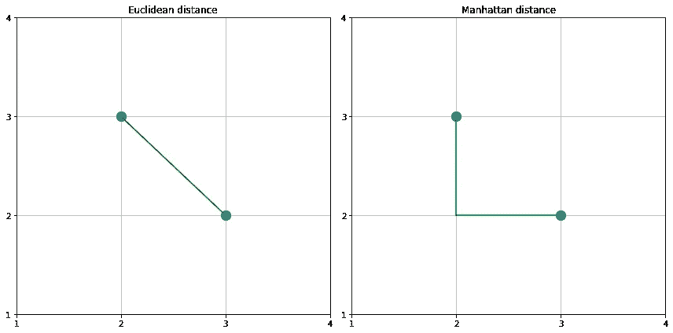
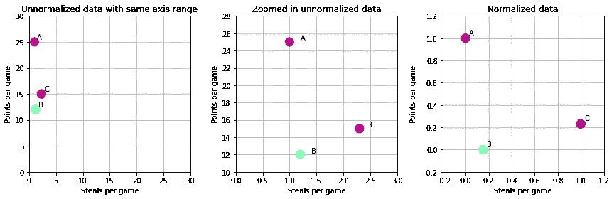
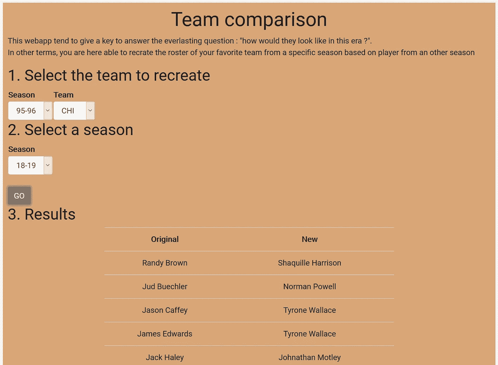

# 使用 Python 的新空间堵塞 Monstars

> 原文：<https://medium.com/analytics-vidhya/the-new-space-jam-monstars-using-python-7e83b48a2159?source=collection_archive---------10----------------------->


马库斯·斯皮斯克在 [Unsplash](https://unsplash.com?utm_source=medium&utm_medium=referral) 上的照片

# 火车运行公司

*   **欢迎来到太空堵塞**
*   **项目创意**
*   **双手放在**上
*   **更进一步**
*   **结论**

# 🎵欢迎来到太空堵塞🎵

我不记得具体是什么时候，但可能是在臭名昭著的 Youtube 兔子洞之后的一个晚上，我发现了一个让我感兴趣的视频。它提到了当时关于《太空堵塞 2》的传言(在迈克尔·乔丹和鲁尼曲调之间的经典交叉之后)。每个人都知道勒布朗·詹姆斯将在这部新作品中取代迈克尔·乔丹，但是怪兽之星呢？

*蒙什么？*

怪兽之星。那些小外星人在篮球比赛中挑战疯狂的曲调。只是… **他们很小，直到他们开始窃取著名 NBA 球员的天赋！**

在电影《论纲》中，外星人选择窃取 NBA 球员的“精华”:

*   查尔斯·巴克利
*   穆格西·博格斯
*   肖恩·布拉德利
*   帕特里克·尤因
*   拉里·约翰逊

*那你的视频呢？*

那么，如果有一个新的空间堵塞与勒布朗詹姆斯在迈克尔乔丹的作用，那么也应该有一个新的 Monstars 团队！该视频的想法是创建一个新的 Monstars 队尽可能类似于旧的，但与目前的 NBA 球员。

前述视频

我发现这个想法真的很有趣，想看看我是否能使用 Python 制作类似的东西。

# 项目理念

所以这个项目的想法是非常直接的:试图找到每个原始 Monstars 成员和当前 NBA 球员之间的相关性，仅仅基于他们的统计线(对于给定的赛季)。

第一步是找到一种方法来访问这些球员的统计数据。那么找到最相似的玩家将意味着在一个 *N* 维度的环境中最小化一个距离函数。这是无监督学习问题中的一种常见方法，称为**最近邻。**

## 检索玩家的统计数据

对于所有与篮球相关的信息(大部分是统计数据)，我认为有一个来源胜过所有其他来源:[https://www.basketball-reference.com/](https://www.basketball-reference.com/)

Basketball-reference 使得获取给定赛季所有球员的统计数据(甚至高级统计数据)变得简单。我在 season > *下找到了我需要的所有信息，一个具体的赛季* >球员统计

在一个完美的世界中，我会使用一个 web scrapping 工具，如 **BeautifulSoup** 来自动下载我需要的所有信息，但我走了一条简单的路，决定手动下载我需要的每个季节(这对未来将是一个很好的更新！).

## 计算玩家之间的相似度

正如已经提到的，我使用**最近邻**来计算两个玩家之间的相似性。

这可能是**无监督学习中最著名的算法。**要理解它的工作原理，最简单的方法就是想象一个散点图。我相信你已经习惯了使用 2D 散点图，即使检索信息对我们来说并不总是那么容易，3D 散点图也没什么不同。在散点图中，一个条目，即单个信息点，由它在图上的位置“表示”。

例如，要计算这种图形中两点之间的距离，只需测量从点 1 到点 2 的直线(这将给出欧几里德距离)，或者绘制两条直线:一条在 X 轴上，一条在 Y 轴上，然后将这两条线的长度相加(这将给出曼哈顿距离)。



距离计算的图解(图片由作者提供)

有了计算两点间距离的方法，如果有 3 个或更多的点，你就能迭代地计算出每个点到其他点的距离。有了所有这些信息，您只需对这些测量值进行排序，就可以找到每个点的最近邻。计算距离的方式(如欧几里德、曼哈顿……)可能会影响结果。

好吧…但是这怎么能帮助我们找到相似的 NBA 球员呢？

想想我们的球员喜欢积分。只是它们不是 2D，甚至不是 3D 点，而是 N 个 D 点(其中 N 是我们决定使用的不同属性的数量)。每一个条目，每一个玩家，都有一个特定的统计值，如果你仔细想想，这和我们的 2D 点没有太大的不同，它的特征是 X 和 Y 坐标(为了完成类比，这将是点的统计线)。

# 把手举起来。

**免责声明**:这个项目只是一个更大的 NBA-stats 相关系列项目的一部分(希望会有更多的文章！).你可以在我的 [Github repo](https://github.com/JonathanGuerne/NBA_MLBD) 上找到所有这些项目的代码。

## 先决条件

虽然我真的希望这篇文章能被任何对其主题感兴趣的人所理解，但我不能说太多的“技术细节”。这意味着如果您想继续学习，我假设您对 Python 有所了解。

如果你只对最终结果感兴趣，我鼓励你看看**演示**部分。在上述部分中，我让你在 mybinder 的帮助下访问我的代码的在线全功能版本。

为了加载和准备我们的数据集，我们将使用熊猫。我们将使用 sklearn 来构建我们的最近邻模型。(将来可以使用 BeautifulSoup 自动检索数据集)

## 加载/准备数据集

正如在项目构想中提到的，我依靠 basketball-reference.com 下载所有我需要的统计数据。我在 csv 文件中存储所有球员的数据。然后我就可以访问熊猫的每个文件了

一旦数据集完全加载，我决定在“输入”模型之前添加一个标准化步骤。这个增加的步骤防止了模型在每个统计数据之间的任何差异。

这里有一个例子来说明我的观点:以 3 名球员(篮球运动员)为例，球员 A 场均 25 分和 1.0 次抢断，
球员 B 场均 12 分和 1.2 次抢断，
球员 C 场均 15 分和 2.3 次抢断

玩家 B 平均每场比赛比玩家 A 少 13 分，而玩家 A 平均每场比赛比玩家 c 少 1.3 次抢断。仅根据数值，玩家 B 和 A 之间的分差比玩家 A 和 c 之间的抢断差大 10 倍。这可能会对相似性计算产生不良影响。



标准化的影响(图片由 autor 提供)

解决方案是归一化我们的数据集，在我们的例子中是通过最小-最大归一化。通过确保每个 stat(官方术语是 feature)都受到每个 stat 共有的最大值和最小值集的限制，规范化将允许我们避免前面提到的“点数与抢断”问题(在[0，1]之间规范化数据集是一种常见的做法)。

最后，如上图所示，标准化数据集会影响两个条目之间的距离计算。影响并不总是巨大的，这意味着即使没有归一化，您也可能获得一些有趣的结果，但我建议您始终在预测模型中寻找并移除不需要的偏差。

上面的代码展示了规范化是如何实现的。我使用 sklearn MinMaxScaler，主要是因为它能够方便地进行拟合，然后用于以后的变换(这消除了在变换之前总是必须指定最小值和最大值的额外步骤)。我决定在新旧数据集的并集上安装缩放器，因为(与其他 ML 问题不同)我们可以自由访问数据集的每个部分。这里没有训练集和测试集，所以不需要担心从测试集中学习。

## 准备模型

我们的数据集已加载并准备妥当，这意味着我们现在可以开始处理相似性模型了。

如前所述，我们依靠 sklearn 最近邻算法。该算法需要在数据集上进行拟合，然后可以用于为给定的一组新的统计数据(对于新玩家)输出 n 个最近的邻居(拟合步骤中使用的数据集的条目)。

使用上面的代码，模型适合当前的玩家数据集。这允许我们得到每个老玩家最近的邻居(以及到这个邻居的距离)。

您还将认识到 NearestNeighbors 构造函数中的度量参数(第 3 行)。在这里选择一个度量类似于我们在**计算玩家之间的相似性一节中已经提到的。**唯一的问题是，因为我们不再处于 2D 的环境中，所以更难理解选择一个指标而不是另一个指标的影响。

在这个项目中，我决定尝试尽可能多的指标，并选择在输出播放器中输出更多变化的指标(这无论如何都不是一个非常科学的方法，但我认为记录它可能会很有趣)。我所说的“输出的播放器中的变化”仅仅意味着我正在寻找一种度量，这种度量在提议的“最相似的播放器”中导致最少的重复。

为什么？因为我不希望模型总是预测同一个玩家。事实上，我希望预测的球员尽可能少重复。但还是那句话，这不是一个很科学的方法。

## 演示

如果您没有遵循，并且您还想玩代码，请不要担心，我会为您做好准备。我在 **mybinder** 上主持了整个项目，这让你可以在你的浏览器上访问我的笔记本文件。然后，即使没有在您的机器上安装 python，您也可以使用这些代码。

[](https://mybinder.org/v2/gh/JonathanGuerne/NBA_MLBD/master) [## GitHub:JonathanGuerne/NBA _ MLBD/master

### 单击运行此交互式环境。来自活页夹项目:可复制、可共享、交互式计算…

mybinder.org](https://mybinder.org/v2/gh/JonathanGuerne/NBA_MLBD/master) 

正如已经提到的，我在这个单一的存储库上托管了多个项目。要访问“空间堵塞”笔记本，只需导航至:

```
space_jam_notebooks > space_jam_casting.ipynb
```

## 结果

我决定为原来的“怪兽之星”小组的每个成员寻找 5 个潜在的替代者。拥有一个以上的选项可以让我们对“思维方式”模型有更好的直觉。

这是我们的模型得出的结果:

```
Charles Barkley potential replacement:
	Anthony Davis
	Nikola Jokić
	Joel Embiid
	Jimmy Butler
	Domantas SabonisShawn Bradley potential replacement:
	Myles Turner
	Hassan Whiteside
	Steven Adams
	Tristan Thompson
	Wendell Carter Jr.Muggsy Bogues potential replacement:
	Jaylen Hoard
	Evan Turner
	Jordan Bell
	Josh Reaves
	Adam MokokaPatrick Ewing potential replacement:
	Andre Drummond
	Deandre Ayton
	Bam Adebayo
	Kristaps Porziņģis
	Joel EmbiidLarry Johnson potential replacement:
	Jimmy Butler
	Julius Randle
	Domantas Sabonis
	Nikola Jokić
	LaMarcus Aldridge
```

在这一点上，希望你对 NBA 有足够的了解，对所有这些预测有自己的看法。如果不是，那么我只能告诉你，一般来说这是有意义的(应该如此)。虽然有几个有问题的选择，但没有什么太疯狂的。

但是我们在这里！看看新的太空堵塞电影的孟士达团队！(此时我已经在抓一些爆米花了🍿).

# 更进一步

*挑选新的《怪兽之星》剧组真的很有趣，但是我们能更进一步吗？*

我们现在可以做很多事情。想想每一个涉及到寻找相似玩家的应用。

尽管在我制作这个项目的时候它还没有上映，但我相信你们很多人现在已经看过《最后的舞蹈》了。而且，即使你没有看过，你肯定知道 90 年代的芝加哥公牛队和他们在整个联盟的恐怖统治。

我出生在 90 年代末，这意味着我没有机会在那个时期跟随迈克尔和他的队友。我觉得这让我更难理解这个团队有多棒。我知道迈克尔·乔丹、斯科蒂·皮蓬、丹尼斯·罗德曼……但不像我知道斯蒂芬·库里、勒布朗·詹姆斯、凯文·杜兰特(等等)那样。那么如果我使用我刚刚构建的工具来为整个团队寻找最相似的球员会怎么样呢！

让我澄清一下:**如果我们把(那支球队的)每个球员都换成与他最相似的现任球员，96 支芝加哥公牛队会是什么样子？**

它能帮助我了解以前时代不太出名的玩家的优缺点吗？

我不会详细讨论如何实现这样的想法，因为它非常简单。我们只是简单地用我们之前建立的模型来评估一个给定球队的每个球员。

为了改善用户体验，我决定把这个项目的最后一部分建成一个专门的网络应用。我简单地使用 Flask 来创建我的应用程序的后端/ API，并使用一些普通的 javascript 来调用这个 API。



前面提到的网络应用程序(图片由作者提供)

我还没有在网上托管这个 web 应用程序，但你会在存储库上找到安装(和启动)它所需的所有信息。

# 结论

现在这个工具完美了吗？**绝对不是。**玩家之间仍然有一些相似的联系，这似乎没有任何意义(最常见的是一个非常具有进攻意识的玩家出于某种原因与一个防守型玩家联系在一起)。但我认为这更有趣，创造了一种通过聪明的思考来提高我们系统性能的探索。

我们没有太多的方法可以改变模型本身(试图获得整体更好的预测)。我在想，我只能想到两个选择:

1.  不是使用所有的统计数据，而是巧妙地选择一个子集会有所帮助
2.  花更多时间选择我们模型的度量标准

*那么我们学到了什么？*

寻找相似的球员是一个有趣的话题，因为很难，如果不是不可能，客观地评价它。**这里我们缺少一个“基本事实”值**，我们可以基于它来评估模型的性能。

我们可以利用专家意见来评估我们的模型性能。例如，允许在该主题上具有可信专业知识的人对每个预测进行评分。然后，模型的平均等级可以更好地反映模型的性能。

我真诚地希望你喜欢读这篇文章，就像我喜欢写它一样。请让我知道你是否有兴趣跟进这个 NBA 统计相关项目的剩余部分。在那之前，请保重，感谢您的宝贵时间！
*乔纳森·居恩*

# 参考

"1.6.最近邻—sci kit—了解 0.23.2 文档。”2020 年 10 月 15 日接入。[https://scikit-learn.org/stable/modules/neighbors.html](https://scikit-learn.org/stable/modules/neighbors.html)

Basketball-Reference.com，《篮球统计和历史》2020 年 10 月 15 日接入。[https://www.basketball-reference.com](https://www.basketball-reference.com)。

吉恩乔纳森。*乔纳森厄恩/NBA_MLBD* 。朱庇特笔记本，2020。[https://github.com/JonathanGuerne/NBA_MLBD](https://github.com/JonathanGuerne/NBA_MLBD)。

“熊猫——Python 数据分析库。”2020 年 10 月 15 日接入。[https://pandas.pydata.org/](https://pandas.pydata.org/)。

彼得卡，乔。*空间堵塞*。动画，冒险，喜剧，家庭，幻想，科幻，体育。华纳兄弟家庭娱乐公司，北极光娱乐公司，球场边座位制作公司，1996 年。

“Sklearn。预处理。minmax scaler—sci kit—学习 0.23.2 文档。”2020 年 10 月 15 日接入。[https://sci kit-learn . org/stable/modules/generated/sk learn . preprocessing . minmax scaler . html](https://scikit-learn.org/stable/modules/generated/sklearn.preprocessing.MinMaxScaler.html)。

“活页夹项目。”2020 年 10 月 15 日接入。https://mybinder.org/。

*我们用数学帮助勒布朗投出《太空堵塞 2》l FiveThirtyEight*，2019。https://www.youtube.com/watch?v=GzujfiDF4vU&t = 4s[。](https://www.youtube.com/watch?v=GzujfiDF4vU&t=4s)

"欢迎使用 Flask — Flask 文档(1.1.x). "2020 年 10 月 15 日接入。[https://flask.palletsprojects.com/en/1.1.x/](https://flask.palletsprojects.com/en/1.1.x/)。