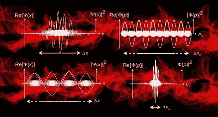
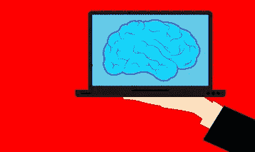
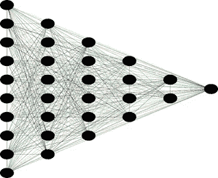

# 下一件大事:量子机器学习

> 原文：<https://medium.com/analytics-vidhya/the-next-big-thing-quantum-machine-learning-58bbf9aa92c4?source=collection_archive---------21----------------------->

随着计算能力的提高和算法的进步，机器学习技术已经成为在数据中寻找模式的强大工具。GPU(图形处理单元)和 TPU(张量处理单元)极大地减少了大型数据集的训练时间。因为量子系统会产生反直觉的模式，而我们使用的经典系统却无法有效地做到这一点。因此，有理由认为量子计算机在机器学习任务上可能优于经典系统。

**量子概念:**

**1。** **量子:**

在亚原子水平上，能量包含在称为量子的微小离散包中，根据当时的环境，它表现为波和粒子。量子理论是由马克斯·普朗克在 1900 年提出的。

**2。** **量子位**

在量子计算中，量子比特(quantum bit)是量子信息的基本单位。它是经典二进制比特的量子版本。量子位是一个两态量子力学系统。例如，电子的自旋，其中两个能级可以被认为是自旋向上和自旋向下。

**3。** **叠加**

量子叠加是量子力学的一个基本原理。它指出，任何两个(或更多)可以加在一起(叠加)，结果将是另一个有效的量子态。

**4。** **量子纠缠**

量子纠缠是一种现象，其中两个或多个物体的量子状态必须相互参照来描述。因此，即使粒子相隔很远，它们也能以相关的方式相互交流。

把量子概念放在一起:量子计算

量子计算是使用量子力学概念的计算。量子计算机是一种执行量子计算的设备。它们不同于基于晶体管的经典计算。而普通的数字计算需要将数据编码成二进制形式，它总是处于两种确定的状态(0 或 1)。量子计算使用量子比特，量子比特可以处于态的超位置。

量子计算是一个领域，它使用基于量子力学原理的量子算法来解决相同的问题，而经典算法解决这些问题的速度要快得多。

例如，量子计算机可以在与平方根(N)成比例的时间内搜索具有 N 个条目的未排序数据库，而传统计算机被给予对相同数据库的黑盒访问所花费的时间与 N 成比例。

量子计算比经典计算占优势，因为我们目前对自然的理解是量子力学。因此，理论计算机科学应该研究量子计算机的能力，而不是经典计算机。

**经典机器学习:**

机器学习协议可以是有监督的，也可以是无监督的。在监督学习中，训练数据分为两类，一类称为独立的特征变量，另一类是依赖于特征变量的标签或因变量。例如，手写数字识别任务，其中我们有一个 28*28 的图像，这是我们的特征向量和相应的标签，其中包含输出类。机器学习算法的工作就是学习如何给训练数据之外的数据分配标签。

**基于线性代数的量子机器学习:**

机器学习算法通过对高维向量空间中的向量执行矩阵运算来操作。另一方面，量子力学完全是关于高维向量空间中向量的矩阵运算。

这些方法背后的关键成分是 n 个量子比特的量子状态是 2n 维复数向量空间中的一个向量。量子位上的量子逻辑运算将状态向量乘以 2n *2n 个矩阵。通过构建这样的矩阵，量子计算机已经被证明可以执行普通的线性代数运算，如傅立叶变换。量子计算机求解这些高维线性方程组的时间复杂度为 n，比经典计算机快得多。

**经典深度学习:**

深度学习利用深度神经网络的力量来解决机器学习算法解决的问题。在给定计算能力和庞大数据集的情况下，具有数百万甚至数十亿可训练参数的深度神经网络可以在给定任务中胜过现有的机器学习算法。深度神经网络非常擅长计算复杂的决策边界。深度学习已被证明是人工智能最具影响力的应用之一。

**深度量子学习:**

经典深度神经网络是机器学习的高效工具

非常适合启发深度量子学习方法的发展。专用量子信息处理器，如量子退火器和可编程光子电路，非常适合构建深度量子学习网络。最简单的用于量子化的深度神经网络是玻尔兹曼机器。经典的玻尔兹曼机器由相互作用可调的比特组成。通过调整这些相互作用来训练玻尔兹曼机器，使得比特的热统计再现数据的统计。为了量子化玻尔兹曼机器，一个简单的步骤就是采用一个神经网络，并将其表达为一组相互作用的量子自旋。然后通过将玻尔兹曼机器中的输入神经元初始化为固定状态，并允许系统热化，我们就可以读出输出量子位，从而获得答案。

**结论:**

在这篇文章中，你学习了量子机器学习的基本概念和量子力学的基本概念。真正潜在的量子机器学习将在几年后开始看到成果，但在这个方向上已经取得了重大进展。高质量的量子机器学习算法将帮助科学家通过使用机器学习驱动的模拟来开发改善生活和理解自然规律的方法。