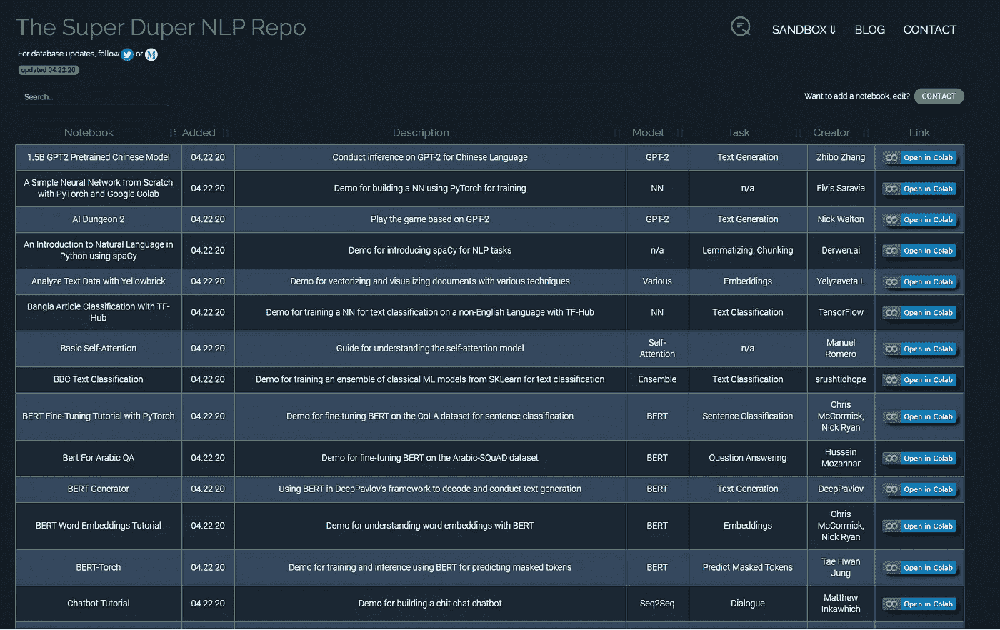
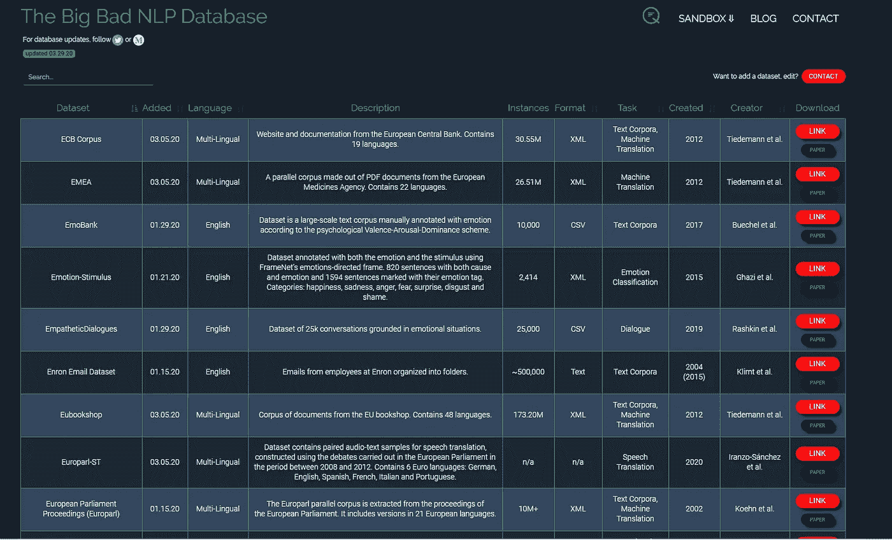

# NLP 宝藏！！！

> 原文：<https://medium.com/analytics-vidhya/the-nlp-treasure-b98d44ddbdfd?source=collection_archive---------26----------------------->

在本文中，我们将探索 Quantum Stat 新发布的 repo，即 [Super-Duper NLP](https://notebooks.quantumstat.com/) Repo，它包含 100 多个准备运行 NLP colab 的笔记本以及[Big Bad NLP 数据库](https://datasets.quantumstat.com/)，该数据库包含所有公开可用的语料库，以及新手如何从中受益！！！

超级骗子 NLP 回购

正如您所看到的，Quantum Stat 在他们的网站上正确地构建了回购，他们清楚地说明了使用了哪个模型，谁是创建者，执行了哪个任务，所有这些都是可过滤和可搜索的，这使得它成为在开始任何 NLP 项目之前进行研究的最佳位置。

糟糕的 NLP 数据库

但是等等，这还没有结束，Quantum Stat 网站还拥有最大的可搜索和可过滤的 NLP 数据库集合。最后，结束了几个小时，有时甚至几天从互联网上抓取文本。

# 新手如何从中受益？

任何类型的机器学习建模项目只有两个主要组成部分:

> 1.数据
> 
> 2.算法

新手可以做的是，使用数据库中的不同数据集，并在 repo 中训练不同笔记本中的不同模型，这样你就会对如何处理 NLP 问题有一个大致的了解。在这之后，前往 https://paperswithcode.com/的[，在这里尝试阅读和理解你所熟悉的 NLP 模型的研究论文，比如 GPT2 或 BERT。你在阅读论文时会面临许多困难，比如不知道一个术语或不理解它背后的数学，但这是让这成为如此伟大的学习经历的原因，现在就填补空白，谷歌你不理解的东西或去找一些大学教授理解背后的数学，相信我，即使你不是学生，教授也会喜欢打破常规免费教你这些话题。最后，去](https://paperswithcode.com/)[https://arxiv.org/](https://arxiv.org/)尝试用一些研究论文做一个模型，如果你没有得到相同的结果，不要担心，没有人得到相同的结果。然而现在，你在自然语言处理方面取得了成功，也可以进行一些你自己的研究了。那么，回购不就是 NLP 的宝藏吗！！！