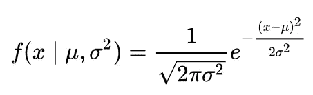

# 数据科学家的正态分布

> 原文：<https://medium.com/analytics-vidhya/the-normal-distribution-for-data-scientists-6de041a01cb9?source=collection_archive---------1----------------------->

图片由来自 [Pixabay](https://pixabay.com/?utm_source=link-attribution&utm_medium=referral&utm_campaign=image&utm_content=2695569) 的 [Felix Mittermeier](https://pixabay.com/users/FelixMittermeier-4397258/?utm_source=link-attribution&utm_medium=referral&utm_campaign=image&utm_content=2695569) 拍摄

作为一名数据科学家，您将不得不根据样本数据推断出感兴趣人群的属性或提出相关命题。为了做到这一点，您可能会使用统计推断来测试假设并得出估计值。

进行假设检验的第一步是探索你的数据，并找出它来自哪个概率分布。正态分布是一种广泛使用的概率分布，因为许多社会和自然现象都遵循它，因此，它通常是数据科学课程中学习的第一个分布。我将这篇博客文章献给正态分布，旨在帮助像我一样没有扎实的统计学背景，需要一些指导来理解正态分布背后的魔力以及它与假设检验的关系的数据科学家。

# 目录

> 正态分布的基石:中心极限定理
> 
> 什么是概率分布？
> 
> 正态分布及其概率密度函数
> 
> 正态分布和 Z 表
> 
> 如何确定自己的概率分布是否正态？

# **正态分布的基石:中心极限定理**

18 世纪和 19 世纪的数学家们渴望了解主宰概率游戏和天文学等其他科学领域的模式和数学模型。这种好奇心使得概率论取得了令人难以置信的进步，并催生了我们的研究课题:正态分布。

下面的时间表简要列出了对发现正态分布做出贡献的数学家。

正如你在时间线中看到的，拉普拉斯在 1810 年发表了中心极限定理，这是正态分布如此重要的主要原因之一。一个实验的总体可以有几种不同的概率分布(正态分布、偏态分布、指数分布等)。中心极限定理指出，不管总体的分布如何(即使分布对你来说是未知的)，如果你取足够大数量的相同大小的随机样本，并计算每个样本组的均值，那么抽样均值将逼近一个正态分布。

该定理对于假设检验至关重要，因为 t 检验或 ANOVA 等几个参数推断检验需要满足正态假设，以确保可靠的结果。由于中心极限定理，如果您正在处理的样本量足够大，那么即使样本总体不是正态的，您也可以使用均值的参数假设检验。换句话说，只要样本量足够大，要求正态性的参数推断检验在非正态分布中仍然是稳健的。

# 什么是概率分布？

在实验中，随机变量的每个可能值都有特定的发生概率。如果你设计了一个实验，并抽取了一些随机样本，那么实验结果值与它们发生的概率就是你的概率分布；你可以通过在实验过程中对频率进行加权来获得每个值发生的概率。请注意，您的实验结果很可能是通过某种测量(温度、年龄、婚姻数量、销售收入)或偶然(抛硬币)获得的。

下图 1 和图 2 以表格和柱状图的形式说明了一家公司每周收到的订单数量的概率分布。

图一。概率分布表。来源:http://ci.columbia.edu/ci/premba_test/c0331/s5/s5_3.html

图二。概率分布图。来源:http://ci.columbia.edu/ci/premba_test/c0331/s5/s5_3.html

# **正态分布及其 PDF**

正态分布是由图 3 中的概率密度函数(PDF)描述的连续概率分布。PDF 描述了实验的某个值落入特定值范围的概率。它包括一个归一化常数，确保曲线下的面积等于 1(所有事件概率之和必须等于 1)。曲线下的总面积除以平均值。

图 3。正态分布的概率密度函数

正态分布曲线的形状由样本的均值和标准差定义；该曲线将以平均值为中心且对称，并根据标准偏差进行拉伸。PDF 曲线从未穿过 x 轴；因此，它在整个实线上是非零的。这意味着正态分布可以给你任何事件发生的概率，但是随着离均值越来越远，它发生的概率会越来越接近零。

经验法则(68–95–99.7%法则)指出，在正态分布中，几乎所有的数据都位于平均值的 3 个标准差以内。当您试图识别数据中的异常值或甚至作为检查分布正态性的一种方式时，这非常方便。图 4 显示了经验法则以及正态分布中 99.7%的数据如何位于 3 个标准偏差内。

图 4。经验法则。来源:[https://en . Wikipedia . org/wiki/Normal _ distribution # Standard _ Normal _ distribution](https://en.wikipedia.org/wiki/Normal_distribution#Standard_normal_distribution)

# **正态分布和 Z 表**

回到正态分布的 PDF，以及它如何描述某个值落在特定范围内的概率，让我简单提一下 z 表。z 表汇总了标准正态分布(平均值= 0，标准差= 1)的所有可能 z 得分的面积百分比。

让我们记住正态分布 PDF 下的总面积等于 1，并且分布的平均值在 50%标记上划分数据。为了计算特定事件发生的概率，有了 PDF，您可以对感兴趣的特定 z 分数进行积分，以获得曲线下的面积，从而获得事件的概率(参见图 5 的直观示例)。由于正态分布的 PDF 从不穿过 x 轴，这将意味着从负无穷大到特定 z 得分进行积分(在右侧 z 表的情况下)。想象一下，如果您必须为想要检查的每个 z 分数计算这个积分，将会花费多少工作量。

图 5。最高 z 值的 PDF 下的区域。来源:[https://towards data science . com/how-to-use-and-create-a-z-table-standard-normal-table-240 e 21 f 36 e 53](https://towardsdatascience.com/how-to-use-and-create-a-z-table-standard-normal-table-240e21f36e53)

正态分布是许多参数假设检验的基本概率分布。z 核心通常是作为假设检验的结果获得的(z 得分告诉我们该值离平均值有多少标准偏差)。基于这一点，我们可以看到有必要在 PDF 下有一个方便的面积百分比汇总。

请记住，有无限多种可能的正态分布(基于特定样本的平均值和标准偏差)。z 表描述了标准正态分布的面积百分比(平均值= 0，标准差= 1)。在 z 表上查找特定结果之前，请确保将您的分布分数纳入 z 分数项(标准正态分布项)。

# 如何确定自己的概率分布是否正态？

## **直方图**

当你从一个实验中得到一个结果样本时，通常的第一步是根据样本值绘制出现的次数，以得到分布曲线(直方图)。在许多情况下，生成的曲线将揭示您的数据遵循的概率分布类型(或者至少会让您对它有一个很好的认识)。

使用正态分布时，您应该寻找一条钟形曲线。如果您看到一个钟形的粗略估计，您可以继续进行其他测试，以完全确定您的样本来自正态分布。

## **Q-Q 图**

此图帮助您确定因变量是否来自正态分布。Q-Q 图采用理论正态分布分位数(x 轴)并将其与样本数据分位数(y 轴)进行比较。如果两组数据都来自正态分布，那么散点图将大致形成一条 45 度角的直线(参见图 6 中的示例)。请记住，就像直方图一样，Q-Q 图是一个视觉检查，它是读者可能认为足够好的直线的主观判断。

图 6。Q-Q 图。来源:[http://www . sth da . com/English/wiki/QQ-plots-quantile-quantile-plots-r-base-graphs](http://www.sthda.com/english/wiki/qq-plots-quantile-quantile-plots-r-base-graphs)

## **附加统计测试**

对数据进行目视检查后，您可以做一些额外的测试来确认概率分布的正态性。一种常见的正态性统计检验是夏皮罗-维尔克检验，它根据您设置的阿尔法水平来判断您的数据是否来自正态分布。

## 参考

*   Brilliant.org。*连续随机变量——概率密度函数。*[https://brilliant . org/wiki/continuous-random-variables-probability-density/](https://brilliant.org/wiki/continuous-random-variables-probability-density/)
*   伊恩·斯图尔特。追寻未知——改变世界的 17 个方程式。*概率模式——正态分布*(第 7 章)。印刷品，2012 年。
*   Investopedia。*经验法则。*[https://www.investopedia.com/terms/e/empirical-rule.asp](https://www.investopedia.com/terms/e/empirical-rule.asp)
*   机器学习精通。*统计数据分布的温和介绍。*[https://machineellingmastery . com/statistical-data-distributions/](https://machinelearningmastery.com/statistical-data-distributions/)
*   吉姆的统计数据。中心极限定理讲解。【https://statisticsbyjim.com/basics/central-limit-theorem/ 号
*   统计学如何？ *Z 向工作台*。[https://www . statistics show to . data science central . com/tables/z-table/](https://www.statisticshowto.datasciencecentral.com/tables/z-table/)
*   爱荷华大学。*正态性的假设。*[http://www2 . psychology . uio wa . edu/faculty/mordkoff/grad stats/part % 201/I . 07% 20 normal . pdf](http://www2.psychology.uiowa.edu/faculty/mordkoff/GradStats/part%201/I.07%20normal.pdf)
*   走向数据科学——迈克尔·加拉尼克。*如何使用和创建 Z 表。*[https://towardsdatascience . com/how-to-use-and-create-a-z-table-standard-normal-table-240 e 21 f 36 e 53](https://towardsdatascience.com/how-to-use-and-create-a-z-table-standard-normal-table-240e21f36e53)
*   弗吉尼亚大学图书馆。*了解 Q-Q 图*。[https://data.library.virginia.edu/understanding-q-q-plots/](https://data.library.virginia.edu/understanding-q-q-plots/)
*   维基百科。正态分布。https://en . Wikipedia . org/wiki/Normal _ distribution # Standard _ Normal _ distribution
*   维基百科。*概率分布。*[https://en.wikipedia.org/wiki/Probability_distribution](https://en.wikipedia.org/wiki/Probability_distribution)