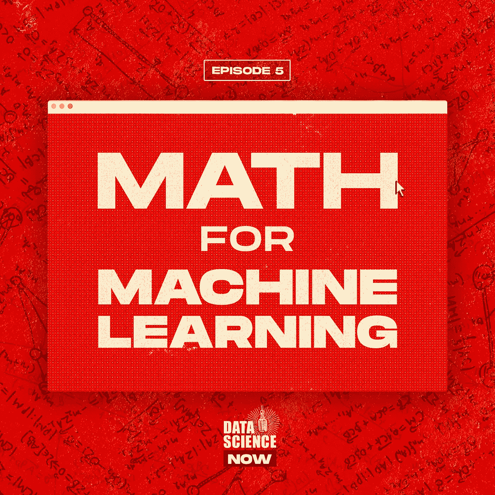
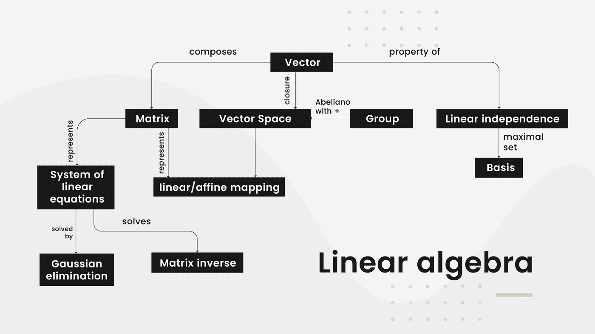
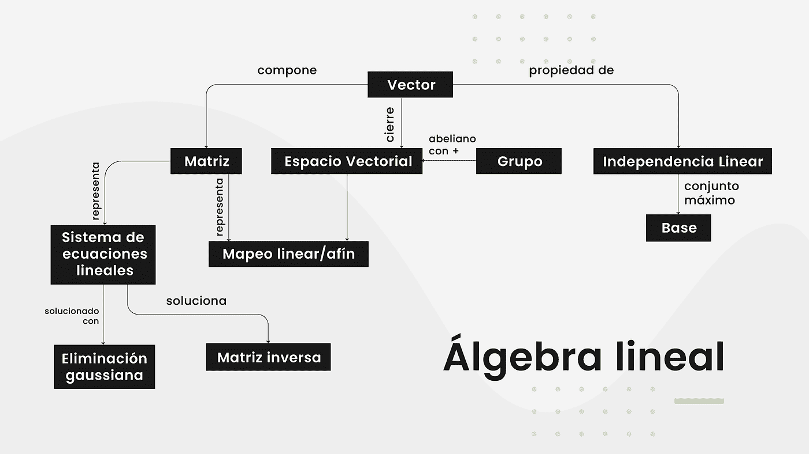
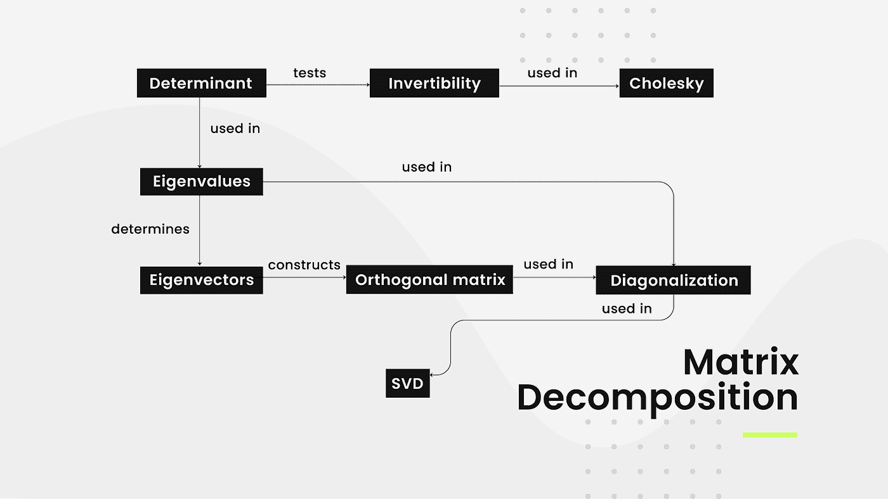
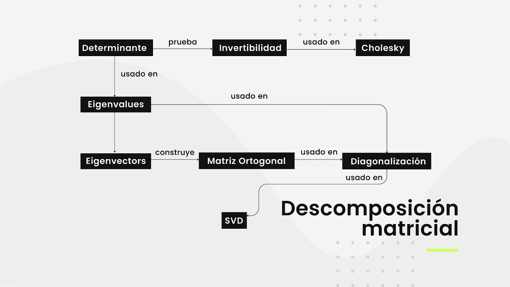
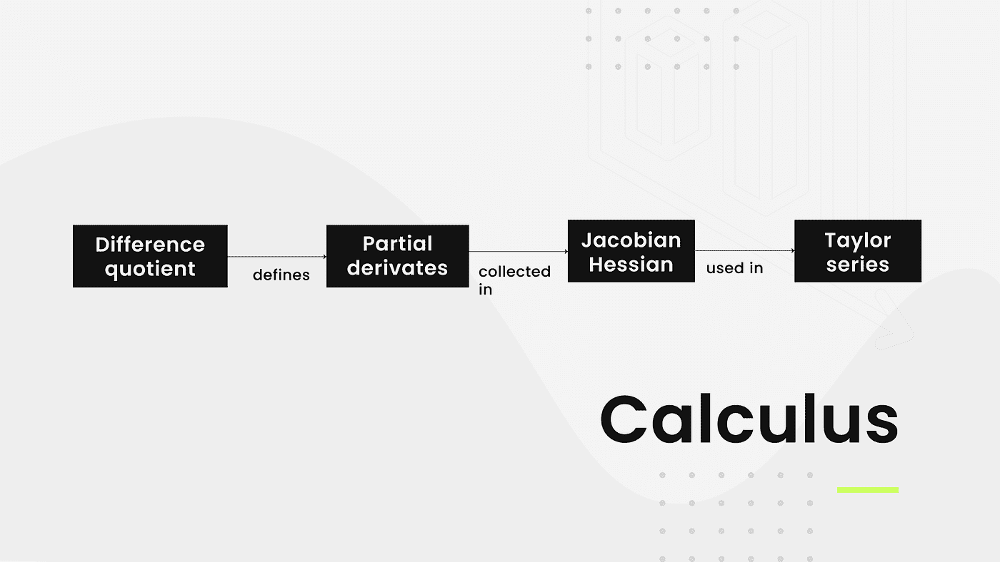
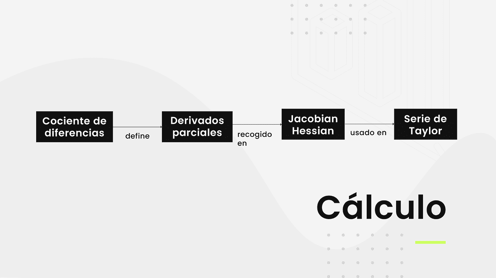
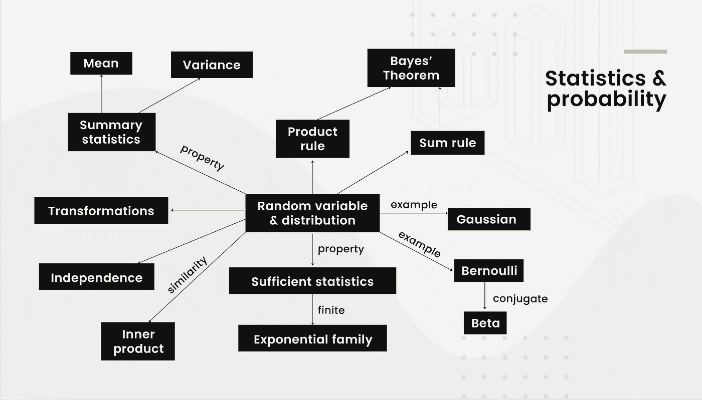
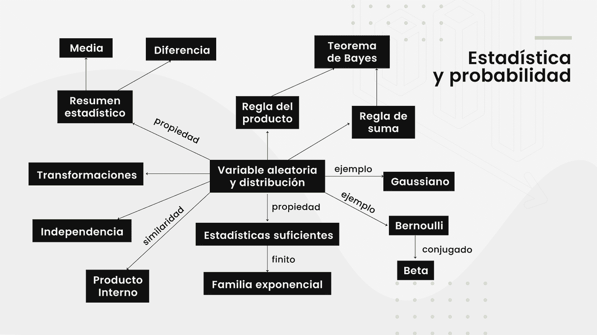

# 为机器学习学习数学的非权威指南

> 原文：<https://medium.com/analytics-vidhya/the-not-definitive-guide-to-learning-math-for-machine-learning-cecab8e0aec7?source=collection_archive---------4----------------------->

## 38 个学习微积分、代数和统计的免费资源。

[https://open.spotify.com/show/5nrspdHxUxzc9TkEibpxD5?si=l69w-RnHR965oBAASVd7sQ](https://open.spotify.com/show/5nrspdHxUxzc9TkEibpxD5?si=l69w-RnHR965oBAASVd7sQ)

**免责声明:**

> 这个指南不是“权威”的，因为它是我对这个主题的看法，而且我讨厌人们说他们所说的是权威的东西。

大家好！这是我最新的数据科学时事通讯的复制，这是我和我的公司 [Closter](https://www.linkedin.com/company/closter/) 关于数据科学、机器学习和人工智能的最新趋势的一个节目，但我也涵盖了类似这样的教育材料。

你可以在这里听到播客版本:

如果你喜欢，你可以在这里观看视频记录(遗憾的是，我们的视频有问题，所以它只是一个带音频的 Youtube 视频):

如果你想看这个节目，我每周三晚上 8 点在 LinkedIn 直播:)

在这个环节中，我谈到了数学在数据科学、机器学习和朋友的世界中的重要性。

为了真正感受到机器学习赋予我们的力量，我们需要知道最重要的模型内部是如何工作的。不一定要数学博士(虽然优秀，可能的话推荐)才知道这些方面。我谈到了数学在数据科学、机器学习和朋友的世界中的重要性。

有多种方法可以获得所有这些知识。你可以从事科学、工程之类的职业，或者你可以参加优秀的数据科学和机器学习课程。

所以事不宜迟，以下是我对学习数学的建议:

# 一般书籍(全部免费):

*   [统计学习的要素](https://web.stanford.edu/~hastie/ElemStatLearn/)
*   [用于机器学习的数学](https://mml-book.github.io/)
*   [贝叶斯推理和机器学习](http://web4.cs.ucl.ac.uk/staff/D.Barber/pmwiki/pmwiki.php?n=Brml.HomePage)
*   [百页机器学习书](http://themlbook.com/wiki/doku.php)
*   [机器学习的数学(笔记)](https://gwthomas.github.io/docs/math4ml.pdf)
*   [机器学习基础](https://cs.nyu.edu/~mohri/mlbook/)

# 代数(免费课程和书籍)

*   [线性代数——前沿基础(edX)](https://www.edx.org/es/course/linear-algebra-foundations-to-frontiers)
*   [高等线性代数:前沿基础](https://www.edx.org/es/course/advanced-linear-algebra-foundations-to-frontiers)
*   [机器学习的数学:线性代数(Coursera)](https://www.coursera.org/learn/linear-algebra-machine-learning)
*   [吉尔伯特·斯特朗线性代数讲座(麻省理工学院)](https://www.youtube.com/watch?v=ZK3O402wf1c&list=PL49CF3715CB9EF31D&index=1)
*   [线性代数(可汗学院)](https://www.khanacademy.org/math/linear-algebra)
*   [线性代数做对了(书)](http://linear.axler.net/)
*   [数值线性代数(Fast.ai)](https://github.com/fastai/numerical-linear-algebra)
*   [编码矩阵(课程)](http://codingthematrix.com/#slides)

我姐姐( [Héizel Vázquez](https://www.linkedin.com/in/h%C3%A9izel-v%C3%A1zquez-74438712a/) )和我用英语和西班牙语复制了《机器学习的数学》一书中的代数图表(以更漂亮的格式)，所以它们在这里:

# 微积分(免费课程和书籍)

*   [机器学习数学:多元微积分(Coursera)](https://www.coursera.org/learn/multivariate-calculus-machine-learning)
*   [微积分的精髓(3Blue1Brown)](https://www.youtube.com/watch?v=WUvTyaaNkzM&list=PLZHQObOWTQDMsr9K-rj53DwVRMYO3t5Yr)
*   [数学思维入门(Coursera)](https://www.coursera.org/learn/mathematical-thinking)
*   [微积分一(伦纳德教授)](https://www.youtube.com/watch?v=fYyARMqiaag&list=PLF797E961509B4EB5)
*   [微积分 II(伦纳德教授)](https://www.youtube.com/watch?v=H9eCT6f_Ftw&list=PLDesaqWTN6EQ2J4vgsN1HyBeRADEh4Cw-)
*   [微积分三(伦纳德教授)](https://www.youtube.com/watch?v=tGVnBAHLApA&list=PLDesaqWTN6ESk16YRmzuJ8f6-rnuy0Ry7)
*   [单变量微积分](https://www.youtube.com/playlist?list=PL590CCC2BC5AF3BC1)
*   [微积分(可汗学院)](https://www.youtube.com/watch?v=EKvHQc3QEow&list=PL19E79A0638C8D449)
*   [微积分入门一、二(书籍)](http://www.math.odu.edu/~jhh/counter10.html)
*   [高等微积分(全书)](http://people.math.harvard.edu/~shlomo/docs/Advanced_Calculus.pdf)
*   [微积分(吉尔伯特·斯特朗课程的配套书)](https://ocw.mit.edu/ans7870/resources/Strang/Edited/Calculus/Calculus.pdf)

我姐姐和我再次用英语和西班牙语复制了《机器学习的数学》一书中的微积分图表，所以它们在这里:

# 统计和概率(免费课程和书籍)

*   [使用 Python (edX)的数据科学中的概率和统计](https://www.edx.org/es/course/probability-and-statistics-in-data-science-using-p)
*   [商业统计和分析专业化(Coursera)](https://www.coursera.org/specializations/business-statistics-analysis)
*   [业务分析:利用数据进行决策(退休)](https://emeritus.org/management-certificate-programs/business-analytics/)
*   [数据可视化:工具和技术(荣誉退休)](https://emeritus.org/management-certificate-programs/data-visualization/)
*   [统计与概率(可汗学院)](https://www.khanacademy.org/math/statistics-probability)
*   [所有的统计:统计推断简明教程(书)](http://read.pudn.com/downloads158/ebook/702714/Larry%20Wasserman_ALL%20OF%20Statistics.pdf)
*   [统计学简介(乌达城)](https://www.udacity.com/course/intro-to-statistics--st101)
*   [统计学 110:概率(哈佛)](https://www.youtube.com/playlist?list=PL2SOU6wwxB0uwwH80KTQ6ht66KWxbzTIo)
*   [速成课程统计(Youtube 课程)](https://www.youtube.com/watch?v=zouPoc49xbk&list=PL8dPuuaLjXtNM_Y-bUAhblSAdWRnmBUcr)
*   [统计学(伦纳德教授)](https://www.youtube.com/watch?v=9FtHB7V14Fo&list=PL5102DFDC6790F3D0)
*   [数据科学统计学(斯坦福)](https://www.youtube.com/watch?v=Vfo5le26IhY)
*   [概率与统计(书)](http://www.utstat.toronto.edu/mikevans/jeffrosenthal/book.pdf)
*   [想统计数据(本书)](https://greenteapress.com/thinkstats/)

你可以想象我姐姐和我用英语和西班牙语复制了《机器学习的数学》一书中的统计和概率图表，所以它们在这里:

希望这能帮助你找到一条好的途径来学习和掌握你所需要的知识来统治数学世界。永远记住:

> 没有简单的道路，你必须练习，学习，如果你想知道你要去哪里，你需要明白你从哪里来。

感谢您阅读本文，请订阅并与您的网络分享，这将对我们有很大帮助:)

克洛斯特团队的爱:

[加布里埃尔·埃里维斯](https://www.linkedin.com/in/gabriel-erives-3608b0192/)，[海泽尔·巴斯克斯](https://www.linkedin.com/in/h%C3%A9izel-v%C3%A1zquez-74438712a/)，[艾林·巴斯克斯](https://www.linkedin.com/in/eilenvazquez/)，[法维奥·巴斯克斯](https://www.linkedin.com/in/faviovazquez/)。

